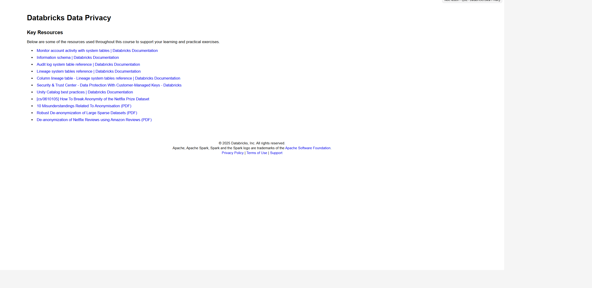

# Lección 21: Resources

**Curso:** Databricks Data Privacy (ID: 3767)  
**Sección:** Section 4: Streaming Data and Change Data Feed (CDF)  
**Lección:** Resources (Lesson ID: 44507)  
**Tipo de Contenido:** HTML Interactivo / Recursos Clave y Bibliografía Oficial  
**Estado:** Completado 100%  

---

## 1. Evidencia Visual de la Lección

---

## 2. Contenido Verbatim Oficial

### Databricks Data Privacy — Key Resources

> *Below are some of the resources used throughout this course to support your learning and practical exercises.*

### Enlaces y Documentación Técnica Oficial:

1. **Monitor account activity with system tables | Databricks Documentation**  
   - Enlace: [https://docs.databricks.com/en/admin/system-tables/index.html](https://docs.databricks.com/en/admin/system-tables/index.html)  
   - *Cobertura:* Esquemas `system.access`, `system.billing`, `system.compute` y monitoreo centralizado de eventos en el lago de datos.

2. **Information schema | Databricks Documentation**  
   - Enlace: [https://docs.databricks.com/en/sql/language-manual/sql-ref-information-schema.html](https://docs.databricks.com/en/sql/language-manual/sql-ref-information-schema.html)  
   - *Cobertura:* Vistas estándar SQL ANSI para consultar metadatos de catálogos, esquemas, tablas, columnas y privilegios en Unity Catalog.

3. **Audit log system table reference | Databricks Documentation**  
   - Enlace: [https://docs.databricks.com/en/admin/system-tables/audit-logs.html](https://docs.databricks.com/en/admin/system-tables/audit-logs.html)  
   - *Cobertura:* Tabla `system.access.audit`, esquemas de eventos JSON, acciones de auditoría y análisis forense de seguridad.

4. **Lineage system tables reference | Databricks Documentation**  
   - Enlace: [https://docs.databricks.com/en/admin/system-tables/lineage.html](https://docs.databricks.com/en/admin/system-tables/lineage.html)  
   - *Cobertura:* Tablas de linaje de tablas y vistas para rastreo de dependencias de datos ascendentes y descendentes.

5. **Column lineage table - Lineage system tables reference | Databricks Documentation**  
   - Enlace: [https://docs.databricks.com/en/admin/system-tables/lineage.html#column-lineage-table](https://docs.databricks.com/en/admin/system-tables/lineage.html#column-lineage-table)  
   - *Cobertura:* Tabla `system.access.column_lineage` para trazabilidad granular a nivel de columnas de datos sensibles (PII).

6. **Security & Trust Center - Data Protection With Customer-Managed Keys - Databricks**  
   - Enlace: [https://www.databricks.com/trust/security-features/data-protection-with-customer-managed-keys](https://www.databricks.com/trust/security-features/data-protection-with-customer-managed-keys)  
   - *Cobertura:* Claves administradas por el cliente (CMK) para almacenamiento en reposo y discos de cómputo en AWS KMS, Azure Key Vault y GCP Cloud KMS.

7. **Unity Catalog best practices | Databricks Documentation**  
   - Enlace: [https://docs.databricks.com/en/data-governance/unity-catalog/best-practices.html](https://docs.databricks.com/en/data-governance/unity-catalog/best-practices.html)  
   - *Cobertura:* Modelo de aislamiento de 3 niveles (`catalog.schema.table`), gobernanza unificada, control de accesos granular y políticas corporativas.

---

## 3. Investigaciones Académicas y Guías de Anonimización

Artículos seminales de investigación sobre desanonimización de conjuntos de datos y ataques de enlace citados en el curso:

8. **[cs/0610105] How To Break Anonymity of the Netflix Prize Dataset**  
   - Autores: Arvind Narayanan, Vitaly Shmatikov (The University of Texas at Austin)  
   - Enlace: [https://arxiv.org/abs/cs/0610105](https://arxiv.org/abs/cs/0610105)  
   - *Relevancia:* Demostración formal de cómo la combinación de calificaciones públicas de películas con marcas de tiempo permite re-identificar usuarios en datasets supuestamente anonimizados.

9. **10 Misunderstandings Related To Anonymisation (PDF)**  
   - Publicación conjunta: European Data Protection Supervisor (EDPS) & Agencia Española de Protección de Datos (AEPD)  
   - Enlace: [https://edps.europa.eu/system/files/2021-04/21-04-27_aepd-edps_anonymisation_en_5.pdf](https://edps.europa.eu/system/files/2021-04/21-04-27_aepd-edps_anonymisation_en_5.pdf)  
   - *Relevancia:* Desmitificación de errores comunes: anonimización vs seudonimización, persistencia del riesgo de reidentificación y límites de la agregación.

10. **Robust De-anonymization of Large Sparse Datasets (PDF)**  
    - Autores: Arvind Narayanan, Vitaly Shmatikov (IEEE Symposium on Security and Privacy, 2008)  
    - Enlace: [https://www.cs.utexas.edu/~shmat/shmat_oak08netflix.pdf](https://www.cs.utexas.edu/~shmat/shmat_oak08netflix.pdf)  
    - *Relevancia:* Algoritmos matemáticos de desanonimización aplicables a grafos dispersos y registros transaccionales masivos.

11. **De-anonymization of Netflix Reviews using Amazon Reviews (PDF)**  
    - Autores: Nicole Archie, Brittany Gershon, Rachel Katchoff, Michelle Zeng (MIT CSAIL 6.857 Computer and Network Security Project)  
    - Enlace: [https://courses.csail.mit.edu/6.857/2018/project/Archie-Gershon-Katchoff-Zeng-Netflix.pdf](https://courses.csail.mit.edu/6.857/2018/project/Archie-Gershon-Katchoff-Zeng-Netflix.pdf)  
    - *Relevancia:* Caso práctico de ataque de enlace cruzado (*linkage attack*) entre diferentes fuentes de datos públicas.
