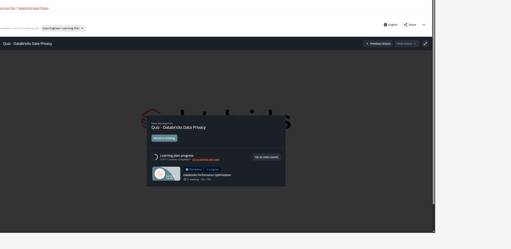

# Quiz: Databricks Data Privacy

**Curso:** Databricks Data Privacy (Course ID: 3767)  
**Evaluación Final:** Quiz Oficial de Certificación / Acreditación  
**Lección:** Quiz - Databricks Data Privacy (Lesson ID: 57348)  
**Total de Preguntas:** 20  
**Puntaje Obtenido:** 95 / 100 (Aprobado - 19 de 20 correctas en primer intento)  
**Tiempo de Ejecución:** 8m 45s  
**Captura de Pantalla:** `capturas/22_quiz_passed.png`  
**Estado en Databricks Academy:** Completado 100% (22 de 22 lecciones aprobadas)  

---

## 1. Evidencia Visual del Quiz y Estado del Curso

---

## 2. Banco Completo de Preguntas y Respuestas Verificadas

### Pregunta 1
**Pregunta:**  
A developer wants to use `table_changes('silver_users', 2, 3)` to read CDF for a specific version range. What happens if version 3 does not yet exist at query time?

**Opciones:**
- [x] **The query raises an out-of-range error, because by default the specified end version cannot exceed the table's latest committed version.** (Correcto)
- [ ] The query blocks until version 3 is committed.
- [ ] The query returns all changes from version 2 to the latest available version.
- [ ] The query returns an empty result set.

**Explicación Técnica:**  
Al invocar la función de tabla `table_changes(table_name, start_version, end_version)` en Delta Lake / Unity Catalog, el argumento `end_version` debe corresponder a una versión ya confirmada en el registro de transacciones de la tabla. Si la versión solicitada es mayor que la versión actual más reciente (`latest committed version`), el motor de análisis arroja una excepción de fuera de rango (*version out-of-range analysis error*). No bloquea la ejecución ni devuelve resultados vacíos.

---

### Pregunta 2
**Pregunta:**  
A data privacy architect is evaluating whether to use hashing or tokenization for a new PII pipeline. The downstream use case requires frequent lookups by the anonymized identifier and the dataset contains billions of records. Which technique is more appropriate and why?

**Opciones:**
- [ ] Hashing, because it requires no lookup table and produces a deterministic output that is fast to compute and query.
- [ ] Both are equally appropriate; the choice depends only on regulatory requirements.
- [x] **Tokenization, because it stores values in a secure lookup table that is fast to read, and the de-identified data is stored in fewer bytes — both advantages at billion-record scale.** (Correcto)
- [ ] Neither; at billion-record scale, data suppression is the only viable technique.

**Explicación Técnica:**  
La tokenización sustituye identificadores sensibles por valores compactos (ej. enteros o identificadores alfanuméricos cortos) almacenados en una tabla de correspondencia protegida. A escala de miles de millones de registros (*billion-record scale*), los tokens ocupan sustancialmente menos bytes por fila que los resúmenes criptográficos (un hash SHA-256 consume de 32 a 64 bytes por registro), lo que optimiza el tamaño en disco, el consumo de memoria en caché y acelera radicalmente las operaciones frecuentes de búsqueda y combinación (*join*).

---

### Pregunta 3
**Pregunta:**  
A team is designing a data privacy architecture. They need to expose aggregated sales data to analysts without revealing individual customer identities, but they also need to allow data scientists to access the full dataset for model training. Which Unity Catalog design pattern best satisfies both requirements simultaneously?

**Opciones:**
- [ ] Create two separate catalogs: one for analysts with anonymized data, one for data scientists with full data.
- [ ] Use a single view with no access controls and rely on data scientists to self-regulate their access.
- [ ] Duplicate the source table into two physical copies: one masked for analysts and one unmasked for data scientists.
- [x] **Apply a dynamic view or row filter/column mask on the source table, granting analysts access to the view/table and data scientists direct access to the source table with appropriate privileges.** (Correcto)

**Explicación Técnica:**  
Unity Catalog proporciona gobernanza fina a nivel de fila y columna mediante vistas dinámicas (*dynamic views*) con `is_account_group_member()` o políticas nativas de filtros de fila (*row filters*) y máscaras de columna (*column masks*). Este patrón evita la duplicación redundante de datos físicos, centraliza las auditorías y garantiza que los analistas consulten únicamente datos anonimizados mientras los científicos de datos con permisos calificados acceden al dato crudo de la tabla fuente.

---

### Pregunta 4
**Pregunta:**  
What is an advantage of tokenization regarding data size?

**Opciones:**
- [x] **De-identified data uses fewer bytes** (Correcto)
- [ ] Increases data size significantly
- [ ] Doubles the storage requirement
- [ ] Has no effect on storage size

**Explicación Técnica:**  
Al reemplazar identificadores de longitud variable o campos de texto extensos por tokens numéricos o secuencias compactas, el tamaño físico de almacenamiento de la tabla desidentificada se reduce significativamente en comparación con algoritmos de hashing que expanden los datos a salidas de tamaño fijo como 256 bits o 512 bits.

---

### Pregunta 5
**Pregunta:**  
A table has a row filter applied via `ALTER TABLE ... SET ROW FILTER`. A data engineer then runs `ALTER TABLE ... DROP ROW FILTER`. What happens to the underlying UDF that implemented the filter?

**Opciones:**
- [ ] The UDF is disabled but not dropped, and can be re-enabled with ALTER TABLE.
- [ ] The UDF is automatically dropped along with the row filter.
- [x] **The UDF remains in the schema and must be dropped separately if no longer needed.** (Correcto)
- [ ] The UDF is moved to a system schema for auditing purposes.

**Explicación Técnica:**  
En Unity Catalog, las UDFs son entidades de catálogo autónomas de primer nivel (`catalog.schema.function`). La instrucción `ALTER TABLE ... DROP ROW FILTER` únicamente remueve el vínculo de la política de filtrado sobre la tabla especificada. La función de usuario permanece intacta en el esquema correspondiente y debe eliminarse explícitamente mediante `DROP FUNCTION` si ya no se requiere.

---

### Pregunta 6
**Pregunta:**  
A data engineer is designing a CDF-based delete propagation pipeline for GDPR compliance. The pipeline must propagate deletes from a central `silver_users` table to 10 downstream gold tables. What is the key advantage of using CDF with `foreachBatch` and `MERGE INTO` over running 10 separate DELETE statements?

**Opciones:**
- [ ] DELETE statements do not support subquery filters, making them unsuitable for multi-table propagation.
- [x] **CDF with foreachBatch allows a single incremental read of silver_users changes to drive updates to all 10 downstream tables atomically within each micro-batch, ensuring consistency and enabling the pipeline to resume from checkpoints if it fails mid-propagation.** (Correcto)
- [ ] CDF with foreachBatch automatically enables CDF on all 10 downstream gold tables.
- [ ] CDF with foreachBatch is faster because it uses vectorized execution.

**Explicación Técnica:**  
Change Data Feed (CDF) acoplado a Structured Streaming y `foreachBatch` permite leer una única vez los cambios incrementales (filas con `_change_type = 'delete'`) de la tabla maestra y actualizar en paralelo o en secuencia controlada las 10 tablas downstream mediante `MERGE INTO`. Si el pipeline se detiene o falla durante la ejecución, el checkpoint garantiza reanudar exactamente en el micro-lote no confirmado, preservando la consistencia atómica y evitando re-escaneos completos e ineficientes.

---

### Pregunta 7
**Pregunta:**  
A team wants to use Unity Catalog lineage to perform an impact analysis before dropping the `customers_silver` table. What does the Downstream view in the Lineage tab show, and why is this critical before dropping the table?

**Opciones:**
- [x] **Downstream shows all objects (views, tables, notebooks, dashboards) that reference or derive from customers_silver; this is critical because dropping the table would break all downstream consumers.** (Correcto)
- [ ] Downstream shows the storage location of customers_silver's data files; this is critical for reclaiming storage.
- [ ] Downstream shows the source files that populated customers_silver; this is critical to understand data origins.
- [ ] Downstream shows the query history for customers_silver; this is critical for auditing who accessed the data.

**Explicación Técnica:**  
La pestaña de linaje (*Lineage*) en Unity Catalog captura de manera automatizada las dependencias de datos. La perspectiva *Downstream* visualiza todos los artefactos dependientes directos e indirectos (tablas Gold, vistas, canalizaciones de Lakeflow/DLT, notebooks y dashboards) que consumen la tabla, permitiendo anticipar el impacto operativo antes de ejecutar un `DROP TABLE`.

---

### Pregunta 8
**Pregunta:**  
An Apache Spark™ Declarative Pipeline processes `registered_users` through both hashing and tokenization paths in parallel. If the pipeline fails midway through the tokenization path, what guarantees does the declarative pipeline framework provide about the state of the hashing path tables?

**Opciones:**
- [ ] The hashing path tables are marked as corrupt and must be manually rebuilt.
- [x] **The hashing path tables retain whatever state they reached before the failure; the pipeline framework tracks each table's state independently and will resume from the last successful checkpoint on the next run.** (Correcto)
- [ ] All pipeline outputs are rolled back atomically because Spark Declarative Pipelines guarantee all-or-nothing execution.
- [ ] The hashing path tables are rolled back to their previous state to maintain consistency across all pipeline outputs.

**Explicación Técnica:**  
El framework de pipelines declarativos (Delta Live Tables / Spark Declarative Pipelines) aísla el ciclo de vida de cada conjunto de datos definido en el grafo acíclico dirigido (DAG). Si una rama falla (tokenización), las tablas de la rama independiente (hashing) preservan los estados confirmados exitosamente en sus respectivos registros transaccionales Delta y checkpoints, permitiendo reintentar únicamente los nodos pendientes.

---

### Pregunta 9
**Pregunta:**  
A developer attempts to add a second row filter to a table that already has one applied. What is the outcome?

**Opciones:**
- [x] **An error is raised because each table can have only one row filter. The existing filter must be dropped before a new one can be applied.** (Correcto)
- [ ] The second row filter replaces the first one silently.
- [ ] The second row filter is queued and applied after the first filter's results are returned.
- [ ] The second row filter is added and both filters are applied conjunctively (AND logic) at query time.

**Explicación Técnica:**  
En Unity Catalog, cada tabla admite estrictamente un único filtro de fila (*row filter*). Intentar vincular una segunda función mediante `ALTER TABLE ... SET ROW FILTER` genera un error de validación. Si se requieren múltiples condiciones, estas deben consolidarse dentro de una única función UDF con operadores booleanos (`AND`, `OR`) o removerse el filtro previo con `DROP ROW FILTER`.

---

### Pregunta 10
**Pregunta:**  
A Unity Catalog tag with key `compliance` and value `GDPR` is applied to the `customer_id` column. Which `INFORMATION_SCHEMA` view would you query to retrieve this tag programmatically?

**Opciones:**
- [ ] INFORMATION_SCHEMA.CATALOG_TAGS
- [x] **INFORMATION_SCHEMA.COLUMN_TAGS** (Correcto)
- [ ] INFORMATION_SCHEMA.SCHEMA_TAGS
- [ ] INFORMATION_SCHEMA.TABLE_TAGS

**Explicación Técnica:**  
El catálogo de esquemas del sistema de Unity Catalog proporciona vistas relacionales ANSI para auditar metadatos de gobernanza. Las etiquetas asignadas a columnas específicas se consultan directamente en `INFORMATION_SCHEMA.COLUMN_TAGS`, que detalla `catalog_name`, `schema_name`, `table_name`, `column_name`, `tag_name` y `tag_value`.

---

### Pregunta 11
**Pregunta:**  
A compliance engineer needs to prove that a specific user's data was deleted from `gold_users` within the 30-day SLA. The deletion was processed via the `process_deletes` streaming function. What combination of artifacts provides the strongest audit trail?

**Opciones:**
- [x] **DESCRIBE HISTORY gold_users (showing the MERGE operation timestamp) + the delete_requests table (showing status='deleted' and request_date) + the userMetadata commit message in the history.** (Correcto)
- [ ] The CDF output from silver_users showing the delete record for the user's mrn.
- [ ] A screenshot of the Databricks notebook showing the DELETE cell was executed.
- [ ] The checkpoint directory contents showing the streaming query processed the relevant micro-batch.

**Explicación Técnica:**  
La evidencia regulatoria más robusta combina: (1) el registro inmutable del historial de Delta Lake (`DESCRIBE HISTORY`) con marca de tiempo del `MERGE`, (2) el mensaje contextual inyectado en `userMetadata`, y (3) la tabla operacional de auditoría (`delete_requests`) con el ciclo de vida de la solicitud (`request_date`, `processed_date`, `status = 'deleted'`). Juntos demuestran cumplimiento legal verificable.

---

### Pregunta 12
**Pregunta:**  
A column mask UDF is defined using Python and applied to a table column. Under what condition is this supported in Unity Catalog?

**Opciones:**
- [ ] Python UDFs are supported as column masks only when the table is stored in an external location.
- [x] **Python UDFs are supported as column masks only when they are wrapped inside a SQL UDF.** (Correcto)
- [ ] Python UDFs are natively supported as column masks without any additional wrapping.
- [ ] Python UDFs cannot be used as column masks under any circumstances; only SQL UDFs are permitted.

**Explicación Técnica:**  
Las políticas de control de acceso de Unity Catalog (máscaras de columna y filtros de fila) requieren interfaces de funciones SQL registradas en el metastore para integrarse en el plan lógico del optimizador Catalyst. Si se escribe lógica en Python, esta debe encapsularse dentro de una SQL UDF registrada que actúe como puente.

---

### Pregunta 13
**Pregunta:**  
A team wants to grant account users access to `customers_gold_view` in the `pii_data` schema. They issue:  
`GRANT SELECT ON VIEW pii_data.customers_gold_view TO account users`.  
A user attempts to query the view and receives an error. What is the most likely missing grant?

**Opciones:**
- [x] **GRANT USE SCHEMA ON SCHEMA pii_data TO `account users`** (Correcto)
- [ ] GRANT MODIFY ON VIEW pii_data.customers_gold_view TO `account users`
- [ ] GRANT EXECUTE ON VIEW pii_data.customers_gold_view TO `account users`
- [ ] GRANT READ VOLUME ON SCHEMA pii_data TO `account users`

**Explicación Técnica:**  
El modelo jerárquico de permisos de Unity Catalog requiere explícitamente `USE CATALOG` sobre el catálogo contenedor y `USE SCHEMA` sobre el esquema para que un usuario pueda resolver los objetos alojados en él. Conceder `SELECT` sobre una vista no es suficiente si el usuario carece de `USE SCHEMA`.

---

### Pregunta 14
**Pregunta:**  
A streaming pipeline writes to `bronze_users` with `.outputMode('append')` and a second pipeline reads from `bronze_users` and merges into `silver_users` using `foreachBatch`. If the bronze stream is stopped and restarted with a new checkpoint location, what is the consequence for the silver table?

**Opciones:**
- [ ] The foreachBatch function will raise an error because the source table has changed checkpoint state.
- [x] **The bronze stream will reprocess all source files from the beginning (since the checkpoint is new), potentially re-appending duplicate records to bronze_users, which the silver MERGE will then attempt to upsert — resulting in no data loss due to MERGE idempotency, but potentially causing unnecessary reprocessing.** (Correcto)
- [ ] No consequence; the silver table retains all previously merged data and the new bronze stream will only append new files.
- [ ] The silver table is automatically reset to match the new bronze stream's starting point.

**Explicación Técnica:**  
Al reiniciar el stream Bronze con una nueva ruta de checkpoint, el motor de streaming pierde la memoria de los archivos procesados y re-ingiere todos los archivos desde el origen, anexando duplicados en Bronze. No obstante, en la capa Silver, la instrucción `MERGE INTO` evalúa claves primarias coincidentes de forma idempotente (*upsert*), evitando la corrupción de datos pero incurriendo en un costo computacional innecesario.

---

### Pregunta 15
**Pregunta:**  
A user who is the owner of a dynamic view queries it, but is NOT a member of the supervisors group referenced in `is_account_group_member()`. What data does the user see?

**Opciones:**
- [ ] All rows but with redacted columns only, because ownership grants row-level bypass but not column-level bypass.
- [ ] An error, because owners cannot query their own dynamic views.
- [ ] All rows and unredacted columns, because ownership bypasses all view-level filters.
- [x] **Redacted columns and filtered rows as defined by the view logic, because is_account_group_member() evaluates the querying user's group membership at runtime regardless of ownership.** (Correcto)

**Explicación Técnica:**  
Las funciones de seguridad dinámica en SQL (`is_account_group_member()`, `current_user()`) se evalúan dinámicamente en tiempo de ejecución considerando la sesión del usuario actual que ejecuta la consulta (*querying user*). La propiedad (*ownership*) sobre la vista no anula las reglas lógicas `CASE WHEN` definidas en el cuerpo de la vista.

---

### Pregunta 16
**Pregunta:**  
A column mask is applied to `customer_id` (returning `9999999` for non-privileged users) and a row filter is applied to the same table. A downstream BI tool, running as a NON-privileged user, queries:  
`SELECT customer_id, loyalty_segment FROM table WHERE customer_id = 12345`.  
What does the BI tool receive?

**Opciones:**
- [ ] A row with customer_id = 9999999, because the row matching 12345 is returned first and then the mask is applied to the output.
- [ ] An error, because filtering on a masked column is not permitted in Unity Catalog.
- [ ] The row matching customer_id = 12345 with the real customer_id value, because the WHERE clause is evaluated against the underlying column before the mask is applied.
- [x] **Zero rows. Unity Catalog injects the column mask at scan time, so the reference to customer_id in the WHERE clause is evaluated as the masked value (9999999). The predicate becomes 9999999 = 12345, which is never true for a non-privileged user, so no rows are returned.** (Correcto)

**Explicación Técnica:**  
En Unity Catalog, las máscaras de columna se inyectan en la fase de análisis del árbol de sintaxis de escaneo (*scan-time rewrite*). Para un usuario no privilegiado, cualquier mención a la columna `customer_id` se sustituye por la expresión enmascarada (`9999999`). Por ende, el predicado en la cláusula `WHERE` se transforma en `9999999 = 12345`, que evalúa a falso para todas las filas de la tabla, retornando un conjunto de resultados vacío.

---

### Pregunta 17
**Pregunta:**  
A developer globally enables CDF with `spark.conf.set('spark.databricks.delta.properties.defaults.enableChangeDataFeed', True)`. They then create a new table with `CREATE TABLE AS SELECT`. Does the new table have CDF enabled, and will tables created before this setting was applied also have CDF enabled?

**Opciones:**
- [x] **Yes for new tables created after the setting; no for tables that existed before — they require an explicit ALTER TABLE to enable CDF.** (Correcto)
- [ ] Yes for new tables; existing tables are automatically migrated to CDF on their next write operation.
- [ ] No for both: the global setting only affects the current session and does not persist to table properties.
- [ ] Yes to both: the global setting retroactively enables CDF on all existing tables.

**Explicación Técnica:**  
La configuración de Spark `spark.databricks.delta.properties.defaults.enableChangeDataFeed` define el valor por omisión para cualquier tabla Delta nueva creada a partir de ese momento. Las tablas creadas con anterioridad mantienen sus propiedades intactas y no habilitan CDF de forma retroactiva a menos que se ejecute explícitamente:  
`ALTER TABLE <table_name> SET TBLPROPERTIES (delta.enableChangeDataFeed = true)`.

---

### Pregunta 18
**Pregunta:**  
A view owner has SELECT on the underlying `customers_silver` table through ownership. A non-owner user is granted SELECT on `customers_gold_view` (which queries `customers_silver`) but has no direct privileges on `customers_silver`. Can the non-owner user successfully query the view?

**Opciones:**
- [ ] No, because SELECT on a view does not transitively grant access to its source tables.
- [ ] Yes, but only if the view is a materialized view rather than a standard view.
- [x] **Yes, because Unity Catalog evaluates the view's underlying table access using the view owner's privileges, not the querying user's privileges.** (Correcto)
- [ ] No, because the user must have at least READ privilege on all tables referenced by the view.

**Explicación Técnica:**  
Unity Catalog implementa el principio de delegación de privilegios en vistas: el acceso a las tablas y fuentes subyacentes referenciadas se evalúa bajo las credenciales y privilegios del propietario de la vista (*view owner*). El usuario consultante solo requiere privilegios de lectura sobre la vista (`SELECT`) y navegación en el catálogo/esquema (`USE CATALOG`, `USE SCHEMA`).

---

### Pregunta 19
**Pregunta:**  
A developer sets `spark.databricks.delta.commitInfo.userMetadata = 'Deletes committed'` at the notebook level, then writes a streaming table with `.option('userMetadata', 'Requests processed interactively')`. Which `userMetadata` value appears in the `STREAMING UPDATE` entry of the table history?

**Opciones:**
- [x] **'Requests processed interactively', because write-level userMetadata options override the session-level configuration for that specific write operation.** (Correcto)
- [ ] Both values are concatenated: 'Deletes committed; Requests processed interactively'.
- [ ] Neither value appears; userMetadata is only recorded for batch writes, not streaming writes.
- [ ] 'Deletes committed', because the notebook-level setting takes precedence over write-level options.

**Explicación Técnica:**  
Las opciones explícitas pasadas al objeto de escritura (`DataStreamWriter.option('userMetadata', ...)`) tienen precedencia directa y anulan la variable de configuración global o de sesión (`spark.databricks.delta.commitInfo.userMetadata`) para ese micro-lote transaccional.

---

### Pregunta 20
**Pregunta:**  
A streaming query uses `.trigger(availableNow=True)` to write delete requests to a table. A developer later re-runs the same cell. What determines whether the stream processes data again or exits immediately?

**Opciones:**
- [ ] The stream re-runs only if the target table has been dropped and recreated since the last run.
- [x] **The checkpoint location determines what has already been processed; if the checkpoint is intact and no new data has arrived since the last run, the stream exits immediately after processing zero records.** (Correcto)
- [ ] The trigger(availableNow=True) mode always processes exactly one micro-batch per invocation.
- [ ] The stream always reprocesses all source data when re-run, regardless of checkpoint state.

**Explicación Técnica:**  
Structured Streaming con `.trigger(availableNow=True)` procesa de forma incremental todos los datos disponibles en el origen hasta agotarlos y luego detiene la ejecución. El estado de avance se almacena de forma persistente en el directorio de `checkpointLocation`. Si no han ingresado nuevos registros desde el último punto de control, la re-ejecución del stream verifica los offsets y termina de inmediato sin procesar filas.
