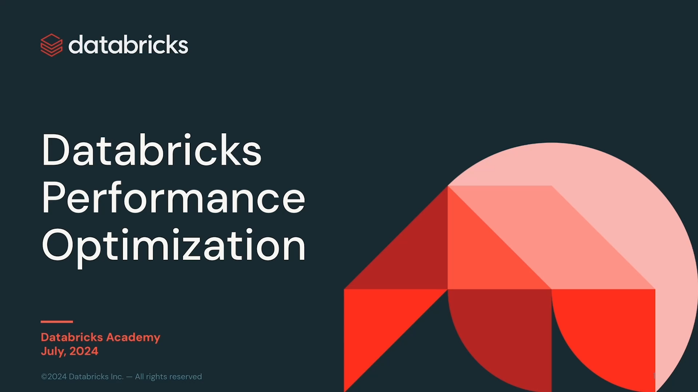
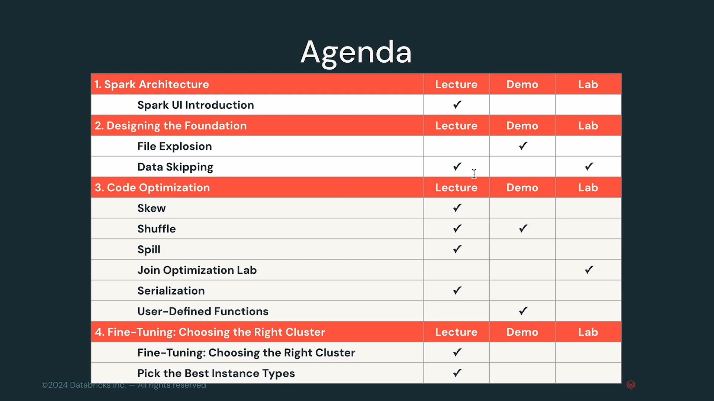

# Lección 01: Course Introduction

**Curso:** Databricks Performance Optimization (ID: 2967)  
**Lección:** Course Introduction (Lesson ID: 25594)  
**Tipo de Contenido:** Video (1080p Full HD)  
**Duración:** 1 min 09 seg (69 segundos)  
**Estado:** Completado 100%  

---

## 1. Evidencia Visual de la Lección

*Figura 1: Portada oficial del curso Databricks Performance Optimization (Databricks Academy - Julio 2024).*

*Figura 2: Agenda curricular detallada dividida en 4 secciones técnicas (Lecture, Demo, Lab).*

*Figura 3: Desglose de optimización de código, fine-tuning y dimensionamiento de clusters.*

---

## 2. Objetivos y Resumen de la Lección

El curso **Databricks Performance Optimization** profundiza en los mecanismos fundamentales de ejecución de Apache Spark™ y el motor Databricks Runtime (Photon), dotando a los ingenieros de datos de herramientas de diagnóstico y patrones arquitectónicos para identificar cuellos de botella y maximizar la eficiencia computacional y de costos.

### Estructura de la Agenda Oficial del Curso:

1. **Section 1: Spark Architecture**
   - *Spark UI Introduction (Lecture):* Análisis exhaustivo de la interfaz web de Spark UI, lectura de Jobs, Stages, Tasks, Event Timeline y métricas de ejecución.

2. **Section 2: Designing the Foundation**
   - *File Explosion (Demo):* Diagnóstico del problema de archivos pequeños (*small files problem*) y explosión de metadatos.
   - *Data Skipping and Liquid Clustering (Lecture & Lab):* Optimización de diseño físico mediante Liquid Clustering (`CLUSTER BY`), estadísticas min/max en columnas y podado de particiones.

3. **Section 3: Code Optimization**
   - *Skew (Lecture):* Detección y mitigación de asimetría de datos (*data skew*), salting y Adaptive Query Execution (AQE).
   - *Shuffles (Lecture & Demo):* Reducción de intercambio de datos entre particiones, tipos de joins (Broadcast Hash Join vs. Shuffle Hash Join vs. Sort-Merge Join).
   - *Spill (Lecture):* Diagnóstico de desbordamiento de memoria a disco (Spill to Disk/Memory), ajuste de memoria de ejecución y compresión.
   - *Join Optimization Lab (Lab):* Laboratorio práctico de optimización de operaciones de cruce masivo.
   - *Serialization (Lecture):* Impacto del formato de serialización de objetos en la JVM y PySpark.
   - *User-Defined Functions (Demo):* Evaluación del rendimiento de Python UDFs vs. Pandas UDFs vs. SQL Native Expressions.

4. **Section 4: Fine-Tuning: Choosing the Right Cluster**
   - *Fine-Tuning: Choosing the Right Cluster (Lecture):* Políticas de auto-escalado, Single Node vs. Multi-Node y cómputo Serverless.
   - *Pick the Best Instance Types (Lecture):* Selección óptima de familias de VMs (Memory Optimized, Compute Optimized, Storage Optimized con SSDs NVMe).

5. **Evaluación Final y Recursos:**
   - *Course Summary and Next Steps*
   - *Resources & System References*
   - *Quiz - Databricks Performance Optimization*
