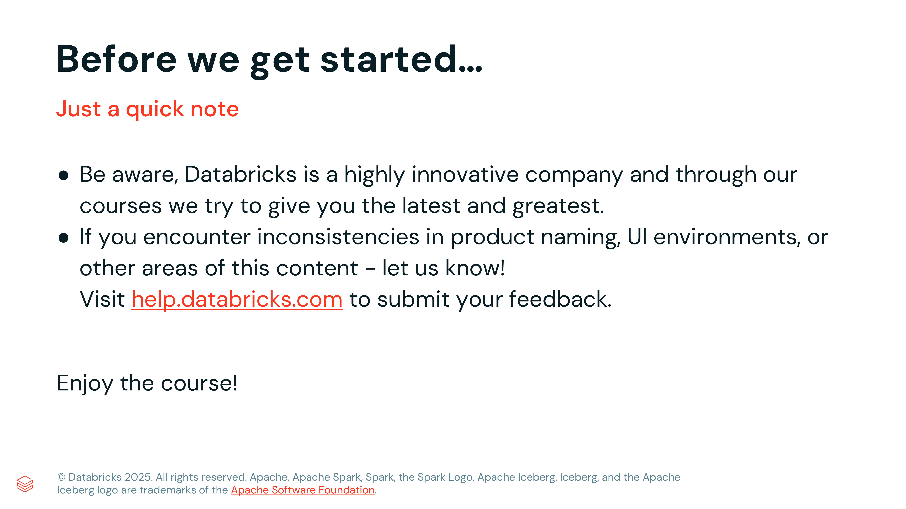

# Lección 02: Before we get started

**Curso:** Databricks Performance Optimization (ID: 2967)  
**Lección:** Before we get started (Lesson ID: 39113)  
**Tipo de Contenido:** Slides / Directrices de Laboratorio  
**Estado:** Completado 100%  

---

## 1. Evidencia Visual de la Lección

*Figura 1: Directrices oficiales de Databricks Academy sobre innovación continua y reporte de discrepancias.*

---

## 2. Directrices Oficiales de Databricks Academy

### Innovación Continua y Actualizaciones de la Plataforma
- **Ritmo de Lanzamientos:** Databricks innova a un ritmo acelerado con actualizaciones constantes en la interfaz gráfica (UI), APIs y motores de cómputo (Databricks Runtime, Photon).
- **Consistencia Visual:** Aunque pueden existir ligeras variaciones cosméticas entre las capturas de pantalla de los cursos y la versión en vivo del workspace, la funcionalidad técnica y los conceptos centrales permanecen consistentes.
- **Canal de Soporte y Feedback:** Si encuentras alguna discrepancia sustancial en laboratorios o material instructivo, repórtalo directamente a través del portal oficial de ayuda en [help.databricks.com](https://help.databricks.com).

### Requisitos de Laboratorio para Optimización de Rendimiento
1. **Entorno de Cómputo:**
   - Para las prácticas de análisis de rendimiento, se recomienda un clúster con Databricks Runtime (DBR) 13.3 LTS o superior con **Photon habilitado** para comparar planes de ejecución vectorizados.
   - Acceso completo a la interfaz web de **Spark UI** y **Query Profile** en Databricks SQL.
2. **Buenas Prácticas:**
   - Evitar tamaños desproporcionados de clústeres durante pruebas de concepto para poder observar cuellos de botella reales (skew, spill, shuffle).
   - Monitorear el consumo de DBUs y finalizar los recursos de cómputo una vez finalizadas las sesiones de diagnóstico.
