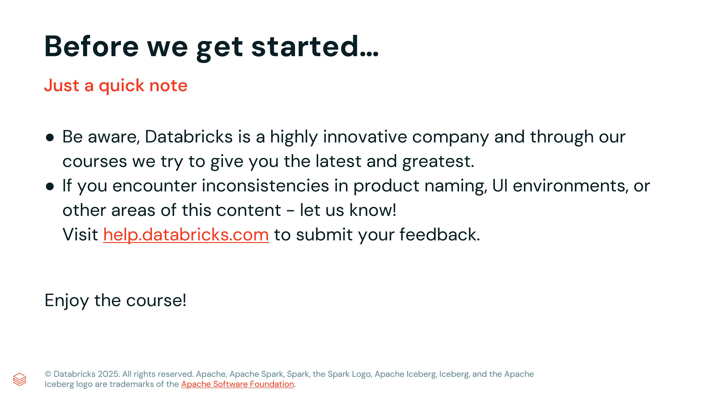

# Lección 03: Course Logistics Review

**Curso:** Databricks Performance Optimization (ID: 2967)  
**Lección:** Course Logistics Review (Lesson ID: 25615)  
**Tipo de Contenido:** HTML Interactivo / Guía Logística  
**Estado:** Completado 100%  

---

## 1. Evidencia Visual de la Lección

*Figura 1: Directrices logísticas oficiales de Databricks Academy para el curso Databricks Performance Optimization.*

---

## 2. Contenido Verbatim Oficial

### Working through this course
> *This course contains a series of lectures and in-product demos that guide you through important concepts and best practices on Databricks.*

### Databricks Academy Labs
> *We are pleased to offer a version of this course that also contains hands-on practice via a Databricks Academy Labs subscription. With a Databricks Academy Labs subscription, you gain access to a library of our most popular courses that each contain a lab environment where you can practice what you learn via hands-on labs.*
>
> *You can purchase the Databricks Academy Labs subscription directly from the Databricks Academy website:*
> - `customer-academy.databricks.com` for Databricks customers and the general public
> - `partner-academy.databricks.com` for Databricks partners

### Technical issues?
> *If you run into technical difficulties with this course, please submit a ticket here. When you submit a ticket please be sure to include the name of this course, screenshots of your issue, and detailed information to help us troubleshoot your issue.*

### Questions about course content?
> *If you have questions about this course content itself or need clarification on a certain topic, we recommend you reach out to the Databricks Academy Learners group in the Databricks Community.*
>
> *Good luck! Let's get started.*

---

## 3. Desglose Estructurado de Recursos
- **Soporte de Laboratorio:** Databricks Academy Help Portal (`help.databricks.com`).
- **Comunidad de Aprendizaje:** Grupo oficial *Databricks Academy Learners* para consultas técnicas de Spark y optimización.
- **Enfoque Pedagógico:** Combinación de conferencias teóricas (Lectures) y demostraciones prácticas en producto (Demos) sobre Spark UI, sesgo de datos (skew), desbordamiento (spill), serialización y dimensionamiento de clústeres.
