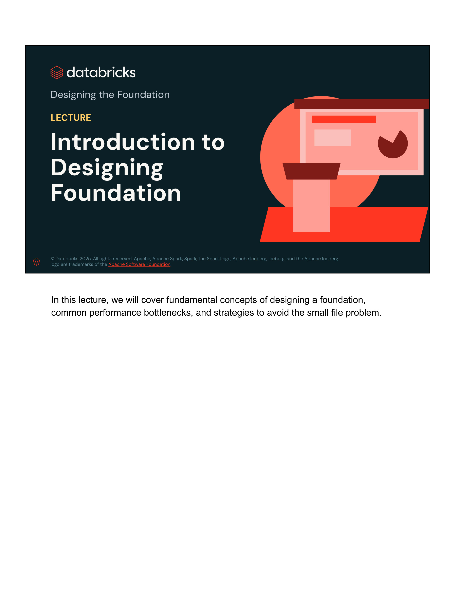
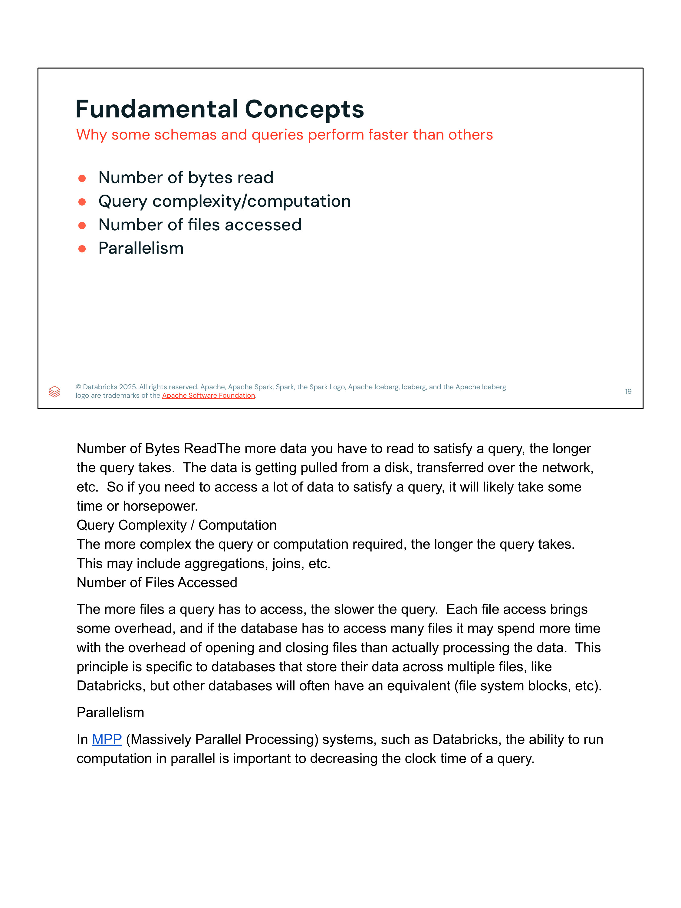
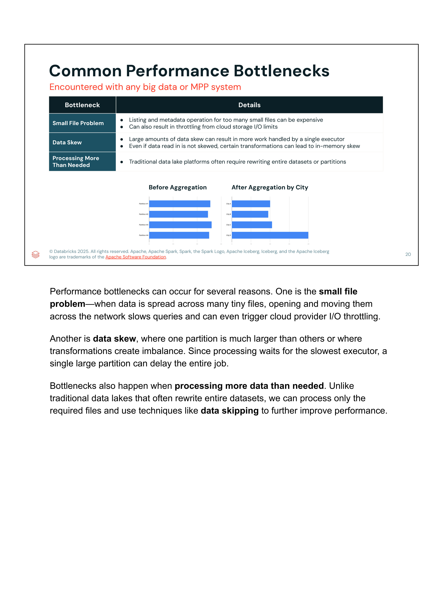
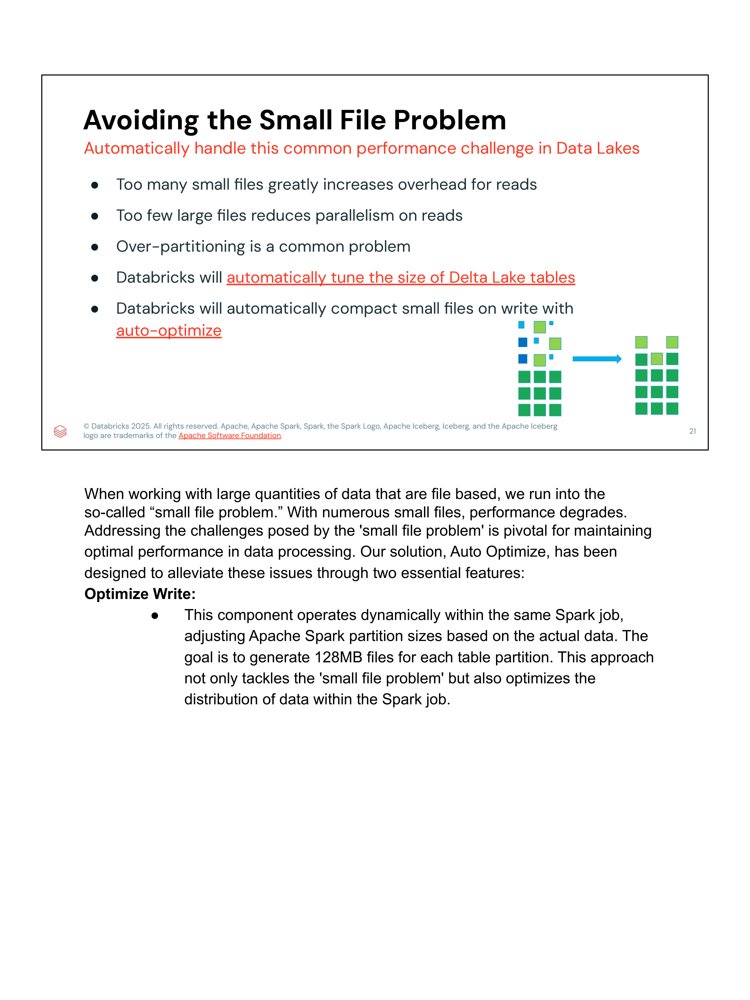
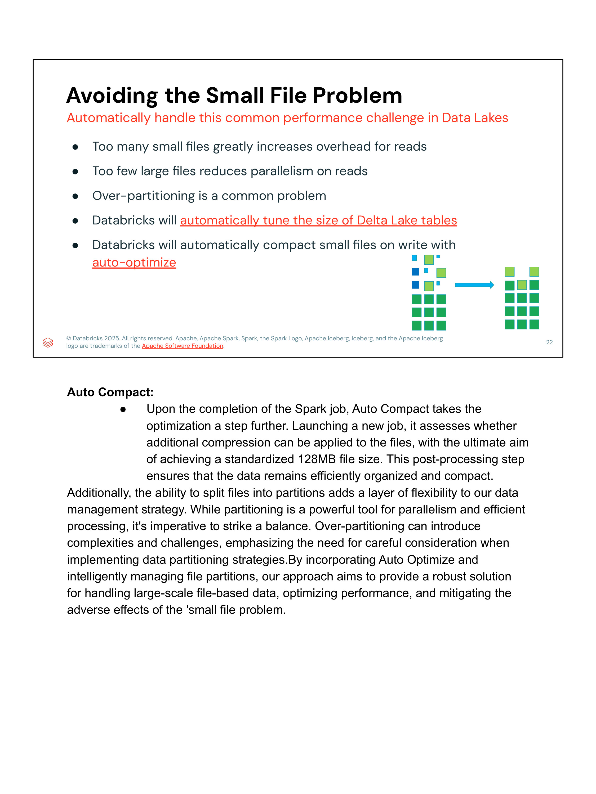

# Lección 05: Introduction to Designing Foundation

**Curso:** Databricks Performance Optimization (ID: 2967)  
**Sección:** Section 2: Designing the Foundation  
**Lección:** Introduction to Designing Foundation (Lesson ID: 44367)  
**Tipo de Contenido:** Slides / Conferencia Técnica Exhaustiva (6 Slides Oficiales)  
**Estado:** Completado 100%  

---

## 1. Evidencia Visual de la Lección (Galería de Diapositivas)

A continuación se presentan las capturas en alta resolución de los conceptos fundamentales de diseño de bases de datos, cuellos de botella comunes y estrategias para mitigar el problema de archivos pequeños (*Small File Problem*):

| Diapositiva | Descripción Técnica | Archivo de Imagen |
|---|---|---|
| **Slide 01** | Portada Oficial: Designing the Foundation |  |
| **Slide 02** | Conceptos Fundamentales: Por qué unos esquemas rinden más |  |
| **Slide 03** | Cuellos de Botella Comunes en Sistemas Big Data / MPP |  |
| **Slide 04** | Cómo Evitar el Small File Problem (Auto-Optimize & Optimize Write) |  |
| **Slide 05** | Auto-Compact y Gestión Equilibrada de Particiones |  |
| **Slide 06** | Conclusión de la Lección y Transición a Demo |  |

---

## 2. Objetivos y Resumen de la Lección

Esta lección inaugura la **Sección 2: Designing the Foundation**. En ella se exploran los cuatro pilares fundamentales que determinan por qué ciertas estructuras de datos y consultas se ejecutan órdenes de magnitud más rápido que otras en plataformas de procesamiento masivo en paralelo (MPP), se categorizan los tres cuellos de botella más severos en lagos de datos y se presentan los mecanismos nativos de Delta Lake y Databricks para combatir el problema de archivos pequeños (*Small File Problem*).

---

## 3. Cuatro Conceptos Fundamentales de Rendimiento (Fundamental Concepts)

¿Por qué algunos esquemas y consultas rinden significativamente mejor que otros?

1. **Número de Bytes Leídos (Number of Bytes Read):**
   - Cuanta mayor cantidad de datos deba leer un motor para satisfacer una consulta, mayor será el tiempo de respuesta.
   - Los datos deben recuperarse desde el almacenamiento de objetos en la nube (AWS S3, Azure ADLS Gen2, GCP GCS), transferirse a través de la red y cargarse en la memoria del clúster.
   - Si una consulta requiere escanear volúmenes masivos de datos para filtrar solo unas pocas filas, consumirá una cantidad desproporcionada de ancho de banda y potencia de cómputo.
   - *Solución:* Técnicas de poda de particiones (*Partition Pruning*), filtrado por empuje hacia abajo (*Predicate Pushdown*) y omisión de datos (*Data Skipping*).

2. **Complejidad de la Consulta / Cómputo (Query Complexity / Computation):**
   - A mayor complejidad algorítmica de la transformación o cálculo requerido, mayor será el tiempo de CPU necesario.
   - Las operaciones intensivas incluyen agregaciones con alta cardinalidad, cruces masivos (*joins*), funciones de ventana (*window functions*) y evaluaciones de expresiones complejas.

3. **Número de Archivos Accedidos (Number of Files Accessed):**
   - Cuanto mayor sea el número de archivos físicos individuales que una consulta deba abrir, más lenta será la ejecución.
   - Cada acceso a un archivo genera una sobrecarga operativa considerable: llamadas a la API de almacenamiento de objetos (`GET`, `LIST`), resolución de metadatos, apertura de descriptores de archivos, lectura del pie de página (*footer* de Parquet) y cierre del archivo.
   - Si una tabla almacena gigabytes de datos fragmentados en millones de archivos de unos pocos kilobytes, el motor pasará más tiempo gestionando la sobrecarga de apertura y cierre de archivos que procesando los datos reales.

4. **Paralelismo (Parallelism):**
   - En sistemas de Procesamiento Masivo en Paralelo (MPP) como Databricks, la capacidad de dividir el cálculo en tareas paralelas independientes distribuidas a través de múltiples cores/slots es el factor crítico para reducir el tiempo de reloj (*clock time*) de una consulta.

---

## 4. Cuellos de Botella Comunes en Rendimiento (Common Performance Bottlenecks)

Los cuellos de botella más frecuentes en arquitecturas de Big Data y sistemas MPP se resumen en la siguiente tabla técnica:

| Cuello de Botella | Detalle Técnico y Manifestación | Consecuencia en el Sistema |
|---|---|---|
| **Small File Problem** (Problema de Archivos Pequeños) | • El listado de archivos y las operaciones de metadatos para excesivos archivos pequeños resultan sumamente costosos. • Exceso de llamadas a la API de almacenamiento de objetos en la nube. | • Degeneración del rendimiento de lectura. • Estrangulamiento (*throttling*) por límites de operaciones I/O por segundo (IOPS) del proveedor cloud (AWS S3 / Azure Blob). |
| **Data Skew** (Asimetría / Sesgo de Datos) | • Grandes volúmenes de asimetría provocan que un único ejecutor procese una porción desproporcionada de datos. • Aunque la lectura inicial esté balanceada, ciertas transformaciones (`groupBy`, `join` por clave sesgada) crean asimetría en memoria. | • Tareas rezagadas (*stragglers*). • El trabajo completo se retrasa esperando que termine el ejecutor más lento, manteniendo a todos los demás cores ociosos. |
| **Processing More Than Needed** (Procesar Más Datos de los Necesarios) | • Plataformas de lago de datos tradicionales a menudo requieren reescribir conjuntos de datos completos o particiones enteras ante cambios menores. | • Consumo innecesario de I/O y cómputo. • Falta de poda a nivel de bloque/archivo. |

---

## 5. Estrategias para Evitar el "Small File Problem"

### 5.1. El Dilema del Tamaño de Archivo
- **Demasiados archivos pequeños:** Incrementa exponencialmente la sobrecarga de metadatos y peticiones de red al almacenamiento de objetos.
- **Demasiado pocos archivos gigantes:** Reduce el paralelismo en la lectura, ya que el número de tareas concurrentes que Spark puede asignar para leer una tabla está limitado por el número de particiones/archivos escaneables.
- **Sobre-particionamiento (Over-partitioning):** Un error de diseño muy extendido consiste en particionar tablas por columnas de alta cardinalidad (por ejemplo, por fecha y hora, o por ID de cliente), lo que divide la información en miles de directorios con archivos diminutos.

### 5.2. Auto Optimize en Delta Lake
Databricks provee la solución **Auto Optimize**, integrada por dos mecanismos complementarios:

#### A. Optimize Write (Optimización durante la Escritura)
- Opera dinámicamente **dentro del mismo trabajo de Spark** que escribe los datos.
- Ajusta el tamaño de las particiones de Apache Spark en tiempo de ejecución en función del volumen de datos real.
- **Objetivo central:** Generar archivos de aproximadamente **128 MB** para cada partición de tabla.
- Reduce el número de archivos escritos inmediatamente sin necesidad de un paso posterior manual, optimizando la distribución de datos desde el origen.

#### B. Auto Compact (Compactación Automática Posterior)
- Opera **inmediatamente después de que el trabajo de Spark ha concluido** la escritura inicial.
- Lanza un sub-trabajo liviano que evalúa si los archivos recién escritos pueden comprimirse y consolidarse aún más.
- Fusiona archivos pequeños dispersos hasta alcanzar el tamaño objetivo estandarizado de **128 MB**.
- Garantiza que la tabla se mantenga organizada de manera eficiente sin intervención del usuario ni programación de tareas `OPTIMIZE` recurrentes para escrituras pequeñas continuas.

---

## 6. Conexión Curricular
Esta lección establece la base teórica sobre el almacenamiento físico y la gestión de archivos. A continuación, en la **Lección 06: Demo: File Explosion**, se observará en código real y en la Spark UI el impacto dramático del problema de archivos pequeños frente a una tabla adecuadamente optimizada. Posteriormente, en la **Lección 07: Data Skipping and Liquid Clustering**, se estudiará la tecnología de vanguardia que reemplaza al particionamiento tradicional (`CLUSTER BY`).
