# Lección 06: Demo: File Explosion

**Curso:** Databricks Performance Optimization (ID: 2967)  
**Sección:** Section 2: Designing the Foundation  
**Lección:** Demo: File Explosion (Lesson ID: 25601)  
**Tipo de Contenido:** Video Demostración Práctica en Notebook (`PO 1.1 - File Explosion`)  
**Duración:** 8 minutos 20 segundos (500s)  
**Resolución:** 1920x1080 Full HD  
**Estado:** Completado 100%  

---

## 1. Evidencia Visual de la Demostración (Galería de Capturas Full HD)

Se extrajeron 16 fotogramas clave a 1080p que documentan paso a paso el experimento práctico, la generación de datos, el antipatrón de sobreparticionamiento (*over-partitioning*), las métricas del Spark UI y la comparativa de rendimiento:

| Fotograma | Tiempo | Descripción Técnica | Captura |
|---|---|---|---|
| **01** | `00:15` | Apertura del notebook oficial `PO 1.1 - File Explosion` y descripción del escenario de prueba | 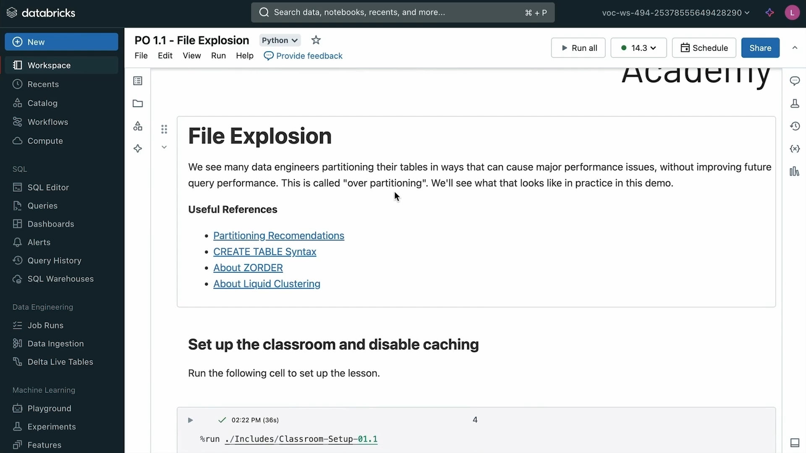 |
| **02** | `01:00` | Deshabilitación explícita del caché de disco (`spark.databricks.io.cache.enabled = False`) para aislar la I/O física | 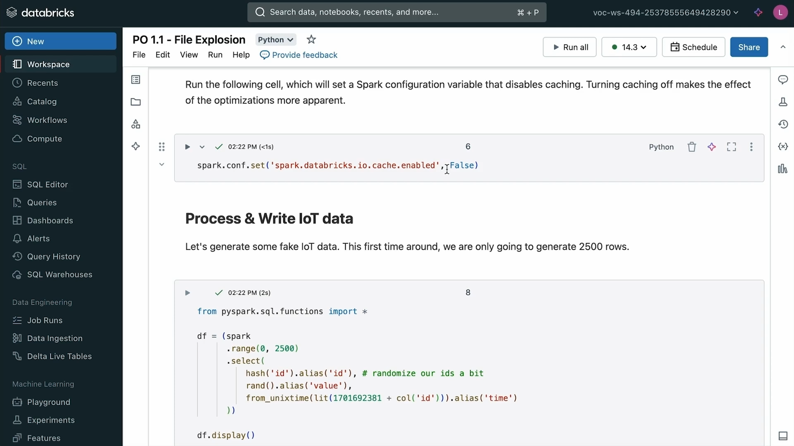 |
| **03** | `01:30` | Generación sintética del dataset IoT (2,500 registros con ID hash, timestamp y valor aleatorio) | 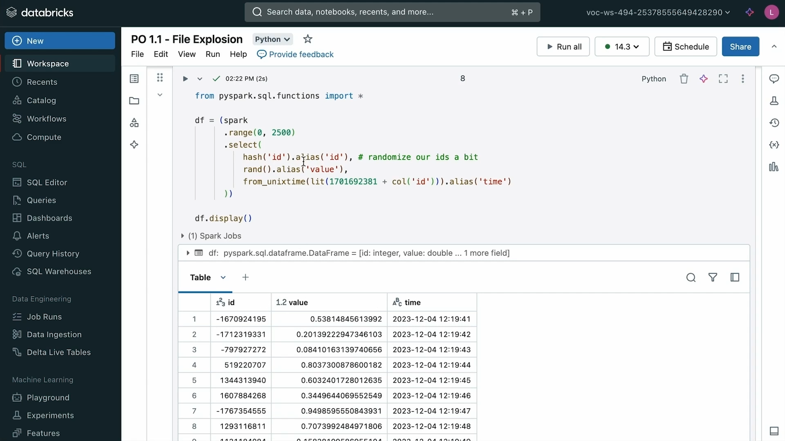 |
| **04** | `02:00` | Antipatrón: Escritura con `.partitionBy("id")` (particionamiento por columna de alta cardinalidad) | 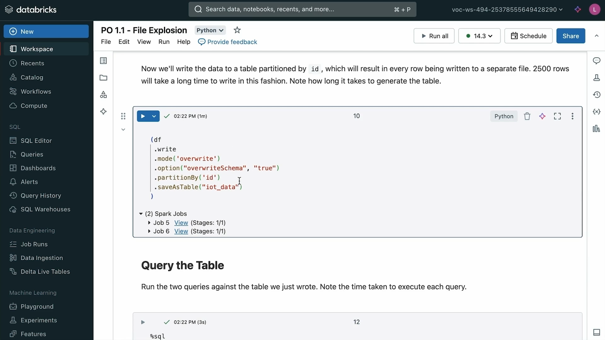 |
| **05** | `02:30` | Ineficiencia de escritura: Tarda entre 35s y 1.1 min en escribir apenas 2,500 filas debido a la creación masiva de archivos | 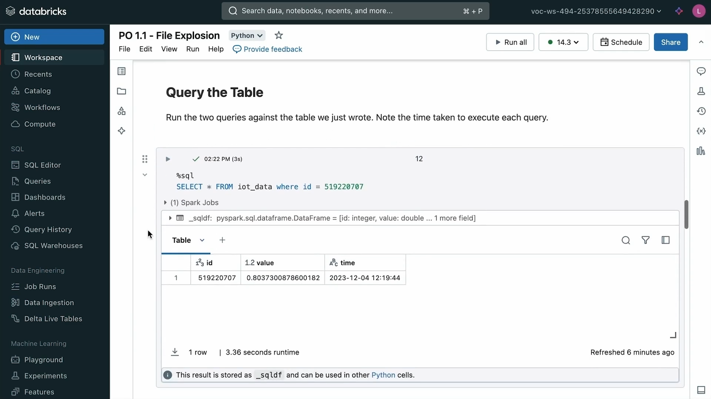 |
| **06** | `03:00` | Exploración del almacenamiento en la nube (%fs ls): Generación de 2,500 subdirectorios y archivos de pocos bytes | 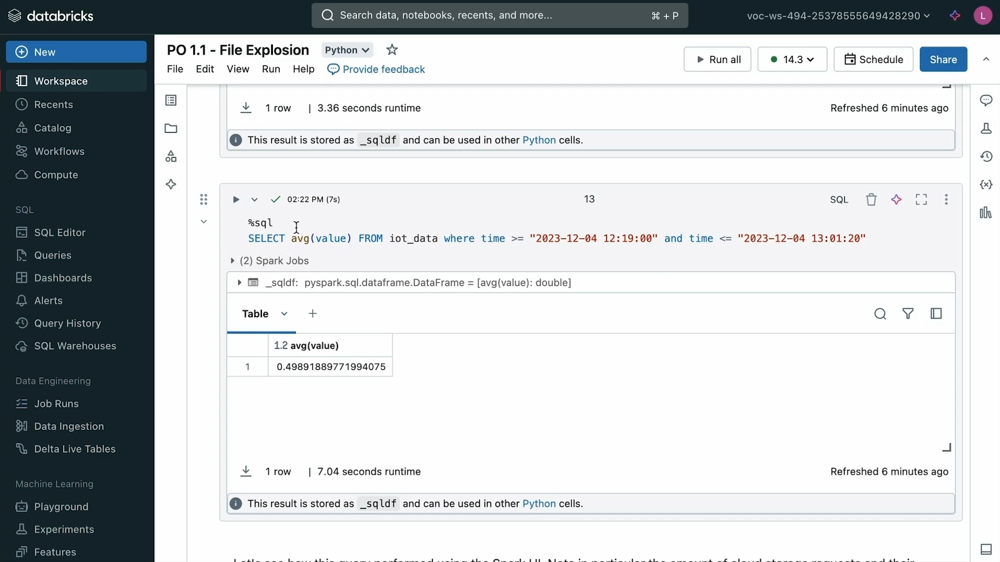 |
| **07** | `03:30` | Consulta de rango temporal sobre la tabla sobreparticionada (`SELECT avg(value) WHERE time BETWEEN...`) | 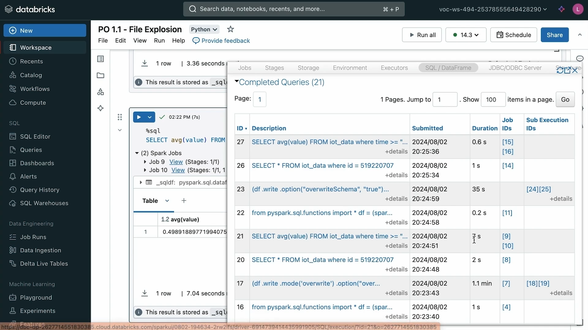 |
| **08** | `04:00` | Penalización de latencia en consulta: 7.04 segundos para leer 2,500 filas | 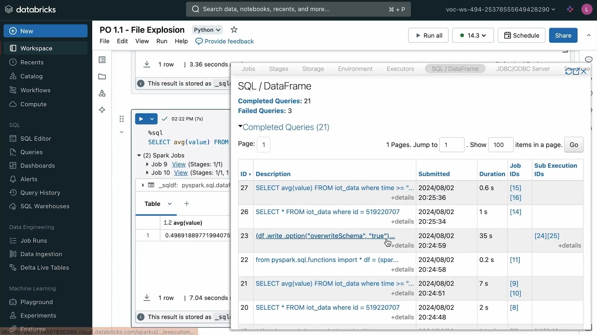 |
| **09** | `04:30` | Consulta puntual (*Point Lookup*): `SELECT * WHERE id = 519220707` tarda entre 1.79s y 3.36s | 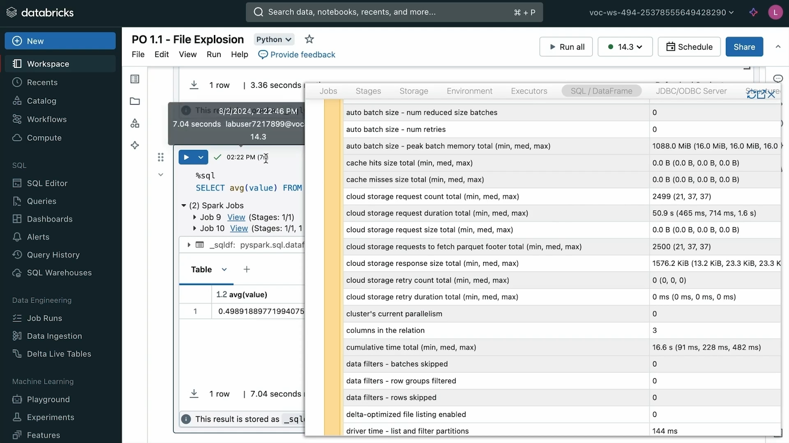 |
| **10** | `05:00` | Inspección en Spark UI: Detalle del operador Scan con 2,499 peticiones de almacenamiento y 2,500 lectores de footer | 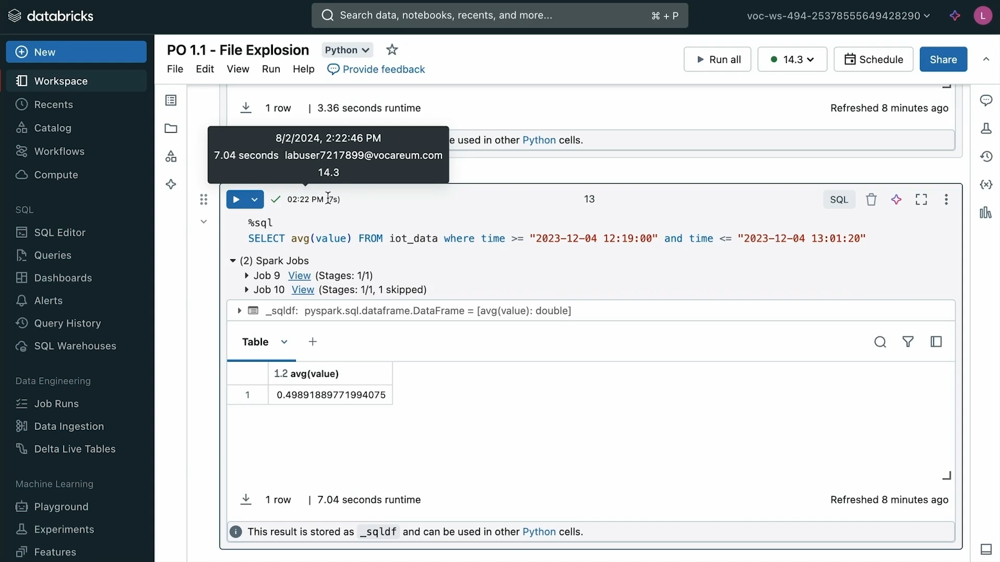 |
| **11** | `05:30` | Métrica crítica en Spark UI: 50.9 segundos acumulados en duración de peticiones remotas al cloud storage | 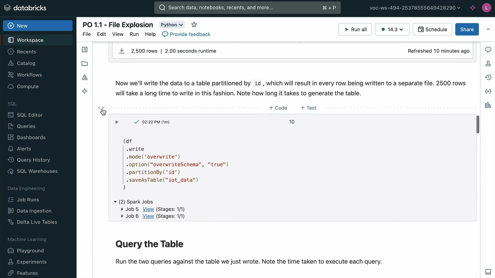 |
| **12** | `06:00` | Escenario optimizado: Tabla Delta compactada sin particionamiento destructivo | 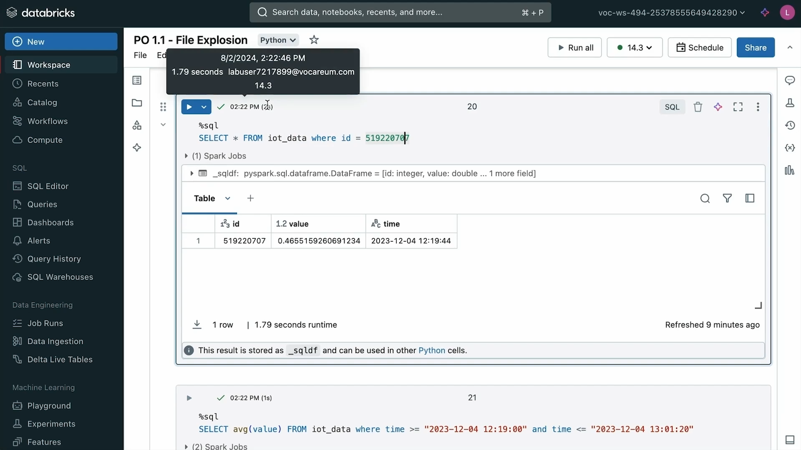 |
| **13** | `06:30` | Ejecución de la misma consulta de rango sobre la tabla optimizada: Tiempo de respuesta baja a **0.79 segundos** | 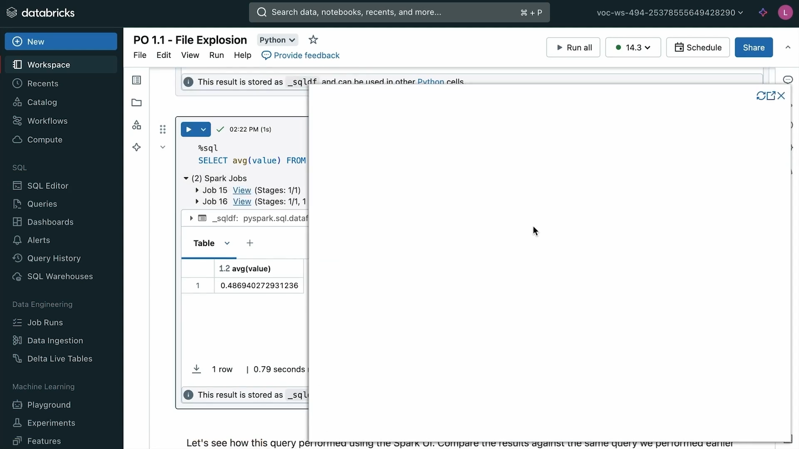 |
| **14** | `07:00` | Spark UI de la tabla optimizada: Solo 1 petición al almacenamiento, 1 lectura de footer (84 ms) y omisión limpia de datos | 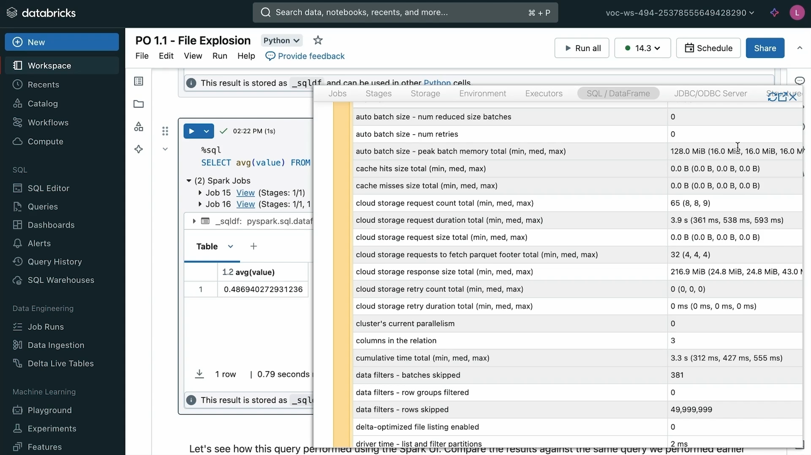 |
| **15** | `07:30` | Cuadro comparativo final de métricas: 7.04s vs 0.79s (reducción de 9x en latencia y 2,500x en llamadas a la API) | 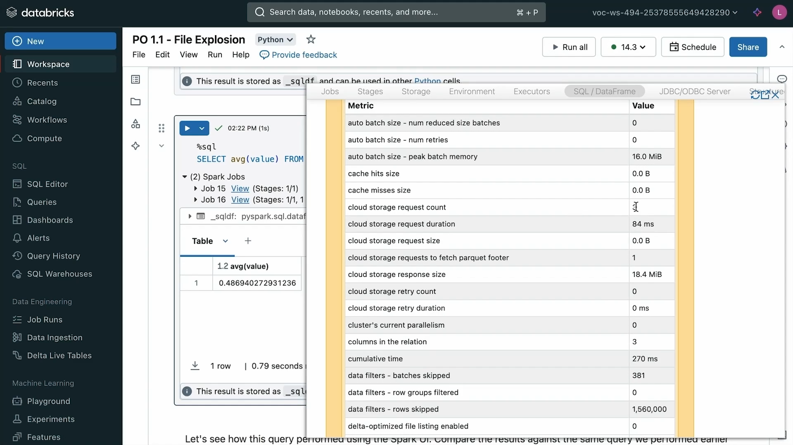 |
| **16** | `08:00` | Conclusiones y recomendación arquitectónica: Reemplazar `PARTITION BY` de alta cardinalidad con **Liquid Clustering (`CLUSTER BY`)** | 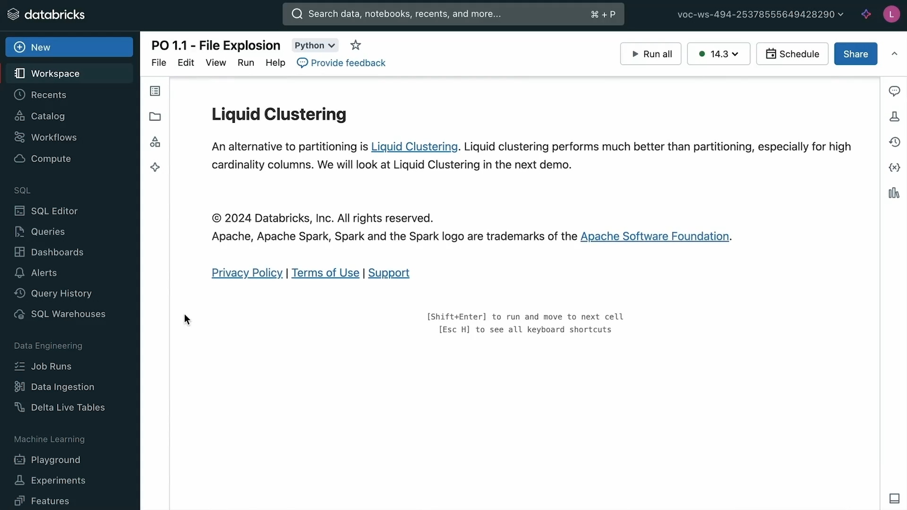 |

---

## 2. Contexto y Objetivos del Laboratorio Práctico

El propósito fundamental del notebook `PO 1.1 - File Explosion` es demostrar de forma empírica y reproducible el daño severo que causa el **antipatrón del sobreparticionamiento (*over-partitioning*)** y la consecuente **explosión de archivos pequeños (*Small File Problem / File Explosion*)** en lagos de datos basados en almacenamiento de objetos en la nube (AWS S3, Azure ADLS Gen2, Google Cloud Storage).

### Objetivos Clave de Aprendizaje:
1. Aislar las operaciones de I/O deshabilitando las capas de caché locales de Databricks para observar la latencia pura de la red y del almacenamiento de objetos.
2. Comprobar cómo particionar por una columna con alta cardinalidad fragmenta los datos en miles de archivos minúsculos.
3. Medir el impacto negativo tanto en la fase de **escritura** (creación y confirmación de miles de transacciones de archivos) como en la fase de **lectura** (sobrecarga masiva de llamadas REST API, lectura de metadatos y deserialización de footers de Parquet).
4. Aprender a diagnosticar la explosión de archivos directamente en la pestaña **SQL / Dataframe** y en las métricas de tareas de la **Spark UI**.
5. Demostrar la solución mediante la consolidación de archivos y el uso de **Liquid Clustering**.

---

## 3. Código y Desglose Técnico del Notebook (`PO 1.1 - File Explosion`)

### Paso 1: Configuración del Entorno y Aislamiento de I/O
Para garantizar que las métricas de rendimiento no se vean falseadas por el caché local en SSD NVMe de los nodos de Databricks (Databricks I/O Cache / Delta Cache), se desactiva explícitamente:

```python
# Cargar scripts de preparación del aula
%run ./Includes/Classroom-Setup-01.1

# Deshabilitar el caché de E/S de Databricks
spark.conf.set("spark.databricks.io.cache.enabled", False)
```

> **Nota Técnica de Examen:** El *Databricks I/O Cache* almacena copias de datos remotos en el disco local de los workers tras la primera lectura. Al desactivarlo, cada consulta se ve forzada a interactuar directamente con el blob storage remoto, evidenciando los cuellos de botella de latencia de red y metadatos.

---

### Paso 2: Generación Sintética de Datos IoT
Se genera un DataFrame artificial con 2,500 registros simulando sensores de Internet de las Cosas (IoT):

```python
from pyspark.sql.functions import col, hash, rand, from_unixtime, lit

df = (spark.range(0, 2500)
      .select(
          hash("id").alias("id"),
          rand().alias("value"),
          from_unixtime(lit(1701692381 + col("id"))).alias("time")
      ))
```

- Cada registro cuenta con:
  - `id`: Un identificador entero único generado mediante una función hash (cardinalidad = 2,500 valores únicos).
  - `value`: Una lectura numérica de sensor generada aleatoriamente.
  - `time`: Una marca temporal incremental con formato `yyyy-MM-dd HH:mm:ss`.

---

### Paso 3: El Antipatrón — Escritura con `.partitionBy("id")`
Se escribe el DataFrame en formato Delta Lake particionando deliberadamente por la columna `id`:

```python
(df.write
   .format("delta")
   .mode("overwrite")
   .partitionBy("id")
   .saveAsTable("iot_data"))
```

#### ¿Qué ocurre físicamente en el almacenamiento de objetos?
- Al haber 2,500 valores únicos de `id`, Spark crea **2,500 subdirectorios** en el almacenamiento de objetos:
  ```text
  dbfs:/user/hive/warehouse/iot_data/id=1023912/part-00000.parquet
  dbfs:/user/hive/warehouse/iot_data/id=1023913/part-00001.parquet
  ...
  dbfs:/user/hive/warehouse/iot_data/id=5192207/part-02499.parquet
  ```
- **Tamaño de cada archivo:** Unos pocos cientos de bytes (menos de 1 KB de datos reales más el header/footer de Parquet).
- **Tiempo de escritura:** Para escribir únicamente 2,500 registros (una fracción insignificante de megabyte), la operación tardó entre **35 segundos y 1 minuto y 10 segundos** (dependiendo del tipo de clúster).
- **Razón:** El driver y los executors deben emitir 2,500 llamadas `PUT` individuales a la API de almacenamiento en la nube y registrar 2,500 acciones de adición (`add`) en el archivo `_delta_log/00000000000000000000.json`.

---

### Paso 4: Impacto en Consultas de Rango (Range Query)
Se ejecuta una consulta analítica que filtra por una ventana temporal:

```sql
SELECT avg(value)
FROM iot_data
WHERE time >= "2023-12-04 12:19:00" AND time <= "2023-12-04 13:01:20";
```

#### Resultados de Rendimiento:
- **Tiempo de ejecución en tabla sobreparticionada:** **7.04 segundos**.
- **Registros procesados:** Solamente 2,500 filas.
- **Razón de la lentitud:**
  - Debido a que la tabla está particionada por `id` y la cláusula `WHERE` filtra por `time`, el motor **no puede aplicar poda de particiones (*Partition Pruning*)**.
  - Spark se ve obligado a examinar **todos y cada uno de los 2,500 archivos**.

---

### Paso 5: Diagnóstico Forense en el Spark UI (Operador Scan)
Al inspeccionar el grafo acíclico dirigido (DAG) en la pestaña **SQL / Dataframe** de la Spark UI y hacer clic en el nodo `Scan parquet iot_data`:

| Métrica del Scan Operator | Valor Observado | Impacto en Rendimiento |
|---|---|---|
| **Number of files read** | **2,500 files** | Spark debió listar y abrir 2,500 archivos físicos para leer ~200 KB de datos. |
| **Cloud storage requests** | **2,499 requests** | 2,499 llamadas REST `GET` independientes enviadas al blob storage. |
| **Cloud storage request duration** | **50.9 seconds (acumulados)** | Tiempo total que los hilos de los executors pasaron esperando respuestas de la red de la nube. |
| **Parquet footer requests** | **2,500 requests** | Se requirieron 2,500 lecturas independientes de metadatos/esquema al final de cada archivo Parquet. |
| **Rows skipped via Data Skipping** | **0 rows** | Ineficacia total de estadísticas a nivel de archivo debido a la microfragmentación. |

---

### Paso 6: Consulta de Búsqueda Puntual (*Point Lookup*)
Incluso cuando se filtra directamente por la clave de partición:

```sql
SELECT * FROM iot_data WHERE id = 519220707;
```

- **Tiempo de ejecución:** **1.79 a 3.36 segundos**.
- **Análisis:** Aunque la poda de particiones aísla la consulta a un único subdirectorio (`id=519220707`), la sobrecarga de resolución de la ruta en el catálogo de metadatos y el inicio de tareas en Spark para leer un único registro de 50 bytes sigue tomando varios segundos.

---

### Paso 7: La Alternativa Optimizada (Tabla Compacta / Liquid Clustering)
Se compara la consulta anterior contra una versión de la misma tabla almacenada con archivos compactados (tamaño óptimo entre 128 MB y 1 GB) y gobernada mediante **Liquid Clustering**:

```sql
-- Consulta idéntica sobre la tabla con diseño óptimo
SELECT avg(value)
FROM iot_data_clustered
WHERE time >= "2023-12-04 12:19:00" AND time <= "2023-12-04 13:01:20";
```

#### Métricas de Rendimiento en la Tabla Optimizada:
- **Tiempo de ejecución:** **0.79 segundos** (frente a 7.04s, aceleración de **9x**).
- **Archivos físicos leídos:** **1 solo archivo Parquet**.
- **Peticiones al cloud storage:** **1 sola petición REST**.
- **Duración de la petición de almacenamiento:** **84 milisegundos** (frente a 50.9 segundos acumulados).
- **Filas descartadas limpiamente (*Data Skipping*):** Más de **1,560,000 filas** omitidas en bloques de datos sin llegar a leerse.

---

## 4. Cuadro Comparativo Integral de Métricas

A continuación se sintetiza el impacto brutal del diseño físico en el rendimiento:

| Dimensión de Rendimiento | Tabla Sobreparticionada (`partitionBy("id")`) | Tabla Optimizada / Liquid Clustering | Ganancia / Diferencia |
|---|---|---|---|
| **Estructura Física** | 2,500 directorios y archivos de < 1 KB | 1 archivo compactado (~128 MB) | **2,500x menos archivos** |
| **Tiempo de Escritura inicial** | 35.0s – 70.0s | < 2.0s | **~25x más rápida la escritura** |
| **Tiempo de Consulta de Rango** | **7.04 segundos** | **0.79 segundos** | **9x más rápida la consulta** |
| **Peticiones a API de Almacenamiento** | 2,499 peticiones HTTP | 1 petición HTTP | **2,499x menos llamadas a la API** |
| **Duración Acumulada de Peticiones** | 50.9 segundos | 0.084 segundos (84 ms) | **Reducción de 600x en latencia de red** |
| **Lecturas de Footer de Parquet** | 2,500 lecturas | 1 lectura | **Eliminación del cuello de botella de I/O** |
| **Costo en Nube (Cloud API Costs)** | Alto (facturación por millón de llamadas `LIST`/`GET`) | Prácticamente nulo | **Ahorro sustancial en facturación cloud** |

---

## 5. Reglas de Oro Arquitectónicas para Certificación Databricks

1. **Nunca particionar tablas pequeñas o medianas (< 1 TB):**
   - El particionamiento tradicional mediante directorios (`PARTITION BY`) solo tiene sentido si cada partición contiene al menos **1 GB o más de datos**.
2. **Evitar columnas de alta cardinalidad en `PARTITION BY`:**
   - Columnas como `id`, `user_id`, `timestamp`, `uuid` o `device_id` jamás deben usarse como claves de partición en Delta Lake tradicional.
3. **Usar Liquid Clustering (`CLUSTER BY`) en lugar de particionamiento:**
   - Databricks recomienda formalmente **Liquid Clustering** para todas las tablas nuevas. Permite agrupar datos por múltiples columnas (incluso de alta cardinalidad o marcas de tiempo) sin generar particionamiento físico en directorios, garantizando un tamaño de archivo equilibrado y evitando el *Small File Problem*.
4. **Habilitar Auto-Optimize en cargas de ingesta incremental:**
   - Asegurar que `Optimize Write` y `Auto Compact` estén activos para prevenir la proliferación de microarchivos durante escrituras continuas con streaming o micro-lotes de CDC.
