# Lección 07: Data Skipping and Liquid Clustering

**Curso:** Databricks Performance Optimization (ID: 2967)  
**Sección:** Section 2: Designing the Foundation  
**Lección:** Data Skipping and Liquid Clustering (Lesson ID: 44368)  
**Tipo de Contenido:** Slides / Conferencia Técnica Exhaustiva (13 Diapositivas Oficiales)  
**Estado:** Completado 100%  

---

## 1. Evidencia Visual de la Lección (Galería de Diapositivas Oficiales en Alta Resolución)

A continuación se presentan las 13 diapositivas extraídas en máxima resolución (2250x3000 nativo) con sus notas pedagógicas oficiales de Databricks:

| Diapositiva | Título / Tema Principal | Captura Oficial |
|---|---|---|
| **Slide 01** | Portada Oficial: Data Skipping and Liquid Clustering | 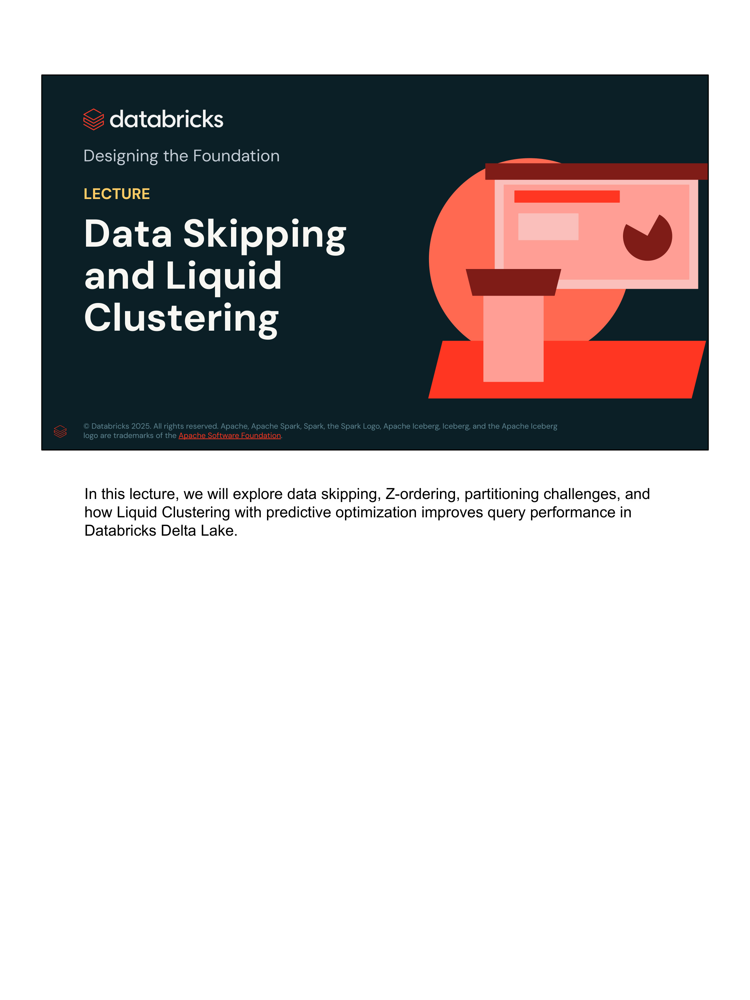 |
| **Slide 02** | Data Skipping: Poda de I/O mediante estadísticas a nivel de archivo (Min/Max) | 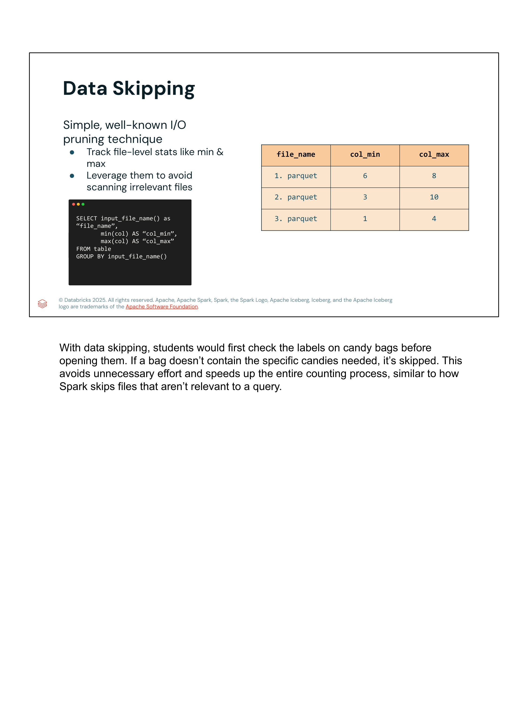 |
| **Slide 03** | Z-Ordering: Reorganización física multidimensional de datos en Parquet | 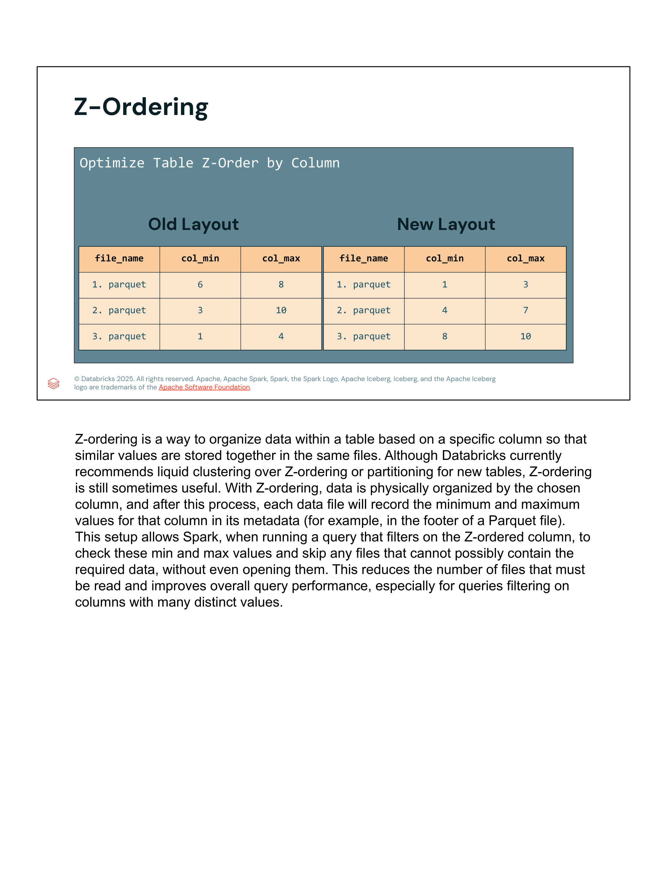 |
| **Slide 04** | Z-Ordering en acción: Ejemplo de consulta `WHERE Col = 7` (1 archivo vs 2 archivos) | 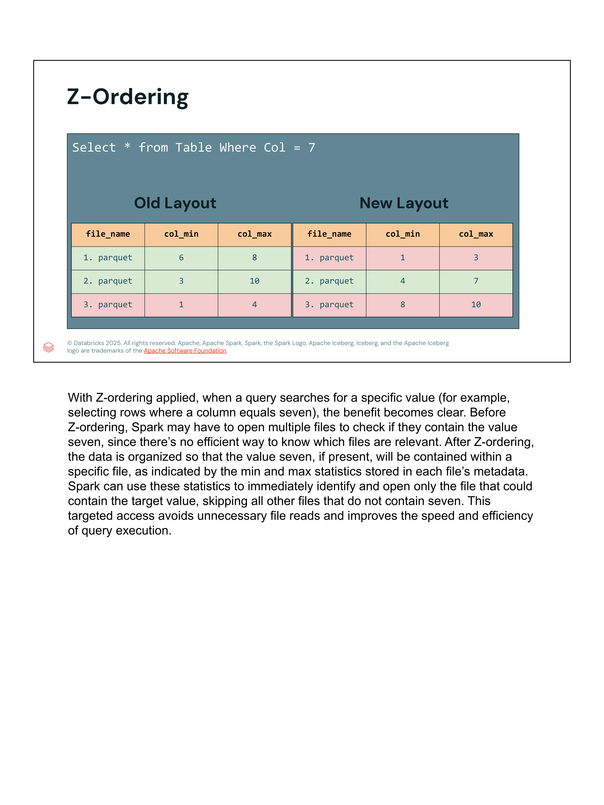 |
| **Slide 05** | Delta Lake y Estadísticas de Tabla (`dataSkippingNumIndexedCols = 32`) y orden de filtros | 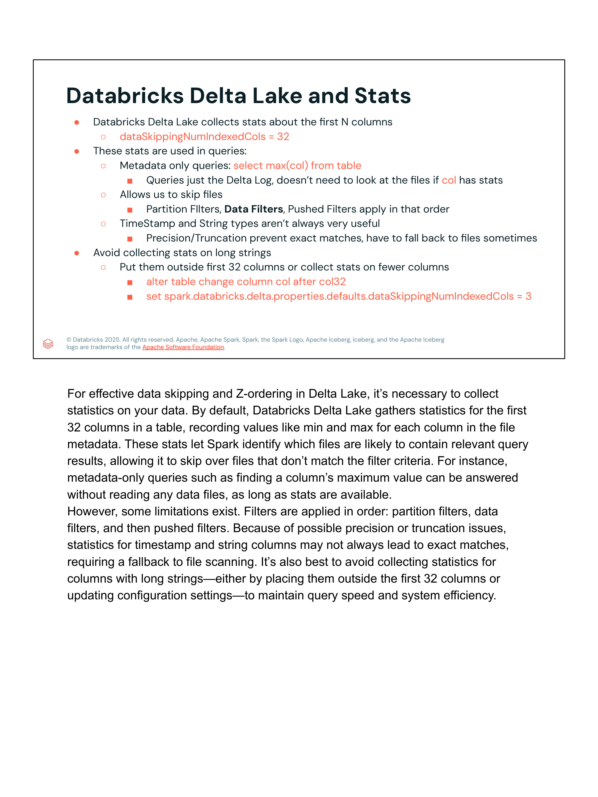 |
| **Slide 06** | ¿Qué hay del Particionamiento tradicional? Reglas, tamaños (1 GB – 1 TB) y casos válidos | 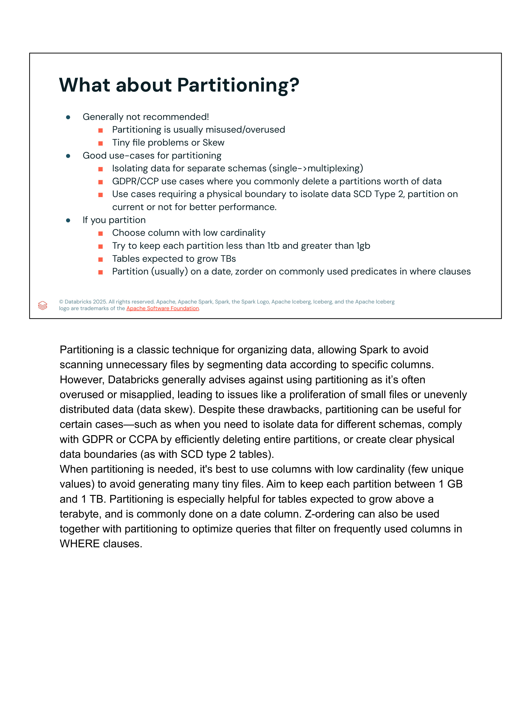 |
| **Slide 07** | Desafíos del Particionamiento en Disco: Explosión de archivos pequeños y sesgo de datos (*Skew*) | 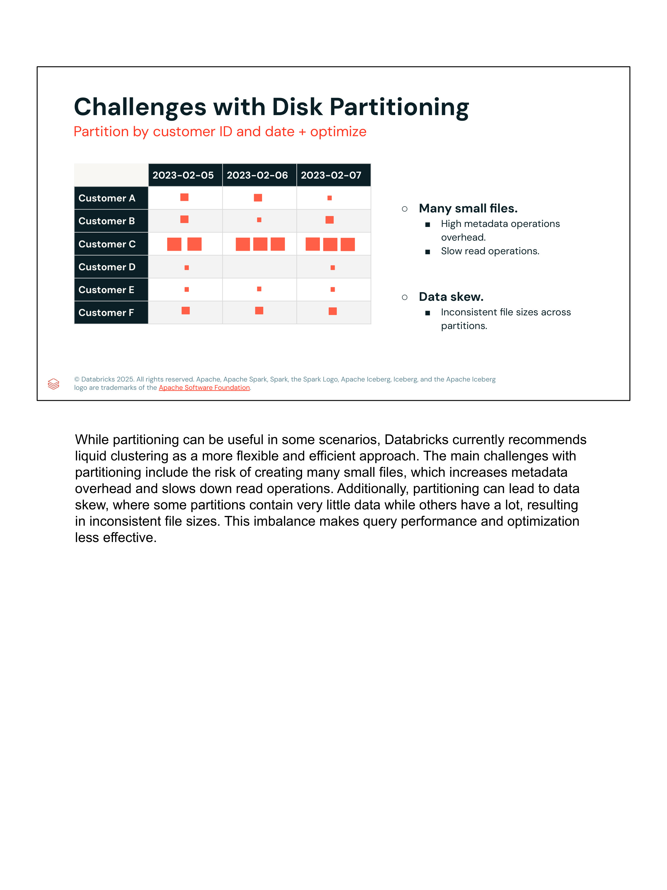 |
| **Slide 08** | Introducción a Liquid Clustering: Concepto, beneficios y concurrencia a nivel de fila (*Row-Level*) | 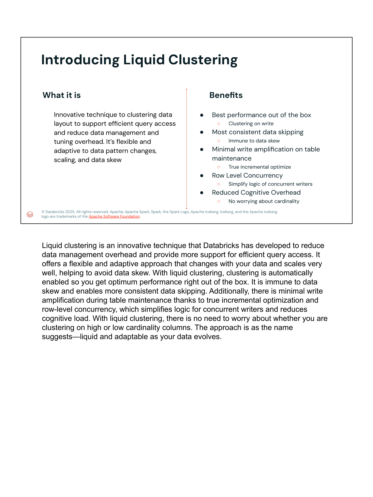 |
| **Slide 09** | Mecánica de Liquid Clustering: Tamaños consistentes y ausencia de límites rígidos | 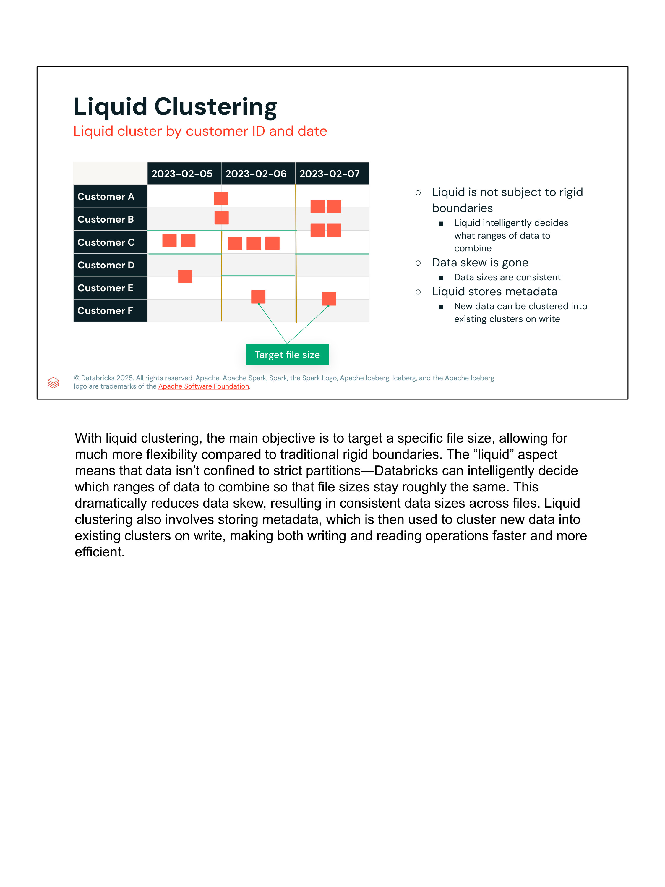 |
| **Slide 10** | Estadísticas de Tabla con `ANALYZE TABLE` y optimización con Adaptive Query Execution (AQE) | 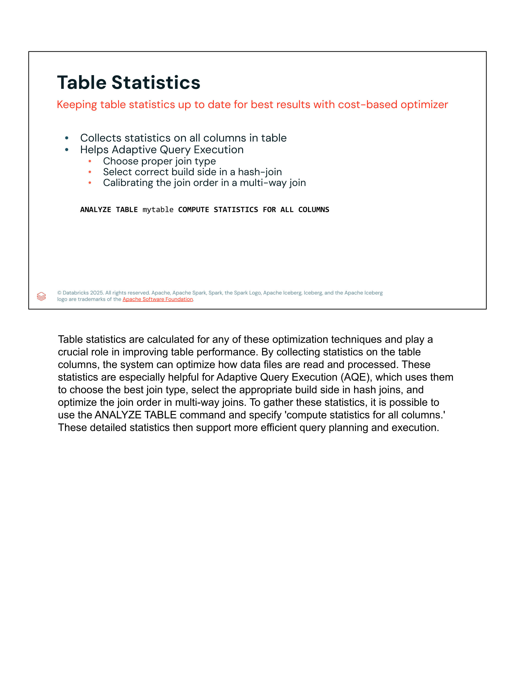 |
| **Slide 11** | Optimización Predictiva (*Predictive Optimization*): Mantenimiento proactivo con IA | 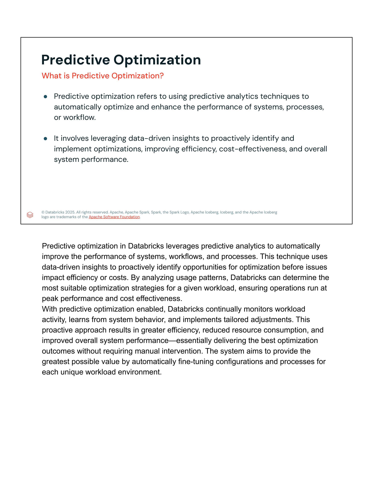 |
| **Slide 12** | Características clave de Predictive Optimization: `OPTIMIZE`, `VACUUM` y Serverless Compute | 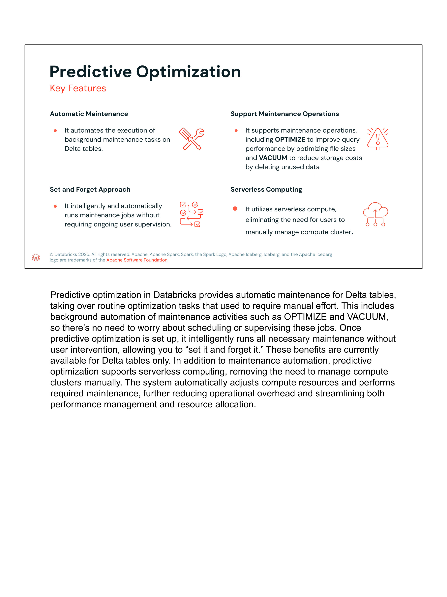 |
| **Slide 13** | Cierre oficial de la lección y transición hacia Code Optimization |  |

---

## 2. Objetivos y Resumen de la Lección

Esta lección culmina la **Sección 2: Designing the Foundation**. En ella se analiza a fondo la evolución arquitectónica de las técnicas de organización física de datos en Databricks y Delta Lake:
1. **Data Skipping:** Cómo Spark y Delta Lake aprovechan los metadatos de valores mínimos y máximos para evitar leer archivos irrelevantes.
2. **Z-Ordering:** Cómo la curva de orden Z agrupa valores similares en los mismos archivos para maximizar la eficacia del Data Skipping.
3. **Gestión de Estadísticas en Delta Lake:** Configuración de `dataSkippingNumIndexedCols`, impacto de tipos String/Timestamp y el orden de evaluación de filtros.
4. **Problemas del Particionamiento Tradicional (`PARTITION BY`):** Por qué el particionamiento físico en carpetas está desaconsejado para tablas modernas, provocando *Small File Problem* y *Data Skew*.
5. **Liquid Clustering (`CLUSTER BY`):** La tecnología de nueva generación de Databricks que reemplaza tanto al particionamiento como a Z-Order, ofreciendo agrupación flexible, clustering en escritura, concurrencia a nivel de fila y reordenamiento incremental.
6. **Estadísticas de Tabla con `ANALYZE TABLE`:** Suministro de métricas a nivel de columna para el planificador basado en costos (CBO) y Adaptive Query Execution (AQE).
7. **Optimización Predictiva (*Predictive Optimization*):** Automatización con IA de las operaciones de `OPTIMIZE` y `VACUUM` sobre cómputo Serverless.

---

## 3. Data Skipping: Principio de Poda de E/S (*I/O Pruning*)

### Concepto y Funcionamiento
*Data Skipping* es una técnica clásica de poda de E/S que consiste en registrar estadísticas a nivel de archivo (mínimo, máximo, conteo de nulos) para evitar abrir y escanear archivos que no contengan los datos buscados:

```sql
-- Cómo consultar internamente las estadísticas que Spark genera por archivo
SELECT 
    input_file_name() AS file_name,
    min(col) AS col_min,
    max(col) AS col_max
FROM table
GROUP BY input_file_name();
```

### Analogía Oficial:
Si un grupo de estudiantes debe contar caramelos específicos dentro de cajas o bolsas cerradas, primero revisan la etiqueta exterior con el inventario de la bolsa. Si la etiqueta indica que la bolsa no contiene el caramelo buscado, la bolsa se descarta inmediatamente sin abrirse. Esto ahorra trabajo y acelera el cómputo drásticamente.

---

## 4. Z-Ordering: Agrupación Multidimensional

### El Problema de Datos Dispersos
Cuando los datos se escriben sin ordenar, los rangos de valores mínimos y máximos en cada archivo Parquet se solapan ampliamente:
- Archivo 1: valores de 6 a 8
- Archivo 2: valores de 3 a 10
- Archivo 3: valores de 1 a 4

Si se ejecuta una consulta con el predicado `WHERE col = 7`:
- **Disposición no ordenada (*Old Layout*):** Debe leer tanto el Archivo 1 (`[6, 8]`) como el Archivo 2 (`[3, 10]`). Solo se descarta el Archivo 3. Total: **2 archivos leídos**.

### Solución con Z-Ordering:
Al ejecutar `OPTIMIZE table ZORDER BY (col)`:
- Los datos se reescriben agrupando físicamente los valores continuos en los mismos archivos:
  - Archivo 1: valores de 1 a 3
  - Archivo 2: valores de 4 a 7
  - Archivo 3: valores de 8 a 10
- Para la misma consulta `WHERE col = 7`:
  - Archivo 1 (`[1, 3]`): Se descarta.
  - Archivo 2 (`[4, 7]`): Se lee (único archivo relevante).
  - Archivo 3 (`[8, 10]`): Se descarta.
  - **Resultado:** **1 solo archivo leído** (reducción del 50% en I/O).

> **Limitación de Z-Order:** Z-Order no es incremental por naturaleza; si se añaden nuevos datos a la tabla, se requiere re-ejecutar `OPTIMIZE table ZORDER BY (...)` sobre la partición o sobre toda la tabla, generando alta amplificación de escritura (*write amplification*).

---

## 5. Recolección de Estadísticas en Delta Lake y sus Límites

### Columnas Indexadas por Defecto
Por defecto, Delta Lake recopila estadísticas de valores mínimo, máximo y número de nulos para las **primeras 32 columnas** del esquema de la tabla:
```text
spark.databricks.delta.properties.defaults.dataSkippingNumIndexedCols = 32
```

### Consultas Basadas Exclusivamente en Metadatos (*Metadata-Only Queries*)
Si una consulta solicita agregaciones extremas sobre columnas indexadas:
```sql
SELECT max(col) FROM table;
```
Spark **no abre ni lee ningún archivo de datos Parquet**. La respuesta se calcula directamente leyendo el registro de transacciones Delta (`_delta_log`), respondiendo en milisegundos.

### Orden de Aplicación de Filtros en Spark:
1. **Partition Filters:** Poda de particiones a nivel de rutas de directorios.
2. **Data Filters:** Descarte de archivos completos mediante estadísticas Min/Max de Data Skipping.
3. **Pushed Filters:** Empuje de predicados (*Predicate Pushdown*) al motor de lectura de Parquet para descartar páginas o grupos de filas (*Row Groups*) dentro del archivo.

### Advertencias Técnicas sobre Cadenas Largas y Marcas de Tiempo:
- **Cadenas de Texto Largas (*Long Strings*):** Recopilar estadísticas sobre columnas con texto muy extenso (ej. descripciones, JSON crudo, payloads) engrosa desproporcionadamente el log de transacciones y degrada el rendimiento.
  - *Solución:* Mover dichas columnas después de la posición 32 con `ALTER TABLE table CHANGE COLUMN col AFTER col32`, o reducir el umbral de `dataSkippingNumIndexedCols`.
- **Tipos Timestamp y Cadenas Truncadas:** Las discrepancias de precisión o el truncamiento de cadenas en las estadísticas pueden provocar que el motor no determine con certeza la exclusión de un archivo, teniendo que recurrir a la lectura física del archivo.

---

## 6. Desafíos y Antipatrones del Particionamiento Tradicional en Disco

### Cuándo SÍ está Justificado Particionar (`PARTITION BY`):
Databricks desaconseja el particionamiento tradicional para la inmensa mayoría de casos de uso. Solo se recomienda en circunstancias específicas:
1. **Tablas Masivas (> 1 TB):** Cuando cada partición individual contiene de forma consistente entre **1 GB y 1 TB de datos**.
2. **Cumplimiento Normativo (GDPR / CCPA / 'Right to be Forgotten'):** Cuando se requiere purgar periódicamente particiones completas de datos antiguos de forma instantánea mediante borrado de directorios.
3. **Tablas SCD Tipo 2 (Slowly Changing Dimensions):** Particionar por un campo booleano `is_current` para aislar físicamente los registros vigentes de los históricos.
4. **Multiplexación de Esquemas:** Separar datos pertenecientes a clientes o inquilinos totalmente aislados.

### Los Dos Grandes Peligros del Particionamiento:
1. **Explosión de Archivos Pequeños (*Small File Problem*):** Particionar por columnas de cardinalidad media/alta genera miles de directorios con archivos de unos pocos kilobytes, disparando las peticiones a la API del almacenamiento de objetos.
2. **Sesgo de Datos (*Data Skew*):** Ciertas particiones contienen volúmenes gigantescos de datos (ej. días festivos o clientes corporativos grandes) mientras que otras quedan casi vacías, provocando desequilibrio severo entre los executors de Spark.

---

## 7. La Solución Moderna: Liquid Clustering (`CLUSTER BY`)

Databricks introduce **Liquid Clustering** como el reemplazo definitivo del particionamiento por directorios (`PARTITION BY`) y de Z-Ordering (`ZORDER BY`).

### ¿Qué es Liquid Clustering?
Es una técnica de disposición física de datos flexible y adaptable que elimina las fronteras rígidas de directorios. Permite agrupar los datos dinámicamente por una o múltiples columnas seleccionadas sin crear carpetas físicas en el sistema de archivos.

```sql
-- Sintaxis de creación de tabla con Liquid Clustering
CREATE TABLE events (
    event_id BIGINT,
    customer_id STRING,
    event_time TIMESTAMP,
    payload STRING
)
CLUSTER BY (customer_id, event_time);
```

### Ventajas Arquitectónicas Fundamentales:
| Característica | Particionamiento Tradicional / Z-Order | Liquid Clustering (`CLUSTER BY`) |
|---|---|---|
| **Estructura en Disco** | Directorios rígidos jerárquicos (`year=/month=/`) | Almacenamiento plano unificado sin directorios |
| **Tamaño de Archivos** | Inconsistente y propenso a microarchivos | **Garantiza archivos de tamaño objetivo (~128MB)** |
| **Inmunidad a Data Skew** | Nula (genera particiones desbalanceadas) | **Totalmente inmune al sesgo de datos (*Skew-free*)** |
| **Sobrecarga Cognitiva** | Alta (requiere analizar cardinalidad) | **Baja (soporta alta y baja cardinalidad)** |
| **Clustering en Escritura** | No (Z-Order requiere paso manual posterior) | **Clustering automático durante la ingesta (*Write-time*)** |
| **Mantenimiento / Optimización** | Reescribe particiones completas | **Verdaderamente incremental (solo datos nuevos)** |
| **Concurrencia de Escritores** | Bloqueos a nivel de archivo/partición | **Row-Level Concurrency (RLC)** |
| **Evolución del Esquema de Agrupación** | Imposible cambiar particiones sin reescribir | **Permite cambiar columnas de cluster con `ALTER TABLE`** |

---

## 8. Estadísticas de Tabla con `ANALYZE TABLE` y su Impacto en AQE

Para que el optimizador Catalyst basado en costos (CBO) y la ejecución adaptativa de consultas (**Adaptive Query Execution - AQE**) tomen decisiones informadas en tiempo de ejecución, es fundamental mantener las estadísticas de columna actualizadas:

```sql
ANALYZE TABLE mytable COMPUTE STATISTICS FOR ALL COLUMNS;
```

### Beneficios para el Optimizador:
1. **Selección del Tipo Óptimo de Join:** Permite a Spark decidir si convertir automáticamente un Shuffle Sort Merge Join en un **Broadcast Hash Join (BHJ)**.
2. **Determinación del Lado de Construcción (*Build Side*):** En un Hash Join distribuido, las estadísticas permiten identificar con precisión cuál es la tabla más pequeña para construir la tabla hash en memoria.
3. **Calibración del Orden de Joins Múltiples:** En consultas complejas con múltiples cruces en cadena, determina el orden más selectivo para minimizar el volumen intermedio de datos propagado por el shuffle.

---

## 9. Optimización Predictiva (*Predictive Optimization*)

### Definición
*Predictive Optimization* es un servicio gobernado por IA dentro de Databricks que supervisa de forma continua los patrones de acceso, el volumen de cambios y el estado físico de las tablas Delta para programar y ejecutar tareas de mantenimiento de forma proactiva.

### Pilares Clave de Predictive Optimization:
1. **Mantenimiento Autónomo ("Set and Forget"):** Elimina la necesidad de crear y monitorear trabajos programados (*Databricks Jobs*) con scripts manuales de `OPTIMIZE` y `VACUUM`.
2. **Ejecución sobre Serverless Compute:** Las tareas de compactación y limpieza se ejecutan en clústeres serverless dedicados y aislados, sin interferir con los recursos de cómputo analíticos de producción.
3. **Operaciones Soportadas:**
   - **`OPTIMIZE` Automático:** Compacta microarchivos y reordena datos usando Liquid Clustering en función de los patrones reales de consulta.
   - **`VACUUM` Automático:** Elimina snapshots antiguos y archivos de datos huérfanos que hayan superado el período de retención configurado, minimizando el costo de almacenamiento en la nube.
