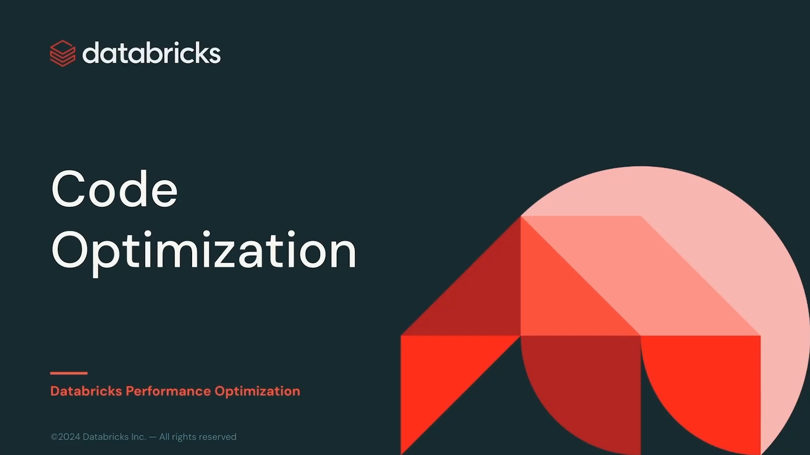
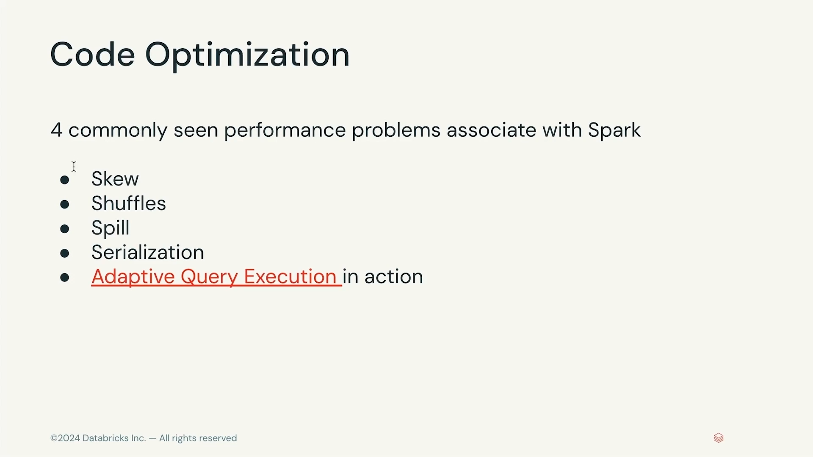

# Lección 08: Code Optimization

**Curso:** Databricks Performance Optimization (ID: 2967)  
**Sección:** Section 3: Code Optimization  
**Lección:** Code Optimization (Lesson ID: 25604)  
**Tipo de Contenido:** Video Introductorio de Sección (Full HD 1080p, 23.5s)  
**Estado:** Completado 100%  

---

## 1. Evidencia Visual de la Lección (Capturas Oficiales)

A continuación se presentan los fotogramas clave extraídos directamente de la lección introductoria de optimización de código en Apache Spark y Databricks Runtime:

| Momento | Descripción Técnica | Captura Oficial |
|---|---|---|
| **00:04** | Portada oficial de la Sección 3: *Code Optimization* |  |
| **00:12** | Los 4 Cuellos de Botella Críticos de Rendimiento en Spark y AQE |  |
| **00:20** | Cierre de introducción y transición a las lecciones temáticas |  |

---

## 2. Objetivos y Resumen de la Sección

La **Sección 3: Code Optimization** aborda el núcleo de la ingeniería de rendimiento en Databricks. Mientras que la Sección 2 se enfocó en diseñar los cimientos del almacenamiento físico (Delta Lake, tamaño de archivos, poda de particiones y Liquid Clustering), esta sección se centra en la optimización del código, los planes de ejecución física y el comportamiento de las etapas (*stages*) y tareas (*tasks*) distribuidas.

El video establece los **4 problemas de rendimiento más comúnmente observados en Apache Spark**, junto con el papel que desempeña **Adaptive Query Execution (AQE)** para mitigarlos dinámicamente en tiempo de ejecución:

```
                          ┌───────────────────────────┐
                          │     CODE OPTIMIZATION     │
                          │   4 Spark Bottlenecks     │
                          └─────────────┬─────────────┘
                                        │
         ┌──────────────────┬───────────┴───────────┬──────────────────┐
         ▼                  ▼                       ▼                  ▼
   1. SKEW            2. SHUFFLES              3. SPILL        4. SERIALIZATION
  (Desbalance        (Intercambio             (Desbordamiento    (Sobrecarga
   de Particiones)    de Red)                 Memoria a Disco)    Python/JVM)
         │                  │                       │                  │
         └──────────────────┴───────────┬───────────┴──────────────────┘
                                        ▼
                       Adaptive Query Execution (AQE)
                     + Catalyst Optimizer Optimizations
```

---

## 3. Desglose Arquitectónico de los 4 Problemas Críticos

### 1. Sesgo de Datos (Data Skew)
- **Definición:** Ocurre cuando los datos no están uniformemente distribuidos entre las particiones del clúster. Como resultado, una o pocas tareas procesan volúmenes significativamente superiores al resto.
- **Síntoma en Spark UI:** La barra de progreso de un Stage se queda en 99% (ej. 199/200 tareas terminadas) mientras un único núcleo/tarea tarda minutos u horas en finalizar (*Straggler Task*).
- **Tratamiento:** Particionamiento adaptativo de AQE (*Skew Join Optimization*), salado de claves (*Key Salting*) e índices de aislamiento.

### 2. Barajado de Datos (Shuffles)
- **Definición:** El proceso de redistribuir físicamente registros entre distintos ejecutores a través de la red para satisfacer transformaciones anchas (*Wide Transformations* como `JOIN`, `GROUP BY`, `DISTINCT`).
- **Impacto:** Es la operación más costosa de Spark porque involucra serialización, escritura de datos en disco local del ejecutor (Shuffle Write), transferencia por la red del clúster y lectura/fusión (Shuffle Read).
- **Tratamiento:** Broadcast Joins (`autoBroadcastJoinThreshold`), optimización de particiones de intercambio (`spark.sql.shuffle.partitions`), coalescencia dinámica con AQE y filtrado temprano (*Predicate Pushdown*).

### 3. Desbordamiento a Disco (Spill - Memory to Disk)
- **Definición:** Se produce cuando la memoria de ejecución asignada a una tarea (*Execution Memory*) es insuficiente para almacenar las estructuras intermedias en memoria (por ejemplo, tablas hash para joins agregaciones de ordenamiento). Spark se ve forzado a volcar los datos excedentes al disco local de la máquina virtual.
- **Tipos:**
  - *Spill (Memory):* Tamaño de los datos deserializados tal como residían en la memoria RAM antes de volcar.
  - *Spill (Disk):* Tamaño de los datos comprimidos y serializados tal como se escribieron en el disco del ejecutor.
- **Impacto:** Provoca una severa degradación por E/S de disco y saturación de la recolección de basura (*Garbage Collection - GC*).

### 4. Serialización y Sobrecarga de UDFs (Serialization & Overhead)
- **Definición:** La conversión de objetos en memoria a formato binario para transferirlos por la red o guardarlos en disco. Cobra especial relevancia cuando se utilizan funciones definidas por el usuario en Python (*Python UDFs*), donde cada fila debe serializarse desde la JVM al proceso trabajador de Python (`PyWorker`) mediante IPC/sockets.
- **Tratamiento:** Uso exclusivo de funciones nativas de Spark SQL / Spark Functions, empleo de Pandas UDFs (vectorizadas vía Apache Arrow) o Scala/Java UDFs.

---

## 4. El Rol de Adaptive Query Execution (AQE) en Acción

Databricks Runtime tiene habilitado **Adaptive Query Execution (AQE)** por defecto (`spark.sql.adaptive.enabled = true`). AQE reoptimiza los planes de ejecución física entre las distintas etapas de barajado utilizando estadísticas recolectadas en tiempo real:

1. **Coalescencia Dinámica de Particiones de Shuffle (*Dynamically Coalescing Shuffle Partitions*):**  
   Si las 200 particiones por defecto son demasiado pequeñas tras el shuffle, AQE las consolida automáticamente para evitar el problema de particiones minúsculas.
2. **Conversión Dinámica a Broadcast Join (*Dynamically Switching to Broadcast Hash Join*):**  
   Si un lado del join resulta ser menor que el umbral de broadcast tras aplicar filtros en tiempo de ejecución, AQE convierte un Sort Merge Join en un Broadcast Hash Join, eliminando el shuffle por completo.
3. **Manejo Dinámico de Sesgo (*Dynamically Optimizing Skew Joins*):**  
   AQE detecta automáticamente particiones con sesgo severo durante el shuffle y las divide en sub-particiones más pequeñas que se procesan en paralelo.

---

## 5. Hoja de Ruta de la Sección 3

Esta sección continuará con el análisis detallado y práctico de cada uno de estos cuellos de botella:
- **Lección 09:** *Skew* — Detección, métricas de percentiles en Spark UI y mitigación con AQE y técnicas manuales.
- **Lección 10:** *Shuffles* — Anatomía de la fase de intercambio, shuffle write/read y balanceo.
- **Lección 11:** *Demo: Shuffle* — Cuantificación experimental en notebooks con Spark UI.
- **Lección 12:** *Spill* — Diagnóstico de desbordamiento de memoria a disco y dimensionamiento de nodos.
- **Lección 13:** *Serialization* — Protocolos de serialización Java/Kryo y paso de datos JVM/Python.
- **Lección 14:** *Demo: User-Defined Functions* — Comparativa de rendimiento entre Python UDF estándar, Pandas Vectorized UDF y Spark SQL nativo.
