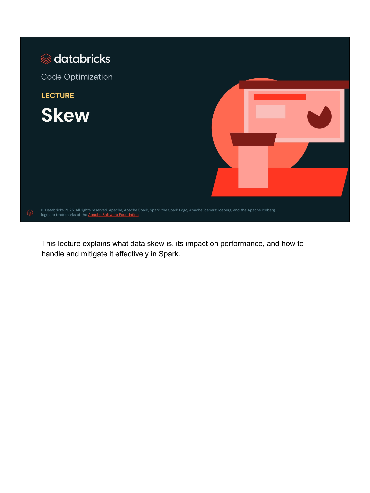
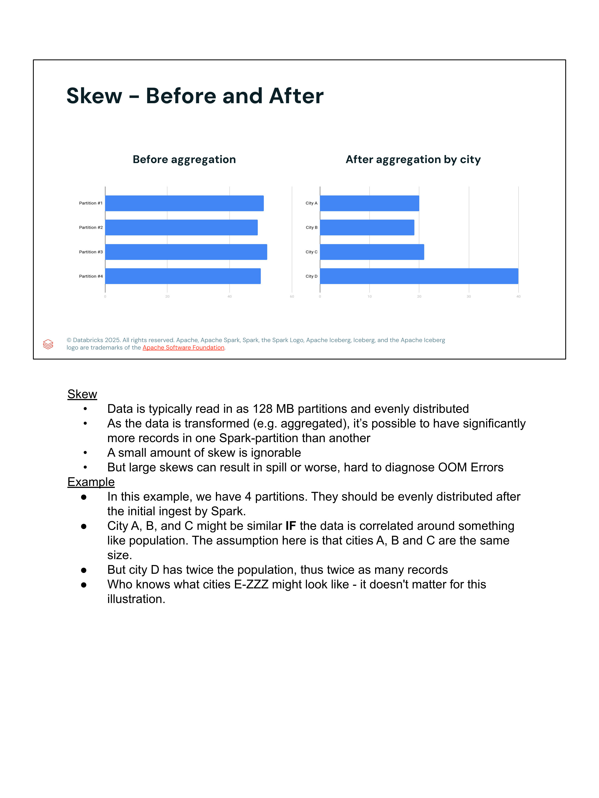
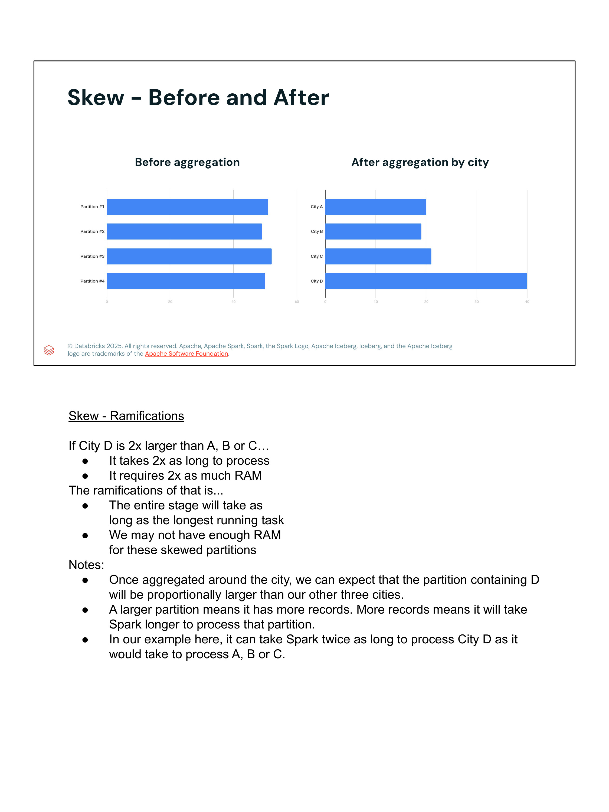
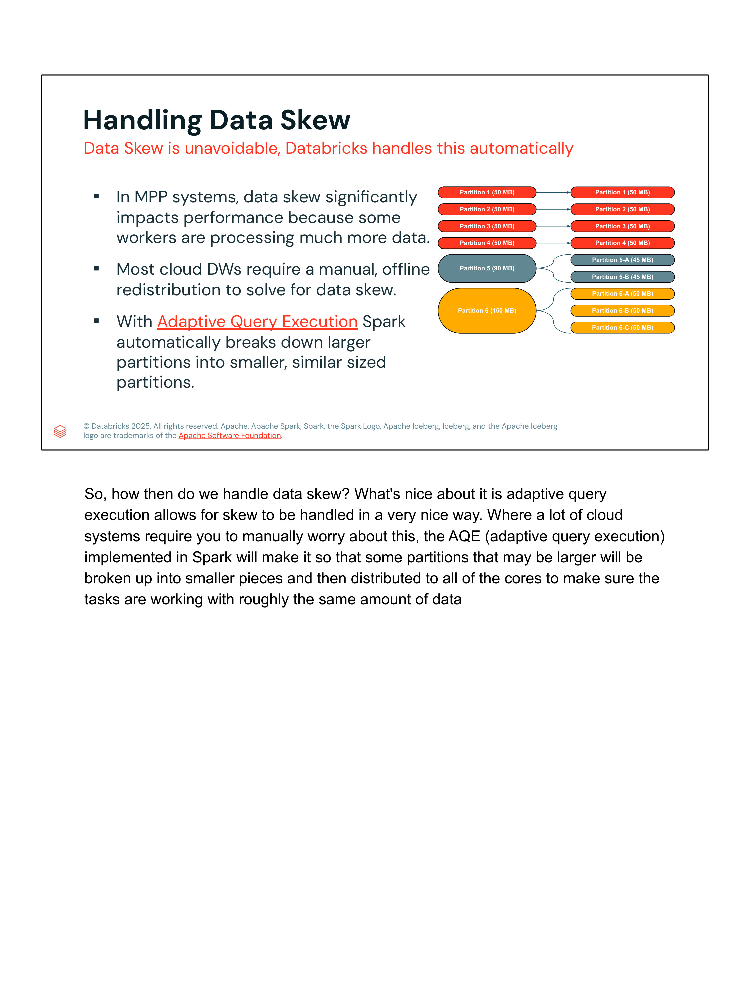
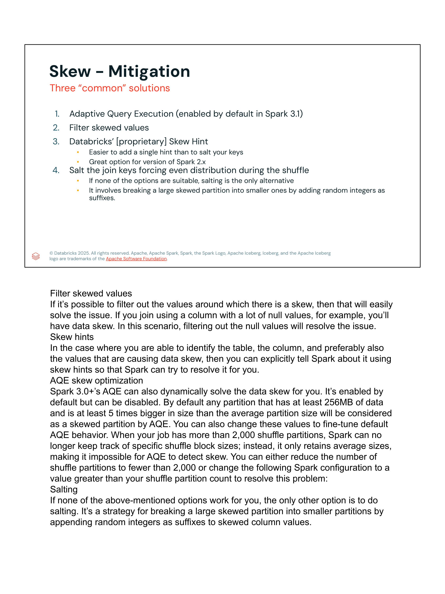

# Lección 09: Skew (Sesgo de Datos)

**Curso:** Databricks Performance Optimization (ID: 2967)  
**Sección:** Section 3: Code Optimization  
**Lección:** Skew (Lesson ID: 44369 / 44372)  
**Tipo de Contenido:** Slides / Conferencia Técnica Exhaustiva (6 Slides Oficiales)  
**Estado:** Completado 100%  

---

## 1. Evidencia Visual de la Lección (Galería de Diapositivas)

A continuación se presentan las capturas oficiales en alta definición de la lección sobre sesgo de datos (*Data Skew*), su manifestación antes y después de transformaciones, el impacto en etapas distribuidas y las estrategias de mitigación:

| Diapositiva | Descripción Técnica | Archivo de Imagen |
|---|---|---|
| **Slide 01** | Portada Oficial: *Code Optimization - Skew* |  |
| **Slide 02** | *Skew - Before and After*: Distribución uniforme inicial vs desbalance tras agregación |  |
| **Slide 03** | *Skew - Ramifications*: Impacto en tiempo de etapa (efecto *Straggler*) y memoria RAM |  |
| **Slide 04** | *Handling Data Skew*: Descomposición automática de particiones con AQE |  |
| **Slide 05** | *Skew - Mitigation*: 4 soluciones técnicas (AQE, filtrado, Skew Hints y Salting) |  |
| **Slide 06** | Conclusión de la Lección y Transición a *Shuffles* |  |

---

## 2. Objetivos y Resumen de la Lección

El **sesgo de datos (*Data Skew*)** es uno de los problemas de rendimiento más destructivos y difíciles de diagnosticar en sistemas de procesamiento masivo en paralelo (MPP) como Apache Spark y Databricks. Esta lección analiza en profundidad:
1. Qué es el sesgo de datos y por qué surge comúnmente tras transformaciones anchas (*wide transformations* como `groupBy` o `join`).
2. Las ramificaciones arquitectónicas en tiempo de reloj y memoria RAM (efecto *straggler* y riesgo de errores *Out-Of-Memory* / *OOM*).
3. Cómo **Adaptive Query Execution (AQE)** mitiga el sesgo dividiendo dinámicamente las particiones afectadas.
4. Las 4 soluciones técnicas de mitigación: AQE, filtrado de claves nulas/atípicas, *Skew Hints* y la técnica de salado de claves (*Salting*).

---

## 3. Anatomía del Sesgo de Datos: Antes y Después (*Before and After*)

Al leer datos desde almacenamiento de objetos (Amazon S3, Azure ADLS Gen2, Google Cloud Storage), Spark divide los datos de entrada en bloques uniformes (típicamente particiones de **128 MB**). En este punto de ingesta inicial, la carga de trabajo está balanceada de forma simétrica entre los ejecutores.

Sin embargo, a medida que los datos se transforman y agregan alrededor de claves específicas (por ejemplo, `city`, `customer_id`, `product_id`), la cardinalidad del dominio del mundo real distorsiona la distribución:

```
DISTRIBUCIÓN INICIAL (Ingesta: Particiones uniformes de ~128 MB)
┌──────────────┐ ┌──────────────┐ ┌──────────────┐ ┌──────────────┐
│ Partition #1 │ │ Partition #2 │ │ Partition #3 │ │ Partition #4 │  (50 MB c/u)
└──────────────┘ └──────────────┘ └──────────────┘ └──────────────┘
                           │
                 [ AGGREGATION BY CITY ] (Shuffle)
                           │
                           ▼
DISTRIBUCIÓN TRAS AGREGACIÓN (Sesgo severo en City D)
┌───────────┐   City A: ~20 MB
┌───────────┐   City B: ~19 MB
┌───────────┐   City C: ~21 MB
┌───────────────────────────────────────┐   City D: ~40 MB (Doble de tamaño)
```

- Un sesgo menor o marginal puede ser ignorado sin impacto notable.
- Un sesgo sustancial provoca **desbordamiento a disco (*spill*)** o, en el peor escenario, fallos catastróficos por **falta de memoria (*Out of Memory - OOM*)** en los ejecutores afectados.

---

## 4. Ramificaciones del Sesgo en Sistemas Distribuidos

Si una clave de partición (como `City D`) contiene el doble de registros que las demás:
1. **El doble de tiempo de cómputo (2x time):** La tarea encargada de procesar `City D` requerirá el doble de tiempo de CPU y E/S.
2. **El doble de consumo de memoria (2x RAM):** El ejecutor necesita almacenar el doble de estado en memoria para las tablas hash de agregación o buffer de join.
3. **El tiempo total de la etapa queda subordinado a la tarea más lenta (*Straggler Task*):**  
   En Apache Spark, una etapa (*Stage*) no puede completarse hasta que la última de sus tareas haya concluido con éxito. Por ende, aunque 199 de 200 núcleos hayan terminado en 5 segundos, si la tarea restante tarda 20 minutos debido al sesgo, el clúster entero permanece ocioso consumiendo recursos sin avanzar.
4. **Insuficiencia de memoria de ejecución:** Si el volumen de la partición sesgada excede el límite de memoria asignado por slot (`spark.executor.memory / spark.executor.cores`), se produce *Disk Spill* o un error fatal de JVM `java.lang.OutOfMemoryError: Java heap space`.

---

## 5. Mitigación Dinámica con Adaptive Query Execution (AQE)

A diferencia de los almacenes de datos tradicionales (*cloud data warehouses*) que exigen redistribuciones manuales y costosas fuera de línea, Databricks y Apache Spark abordan el sesgo automáticamente mediante **Adaptive Query Execution (AQE)**:

Durante la etapa de shuffle, AQE monitorea las estadísticas de tamaño de cada partición física generada. Cuando identifica una partición que supera los umbrales de sesgo, la subdivide automáticamente en sub-particiones más pequeñas que se procesan concurrentemente en múltiples slots:

```
Particiones Normales:
  Partition 1 (50 MB) ────────► Task 1 (50 MB)
  Partition 2 (50 MB) ────────► Task 2 (50 MB)
  Partition 3 (50 MB) ────────► Task 3 (50 MB)
  Partition 4 (50 MB) ────────► Task 4 (50 MB)

Particiones con Sesgo (Descompuestas dinámicamente por AQE):
  Partition 5 (90 MB)  ───────┬─► Sub-partition 5-A (45 MB)
                              └─► Sub-partition 5-B (45 MB)

  Partition 6 (150 MB) ───────┬─► Sub-partition 6-A (50 MB)
                              ├─► Sub-partition 6-B (50 MB)
                              └─► Sub-partition 6-C (50 MB)
```

### Reglas y Umbrales Oficiales de AQE para Skew Joins:
Para que AQE clasifique una partición como "sesgada" (*skewed partition*), deben cumplirse simultáneamente dos condiciones:
1. **Umbral Absoluto:** El tamaño de la partición debe ser de al menos **256 MB**:  
   `spark.sql.adaptive.skewJoin.skewedPartitionThresholdInBytes = 256MB`
2. **Factor Relativo:** El tamaño de la partición debe ser al menos **5 veces mayor** que el tamaño mediano de partición de la etapa:  
   `spark.sql.adaptive.skewJoin.skewedPartitionFactor = 5`

> **Límite Crítico de las 2,000 Particiones:**  
> Cuando un trabajo genera más de **2,000 particiones de shuffle**, Spark deja de rastrear los tamaños individuales de los bloques de shuffle por razones de eficiencia de memoria; en su lugar, solo retiene promedios. Esto **impide que AQE detecte el sesgo**.  
> *Solución:* Reducir `spark.sql.shuffle.partitions` por debajo de 2,000 o ajustar `spark.shuffle.minNumPartitionsToSplit` a un valor superior al conteo de particiones de shuffle.

---

## 6. Cuatro Soluciones Comunes para Mitigar el Sesgo (*Four Mitigation Strategies*)

| Estrategia | Descripción y Funcionamiento | Cuándo Usarla |
|---|---|---|
| **1. Adaptive Query Execution (AQE)** | Mecanismo automático nativo de Spark 3.0+ (activo por defecto en Databricks). Divide particiones sobredimensionadas en subparticiones equilibradas. | Primera línea de defensa en todas las cargas modernas en Databricks. |
| **2. Filtrado de Valores Sesgados (*Filter Skewed Values*)** | En muchos casos, el sesgo se debe a concentraciones masivas de valores nulos (`NULL`), cadenas vacías o valores por defecto (ej. `unknown`, `N/A`, `999999`). Filtrar estos registros antes del join o procesarlos en una rama separada elimina el sesgo de raíz. | Cuando la clave de join contiene una alta proporción de nulos o valores sentinela. |
| **3. Skew Hints de Databricks** | Sugerencias directas en la consulta SQL (`/*+ SKEW('tableName', 'columnName', (skewedValues)) */`) que indican al optimizador exactamente qué tabla y valores causan el problema para que divida la partición en el plan. | Especialmente útil en versiones anteriores de Spark (2.x) o cuando se desea control explícito sin salado. |
| **4. Salado de Claves (*Salting*)** | Técnica manual consistente en añadir un sufijo entero aleatorio (ej. `random(0, N)`) a la clave de join en la tabla sesgada, y replicar/expandir las filas correspondientes en la tabla secundaria multiplicadas por el rango `0..N`. | Cuando AQE no puede intervenir (ej. agregaciones complejas que no son joins o shuffles > 2,000 particiones). |

### Ejemplo Práctico de Skew Hint en Databricks SQL:
```sql
-- Indicar a Spark que la columna 'store_id' de la tabla 'sales' tiene sesgo en los valores 101 y 205
SELECT /*+ SKEW('sales', 'store_id', (101, 205)) */ *
FROM sales s
JOIN stores t ON s.store_id = t.store_id;
```

### Ejemplo Conceptual de Salado de Claves (*Salting*):
```python
import pyspark.sql.functions as F

# 1. En la tabla sesgada (ej. df_skewed), se añade un sufijo aleatorio del 0 al 4 a la clave
df_salted = df_skewed.withColumn("salt", F.concat(F.col("city"), F.lit("_"), F.floor(F.rand() * 5)))

# 2. En la tabla de búsqueda (df_lookup), se duplican las claves para cubrir todos los posibles sufijos (0..4)
df_lookup_replicated = df_lookup.withColumn("salt_range", F.array([F.lit(i) for i in range(5)])) \
                                .withColumn("salt_idx", F.explode("salt_range")) \
                                .withColumn("salt", F.concat(F.col("city"), F.lit("_"), F.col("salt_idx")))

# 3. El join se realiza sobre la columna salada 'salt', garantizando una distribución 5 veces más uniforme
df_joined = df_salted.join(df_lookup_replicated, on="salt")
```
