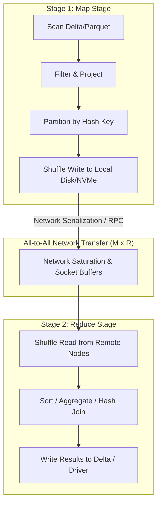

# Lesson 10: Shuffles — Architecture, Bottlenecks, and Mitigation Strategies

> **Course:** Databricks Performance Optimization (Course ID: 2967)  
> **Section:** 3. Code Optimization  
> **Lesson:** 10 of 19 — Shuffles (Authoring ID: 814 / Lesson ID: 44373)  
> **Source Material:** Official Databricks Academy Slide Deck (9 Slides)  
> **Local Slides Archive:** `D:\2026\Simulador de Preguntas\Databricks Performance Optimization\capturas\10_shuffles_slide_01.png` to `09.png`

---

## Executive Summary & Core Architectural Concepts

In Apache Spark and the Databricks Lakehouse, the **Shuffle** is universally recognized as the **single most expensive operation** in distributed data processing. 

A shuffle occurs whenever data must be redistributed across executors because the required transformation cannot be satisfied by data currently held on a single partition or node. Shuffles break query execution into discrete **Stages** separated by **Shuffle Boundaries** (represented in the physical execution plan by the `Exchange` operator).



---

## Slide Inventory & Verbatim Breakdown

### Slide 1: Introduction to Shuffles


* **Key Concept:** Shuffles represent the primary performance bottleneck in large-scale Spark queries, dominating CPU, local disk I/O, network bandwidth, and memory consumption.

---

### Slide 2: Wide vs. Narrow Transformations


#### 1. Narrow Transformations (No Shuffle Required)
* **Definition:** Each partition of the parent DataFrame/RDD is used by at most one partition of the child DataFrame/RDD.
* **Execution:** Executed strictly in-place (pipelined) within the same executor memory and core without network transfer.
* **Examples:** `select()`, `filter()`, `map()`, `flatMap()`, `union()`.

#### 2. Wide Transformations (Mandatory Shuffle Required)
* **Definition:** Multiple child partitions depend on data distributed across multiple parent partitions. Data must be re-grouped by a common key across the entire cluster.
* **Examples:**
  * Joins: `join()` (Sort-Merge, Shuffle Hash, Cartesian).
  * Aggregations: `groupBy()`, `agg()`, `distinct()`, `reduceByKey()`.
  * Sorting: `orderBy()`, `sort()`.
  * Repartitioning: `repartition()`, `coalesce()` (when increasing partitions).
  * Actions that collect or aggregate: `count()`, `collect()`.

#### 3. Spark DAG Physical Plan: The `Exchange` Operator
In Spark SQL physical plans, every shuffle is denoted by an `Exchange` operator:
```
== Physical Plan ==
AdaptiveSparkPlan isFinalPlan=false
+- SortMergeJoin [id#1L], [user_id#5L], Inner
   :- Sort [id#1L ASC NULLS FIRST], false, 0
   :  +- Exchange hashpartitioning(id#1L, 200), ENSURE_REQUIREMENTS, [plan_id=12]
   :     +- Filter isnotnull(id#1L)
   :        +- Scan parquet default.orders [id#1L, amount#2]
   +- Sort [user_id#5L ASC NULLS FIRST], false, 0
      +- Exchange hashpartitioning(user_id#5L, 200), ENSURE_REQUIREMENTS, [plan_id=13]
         +- Filter isnotnull(user_id#5L)
            +- Scan parquet default.users [user_id#5L, name#6]
```
* `Exchange hashpartitioning(key, 200)`: Evaluates `hash(key) % spark.sql.shuffle.partitions` (default 200) to assign records to target reduce partitions.

---

### Slides 3 to 7: The 5-Step MapReduce Shuffle Lifecycle

The slide deck walks through the physical mechanics of distributed shuffle data flow:

#### Step 1: Scan & Map (Slide 3)

* Tasks in Stage 1 read Parquet/Delta files from cloud object storage (S3, ADLS Gen2, GCS) into executor JVM memory.
* Pipelined narrow transformations (filters, projections, expressions) execute concurrently across available worker CPU cores.

#### Step 2: Shuffle Write (Slide 4)

* Rather than sending individual rows across the network immediately, Map tasks buffer records in memory and partition them according to the target reduce partition key.
* When memory fills, mapped data is written to **local block storage** (ephemeral NVMe or EBS/Managed Disk attached to the VM).
* Two files are created per map task:
  1. `.data`: Contains all serialized partition blocks written sequentially.
  2. `.index`: Stores byte offsets indicating where each partition block starts and ends.
* **Metric in Spark UI:** `Shuffle Write Size / Records`, `Shuffle Write Time`.

#### Step 3: Network Transfer — The All-to-All Bottleneck (Slide 5)

* Stage 2 (Reduce Stage) cannot begin execution until Stage 1 has completed writing its shuffle files.
* Every Reducer task connects via Netty RPC to **every Mapper executor** in the cluster to fetch only its designated partition slice.
* **Complexity:** If there are $M$ map tasks and $R$ reduce tasks, there are potentially $M \times R$ network connections.
* **Impact:** 
  * Network interface cards (NICs) become saturated.
  * Heavy serialization/deserialization CPU cycles.
  * OS TCP connection overhead and thread contention.

#### Step 4: Shuffle Read & Spill Risk (Slide 6)

* Reducer tasks pull shuffle blocks from remote executors into JVM off-heap/on-heap memory buffers (`spark.reducer.maxSizeInFlight`, default 48MB).
* If incoming shuffle data exceeds available execution memory in the JVM, Spark **spills** data to disk:
  * `Spill (Memory)`: Uncompressed size of data ejected from memory.
  * `Spill (Disk)`: Compressed size of data written to disk, multiplying I/O penalty.
* **Metric in Spark UI:** `Shuffle Read Size / Records`, `Shuffle Fetch Wait Time` (high values indicate network congestion or slow mapper disk I/O).

#### Step 5: Reduce & Output Materialization (Slide 7)

* Reducer tasks perform the final stateful computation:
  * Sorting partition keys (SortMergeJoin, orderBy).
  * Evaluating aggregate functions (sum, avg, count).
  * Hash-table lookups (ShuffleHashJoin).
* Output partitions are written out to Delta Lake or materialized to the calling client.

---

### Slide 8: Shuffles — Mitigation Strategies


The lecture establishes comprehensive architectural tactics to mitigate shuffle penalties across infrastructure, query design, and join algorithms:

#### 1. Hardware & Cluster Topology
* **Use Fewer, Larger Workers:**
  * *Mechanism:* Using fewer, larger VMs (e.g., 4 workers with 32 cores vs. 16 workers with 8 cores) reduces cross-machine network transfers.
  * *Reasoning:* When tasks on the same physical VM shuffle data, Spark transfers blocks through local memory / OS IPC buffers without traversing the top-of-rack network switch or virtual network adapters. Disk I/O cost remains, but network I/O drops drastically.
* **High-Performance Local Storage:**
  * Equip worker nodes with local NVMe SSDs (e.g., AWS `i3en`, Azure `Lsv3`, GCP `z3`) to accelerate local shuffle write and shuffle fetch throughput.

#### 2. Query Pruning & Data Volume Reduction
* **Preemptive Column Pruning:** Select only required columns *before* wide transformations to reduce serialized shuffle record size.
* **Pushdown Filters:** Apply selective `WHERE` clauses upstream so that unneeded records are eliminated prior to the `Exchange` step.
* **Denormalization:** In classical data warehousing, denormalizing tables into pre-joined broad tables avoids runtime joins. 
  * *Note:* Adaptive Query Execution (AQE) and Dynamic Partition Pruning (DPP) reduce the historical need for aggressive denormalization, but denormalization remains effective for ultra-high-throughput streaming and low-latency batch.

#### 3. Bucketing Reality Check (Quote: Daniel Tomes)
* **Quote:** *"If you are bucketing datasets, you are doing it wrong" — Daniel Tomes (Databricks Principal Solutions Architect)*.
* **Bucketing Trade-offs:**
  * Bucketing attempts to pre-sort and pre-hash data during table ingestion so that downstream Sort-Merge Joins skip the `Exchange` and `Sort` operators.
  * **Critical Flaws:** Extremely brittle, expensive to maintain, breaks easily if partition counts or join keys mismatch, and incurs massive ingestion overhead whenever data is updated or backfilled.
  * **Rule of Thumb:** Not worth considering for datasets under **1 to 5 TB**.
  * **Modern Replacement:** In modern Databricks, **Liquid Clustering (`CLUSTER BY`)** completely supersedes Hive bucketing by providing self-maintaining, multi-dimensional data clustering without fixed partition boundaries.

#### 4. Join Strategy Re-evaluation
Selecting or enabling the correct join strategy can eliminate or dramatically optimize shuffle behavior:

| Join Strategy | Mechanism | Shuffle Overhead | Best Used When |
| :--- | :--- | :--- | :--- |
| **Broadcast Hash Join (BHJ)** | Driver broadcasts small table to all executors; each executor builds in-memory hash table. | **Zero Shuffle** for large table; lightweight broadcast transfer of small table. | Small table size < `spark.sql.autoBroadcastJoinThreshold` (default 10 MB, often tuned to 64–128 MB). |
| **Shuffle Hash Join (SHJ)** | Both tables are hashed and shuffled by join key; smaller side builds in-memory hash map; larger side streams through. | **Shuffle required**, but **no sorting required**. | **Default for Databricks Photon engine**. Highly efficient when memory is sufficient to hold partitioned hash tables. |
| **Sort-Merge Join (SMJ)** | Both tables are shuffled by join key, written to disk, read back, sorted by join key, and merged. | **Maximum overhead:** Heavy shuffle exchange + expensive distributed sorting. | **Default for Open-Source Apache Spark**. Ideal for very large datasets that exceed RAM capacity. |

---

### Slide 9: Lesson Conclusion


---

## Spark UI Diagnosis Reference for Shuffles

When debugging slow queries in the Spark UI, inspect:

1. **SQL / DataFrame Tab:**
   * Look for `Exchange hashpartitioning(...)` nodes.
   * Verify the number of output partitions (e.g., `aqe_shuffle_partitions` vs default `200`).
   * Check for `ShuffleFetchWaitTime` and data transfer metrics.
2. **Stages Tab:**
   * Compare **Shuffle Read Size / Records** vs **Shuffle Write Size / Records**.
   * Review task distribution in the Stage summary table: if Min, Median, and Max shuffle read sizes differ by orders of magnitude, the stage suffers from combined **Shuffle + Skew**.
3. **Executors Tab:**
   * Monitor **Shuffle Read (GB)** and **Shuffle Write (GB)** per executor. Asymmetric traffic indicates imbalanced cluster topology or unoptimized partition routing.
