# Lesson 11: Demo — Shuffle (Notebook PO 1.3)

> **Course:** Databricks Performance Optimization (Course ID: 2967)  
> **Section:** 3. Code Optimization  
> **Lesson:** 11 of 19 — Demo: Shuffle (Lesson ID: 25607)  
> **Notebook Reference:** `PO 1.3 - Shuffle`  
> **Runtime Environment:** Databricks Runtime (DBR) 14.3 LTS (with Photon engine)  
> **Local Captures Archive:** `D:\2026\Simulador de Preguntas\Databricks Performance Optimization\capturas\11_demo_shuffle_*.jpg` (11 high-res video captures)

---

## Executive Summary & Laboratory Objectives

The goal of notebook **`PO 1.3 - Shuffle`** is to visually demonstrate how distributed shuffles impact Spark query performance and how to diagnose and mitigate them using the **Spark UI**.

```mermaid
flowchart TD
    subgraph Exp1["Experiment 1: Shuffle Join (Broadcast Disabled)"]
        A1[150M Rows Transactions] -->|Shuffle Write 1.4 GB| B1[Network Exchange]
        C1[Stores & Countries] -->|Shuffle Write| B1
        B1 -->|Shuffle Read 1.4 GB| D1[SortMerge / ShuffleHash Join]
        D1 -->|Runtime: ~60s| E1[8 Spark Jobs]
    end

    subgraph Exp2["Experiment 2: Broadcast Hash Join (Default Enabled)"]
        A2[150M Rows Transactions] -->|No Shuffle for Large Table| D2[Broadcast Hash Join]
        C2[Stores & Countries < 100MB] -->|Broadcast 4.9 KiB| D2
        D2 -->|Runtime: 31s| E2[6 Spark Jobs, 4.9 KiB Shuffle]
    end

    subgraph Exp3["Experiment 3: Map-Side Aggregation"]
        A3[150M Rows Transactions] --> F3[Local Partial HashAggregate]
        F3 -->|Shuffle Partial Counts/Sums: few KB| G3[Global HashAggregate]
        G3 -->|Runtime: 4s| H3[Super Fast Execution]
    end
```



The demo benchmarks three distinct execution patterns on a dataset of **150,000,000 sales transactions**:
1. **Full Distributed Shuffle Join:** Explicitly disabling broadcast joins (`autoBroadcastJoinThreshold = -1`), forcing Spark/Photon to shuffle the full 1.4 GB transactions table across stages.
2. **Broadcast Hash Join (BHJ):** Restoring the default broadcast join mechanism, which distributes the small dimension tables (`< 100MB`) to all executors and completely eliminates the large-table shuffle.
3. **Map-Side Aggregation (`groupBy`):** Demonstrating how partial aggregation at the mapper level reduces shuffle payload from gigabytes to mere kilobytes.

---

## Step-by-Step Lab Walkthrough & Code Execution

### Step 1: Environment Setup and Disabling Disk Cache


To observe raw shuffle and network latency without artificial acceleration from local cache hits, Databricks I/O caching is disabled:

```python
%run ./Includes/Classroom-Setup-01.3
```

```python
# Cell 5: Disable Databricks I/O Cache
spark.conf.set('spark.databricks.io.cache.enabled', False)
```

---

### Step 2: Synthetic Data Generation (150 Million Transactions)


The notebook generates a synthetic fact table of 150M rows across 32 partitions, joined with two dimension tables (`stores` and `countries`):

```python
from pyspark.sql.functions import *

# Cell 7: Fact Table (150 Million Records)
transactions_df = (spark
    .range(0, 150000000, 1, 32)
    .select(
        'id',
        round(rand() * 10000, 2).alias('amount'),
        (col('id') % 10).alias('country_id'),
        (col('id') % 100).alias('store_id')
    )
)
transactions_df.createOrReplaceTempView("transactions")
```


* **`stores_df` (Cell 11):** 99 rows containing `[id, employees, country_id, name]`.
* **`countries_df`:** 10 rows containing `[id, name]`.

---

### Step 3: Inducing Massive Distributed Shuffle Joins


To simulate worst-case distributed joins (e.g., when joining two massive fact tables where neither fits in memory), broadcast joins are turned off by setting thresholds to `-1`:

```python
# Cell 17: Explicitly disable broadcast joins
spark.conf.set("spark.sql.autoBroadcastJoinThreshold", -1)
spark.conf.set("spark.databricks.adaptive.autoBroadcastJoinThreshold", -1)

joined_df = spark.sql("""
SELECT
    transactions.id,
    amount,
    countries.name as country_name,
    employees,
    stores.name as store_name
FROM
    transactions
LEFT JOIN
    stores
ON
    transactions.store_id = stores.id
LEFT JOIN
    countries
ON
    transactions.country_id = countries.id
""")

joined_df.write.mode('overwrite').saveAsTable('transact_countries')
```


#### Spark UI Diagnosis: The Cost of Shuffling 1.4 GB
Opening the Spark UI (`Jobs` and `Stages` tabs) reveals the severe performance cost:


* **Runtime:** ~1 minute (8 separate Spark Jobs triggered).
* **Shuffle Write / Read Metrics:**
  * **Stage 43:** 16/16 tasks, 19s duration, **1378.1 MiB Input, 1412.9 MiB Output**.
  * **Stage 48:** 27/27 tasks, 20s duration, **1413.0 MiB Input, 1454.6 MiB Output**.
  * **Stage 53:** 10/10 tasks, 25s duration, **1422.9 MiB Input, 1454.6 MiB Output**.
* **Photon Acceleration:** Operates via `PhotonExec.scala` (`mapPartitionsInternal at PhotonExec.scala:508`), executing vectorised shuffle hash joins in C++, but network I/O and local block serialization remain unavoidable.

---

### Step 4: Mitigating Shuffle via Broadcast Hash Join (BHJ)


The configuration overrides are removed, allowing Spark and Adaptive Query Execution (AQE) to revert to default threshold behavior (tables < 100MB in Databricks are automatically broadcasted):

```python
# Cell 20: Restore default broadcast join threshold
spark.conf.unset("spark.sql.autoBroadcastJoinThreshold")
spark.conf.unset("spark.databricks.adaptive.autoBroadcastJoinThreshold")

# Re-run identical join and table materialization
joined_df.write.mode('overwrite').saveAsTable('transact_countries')
```

#### Spark UI Benchmark Results with Broadcast Join


* **Runtime:** Dropped from **~60 seconds down to 31 seconds** (nearly **2x speedup**).
* **Job Count:** Reduced from 8 jobs to 6 jobs.
* **Shuffle Data Volume:**
  * In the shuffle-join version, the 150M row table was shuffled across nodes **twice** (moving 1.4 GB + 1.4 GB).
  * In the broadcast-join version, the large table was **never shuffled**; only the tiny lookup tables were broadcasted.
  * Shuffle read dropped from **1.45 GB down to 4.9 KiB**!

---

### Step 5: Map-Side Aggregation (`groupBy`) vs. Shuffle Joins


The instructor demonstrates an aggregation query on the same 150M row table:

```sql
-- Cell 23: Group By Aggregation
%sql
SELECT
    country_id,
    COUNT(*) AS count,
    AVG(amount) AS avg_amount
FROM transactions
GROUP BY country_id
ORDER BY count DESC
```

#### Key Architectural Findings:
* **Execution Time:** Just **4 seconds**!
* **Why Aggregations are Vastly Cheaper than Joins:**
  * Spark SQL employs **two-phase aggregation** (`HashAggregate`):
    1. **Partial Aggregation (Map Side):** Each worker computes local running sums and counts within its own partition memory without moving rows across the network.
    2. **Final Aggregation (Reduce Side):** Only the partial aggregated values (10 rows per partition, one for each `country_id`) are shuffled across the cluster.
  * The total shuffle payload across the entire network is **only a few kilobytes**, rather than transferring 150 million raw transaction records.

---

## Comparative Lab Summary Matrix

| Metric / Dimension | Shuffle Join (No Broadcast) | Broadcast Hash Join (BHJ) | Map-Side Aggregation (`groupBy`) |
| :--- | :--- | :--- | :--- |
| **Total Query Runtime** | ~60 seconds | 31 seconds | **4 seconds** |
| **Spark Jobs Triggered** | 8 jobs | 6 jobs | 2 jobs |
| **Shuffle Data Volume** | **1.45 GB (x2 exchanges)** | **4.9 KiB** | **Few Kilobytes** |
| **Large Table Movement** | Shuffled across all nodes | **Zero network transfer** | Zero row-level network transfer |
| **Primary Resource Used** | Network NIC + NVMe Disk Spill | Executor RAM (Hash Table) | CPU Vectorization (Photon) |
| **Optimization Applied** | None (worst-case distributed join) | Dimension broadcast (<100MB) | Map-side partial pre-aggregation |
