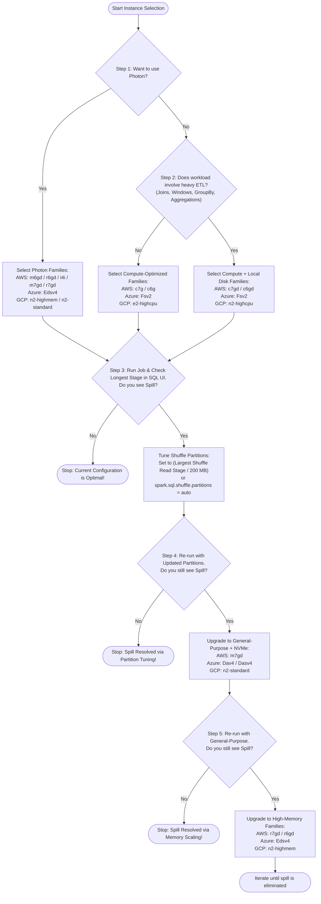

# Lesson 16: Pick the Best Instance Types

> **Course:** Databricks Performance Optimization (Course ID: 2967)  
> **Pathway:** Databricks Certified Professional Data Engineer  
> **Authoring Module ID:** 818 | **Lesson ID:** 44395  
> **Captures:** [capturas/16_instance_types_slide_01.png](file:///D:/2026/Simulador%20de%20Preguntas/Databricks%20Performance%20Optimization/capturas/16_instance_types_slide_01.png) to [capturas/16_instance_types_slide_15.png](file:///D:/2026/Simulador%20de%20Preguntas/Databricks%20Performance%20Optimization/capturas/16_instance_types_slide_15.png)

---

## 1. Overview and Core Philosophy

Choosing the right virtual machine instance types and cluster sizing in Databricks does not require guessing or blindly copying configurations from on-premises Hadoop/Spark clusters. Databricks provides a systematic **IFTTT ("If This Then That")** decision tree driven by empirical query metrics observed in the Spark UI.


### The Time-Cost Equivalence Rule
$$\text{Cost} = \text{Cluster Size} \times \text{Runtime} \times \text{Instance/DBU Rate}$$

> **Key Rule of Thumb:** If you double ($2\times$) the cluster size and the job completes in half ($\frac{1}{2}$) the time, the total cloud infrastructure and DBU cost is **identical**, but you gain significant developer and business time. A larger cluster is not inherently more expensive if it scales linearly.

---

## 2. Key Hardware Dimensions for Instance Selection

When evaluating cloud instance offerings across AWS, Azure, and GCP, data engineers must balance four critical dimensions:

1. **Core-to-RAM Ratio:** Determines how much working memory each Spark task/core has before spilling during shuffles, hash joins, and window aggregations.
2. **Processor Type & Architecture:** Clock speed (GHz), instruction set (x86_64 vs. ARM64/AWS Graviton), and vectorization support (e.g., AVX-512).
3. **Local vs. Remote Storage:** Remote network-attached block storage (AWS EBS, Azure Managed Disk, GCP Persistent Disk) introduces latency and IOPS limits during heavy shuffle and spill phases. Local ephemeral NVMe SSD storage attached via PCIe offers order-of-magnitude lower latency and higher sequential/random throughput.
4. **Storage Medium:** Local NVMe SSDs provide optimal swap space for shuffle files, spill storage, and Delta caching.


### Cloud Baseline Comparison Table

| Cloud Provider | Instance Family | Core : RAM Ratio | Processor Specification | Storage Type |
| :--- | :--- | :--- | :--- | :--- |
| **AWS** | `c5` | 1 core : 2 GB | Intel Xeon Cascade Lake @ 3.6 GHz | `(d)` Local NVMe SSD |
| **Azure** | `F-series` (`Fsv2`) | 1 core : 2 GB | Intel Xeon Platinum @ 2.4 GHz | Local SSD |
| **GCP** | `n2-highcpu` | 1 core : 1 GB | Intel Xeon Cascade Lake @ 3.4 GHz | Local SSD |

---

## 3. General Rules of Thumb for Initial Cluster Sizing


1. **Initial Shuffle Partitions:**
   $$\text{spark.sql.shuffle.partitions} = 2 \times (\text{Total Cores in Cluster})$$
   Alternatively, set `spark.sql.shuffle.partitions = auto` (or rely on Adaptive Query Execution).
2. **Memory Ceiling per Worker:**
   - **Keep total memory available to any single machine less than 128 GB.**
   - *Rationale:* Extremely large JVM heaps ($>128\text{ GB}$) suffer from prolonged garbage collection (GC) pauses, heap fragmentation, and increased failure blast radius if a node is terminated or preempted.
3. **Core-to-Data-Read Ratio:**
   - Target **1 core for every 128 MB to 2 GB of raw reads**, scaling up according to query complexity (filtering vs. heavy multi-way joins).
4. **Zero Legacy Configuration Inheritance:**
   - **Avoid setting unnecessary Spark configurations upfront.**
   - Do not copy-paste legacy Spark configuration flags (`spark.default.parallelism`, manual buffer sizes, off-heap sizing) from legacy Cloudera/Hadoop environments. Let Databricks Runtime (DBR) and AQE optimize defaults first.

### Measuring Filesystem Read Data Size


In the Spark SQL DAG / Stage UI, inspect the `Scan parquet` / `Scan Delta` metrics:
- **`number of files read`**: Indicates partitioning granularity.
- **`filesystem read data size total (min, med, max)`**: Total bytes read from object storage.
- **`size of files read`**: Helps establish whether the current worker core count satisfies the 128 MB – 2 GB per core ratio.

---

## 4. Sizing the Driver Node


### Default Recommendation
- **Keep the driver node the same size as your worker nodes**, unless you are optimizing strictly for minimal cost.
- A standard driver with **4 to 8 cores and 16 to 32 GB RAM** is sufficient for 90%+ of standard ETL and batch workloads.
- The driver orchestrates tasks and builds the DAG; it does not process distributed data partitions directly.

### When You MUST Upsize the Driver
The standard driver sizing recommendation is voided under the following three conditions:
1. **High Concurrency & Multi-Streaming:** Running dozens of concurrent Spark structured streaming queries or multi-tenant concurrent jobs on the same cluster driver.
2. **Massive Delta Table Commits:** Committing transactions with a huge number of files ($>100,000$ files) in a single commit, as Delta log state computation and transaction reconciliation occur in driver memory.
3. **Data Collection Operations:** Executing `.collect()`, `toPandas()`, or extracting large result sets to driver memory for processing in single-node Python/R packages.

---

## 5. Spot Market Considerations and Instance Selection


Spot instances (AWS Spot, Azure Spot VMs, GCP Preemptible/Spot) provide up to 70%–85% cost savings on compute infrastructure. However, spot interruption rates vary dramatically across instance families:

| Instance Family (AWS) | vCPU | Memory (GiB) | Savings vs. On-Demand | Frequency of Interruption |
| :--- | :--- | :--- | :--- | :--- |
| `i3.xlarge` | 4 | 30.5 | 70% | **$>20\%$ (High Risk)** |
| `i3.2xlarge` | 8 | 61 | 70% | **$>20\%$ (High Risk)** |
| `i3.4xlarge` | 16 | 122 | 70% | **$>20\%$ (High Risk)** |
| `r5d.large` | 2 | 16 | 85% | **$<5\%$ (Very Stable)** |
| `r5d.xlarge` | 4 | 32 | 85% | **$<5\%$ (Very Stable)** |
| `r5d.2xlarge` | 8 | 64 | 69% | **$<5\%$ (Very Stable)** |
| `r5d.4xlarge` | 16 | 128 | 80% | **5% – 10% (Stable)** |

> **Architectural Takeaway:** Legacy tutorials frequently recommend AWS `i3` instances for storage. However, AWS `i3` instances experience high spot interruption rates ($>20\%$). Modern alternatives like `r5d`, `m6gd`, and `m7gd` provide equivalent or superior NVMe SSD performance with significantly lower eviction probability ($<5\%$) and deeper spot discounts ($85\%$).

---

## 6. The 5-Step IFTTT Decision Tree for Instance Selection

Databricks provides a deterministic 5-step decision framework to match instance types to workload characteristics while systematically eradicating spill.



---

### Step-by-Step Breakdown

#### Step 1: Evaluating Photon Engine

If enabling the C++ vectorized **Photon** engine:
- **AWS:** `m6gd`, `r6gd`, `i4i`, `m7gd`, `r7gd` (Graviton ARM64 with NVMe local storage).
- **Azure:** `Edsv4` series (Intel Xeon with local NVMe SSDs).
- **GCP:** `n2-highmem`, `n2-standard`.

#### Step 2: Evaluating Workload Type (Non-Photon)

Determine if the job contains wide transformations (joins, window functions, `GROUP BY`, wide aggregations):
- **Simple / Narrow Transformations (Filter, Map, Simple Writes):**
  - AWS: `c7g` / `c6g`
  - Azure: `Fsv2`
  - GCP: `e2-highcpu`
- **Complex / Wide Transformations (Joins, Aggregations requiring Shuffle):**
  - AWS: `c7gd` / `c6gd` (incorporates local NVMe disk for local shuffle buffer)
  - Azure: `Fsv2`
  - GCP: `n2-highcpu`

#### Step 3: Checking SQL UI for Spill

Examine `HashAggregate`, `SortMergeJoin`, or `ShuffleExchange` details:
- If **`spill size == 0.0 B`**: Stop. Cluster configuration is well-tuned.
- If **`spill size > 0`**: Update shuffle partitions before changing instance types:
  $$\text{spark.sql.shuffle.partitions} = \frac{\text{Largest Shuffle Read Size}}{200\text{ MB}}$$
  Or set `spark.sql.shuffle.partitions = auto`.
  *(Note: Spill has significantly lower penalty when Photon is enabled due to optimized off-heap C++ memory management).*

#### Step 4: Re-evaluating Spill After Partition Tuning

If spill persists after right-sizing shuffle partitions to 200 MB chunks:
- Move from compute-optimized (`c`) to **general-purpose instances with local NVMe disk**:
  - AWS: `m7gd`
  - Azure: `Dav4` / `Dasv4`
  - GCP: `n2-standard`

#### Step 5: Escalating to Memory-Optimized Instances

If spill continues even on general-purpose instances:
- Move to **memory-optimized instance families**:
  - AWS: `r7gd` / `r6gd` (1:8 core-to-RAM ratio with local NVMe SSDs)
  - Azure: `Edsv4`
  - GCP: `n2-highmem`

---

## 7. Shuffle Partition Sizing Recap


Two valid operational methods for tuning shuffle partitions:
1. **Automated (Adaptive):**
   ```python
   spark.conf.set("spark.sql.shuffle.partitions", "auto")
   ```
2. **Empirical Stage Sizing:**
   Navigate to the Spark Stage UI, locate the stage with the highest **Shuffle Read** volume, and divide the total bytes by **200 MB**:
   $$\text{Partitions} = \left\lceil \frac{\text{Stage Max Shuffle Read (Bytes)}}{200 \times 1024 \times 1024} \right\rceil$$

---

## 8. Verifying Cluster Health via the Event Log


When troubleshooting cluster performance, **always inspect the Cluster Event Log first**:
- **Spot Preemptions:** Identifies when cloud providers revoke spot instances (`EVIC_FAILED`, `TERMINATED`). Frequent preemptions ruin job runtime and cause cascade shuffle fetch failures.
- **Autoscaling Oscillations:** Look for rapid cycles of `RESIZING (Autoscaling from X down to Y workers)` followed immediately by `UPSIZE_COMPLETED (Cluster upsize to Z nodes completed)`. Rapid fluctuations indicate misconfigured autoscaling thresholds or bursty shuffle stages.
- **Node Failures & Disk Full:** Captures out-of-disk errors if worker root or NVMe swap volumes fill up during massive uncompressed spills.

---

## 9. Key Takeaways and Exam Objectives

1. **Doubling cluster size** can cut runtime in half with zero net cost increase while saving developer time.
2. Target **1 core per 128 MB to 2 GB of data reads** as an initial baseline.
3. Keep worker JVM memory **$<128\text{ GB}$** to minimize garbage collection (GC) latency.
4. Keep the driver **the same size as workers** unless executing heavy Delta commits ($>100\text{k}$ files), multi-stream hosting, or large `.collect()` operations.
5. In AWS, avoid spot `i3` ($>20\%$ interruption rate) in favor of modern `r5d`, `m6gd`, or `m7gd` ($<5\%$ interruption rate).
6. When spill occurs, **first adjust shuffle partitions to target 200 MB per partition** before spending money on larger instance families.
7. Always check the **Cluster Event Log** to detect spot terminations and autoscaling thrashing before modifying code.
