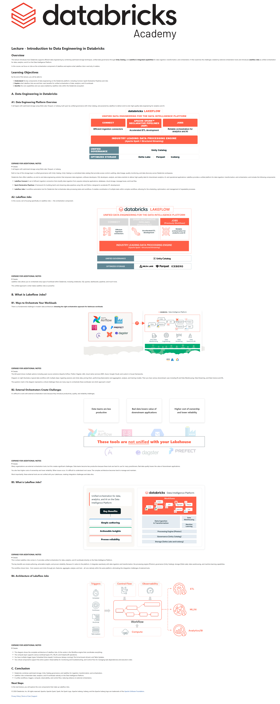

# 03. Lecture: Introduction to Data Engineering in Databricks

**Curso:** Deploy Workloads with Lakeflow Jobs  
**Tipo de Contenido:** SCORM / Lección Interactiva  
**Captura de Pantalla:** 

---

## Overview

This lecture introduces how Databricks supports efficient data engineering by combining optimized storage techniques, unified data governance through Unity Catalog, and Lakeflow's integrated capabilities for data ingestion, transformation, and orchestration. It then examines the challenges created by external orchestration tools and introduces Lakeflow Jobs as unified orchestration for data, analytics, and AI on the Data Intelligence Platform.

In this course, we focus on Jobs as the orchestration component of Lakeflow and explore what Lakeflow Jobs is and why it matters.

## Learning Objectives

By the end of this lecture, you will be able to:
1. Understand the key components of data engineering on the Databricks platform, including Connect, Spark Declarative Pipelines and Jobs.
2. Explain what Lakeflow Jobs are and their main benefits for unified orchestration of data, analytics, and AI workloads.
3. Identify the core capabilities and use cases enabled by Lakeflow Jobs within the Databricks ecosystem.

---

## A. Data Engineering in Databricks

### A1. Data Engineering Platform Overview

It all begins with optimized storage using Delta Lake, Parquet, or Iceberg, built upon by unified governance with Unity Catalog, and powered by Lakeflow to deliver end-to-end, high-quality data engineering for analytics and AI.

```
+-----------------------------------------------------------------------------------+
|                                databricks LAKEFLOW                                |
|            UNIFIED DATA ENGINEERING FOR THE DATA INTELLIGENCE PLATFORM            |
+------------------------+---------------------------------+------------------------+
|        CONNECT         | APACHE SPARK™ DECLARATIVE (SDP) |          JOBS          |
|  Efficient ingestion   |         Accelerated ETL         |  Reliable orchestration|
|       connectors       |           development           |   for analytics & AI   |
+------------------------+---------------------------------+------------------------+
|                     INDUSTRY LEADING DATA PROCESSING ENGINE                       |
|                       (Apache Spark + Structured Streaming)                       |
+-----------------------------------------------------------------------------------+
|                                 UNIFIED GOVERNANCE                                |
|                                   Unity Catalog                                   |
+-----------------------------------------------------------------------------------+
|                                 OPTIMIZED STORAGE                                 |
|                       Delta Lake   |   Parquet   |   Iceberg                      |
+-----------------------------------------------------------------------------------+
```

#### Additional Notes:
- **Optimized Storage**: It all begins with optimized storage using Delta Lake, Parquet, or Iceberg.
- **Unified Governance (Unity Catalog)**: Unity Catalog is a centralized data catalog that provides access control, auditing, data lineage, quality monitoring, and data discovery across Databricks workspaces.
- **Lakeflow Components**:
  - **Lakeflow Connect**: A set of efficient ingestion connectors that simplify data ingestion from popular enterprise applications, databases, cloud storage, message buses, and local files.
  - **Spark Declarative Pipelines (SDP)**: A framework for building batch and streaming data pipelines using SQL and Python, designed to accelerate ETL development.
  - **Lakeflow Jobs**: A workflow automation tool for Databricks that orchestrates data processing tasks and workflows. It enables coordination of multiple tasks within complex workflows, allowing for the scheduling, optimization, and management of repeatable processes.

### A2. Lakeflow Jobs Focus
In this course, we're focusing specifically on **Lakeflow Jobs** — the orchestration component.
Lakeflow Jobs allows you to orchestrate every type of workload within Databricks, including notebooks, SQL queries, dashboards, pipelines, and much more. This unified approach is what makes Lakeflow Jobs so powerful.

---

## B. What is Lakeflow Jobs?

### B1. Ways to Orchestrate Your Workloads
There is a fundamental challenge in modern data architecture: choosing the right orchestration approach for lakehouse workloads.
- **Orchestration options**: Open-source solutions (Apache Airflow, Prefect, Dagster, dbt), cloud-native services (AWS, Azure, Google Cloud), and custom in-house frameworks.
- **Typical data workflow**: Sessions & Clicks Ingest $\rightarrow$ Join $\rightarrow$ Featurize & Aggregate $\rightarrow$ Analyze $\rightarrow$ Train ML Models $\rightarrow$ Downstream BI, Data Streaming, and ML applications.
- **The Dilemma**: There are many ways to orchestrate these workloads, but which approach is best?

### B2. External Orchestrators Create Challenges
It's difficult to work with external orchestration tools because they introduce productivity, quality, and reliability challenges:
- **Data teams are less productive**: Hard to use for many practitioners.
- **Bad data lowers value of downstream applications**: Difficult to understand the root cause when issues occur.
- **Higher cost of ownership and lower reliability**: Complex architecture to manage and maintain.
- **Not unified with your Lakehouse**: External tools create integration challenges and data silos.

### B3. What is Lakeflow Jobs?
**Unified orchestration for data, analytics, and AI on the Data Intelligence Platform.**
- **Key Benefits**:
  1. **Simple authoring**: Intuitive DAG builder, multi-task orchestration.
  2. **Actionable insights**: Deep execution observability and unified logs.
  3. **Proven reliability**: Automatic retries, cluster reuse, and repair runs.
- **Native Integration**: Seamlessly integrates with Photon processing engine, Unity Catalog governance, Delta Lake storage, SQL Warehouses, and Databricks ML.

### B4. Architecture of Lakeflow Jobs
1. **Workflow Engine**: Coordinates DAG execution and task dependencies at the core.
2. **Compute Layer**: Serverless compute, Classic Clusters, SQL Warehouses for ETL, ML/AI, and Analytics/BI.
3. **Trigger Types**:
   - **Scheduled**: Time-based (cron / periodic).
   - **Continuous**: Always-running for low-latency streaming.
   - **File Arrival**: Event-driven ingestion upon new files landing in cloud storage.
   - **Table Updates**: Triggered when upstream tables are updated.
4. **Supporting Pillars**:
   - **Observability**: Monitoring, alerting, execution duration, and troubleshooting.
   - **Control Flow**: Conditionals (If/Else), For-each loops, Run Job tasks, and error handling.

---

## C. Conclusion
- Databricks combines optimized storage, Unity Catalog governance, and Lakeflow for ingestion, transformation, and orchestration.
- Lakeflow Jobs orchestrates data, analytics, and AI workloads natively on the Data Intelligence Platform.
- It unifies workflows, triggers, compute, observability, and control flow, eliminating reliance on external orchestrators.
