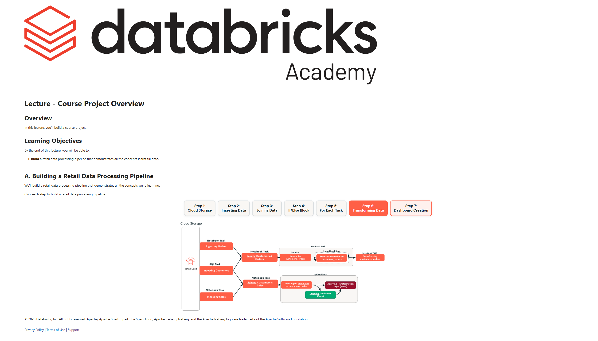

# 05. Lecture: Course Project Overview

**Curso:** Deploy Workloads with Lakeflow Jobs  
**Tipo de Contenido:** SCORM / Lección Interactiva  
**Captura de Pantalla:** 

---

## Overview

In this lecture, you'll build a course project: a complete, production-grade retail data processing pipeline that demonstrates all the Lakeflow Jobs concepts learned throughout this course.

## Learning Objectives

By the end of this lecture, you will be able to:
- Build a retail data processing pipeline that demonstrates all the concepts learned to date, from cloud storage landing to final business dashboard delivery.

---

## A. Building a Retail Data Processing Pipeline

We'll build a retail data processing pipeline that demonstrates all the concepts we're learning across seven progressive steps:

### Step 1: Cloud Storage Landing
- Land raw retail transactions, customer profiles, and store metadata files into Cloud Object Storage (AWS S3, Azure ADLS Gen2, or GCP Cloud Storage) configured through Unity Catalog external locations and volumes.

### Step 2: Ingesting Data
- Ingest the landing files into raw Bronze tables using Lakeflow Jobs tasks.
- Leverage Auto Loader (`read_files` / Streaming Tables) to incrementally capture new order batches without duplicating records.

### Step 3: Joining Data
- Execute intermediate tasks to validate, clean, and enrich datasets.
- Join transaction logs with customer demographics and store master data to populate normalized Silver Delta tables.

### Step 4: If/Else Block (Conditional Logic)
- Incorporate conditional control flow tasks (`If/Else` blocks) to evaluate business logic:
  - If daily data quality checks pass and record counts meet thresholds $\rightarrow$ proceed to aggregation.
  - Else $\rightarrow$ trigger quarantine workflow and send alerts to the engineering on-call channel.

### Step 5: For Each Task (Iterative Execution)
- Use the **For Each** task to iterate across an array of regional stores or geographical territories.
- Run region-specific processing in parallel or sequence without writing duplicate boilerplate DAG definitions.

### Step 6: Transforming Data (Gold Aggregations)
- Aggregate daily and monthly metrics (revenue by department, top customers, inventory turnover) into Gold tables optimized for BI consumption.

### Step 7: Dashboard Creation & Reporting
- Automatically refresh AI/BI Dashboards and trigger downstream alert evaluations.
- Complete the end-to-end pipeline from raw arrival to executive visualization.

---
*© 2026 Databricks, Inc. All rights reserved.*
