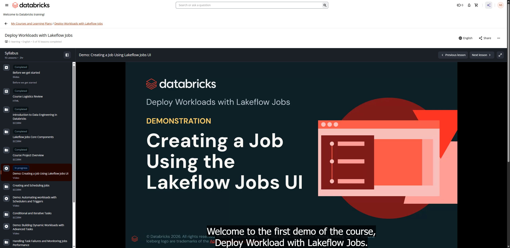

# 06. Demo: Creating a Job Using Lakeflow Jobs UI

**Curso:** Deploy Workloads with Lakeflow Jobs  
**Tipo de Contenido:** Video / Demostración Técnica  
**Captura de Pantalla:** 

---

## Overview
In this first demo, the instructor demonstrates how to navigate the Databricks Lakeflow Jobs interface, create a new multi-task job, configure compute resources (Serverless vs. Classic clusters), attach notebooks and SQL scripts, establish task dependencies (DAG), set parameters, and run the pipeline.

---

## Complete Spoken Transcript (Timestamps & Cues)

**[00:00 - 00:05]** Welcome to the first demo of the course, Deploy Workload with Lakeflow Jobs.

**[00:06 - 00:10]** In this course, we are going to see the various way in which

**[00:10 - 00:15]** you can orchestrate your data pipeline in Databricks environment.

**[00:16 - 00:20]** Now, as we progress through the demo, we are going to use different, different

**[00:20 - 00:24]** tasks in the demo to create a retail pipe.

**[00:25 - 00:30]** Before starting this demo, let me first give you a quick walkthrough of

**[00:30 - 00:33]** how my pipeline is going to look like.

**[00:35 - 00:39]** Now, I have a cloud storage in which my data resides.

**[00:39 - 00:42]** First, I'm going to look at the data.

**[00:42 - 00:50]** So it is currently in dbacademy_retail under schema vo1, we have three tables.

**[00:50 - 00:56]** Now, these is going to be act as a source data for my pipeline.

**[00:57 - 00:59]** My lab user catalog is this.

**[01:00 - 01:06]** So what I'm going to do, I'm going to ingest this particular data into my table

**[01:06 - 01:08]** and then going to build into my pipeline.

**[01:09 - 01:14]** So I'm going to create some notebook tasks and SQL tasks to ingest that data.

**[01:15 - 01:20]** Then I'm performing some joins or some-- performing some transformation as well.

**[01:20 - 01:23]** Then I'll be using some complex tasks such as

**[01:25 - 01:28]** if else tasks, for each task, and then applying some business logic as well.

**[01:29 - 01:35]** Post that, all of the final tables that I've created is going to be fed into

**[01:35 - 01:39]** the dashboard, and I'm going to have another task which is a dashboard task,

**[01:40 - 01:42]** which is going to refresh my pipeline.

**[01:45 - 01:49]** So as and when my data gets loads, the dashboard get refreshed.

**[01:50 - 01:53]** Now back to this particular demo.

**[01:54 - 01:59]** So in this demo, what we are going to do, we are going to create two sorts of tasks.

**[01:59 - 02:03]** The first one is notebook task, another one is SQL task.

**[02:05 - 02:08]** First, I'll make sure I'm connected to a serverless compute.

**[02:09 - 02:10]** I'm currently at the latest version.

**[02:11 - 02:14]** Then I'm going to run my classroom setup.

**[02:15 - 02:19]** It is going to create required resources for this particular demo.

**[02:20 - 02:28]** Also, it is going to create a volume for me, and it has given me a current

**[02:28 - 02:30]** path, the current directory path.

**[02:30 - 02:32]** Also, it has created a

**[02:34 - 02:35]** SQL query for me.

**[02:37 - 02:38]** Right.

**[02:38 - 02:42]** So first thing first, let me look at my catalog and schema.

**[02:44 - 02:48]** So my catalog is going to my unique lab username, and this is going to my catalog.

**[02:49 - 02:54]** Then under this, all of my table will reside under jobs schema.

**[02:55 - 02:59]** I expand this, and I'll see there are currently no tables, but

**[02:59 - 03:04]** only one volume location, which will we see in the further demo.

**[03:05 - 03:05]** Right.

**[03:07 - 03:07]** Okay.

**[03:08 - 03:13]** Now, we have two different sort of marketplace data that we are going to use.

**[03:13 - 03:15]** So first one is DB Academy Retail,

**[03:15 - 03:18]** and second is DB Academy Bank.

**[03:18 - 03:23]** We are using DB Academy Bank for our labs and DB Academy Retail

**[03:23 - 03:25]** for our demonstration purposes.

**[03:27 - 03:33]** Now, as I told you, we are going to create two tasks in this demo.

**[03:34 - 03:41]** First thing first, let me look at my task files, and

**[03:41 - 03:45]** under lesson four files, you can see I have a creating orders table.

**[03:46 - 03:49]** Let me see how I'm going to create my orders table.

**[03:49 - 03:55]** So I'm going to run a classroom setup script, which is going to default

**[03:55 - 03:57]** my usage of catalog and schema.

**[03:58 - 04:05]** Now, I am fetching a table which is already stored under DB Academy Retail.

**[04:05 - 04:11]** I'm fetching sales order, saving it as a data frame, then creating

**[04:11 - 04:13]** a table name as orders_bronze.

**[04:14 - 04:21]** I can simply run this, but we are going to create a lakeflow job to

**[04:22 - 04:25]** automatically run this notebook for me.

**[04:26 - 04:29]** Second thing is, I have the SQL query.

**[04:30 - 04:31]** Let me look at the SQL query

**[04:35 - 04:43]** It says, create or replace table inside my catalog, inside my schema by the

**[04:43 - 04:49]** name of sales_bronze, and it is taking data from, again, DB Academy retails

**[04:50 - 04:54]** under V01 catalog and sales table.

**[04:55 - 05:02]** Okay, so by doing this, I'm ingesting sales and order table into

**[05:02 - 05:05]** my catalog under my schema chops

**[05:07 - 05:07]** Okay.

**[05:08 - 05:14]** Now, before creating a job, let me get the name of the job I want to have

**[05:18 - 05:21]** Click on this icon here and click on Jobs & Pipelines.

**[05:22 - 05:24]** Make sure to open it in a new tab

**[05:28 - 05:29]** I'm into new tab.

**[05:29 - 05:36]** Now, for creating a job, I can click on Create and select the job from here, or

**[05:36 - 05:39]** I can simply select from here as well

**[05:41 - 05:47]** First thing first, I'm going to name it as By Given Configuration.

**[05:47 - 05:53]** Then as you can see, it has already given me some suggestion like, "Do

**[05:53 - 05:54]** you want to create a notebook task?"

**[05:55 - 06:00]** Yeah, I want to, but I'm just going to explore what another type do I have.

**[06:01 - 06:07]** So it says you have Notebook, Python, Visual Data Preparation, SQL Query, File,

**[06:07 - 06:12]** then we have Ingestion, ETL Pipeline, and these are some advanced tasks that

**[06:12 - 06:15]** we are going to see in the further demos.

**[06:16 - 06:19]** For now, I'm going to select a notebook task.

**[06:20 - 06:21]** Okay.

**[06:21 - 06:22]** So what I'm going to name it?

**[06:23 - 06:25]** I'm going to name it as ingesting_orders.

**[06:28 - 06:29]** Right.

**[06:30 - 06:36]** Now, I need to define the path where my actual notebook lies, where the

**[06:36 - 06:39]** code to ingest orders actually resides.

**[06:40 - 06:47]** So as we know, we need to go into our course shell, then into the course,

**[06:48 - 06:50]** then we have our task files, right?

**[06:51 - 06:55]** Under lesson-04 files, we have this creating_orders table that we want.

**[06:57 - 06:58]** We have given the path.

**[06:59 - 07:01]** We are going to select Serverless compute.

**[07:01 - 07:02]** Why?

**[07:02 - 07:04]** Because first, it autoscale.

**[07:04 - 07:07]** Second, the startup time is very low

**[07:09 - 07:11]** So what other options do we have?

**[07:11 - 07:15]** You can create a specific cluster for your job, and then you can run

**[07:15 - 07:21]** your pipeline or your lakeflow job using job cluster, or you can use

**[07:21 - 07:24]** the all-purpose compute as well.

**[07:24 - 07:26]** For this demonstration, we are going to use serverless.

**[07:28 - 07:29]** And there is a parameter key.

**[07:29 - 07:35]** So let's say, if your notebook or if your task file is

**[07:36 - 07:38]** requires some dynamic parameter.

**[07:39 - 07:44]** So what you can do, you can define your key value pair here and into

**[07:44 - 07:47]** your code, you can fetch it directly.

**[07:47 - 07:50]** We are going to see that in the further demo as well.

**[07:51 - 07:56]** Now, for the retries, it says how many times you are going to retry it.

**[07:57 - 08:00]** So right now it is set at four attempts.

**[08:00 - 08:05]** So first time it fails, it's going to reattempt and reattempt until four time.

**[08:06 - 08:08]** Then we have notification as well.

**[08:09 - 08:13]** For example, if a job completes and if I want to notify a certain

**[08:13 - 08:17]** group of people, I can notify them by adding,   add notification.

**[08:17 - 08:21]** So it says you can notify on start, success, failure,

**[08:21 - 08:23]** duration warning, streaming.

**[08:23 - 08:26]** What are all the supporting destination?

**[08:26 - 08:31]** It is email, Microsoft Teams, Slack, webhook, and lot of other things.

**[08:33 - 08:33]** Right.

**[08:34 - 08:37]** Now, let me focus into the right-hand side panel.

**[08:38 - 08:40]** It says job details.

**[08:40 - 08:44]** So it is specifically a metadata about your job.

**[08:45 - 08:46]** So what is the job ID?

**[08:47 - 08:48]** Who is the creator of the job?

**[08:49 - 08:51]** Who is running it, for example.

**[08:51 - 08:54]** So right now I'm running it, but I can run it as service principal as well.

**[08:55 - 08:58]** If I need to add some description, what this job is about, let's say it's about

**[08:59 - 09:03]** ingesting data or something like that.

**[09:04 - 09:07]** Then we have lineage, and then this performance optimize.

**[09:07 - 09:11]** Let me create a task, and it automatically gets on.

**[09:11 - 09:17]** As soon as I save this create task, you can see the toggle for performance

**[09:17 - 09:20]** optimization automatically becomes on.

**[09:21 - 09:28]** So if we keep this mode on, whenever I trigger a job, it will start immediately.

**[09:29 - 09:33]** And if I don't enable it, it is going to take five to seven minutes

**[09:33 - 09:41]** to even start my job The next thing here is schedules and triggers.

**[09:41 - 09:45]** Now, it is about triggering your jobs or setting a schedule.

**[09:47 - 09:50]** So we have different types of schedules available here, schedule, fireable,

**[09:50 - 09:55]** table update, continuous, which we are going to see in the further demos.

**[09:55 - 09:57]** Now, we have two types of parameters.

**[09:58 - 10:03]** One we can define at task level, the another one is at job level.

**[10:04 - 10:07]** So if we define anything at job level, it overrides whatever we

**[10:07 - 10:10]** have defined at the task level.

**[10:10 - 10:14]** The compute is going to be serverless, and the environment it says it

**[10:14 - 10:16]** is using serverless version five.

**[10:17 - 10:21]** I can also add a tag to my job, and there are some job health

**[10:21 - 10:24]** configuration that I set as well.

**[10:25 - 10:29]** Also, you can set up task notification and job notification.

**[10:30 - 10:35]** So this is about the task notifications, and this is job notifications.

**[10:36 - 10:43]** Then you can also add Git and use Git to orchestrate your task if you

**[10:43 - 10:45]** have any pipeline defined over Git.

**[10:45 - 10:48]** So you can add Git, and then you can use that.

**[10:48 - 10:52]** Last, we have permissions and advanced settings.

**[10:52 - 10:55]** So under advanced setting, we can define how many concurrent tasks

**[10:55 - 11:00]** you have, what is the queue, do you want that queue or not, right?

**[11:01 - 11:04]** So we created our first task, which is ingesting orders.

**[11:04 - 11:06]** Now

**[11:06 - 11:07]** let's add another task.

**[11:11 - 11:15]** L- Now, let's add another task, which is a SQL task

**[11:15 - 11:17]** So we have three different files.

**[11:18 - 11:22]** One is SQL query, another is SQL file, and third one is SQL alert.

**[11:23 - 11:26]** We are going to use SQL query for this demonstration.

**[11:27 - 11:28]** First thing first,

**[11:28 - 11:37]** I'm going to name it at ingesting_Sales

**[11:38 - 11:43]** Now, in the drop-down you can see I have only one query which has been

**[11:43 - 11:45]** created by my classroom setup script.

**[11:47 - 11:50]** For compute, it is saying you have shared warehouse.

**[11:50 - 11:55]** Please notice that I'm not getting an option for a serverless compute here.

**[11:56 - 12:03]** Instead, I'm getting a SQL warehouse compute since my task type is SQL query.

**[12:05 - 12:07]** Oh, so it should not depend on anything.

**[12:07 - 12:10]** It's an independent task, so I'm just going to

**[12:12 - 12:13]** Deselect that.

**[12:14 - 12:17]** Now, this task is ready as well,

**[12:19 - 12:23]** and it says, "Your job has been updated." I'm going to click

**[12:23 - 12:25]** on Run now to run this task.

**[12:26 - 12:27]** Meanwhile, this is running.

**[12:28 - 12:34]** Let me show you what different option do I have for running my task or a job

**[12:37 - 12:41]** You can run it with different settings, or you have a run backfill.

**[12:41 - 12:45]** For example, you can also backfill your data.

**[12:45 - 12:48]** So that's where this run backfill comes into the play.

**[12:49 - 12:55]** Now I'm going to navigate into the Runs tab and going to give it a

**[12:55 - 13:00]** refresh so that I can see all of my existing run for this particular job.

**[13:02 - 13:06]** So it says the start time is this, the current status is running.

**[13:07 - 13:08]** This is the run ID.

**[13:08 - 13:11]** How I launched it, it is launched manually.

**[13:12 - 13:13]** How long it has been running?

**[13:13 - 13:15]** It's been forty-two seconds.

**[13:16 - 13:21]** Also, you can navigate or see your runs in this graph.

**[13:22 - 13:23]** It says this is your total run.

**[13:24 - 13:25]** Now you have two tasks.

**[13:25 - 13:29]** First is ingesting sales, another one is ingesting orders.

**[13:30 - 13:35]** I'm going to click on this, so it's going to give me the DAG.

**[13:35 - 13:37]** I have three options here as well.

**[13:37 - 13:41]** First one is graph, second is timeline, the third one is list.

**[13:42 - 13:47]** So let me click on the timeline, and if you want to deep dive into the

**[13:47 - 13:52]** Spark configuration, let's say if a job is taking too much of a time,

**[13:53 - 13:57]** and it includes different stages, jobs, etc., etc., and you want to

**[13:57 - 13:58]** look into the Spark configuration.

**[13:59 - 14:00]** So you click on any of these.

**[14:01 - 14:06]** Let's say I'm click on the create schema one, and here I have more detail.

**[14:06 - 14:06]** And

**[14:09 - 14:14]** this is particular for data engineers who's looking for where my compute is

**[14:14 - 14:20]** taking too much of a time, which stage it is getting stuck at, what particular job

**[14:20 - 14:25]** I need to, you know, looked at, or which particular thing I need to optimize for

**[14:26 - 14:29]** my notebook or for your any other task

**[14:31 - 14:36]** Now, so whenever I run any instance of this, it is going to log into here.

**[14:36 - 14:42]** So if I run it again, you can see the start time has changed and the

**[14:42 - 14:45]** new job have been triggered, right?

**[14:49 - 14:51]** So we're done this.

**[14:51 - 14:53]** We explored our job.

**[14:53 - 14:56]** We've reviewed the run, and let me query my table

**[14:59 - 15:03]** So first I'm going to run sales bronze.

**[15:03 - 15:08]** As you can see, I'm not using three-level namespace here because my setup script

**[15:08 - 15:15]** has already set my catalog, my lab user catalog as default catalog, and

**[15:15 - 15:18]** my job schema as the default schema.

**[15:19 - 15:22]** So you can see the data have been ingested.

**[15:22 - 15:23]** It is looking quite good.

**[15:24 - 15:26]** Let's look at the orders bronze

**[15:30 - 15:32]** Now it has also been ingested and looking quite good.

**[15:34 - 15:35]** Thank you

