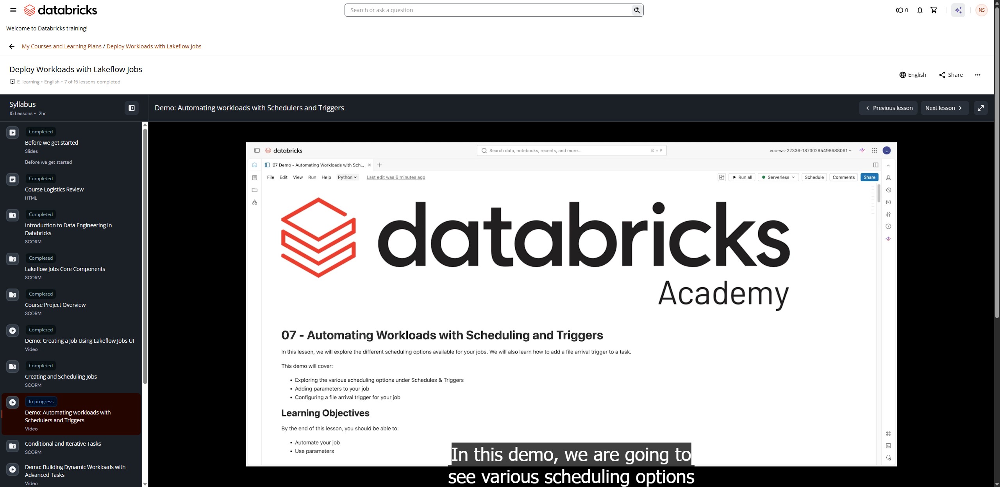

# 08. Demo: Automating workloads with Schedulers and Triggers

**Curso:** Deploy Workloads with Lakeflow Jobs  
**Tipo de Contenido:** Video / Demostración Técnica  
**Captura de Pantalla:** 

---

## Overview
In this demonstration, the instructor walks through setting up scheduled triggers (cron expressions), configuring File Arrival triggers on cloud storage volumes, passing parameters at the job and task levels, and verifying execution through the job runs history.

---

## Complete Spoken Transcript (Timestamps & Cues)

**[00:00 - 00:04]** Welcome to demo automating workload with scheduling and triggers.

**[00:05 - 00:09]** In this demo, we are going to see various scheduling options

**[00:09 - 00:11]** available in lakeflow job.

**[00:12 - 00:17]** Then we are also going to see how we can add parameter into a task or a job.

**[00:18 - 00:23]** Then we will be configuring a file arrival trigger for our job.

**[00:24 - 00:28]** First thing first, I'll make sure I'm connected to Serverless

**[00:28 - 00:30]** version five, which I am.

**[00:31 - 00:34]** Then I'm going to run my classroom setup script.

**[00:35 - 00:36]** Meanwhile, this is running.

**[00:36 - 00:38]** Let me navigate to my catalog.

**[00:39 - 00:45]** Now, in my catalog under my schema jobs, you can see I already have

**[00:45 - 00:49]** two tables created, which is orders_bronze and sales_bronze.

**[00:49 - 00:52]** These tables were created by earlier demo

**[00:55 - 00:55]** Okay.

**[00:57 - 00:59]** Now let me see.

**[00:59 - 01:03]** What I'm going to do, we have ingested orders and sales.

**[01:03 - 01:08]** Now we are going to ingest customer data into our schema.

**[01:09 - 01:15]** Okay, so let me see my notebook for creating a customer table.

**[01:16 - 01:21]** I can directly click on this link, and it will open it in a new tab, or I can

**[01:21 - 01:23]** click on the file, go to the task file.

**[01:24 - 01:29]** Under lesson seven files, I have my creating customer table.

**[01:31 - 01:35]** As you can see, I'm not running classroom setup script here, or…

**[01:38 - 01:42]** And rather I'm fetching it from the parameters dynamically.

**[01:43 - 01:47]** So whatever the parameter I passed as catalog and schema, it is going

**[01:47 - 01:53]** to be stored into my catalog and my schema variable, and that is going

**[01:53 - 01:56]** to define path for my volume as well.

**[01:57 - 02:04]** Then using those variables, I'm going to write or save my table into

**[02:06 - 02:10]** customer branch, or I'm going to save it as customer branch table.

**[02:12 - 02:13]** Okay.

**[02:14 - 02:20]** So since we already done demo four and we want to create a new job.

**[02:22 - 02:29]** Now if somebody comes in and has not done demo four, he can just come in

**[02:29 - 02:32]** here, run this particular function.

**[02:32 - 02:38]** What this function will do, it will create a job for him and add two tasks,

**[02:39 - 02:42]** which we already performed in demo four.

**[02:43 - 02:47]** Okay, now navigate to jobs and pipelines.

**[02:48 - 02:49]** I'm going to open it in a new tab

**[02:52 - 02:54]** Here you can see we have two jobs.

**[02:55 - 02:58]** This one we created in the earlier demo, and this one we

**[02:58 - 03:01]** just created using that function.

**[03:02 - 03:06]** Now, if you see a task, we have two tasks already here.

**[03:06 - 03:11]** First one is ingesting orders, and another one is ingesting sales.

**[03:11 - 03:15]** I'm going to add a third task into this, which is of type notebook.

**[03:16 - 03:20]** I'm going to name it as Ingesting Customers.

**[03:22 - 03:25]** Then for the notebook path, I'm going to select,

**[03:28 - 03:34]** my task files, and then under lesson seven files, I have this notebook.

**[03:36 - 03:39]** Okay, so it doesn't depend upon anything.

**[03:40 - 03:41]** Now, here is the fun part.

**[03:43 - 03:47]** So should I define my parameters here or at job level?

**[03:50 - 03:56]** If I define it in the task, it is going to be used by this particular task, and

**[03:56 - 04:01]** if I define it in job parameters, it's going to be passed in all three of them.

**[04:02 - 04:07]** Since the first two does not require parameters, so I'm going

**[04:07 - 04:08]** to define it at task level.

**[04:09 - 04:10]** Right.

**[04:11 - 04:19]** Now, before creating this task, let me create a task, and let

**[04:19 - 04:22]** me see what are the different schedules and triggers that I have.

**[04:23 - 04:28]** The first one is None, which means you came in and manually

**[04:28 - 04:30]** run the Run now command.

**[04:31 - 04:33]** The second one you have is Scheduled.

**[04:34 - 04:39]** The scheduled is generally used when you know your data is going to land at your

**[04:39 - 04:45]** source location at certain point of time, and then you define it either using the

**[04:45 - 04:51]** interval, or you can define the exact time using cron syntax as well, or just,

**[04:51 - 04:54]** like, using any particular timestamp

**[04:56 - 05:00]** Then we have table update.

**[05:00 - 05:04]** So this task is used, for example, your source is a table.

**[05:04 - 05:08]** So whenever a data ingested into the table, you want to

**[05:08 - 05:10]** run your downstream pipeline.

**[05:10 - 05:14]** So if your upstream table gets some data, you want to run the downstream

**[05:15 - 05:21]** pipeline, you define that table here, and as soon as the data lands into that

**[05:21 - 05:24]** table, your job is going to get started.

**[05:25 - 05:28]** The fourth one here, the fourth one here is the continuous method,

**[05:29 - 05:35]** which is generally used when we are dealing with streaming data.

**[05:36 - 05:38]** So let's jump to this file arrival.

**[05:39 - 05:43]** This is what we are going to use for this demo.

**[05:43 - 05:48]** For file arrival, it is basically you can define any volume location.

**[05:49 - 05:55]** So once you define your volume location, whenever a new file drops in, you

**[05:55 - 05:57]** can start your job based on that.

**[05:59 - 06:00]** So we are going to use that.

**[06:01 - 06:07]** But before doing this, let me head back to my demo and get my source location.

**[06:09 - 06:09]** Okay.

**[06:10 - 06:16]** First thing first, I'm going to create a volume, which is trigger storage location.

**[06:17 - 06:22]** Now, by default, it is going to be created inside my jobs schema.

**[06:23 - 06:29]** I go to my catalog, and you can see I have one folder here by the

**[06:29 - 06:30]** name of trigger storage location.

**[06:31 - 06:32]** Perfect.

**[06:33 - 06:39]** Now, let me show if any data exist in it.

**[06:39 - 06:43]** So it says it is under trigger storage volume.

**[06:43 - 06:43]** Okay.

**[06:44 - 06:46]** Now, let me get the volume path.

**[06:47 - 06:48]** I'm going to copy it

**[06:55 - 07:00]** Then I'm going to paste this location here, right?

**[07:01 - 07:05]** And under Advance, you can always define the time, but we are not going to do that.

**[07:06 - 07:09]** And before saving, let me test it.

**[07:10 - 07:13]** So it successfully passed, which means this location exists

**[07:13 - 07:15]** and accessible by this job.

**[07:16 - 07:17]** I'm going to save it.

**[07:18 - 07:20]** Then back to my job.

**[07:20 - 07:22]** Let me add parameters as well.

**[07:22 - 07:26]** So it says the key is catalog and the value is labuser.

**[07:27 - 07:32]** I'm going to copy this and manually add here.

**[07:32 - 07:37]** The key is catalog, and the value is my labuser catalog name.

**[07:38 - 07:42]** Again, it is schema, and it is jobs.

**[07:43 - 07:44]** Okay, I've defined this.

**[07:44 - 07:45]** Let me save my task.

**[07:47 - 07:49]** Okay, now my job is ready.

**[07:49 - 07:54]** As soon as a new file arrives into this location, this job

**[07:54 - 07:55]** is going to get triggered

**[08:00 - 08:00]** Okay.

**[08:00 - 08:05]** Now, before copying data into my trigger storage location, let me confirm

**[08:05 - 08:08]** whether it has any existing data or not.

**[08:09 - 08:11]** So right now there is no data.

**[08:12 - 08:14]** Let me run this command

**[08:17 - 08:21]** But it says data have been copied from DB Academy Retail.

**[08:21 - 08:22]** Where is DB Academy Retail?

**[08:23 - 08:24]** Okay.

**[08:25 - 08:30]** So the data have been copied from source file customer CSV

**[08:31 - 08:34]** to my trigger storage location.

**[08:35 - 08:36]** Let me confirm this.

**[08:37 - 08:37]** Okay.

**[08:37 - 08:40]** Yeah, I can see our file have been placed

**[08:42 - 08:44]** Now let's monitor the run.

**[08:45 - 08:51]** I'm going into my run and let me give it a refresh

**[08:54 - 08:54]** Okay.

**[08:54 - 08:59]** So it says the run has been launched by file arrival.

**[09:00 - 09:06]** The current status is running, and it automatically initialize job

**[09:10 - 09:13]** Let me look at the graph view, the timeline.

**[09:14 - 09:18]** So all the runs started at same time as you can see because there's no dependency.

**[09:18 - 09:24]** So and as soon as I get a go, all the tasks starts running parallelly

**[09:30 - 09:35]** Now, just wait for a couple of… Oh, it's done.

**[09:36 - 09:44]** Now, the data have been ingested into the customer_bronze table as well.

**[09:45 - 09:49]** Let me show how many tables exist in my schema.

**[09:49 - 09:53]** Says three tables: customer_bronze, order_bronze, and sales_bronze.

**[09:53 - 09:55]** Let me query my customer_bronze table

**[10:01 - 10:01]** Perfect.

**[10:01 - 10:03]** I have the data available for customers now.

**[10:04 - 10:11]** Now I can do some joins and some transformation in my next demo

