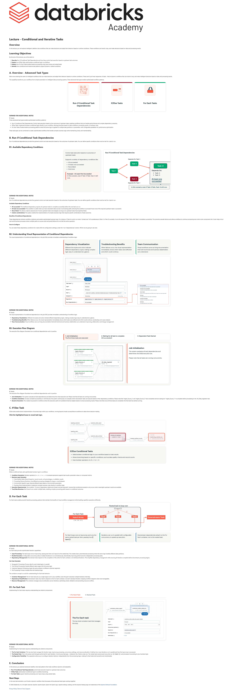

# 09. Lecture: Conditional and Iterative Tasks

**Curso:** Deploy Workloads with Lakeflow Jobs  
**Tipo de Contenido:** SCORM / Lección Interactiva  
**Captura de Pantalla:** 

---

## Overview

In this lecture, you will explore intelligent Lakeflow Jobs workflows that can make decisions and adapt their behavior based on runtime conditions. These workflows can branch, loop, and make decisions based on data and processing results.

## Learning Objectives

By the end of this lecture, you will be able to:
1. Describe **Run-if Conditional Task Dependencies** and how they control task execution based on upstream task outcomes.
2. Explain how **If/Else Tasks** add boolean conditional logic to workflows.
3. Explain how **For Each Tasks** enable iterative processing using input arrays and nested tasks.
4. Identify how conditional and iterative task patterns support dynamic, resilient workflows.

---

## A. Overview of Advanced Task Types

Three advanced task types transform static pipelines into intelligent, adaptive data processing systems:
1. **Run-if Conditional Task Dependencies**: Control task execution based on upstream task outcomes, preventing cascading failures.
2. **If/Else Tasks**: Implement boolean conditional logic directly in the workflow DAG, enabling data-driven branching.
3. **For Each Tasks**: Enable parameterized loop iterations over an input array with configurable parallelism.

---

## B. Run-if Conditional Task Dependencies

Run-if dependencies determine whether a downstream task executes based on the completion statuses of its parent tasks.

### B1. Supported Dependency Conditions
- **All succeeded** *(Default)*: Traditional dependency. All parent tasks must succeed.
- **At least one succeeded**: Executes if any single upstream task succeeds. Useful for redundant ingestion sources or alternate processing paths.
- **None failed**: Executes if no upstream task explicitly failed (skipped tasks are allowed).
- **All failed**: Executes only if all upstream tasks failed (e.g., triggering global cleanup or rollback handlers).
- **At least one failed**: Executes if any upstream task fails (e.g., immediate failure alerting).

### B2. Visual Representation in the DAG
- In the Lakeflow Jobs UI, dependency types are visually indicated with distinct line colors and styles.
- When partial failures occur, the visual graph immediately shows which branch was skipped and which branch proceeded, simplifying root-cause debugging.

---

## C. If / Else Conditional Tasks

If/Else tasks bring boolean evaluation directly into the workflow orchestration layer.

### C1. Evaluation Logic
- **Operators Supported**: `==`, `!=`, `>`, `>=`, `<`, `<=`
- **Operands**: Evaluates dynamic task values (e.g. `{{tasks.data_quality.values.error_count}}`), job parameters, or runtime constants.
- **Branches**:
  - **True Branch**: One or more downstream tasks executed when the expression evaluates to true.
  - **False Branch**: Alternate downstream tasks executed when false.
- **Example Use Cases**:
  - Data Quality Gates: `error_count == 0` $\rightarrow$ True: proceed to Gold tables; False: quarantine and alert.
  - Processing Volume Thresholds: `record_count > 1000000` $\rightarrow$ True: spin up high-concurrency cluster; False: run on lightweight Serverless SQL.

---

## D. For Each Tasks (Iterative Processing)

For Each tasks execute a repeatable task across an array of inputs without duplicating DAG definitions.

### D1. Architecture: Container vs. Nested Task
1. **For Each Container Task**:
   - The top-level orchestrator that manages loop execution.
   - Defines the **Input Array** (e.g., `["US_EAST", "US_WEST", "EMEA", "APAC"]` or dynamically passed JSON).
   - Configures **Concurrency** (e.g., run up to 4 iterations simultaneously).
2. **Nested Task**:
   - The actual unit of work executed per array item (Notebook, Python script, or SQL query).
   - Automatically receives the current item via the dynamic reference `{{input}}`.

### D2. Dependency Model
- Downstream tasks connect directly to the **For Each Container**, not to individual iterations.
- The container completes only after **all** iterations finish successfully.

---

## E. Conclusion
- Run-if dependencies provide error tolerance and multi-path processing.
- If/Else tasks enable data-driven branching and automated validation gates.
- For Each tasks deliver scalable, parallel loop processing while keeping workflow DAGs clean and maintainable.
