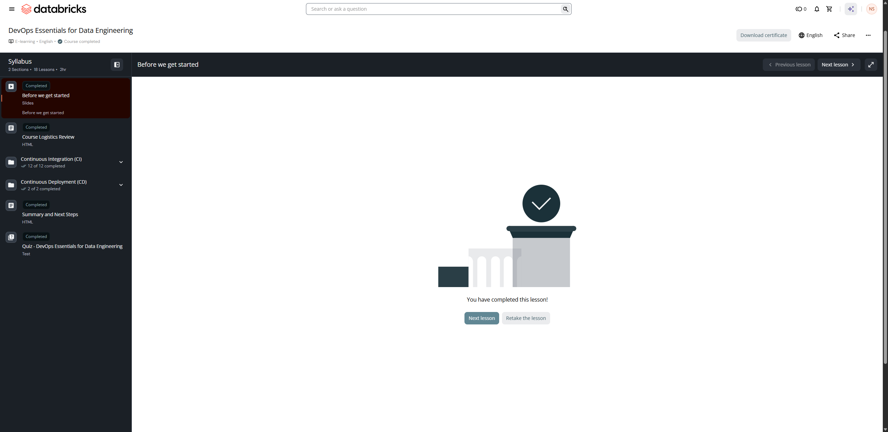

# Before we get started

**Course:** DevOps Essentials for Data Engineering  
**Lesson:** 1 (Slides / Overview)  
**Screenshot:** 

---

## Course Overview & Prerequisites

Welcome to **DevOps Essentials for Data Engineering** from Databricks Academy.

### Course Description

This course explores software engineering best practices and DevOps principles, specifically designed for data engineers working with Databricks. Participants will build a strong foundation in key topics such as code quality, version control, documentation, and testing. The course emphasizes DevOps, covering core components, benefits, and the role of continuous integration and continuous delivery (CI/CD) in optimizing data engineering workflows.

You will learn how to:
- Apply modularity principles in PySpark to create reusable components and structure code efficiently.
- Design and implement unit tests for PySpark functions using the pytest framework and \`pyspark.testing.utils\`.
- Execute end-to-end integration tests using Lakeflow Spark Declarative Pipelines and Lakeflow Jobs.
- Implement Git version control practices with Databricks Git Folders and GitHub Personal Access Tokens (PAT).
- Package, configure, and automate the deployment of data workloads across multi-environment workspaces (dev, staging, prod) using Databricks Asset Bundles (DABs) and the Databricks CLI.

### Learning Objectives

1. Explain the core principles of software engineering best practices, including code quality, version control, documentation, and testing.
2. Explain the principles of DevOps including core components, benefits, and the role of continuous integration and continuous delivery (CI/CD) in DevOps.
3. Apply principles of modularity to organize PySpark code into reusable functions and components.
4. Design and implement effective unit tests and integration tests for your Databricks data pipelines.
5. Apply basic Git operations in Databricks using Git Folders to implement CI practices effectively.
6. Explain the different methods for deploying Databricks assets, including REST API, CLI, SDK, and Declarative Automation Bundles (DABs).
