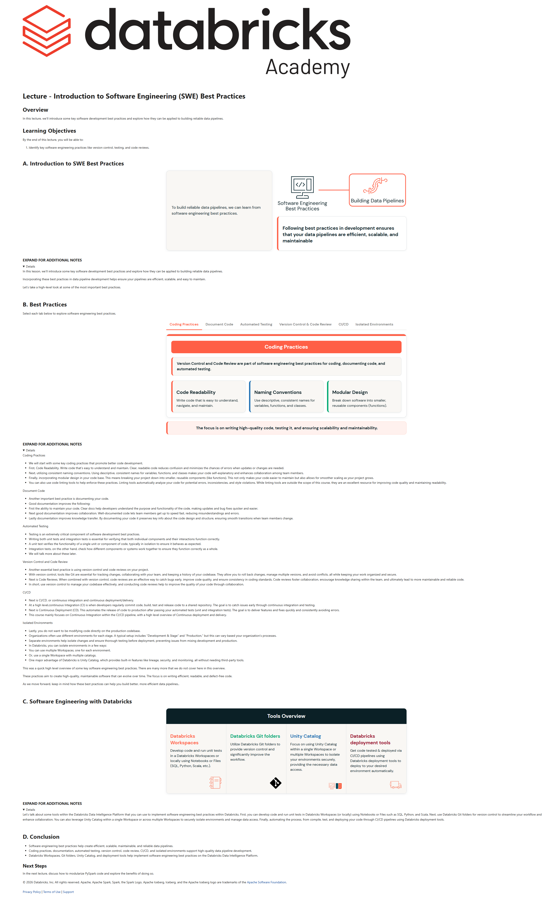

# Lecture: Introduction to Software Engineering (SWE) Best Practices

**Course:** DevOps Essentials for Data Engineering  
**Lesson:** 3 (Lecture / SCORM)  
**Full Screenshot:** 

---

## Verbatim Lesson Content

	

	
Lecture - Introduction to Software Engineering (SWE) Best Practices
Overview

In this lecture, we’ll introduce some key software development best practices and explore how they can be applied to building reliable data pipelines.

Learning Objectives

By the end of this lecture, you will be able to:

Identify key software engineering practices like version control, testing, and code reviews.
	
A. Introduction to SWE Best Practices

To build reliable data pipelines, we can learn from software engineering best practices.

Following best practices in development ensures that your data pipelines are efficient, scalable, and maintainable
	
EXPAND FOR ADDITIONAL NOTES

In this lesson, we’ll introduce some key software development best practices and explore how they can be applied to building reliable data pipelines.

Incorporating these best practices in data pipeline development helps ensure your pipelines are efficient, scalable, and easy to maintain.

Let’s take a high-level look at some of the most important best practices.

	
B. Best Practices

Select each tab below to explore software engineering best practices.

Coding Practices
Document Code
Automated Testing
Version Control & Code Review
CI/CD
Isolated Environments
Coding Practices
Version Control and Code Review are part of software engineering best practices for coding, documenting code, and automated testing.

Code Readability

Write code that is easy to understand, navigate, and maintain.

Naming Conventions

Use descriptive, consistent names for variables, functions, and classes.

Modular Design

Break down software into smaller, reusable components (functions).

The focus is on writing high-quality code, testing it, and ensuring scalability and maintainability.
	
EXPAND FOR ADDITIONAL NOTES

Coding Practices

We will start with some key coding practices that promote better code development.
First, Code Readability. Write code that’s easy to understand and maintain. Clear, readable code reduces confusion and minimizes the chances of errors when updates or changes are needed.
Next, utilizing consistent naming conventions. Using descriptive, consistent names for variables, functions, and classes makes your code self-explanatory and enhances collaboration among team members.
Finally, incorporating modular design in your code base. This means breaking your project down into smaller, reusable components (like functions). This not only makes your code easier to maintain but also allows for smoother scaling as your project grows.
You can also use code linting tools to help enforce these practices. Linting tools automatically analyze your code for potential errors, inconsistencies, and style violations. While linting tools are outside the scope of this course, they are an excellent resource for improving code quality and maintaining readability.

Document Code

Another important best practice is documenting your code.
Good documentation improves the following:
First the ability to maintain your code. Clear docs help developers understand the purpose and functionality of the code, making updates and bug fixes quicker and easier.
Next good documentation improves collaboration. Well-documented code lets team members get up to speed fast, reducing misunderstandings and errors.
Lastly documentation improves knowledge transfer. By documenting your code it preserves key info about the code design and structure, ensuring smooth transitions when team members change.

Automated Testing

Testing is an extremely critical component of software development best practices.
Writing both unit tests and integration tests is essential for verifying that both individual components and their interactions function correctly.
A unit test verifies the functionality of a single unit or component of code, typically in isolation to ensure it behaves as expected.
Integration tests, on the other hand, check how different components or systems work together to ensure they function correctly as a whole.
We will talk more about these later.

Version Control and Code Review

Another essential best practice is using version control and code reviews on your project.
With version control, tools like Git are essential for tracking changes, collaborating with your team, and keeping a history of your codebase. They allow you to roll back changes, manage multiple versions, and avoid conflicts, all while keeping your work organized and secure.
Next is Code Reviews. When combined with version control, code reviews are an effective way to catch bugs early, improve code quality, and ensure consistency in coding standards. Code reviews foster collaboration, encourage knowledge sharing within the team, and ultimately lead to more maintainable and reliable code.
In short, use version control to manage your codebase effectively, and conducting code reviews help to improve the quality of your code through collaboration.

CI/CD

Next is CI/CD, or continuous integration and continuous deployment/delivery.
At a high level,continuous Integration (CI) is when developers regularly commit code, build, test and release code to a shared repository. The goal is to catch issues early through continuous integration and testing.
Next is Continuous Deployment (CD). This automates the release of code to production after passing your automated tests (unit and integration tests). The goal is to deliver features and fixes quickly and consistently avoiding errors.
This course mainly focuses on Continuous Integration within the CI/CD pipeline, with a high level overview of Continuous deployment and delivery.

Isolated Environments

Lastly, you do not want to be modifying code directly on the production codebase.
Organizations often use different environments for each stage. A typical setup includes “Development & Stage” and “Production,” but this can vary based your organization's processes.
Separate environments help isolate changes and ensure thorough testing before deployment, preventing issues from mixing development and production.
In Databricks, you can isolate environments in a few ways:
You can use multiple Workspaces, one for each environment.
Or, use a single Workspace with multiple catalogs.
One major advantage of Databricks is Unity Catalog, which provides built-in features like lineage, security, and monitoring, all without needing third-party tools.

This was a quick high level overview of some key software engineering best practices. There are many more that we do not cover here in this overview.

These practices aim to create high-quality, maintainable software that can evolve over time. The focus is on writing efficient, readable, and defect-free code.

As we move forward, keep in mind how these best practices can help you build better, more efficient data pipelines..

	
C. Software Engineering with Databricks
Tools Overview
Databricks Workspaces

Develop code and run unit tests in a Databricks Workspaces or locally using Notebooks or Files (SQL, Python, Scala, etc.).

Databricks Git folders

Utilize Databricks Git folders to provide version control and significantly improve the workflow.

Unity Catalog

Focus on using Unity Catalog within a single Workspace or multiple Workspaces to isolate your environments securely, providing the necessary data access.

Databricks deployment tools

Get code tested & deployed via CI/CD pipelines using Databricks deployment tools to deploy to your desired environment automatically.

	
EXPAND FOR ADDITIONAL NOTES

Let’s talk about some tools within the Databricks Data Intelligence Platform that you can use to implement software engineering best practices within Databricks. First, you can develop code and run unit tests in Databricks Workspaces (or locally) using Notebooks or Files such as SQL, Python, and Scala. Next, use Databricks Git folders for version control to streamline your workflow and enhance collaboration. You can also leverage Unity Catalog within a single Workspace or across multiple Workspaces to securely isolate environments and manage data access. Finally, automating the process, from compile, test, and deploying your code through CI/CD pipelines using Databricks deployment tools.

	
D. Conclusion
Software engineering best practices help create efficient, scalable, maintainable, and reliable data pipelines.
Coding practices, documentation, automated testing, version control, code review, CI/CD, and isolated environments support high-quality data pipeline development.
Databricks Workspaces, Git folders, Unity Catalog, and deployment tools help implement software engineering best practices on the Databricks Data Intelligence Platform.
Next Steps

In the next lecture, discuss how to modularize PySpark code and explore the benefits of doing so.

	

© 2026 Databricks, Inc. All rights reserved. Apache, Apache Spark, Spark, the Spark Logo, Apache Iceberg, Iceberg, and the Apache Iceberg logo are trademarks of the Apache Software Foundation.

Privacy Policy | Terms of Use | Support

