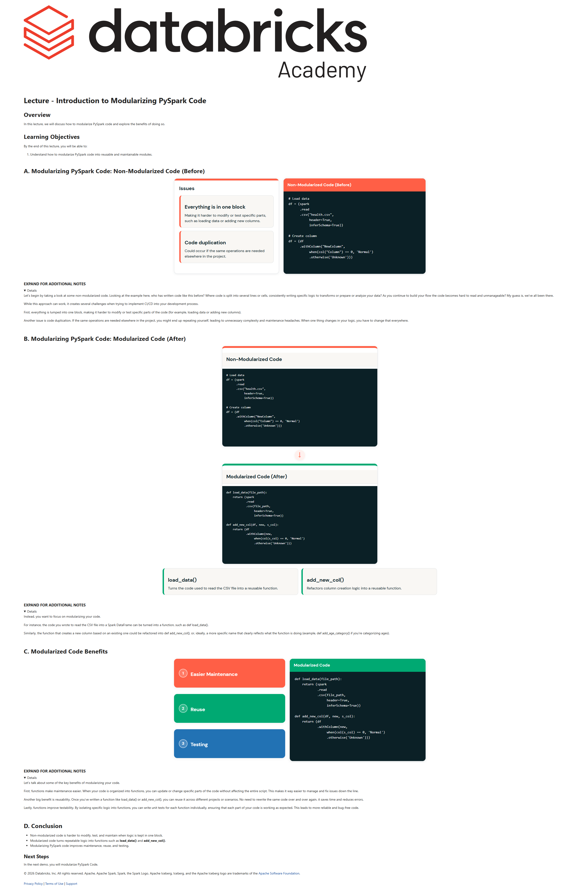

# Lecture: Introduction to Modularizing PySpark Code

**Course:** DevOps Essentials for Data Engineering  
**Lesson:** 4 (Lecture / SCORM)  
**Full Screenshot:** 

---

## Verbatim Lesson Content

	

	
Lecture - Introduction to Modularizing PySpark Code
Overview

In this lecture, we will discuss how to modularize PySpark code and explore the benefits of doing so.

Learning Objectives

By the end of this lecture, you will be able to:

Understand how to modularize PySpark code into reusable and maintainable modules.
	
A. Modularizing PySpark Code: Non-Modularized Code (Before)
Issues
Everything is in one block

Making it harder to modify or test specific parts, such as loading data or adding new columns.

Code duplication

Could occur if the same operations are needed elsewhere in the project.

Non-Modularized Code (Before)
# Load data
df = (spark
      .read
      .csv("health.csv",
           header=True,
           inferSchema=True))

# Create column
df = (df
      .withColumn("NewColumn",
           when(col("Column") == 0, 'Normal')
           .otherwise('Unknown')))
	
EXPAND FOR ADDITIONAL NOTES

Let's begin by taking a look at some non-modularized code. Looking at the example here, who has written code like this before? Where code is split into several lines or cells, consistently writing specific logic to transforms or prepare or analyze your data? As you continue to build your flow the code becomes hard to read and unmanageable? My guess is, we've all been there.

While this approach can work, it creates several challenges when trying to implement CI/CD into your development process.

First, everything is lumped into one block, making it harder to modify or test specific parts of the code (for example, loading data or adding new columns).

Another issue is code duplication. If the same operations are needed elsewhere in the project, you might end up repeating yourself, leading to unnecessary complexity and maintenance headaches. When one thing changes in your logic, you have to change that everywhere.

	
B. Modularizing PySpark Code: Modularized Code (After)
Non-Modularized Code
# Load data
df = (spark
      .read
      .csv("health.csv",
           header=True,
           inferSchema=True))

# Create column
df = (df
      .withColumn("NewColumn",
           when(col("Column") == 0, 'Normal')
           .otherwise('Unknown')))
↓
Modularized Code (After)
def load_data(file_path):
    return (spark
            .read
            .csv(file_path,
                 header=True,
                 inferSchema=True))

def add_new_col(df, new, s_col):
    return (df
            .withColumn(new,
                 when(col(s_col) == 0, 'Normal')
                 .otherwise('Unknown')))
load_data()

Turns the code used to read the CSV file into a reusable function.

add_new_col()

Refactors column creation logic into a reusable function.

	
EXPAND FOR ADDITIONAL NOTES

Instead, you want to focus on modularizing your code.

For instance, the code you wrote to read the CSV file into a Spark DataFrame can be turned into a function, such as def load_data().

Similarly, the function that creates a new column based on an existing one could be refactored into def add_new_col(), or, ideally, a more specific name that clearly reflects what the function is doing (example, def add_age_category() if you're categorizing ages).

	
C. Modularized Code Benefits
1
Easier Maintenance

Update only specific functions without changing the entire script.

2
Reuse

Reuse functions in different projects.

3
Testing

Test individual functions through unit tests to ensure code reliability.

Modularized Code
def load_data(file_path):
    return (spark
            .read
            .csv(file_path,
                 header=True,
                 inferSchema=True))

def add_new_col(df, new, s_col):
    return (df
            .withColumn(new,
                 when(col(s_col) == 0, 'Normal')
                 .otherwise('Unknown')))
	
EXPAND FOR ADDITIONAL NOTES

Let’s talk about some of the key benefits of modularizing your code.

First, functions make maintenance easier. When your code is organized into functions, you can update or change specific parts of the code without affecting the entire script. This makes it way easier to manage and fix issues down the line.

Another big benefit is reusability. Once you’ve written a function like load_data() or add_new_col(), you can reuse it across different projects or scenarios. No need to rewrite the same code over and over again. it saves time and reduces errors.

Lastly, functions improve testability. By isolating specific logic into functions, you can write unit tests for each function individually, ensuring that each part of your code is working as expected. This leads to more reliable and bug-free code.

	
D. Conclusion
Non-modularized code is harder to modify, test, and maintain when logic is kept in one block.
Modularized code turns repeatable logic into functions such as load_data() and add_new_col().
Modularizing PySpark code improves maintenance, reuse, and testing.
Next Steps

In the next demo, you will modularize PySpark Code.

	

© 2026 Databricks, Inc. All rights reserved. Apache, Apache Spark, Spark, the Spark Logo, Apache Iceberg, Iceberg, and the Apache Iceberg logo are trademarks of the Apache Software Foundation.

Privacy Policy | Terms of Use | Support

