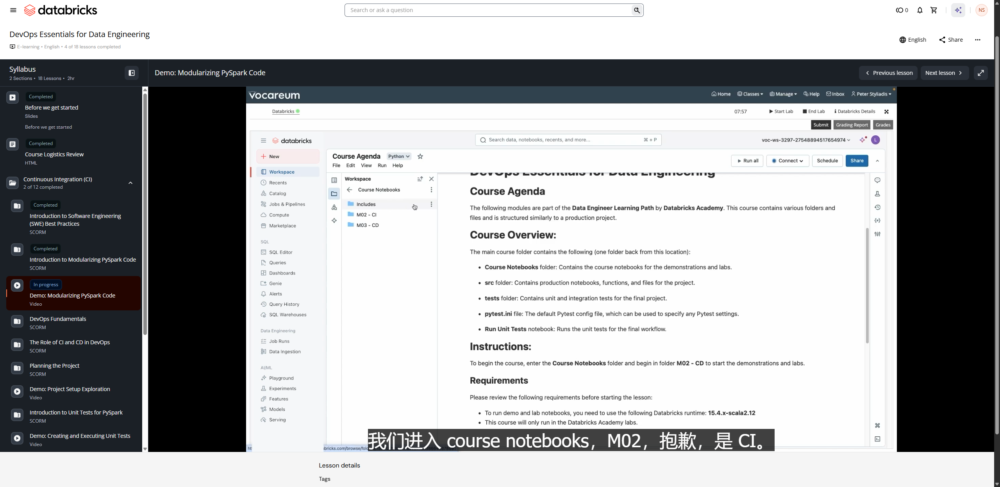

# Demo: Modularizing PySpark Code

**Course:** DevOps Essentials for Data Engineering  
**Lesson:** 5 (Demo)  
**Duration:** ~11 min (673s)  
**Screenshot:** 

---

## Overview & Learning Objectives

In this hands-on demonstration, the instructor walks through taking a monolithic PySpark notebook script and refactoring it into modular, reusable, testable Python functions and modules.

Key concepts demonstrated:
- Identifying code smells and monolithic patterns in exploratory PySpark notebooks.
- Extracting inline transformation logic into standalone pure functions (e.g. data cleaning, column transformation, filtering).
- Structuring Python files within Databricks Git folders (Repos) into packages/modules.
- Importing custom Python modules into notebooks using `from my_module import my_func`.
- Ensuring functions accept and return PySpark DataFrames cleanly to facilitate unit testing.

---

## Verbatim Video Transcript & Walkthrough

- **[00:00 - 00:02]** 欢迎来到 DevOps Essentials for Data Engineering 实验课。
- **[00:03 - 00:05]** 它应该会让你从课程大纲页面开始。
- **[00:06 - 00:09]** 在这里，我们会看到几个文件夹。
- **[00:09 - 00:12]** 我们有 course notebooks、source 和 test，我们会
- **[00:12 - 00:15]** 在本课程的演示和实验中逐一深入了解它们。
- **[00:16 - 00:18]** 但首先，你需要进入 course notebooks，
- **[00:18 - 00:21]** 对于第一个演示，进入 M02-CD。
- **[00:21 - 00:26]** 我们进入 course notebooks，M02，抱歉，是 CI。
- **[00:27 - 00:31]** 我们要完成的第一个演示是模块化 PySpark 代码。
- **[00:31 - 00:36]** 这个演示是必做的，因为它会设置你的
- **[00:36 - 00:39]** 环境；如果你跳过这个演示，后面大部分内容都无法运行。
- **[00:40 - 00:45]** 那么我们选择 2.1，为了腾出一些额外的界面空间，
- **[00:45 - 00:48]** 我会关闭其中一些面板。
- **[00:48 - 00:51]** 再说一次，这是模块化 PySpark 代码。
- **[00:51 - 00:54]** 同样，这里有一些说明，你确实需要执行
- **[00:54 - 00:58]** 这个实验，以便设置好你的整个环境，这一点
- **[00:58 - 00:59]** 我们稍后会讲到。
- **[01:00 - 01:02]** 现在，我们将使用 Classic Compute Server。
- **[01:02 - 01:05]** 那个应该也能用，但我们这里就用 classic。
- **[01:05 - 01:11]** 我到上面这里，如果你进入 more（更多），然后我们选择——这
- **[01:11 - 01:14]** 如果是你第一次打开这个实验，大约需要几分钟。
- **[01:14 - 01:18]** 它确实会在大约一个半到两个小时后超时。
- **[01:18 - 01:21]** 但如果这只是一个 classic compute 集群，你的
- **[01:21 - 01:22]** 名称会稍有不同。
- **[01:22 - 01:25]** 我选择我的，然后点击 Attached（已附加）。
- **[01:26 - 01:30]** 然后在剪辑时，我们在等它启动，所以你可以直接跳过
- **[01:30 - 01:33]** 这一部分，直到集群启动。
- **[01:33 - 01:34]** 我们把这段剪掉。
- **[01:34 - 01:36]** 我就在同一个画面这里等着。
- **[01:38 - 01:41]** 好，我们可以看到我的集群已经启动，所以可以继续了。
- **[01:43 - 01:44]** 然后同样，这里只是一些说明。
- **[01:44 - 01:45]** 你确实需要执行这个单元格。
- **[01:45 - 01:46]** 我来执行它。
- **[01:46 - 01:47]** 它大约需要两分钟来运行。
- **[01:48 - 01:52]** 那么我来执行这个单元格，完成后我们再讲它的作用。
- **[01:52 - 01:57]** 但最终，它会为我们创建几个目录：一个 dev
- **[01:57 - 02:03]** 目录、一个 stage 目录和一个 prod 目录，并会在
- **[02:03 - 02:08]** 每个目录中创建一个 volume，然后还有一些供我们使用的文件，一些 CSV 文件。
- **[02:08 - 02:09]** 所以同样，给它大约一到两分钟。
- **[02:09 - 02:12]** 在这个实验中运行过一次后，你应该就不必再运行了。
- **[02:13 - 02:16]** 在它运行期间——如果你结束了实验，这会把所有内容清空。
- **[02:16 - 02:20]** 所以如果你，比如说，明天再回来，你就必须重新运行它
- **[02:20 - 02:23]** 来设置你的环境，因为当你结束实验时，它确实会被清空。
- **[02:24 - 02:25]** 请注意这一点。
- **[02:25 - 02:28]** 同样，它大约需要一到两分钟，所以我们就在这里等，
- **[02:28 - 02:30]** 然后它就会神奇地完成。
- **[02:31 - 02:32]** 好的。
- **[02:32 - 02:33]** 它神奇地完成了。
- **[02:33 - 02:34]** 同样，大约两分钟。
- **[02:34 - 02:36]** 如果你在说明里向下滚动——你其实不必阅读这些说明。
- **[02:36 - 02:38]** 我们只想看到 core setup complete（核心设置完成）。
- **[02:38 - 02:41]** 然后在下面这里，我们看到 main catalog reference（主目录引用）。
- **[02:41 - 02:45]** 如果我们使用变量 da.catalog_name，它应该指向这个，
- **[02:45 - 02:46]** 它应该与我们的 compute 名称相匹配。
- **[02:47 - 02:52]** 那么我运行这里的这个单元格，我们可以看到它们应该都能对上。
- **[02:53 - 02:56]** 我快速到左侧看一下我的目录。
- **[02:57 - 03:00]** 它所做的就是为我们创建了多个目录，供
- **[03:00 - 03:01]** 我们在整个课程中使用。
- **[03:01 - 03:04]** 请留意，我们稍后会看一下它们。
- **[03:05 - 03:09]** 现在，我们要看的是这个主目录 da.catalog_name。
- **[03:09 - 03:10]** 它会指向我的目录。
- **[03:10 - 03:12]** 你们每个人的实验用户名都会不一样。
- **[03:13 - 03:19]** 接下来，我们将仅用一些传统的 Spark 代码来构建一个管道。
- **[03:19 - 03:23]** 我们会摄取一些 CSV 文件，创建一个 Bronze 表、一个
- **[03:23 - 03:24]** Silver 表和一个 Gold 表。
- **[03:24 - 03:27]** 通常，当你开始一个项目时，你会在一个临时的
- **[03:27 - 03:31]** 文件夹或临时笔记本中工作，只是为了探索你的数据，大致了解
- **[03:31 - 03:32]** 你需要做什么，等等。
- **[03:32 - 03:36]** 所以这是一个简单的例子，我们的主要重点其实是
- **[03:36 - 03:39]** 这里模块化代码的过程，而不是代码本身。
- **[03:40 - 03:45]** 那么我们先来预览一下来自我们目录下 health volume 的
- **[03:45 - 03:47]** dev_health CSV 文件。
- **[03:47 - 03:53]** 如果我展开我的主目录——不是这些稍后才用的——然后
- **[03:53 - 03:59]** 展开 Default，再展开 Health，我就会看到这个 dev_health CSV 文件。
- **[03:59 - 04:04]** 这算是我的开发用 CSV 文件，我们可以用它来试验和测试。
- **[04:05 - 04:09]** 那么我运行这里的这段代码，用一个简单的查询来
- **[04:09 - 04:11]** 预览那份数据，也就是那个 CSV 文件。
- **[04:15 - 04:18]** 在这里我们再次看到，这是一个简单的 CSV 文件，有几列，
- **[04:18 - 04:20]** 我记得有 7,500 行。
- **[04:20 - 04:23]** 由于我们是以文本方式读入的，所以其中一行是这里的标题行。
- **[04:23 - 04:26]** 同样，我们并不太关心数据或流程，真正关心的
- **[04:26 - 04:28]** 只是代码的模块化，对吧？
- **[04:28 - 04:31]** 我们假设你在学习本课程前已具备一些 PySpark 和 SQL 知识。
- **[04:32 - 04:36]** 那么下一步是我们要摄取 CSV 文件，创建一个 Bronze 表，
- **[04:36 - 04:41]** 然后使用一个 schema 创建 Bronze 表，接着取用这个 Bronze 表
- **[04:41 - 04:46]** 创建一个带有这两个新列的 Silver 表，即 HighCholest 和 age。
- **[04:46 - 04:49]** 我们会取用这些列，把它们变成分组或分类变量。
- **[04:49 - 04:51]** 我们会从 Bronze 表中删除元数据列。
- **[04:51 - 04:54]** 我们会把这个 DataFrame 保存为目录中的一个表。
- **[04:54 - 04:56]** 然后我们会创建这个 Gold 表，稍后
- **[04:56 - 04:58]** 用于可视化。
- **[04:58 - 05:02]** 但同样，这只是一种开发、探索、测试
- **[05:02 - 05:03]** 我们的数据、测试我们的管道的过程。
- **[05:04 - 05:07]** 最终，在本课程的结尾，我们会把这些代码迁移
- **[05:07 - 05:10]** 到一个 DLT 管道，所以请跟着做，我们会讲到那一步。
- **[05:10 - 05:12]** 但目前，我们只是处于开发模式。
- **[05:13 - 05:16]** 很快地说，我不会深入讲解这段 PySpark 代码或 SQL 代码。
- **[05:16 - 05:19]** 本课程假设你已具备 PySpark 和 SQL 基础。
- **[05:20 - 05:25]** 简单来说，我先从导入所需的依赖包开始，把 CSV 转换到 Bronze。
- **[05:25 - 05:29]** 那么这里，就是我的 schema、我的路径、volumes、da 目录，对吧？
- **[05:29 - 05:31]** 我的目录在这里。
- **[05:32 - 05:33]** 获取那份数据。
- **[05:34 - 05:37]** 在这里，我会把它读入为 health_raw，也就是我的 health_bronze。
- **[05:38 - 05:42]** 这里是 schema，在加载数据、我的元数据列。
- **[05:42 - 05:47]** 然后我会把它写入一个名为 health_dev 或 health_bronze_dev 的表。
- **[05:49 - 05:51]** 我会引用那个 Delta Table。
- **[05:51 - 05:53]** 然后我会创建一个 Silver 表。
- **[05:53 - 05:55]** 我们会创建一个高胆固醇分组列。
- **[05:55 - 05:58]** 你知道，0 表示正常，1 表示高于平均，2 表示偏高。
- **[05:58 - 06:00]** 对年龄分组也做同样的处理。
- **[06:00 - 06:02]** 我们会为 Silver 表删除元数据列。
- **[06:02 - 06:05]** 同样，我们完全不会太深入地讲解 PySpark 代码。
- **[06:05 - 06:07]** 同样，这里是一个非常非常简单的例子。
- **[06:08 - 06:11]** 然后我们会取用那个 health_silver DataFrame，实际上我们正在重写
- **[06:11 - 06:15]** 我们上面写过的这段代码——把一个 DataFrame 保存为 Delta Table，只是我们
- **[06:15 - 06:16]** 这样做了，并把它命名为 health_silver。
- **[06:17 - 06:24]** 然后我们在 spark.sql 中有一个 SQL 查询，用来创建汇总。
- **[06:25 - 06:29]** 然后我们就在这里查看结果。
- **[06:29 - 06:32]** 那么同样，我趁它运行的时候先开始讲。
- **[06:32 - 06:34]** 我们刚刚写了这么多代码。
- **[06:34 - 06:37]** 我想让大家看看这个——谁以前也是这样做的？
- **[06:37 - 06:38]** 我举手了。
- **[06:38 - 06:39]** 我以前也这样做过。
- **[06:39 - 06:40]** 这没什么大不了的。
- **[06:40 - 06:43]** 我们一路写下来，把所有代码都写好。
- **[06:43 - 06:45]** 但同样，这是一个非常简单的例子。
- **[06:45 - 06:49]** 你可以开始设想，如果这个项目更复杂，这些
- **[06:49 - 06:50]** 代码会变得更复杂。
- **[06:51 - 06:54]** 然后要维护这些代码，你就得钻进这些零散的部分
- **[06:54 - 06:56]** 才能弄清楚各项操作是在哪里完成的。
- **[06:57 - 07:00]** 所以同样，这就是我们未模块化的代码。
- **[07:00 - 07:02]** 我们并不太关注代码本身，真正关注的是
- **[07:02 - 07:03]** 我们即将要做的这个过程。
- **[07:06 - 07:06]** 这差不多完成了。
- **[07:06 - 07:09]** 那么在等待的同时，我们要做的是把上面的
- **[07:09 - 07:11]** PySpark 代码模块化。
- **[07:12 - 07:16]** 而模块化我们的代码会真正提升可维护性、
- **[07:16 - 07:19]** 可重用性以及我们的协作方式，方法就是把
- **[07:19 - 07:22]** 我们看到的代码拆分成更小、真正更小的函数，
- **[07:22 - 07:24]** 形成更易于维护的部分。
- **[07:24 - 07:27]** 那么我们开始吧，我们在这里要做的——同样，有
- **[07:27 - 07:29]** 多种技术可供我们使用。
- **[07:29 - 07:31]** 这是一个非常非常简单的例子。
- **[07:32 - 07:35]** 这里我们会用 get_health_schema 来获取 schema，用 read_health_data
- **[07:35 - 07:37]** 来读取那些 CSV 文件。
- **[07:37 - 07:41]** 这是我的两个列映射函数，或者说列转换。
- **[07:41 - 07:44]** save_df_to_delta，我们上面实际上写了两次。
- **[07:44 - 07:47]** 我们会为它创建一个函数，然后是 get_cholesterol_age_agg，
- **[07:47 - 07:48]** 用来创建我们的 Gold 表。
- **[07:49 - 07:51]** 那么同样，我们到下面这里，但这次我们会创建一个名为
- **[07:51 - 07:53]** def get_health_schema 的函数。
- **[07:53 - 07:55]** 我们只需返回这个 schema。
- **[07:55 - 08:00]** read_health_data 只是返回从摄取 CSV
- **[08:00 - 08:01]** 得到的 DataFrame。
- **[08:01 - 08:03]** 这里我们在重新加载 schema。
- **[08:03 - 08:04]** 我们实际上会加载这个 schema。
- **[08:04 - 08:06]** 这是旧代码。
- **[08:06 - 08:09]** 我们实际上想做的是粘贴这段代码。
- **[08:10 - 08:11]** 哦，不用，我们没问题。
- **[08:11 - 08:12]** 代码就在这里。
- **[08:13 - 08:15]** 我们有了 schema，所以我们会在函数中使用它。
- **[08:16 - 08:19]** high_cholesterol_map，给它一个列，它就会对其进行转换。
- **[08:19 - 08:21]** group_ages_map 也是一样。
- **[08:21 - 08:25]** 这是我们的 save_df_to_delta，然后是我的 get_cholesterol_age_agg。
- **[08:26 - 08:30]** 这样我们就把那个较大的单元格拆分成了多个函数，
- **[08:30 - 08:33]** 我们可以复用并灵活放置它们，整个课程中我们都会这样做。
- **[08:35 - 08:38]** 那么同样，现在我可以再构建一个函数，把这些全部组合到一起。
- **[08:38 - 08:40]** 只是为了简单起见，我不会这么做。
- **[08:41 - 08:44]** 但在本例中，我们实现的是与一开始相同的效果，只是
- **[08:44 - 08:49]** 这次我们用 read_health_data 来读取 CSV 文件，把它放到这里。
- **[08:50 - 08:52]** save_df_to_delta，我们会取用
- **[08:54 - 08:56]** health_csv_bronze_read，把它保存到 bronze_dev。
- **[08:57 - 09:01]** Silver 会取用 Bronze，同样地，走一遍流程，做我们的映射。
- **[09:03 - 09:05]** 在下面这里，我们会把它保存到 Delta。
- **[09:05 - 09:06]** get_cholesterol_age_agg。
- **[09:07 - 09:09]** 在下面这里，你会得到我们的汇总。
- **[09:10 - 09:12]** 然后我们就运行所有这些。
- **[09:12 - 09:17]** 实际上，我们得先运行第一个，然后再运行这个。
- **[09:18 - 09:23]** 这同样是在完成与上面相同的事情，
- **[09:23 - 09:24]** 只不过现在是以模块化函数的形式。
- **[09:25 - 09:28]** 那么等它完成后，我们稍等一下，然后我们就
- **[09:28 - 09:31]** 查看我们用这里这些函数创建的每一个表，它们
- **[09:31 - 09:33]** 和我们一开始创建的是一样的。
- **[09:33 - 09:37]** 那么我们先运行这个，它只查看 health_bronze_dev
- **[09:38 - 09:40]** 数据，也就是最初读入的数据。
- **[09:40 - 09:42]** 同样，这只是简单的数据。
- **[09:42 - 09:43]** 我们在这里并不太关注数据本身。
- **[09:44 - 09:47]** 但如果我们向右滚动，就能看到我们的元数据列。
- **[09:48 - 09:49]** 7,500 行正是我们所期望的。
- **[09:50 - 09:52]** 我们会读取 health_silver 数据。
- **[09:52 - 09:54]** 同样，我们并没有在这里清洗所有内容。
- **[09:54 - 09:55]** 这不是本课程的重点。
- **[09:55 - 09:57]** 我们只专注于这些流程。
- **[09:57 - 10:01]** 那么这里我们为 Silver 表移除了元数据列，并且
- **[10:01 - 10:03]** 创建了这两个新列，对吧？
- **[10:03 - 10:05]** 我们仍然有一些空值之类的、大概应该修复的问题，
- **[10:05 - 10:07]** 但在本例中，我们只关注这两个新列。
- **[10:08 - 10:13]** 然后我们会处理 chol_age_agg_dev 表，它会
- **[10:13 - 10:16]** 按我们上面看到的高胆固醇分组和年龄分组对数据进行聚合。
- **[10:18 - 10:20]** 同样，这是对我们 dev 数据的一些聚合。
- **[10:20 - 10:25]** 如果我进入我的目录——同样，不是 dev、stage 或 prod 那几个。
- **[10:25 - 10:27]** 这只是一个快速的介绍。
- **[10:27 - 10:30]** 如果你进入这里，我们应该有刚刚预览过的三个表。
- **[10:31 - 10:33]** 然后我要做的就是把它清理一下。
- **[10:33 - 10:34]** 同样，我们只是在做测试。
- **[10:34 - 10:36]** 我其实不再需要那些表了，所以我就运行
- **[10:36 - 10:38]** 这个函数把它们删除。
- **[10:39 - 10:40]** 刷新页面。
- **[10:41 - 10:41]** 好了。
- **[10:42 - 10:43]** 这就是我们的第一个演示。
- **[10:43 - 10:47]** 同样，这是一个非常非常非常简单的、关于模块化 PySpark 代码的介绍。
- **[10:47 - 10:50]** 但同样，当你开始开发自己的项目时，请认真思考这一点。
- **[10:50 - 10:54]** 与其编写这些又大又长的脚本，你如何能够静下心来，制定一个
- **[10:54 - 10:56]** 计划，并把你的代码模块化呢？
- **[10:56 - 11:00]** 你会明白为什么这一点非常重要，我们会把它引入到
- **[11:00 - 11:05]** 我们的 CI/CD 管道，或者单元测试、集成测试等后续内容中。
- **[11:05 - 11:06]** 感谢观看。
- **[11:07 - 11:07]** 我们下个演示再见。

---

## Key Takeaways

1. **Modularity Benefits:**
   - Separates business logic from notebook execution state.
   - Enables unit testing outside of interactive notebook clusters.
   - Eliminates copy-paste code across multiple data pipelines.

2. **Databricks Git Folders Integration:**
   - Files in Databricks Git folders automatically participate in Python's `sys.path`, allowing seamless importing across files in the repository without manual `sys.path.append` tricks.
