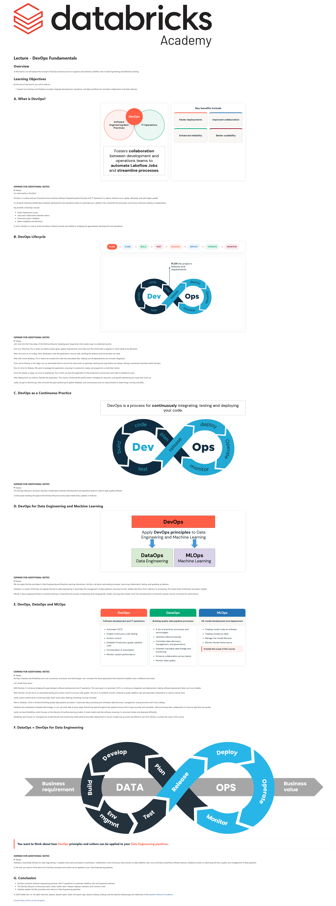

# Lecture: DevOps Fundamentals

**Course:** DevOps Essentials for Data Engineering  
**Lesson:** 6 (Lecture / SCORM)  
**Full Screenshot:** 

---

## Verbatim Lesson Content

	

	
Lecture - DevOps Fundamentals
Overview

In this lecture, we will explore the concept of DevOps and discuss how it supports and enhances Lakeflow Jobs in Data Engineering and Machine Learning.

Learning Objectives

By the end of this lecture, you will be able to:

Explain how DevOps and DataOps principles integrate development, operations, and data workflows for smoother collaboration and faster delivery.
	
A. What is DevOps?
Software Engineering Best Practices
IT Operations
DevOps
Fosters collaboration between development and operations teams to automate Lakeflow Jobs and streamline processes.
Key benefits include
Faster deployments
Improved collaboration
Enhanced reliability
Better scalability
	
EXPAND FOR ADDITIONAL NOTES

So, what exactly is DevOps?

DevOps is a culture and set of practices that combines Software Engineering Best Practices with IT Operations to deliver software more rapidly, efficiently, and with higher quality.

It’s all about fostering collaboration between development and operations teams to automate your Lakeflow Jobs, streamline the processes, and ensure continuous delivery of applications.

Key benefits of DevOps include:

Faster deployment cycles
Improved collaboration between teams
Enhanced system reliability
Better scalability and efficiency

In short, DevOps is a way to build and deliver software quickly and reliably by bridging the gap between development and operations.

	
B. DevOps Lifecycle
PLAN
→
CODE
→
BUILD
→
TEST
→
RELEASE
→
DEPLOY
→
OPERATE
→
MONITOR
	
EXPAND FOR ADDITIONAL NOTES

Let’s dive into the 8 key steps of the DevOps lifecycle, breaking each stage down into simple, easy-to-understand points.

First up is Planning. This is where we define project goals, gather requirements, and make sure the whole team is aligned on what needs to be delivered.

Next, we move on to Coding. Here, developers write the application’s source code, building the features and functionality we need.

After that comes Building. This is where we compile the code into executable files, making sure all dependencies are correctly integrated.

Then, we hit Testing. In this stage, we run automated tests to ensure the code works as expected, catching any bugs before we release. Testing is extremely important within DevOps.

Now it’s time for Release. We want to package the application, ensuring it’s production-ready, and prepare for a controlled rollout.

Once the release is ready, we move to Deploying. This is when we push the application to the production environment and make it available to users.

After deployment, we need to Operate the application. This means monitoring the performance, managing its resources, and quickly addressing any issues that come up.

Lastly, we get to Monitoring. Here, we track the app’s performance, gather feedback, and continuously work on improvements to keep things running smoothly.

	
C. DevOps as a Continuous Practice
	
DevOps is a process for continuously integrating, testing and deploying your code.
	
EXPAND FOR ADDITIONAL NOTES

The DevOps lifecycle is all about seamless collaboration between development and operations teams to deliver high-quality software.

Continuously iterating throughout the DevOps lifecycle as the project needs fixes, updates or features.

	
D. DevOps for Data Engineering and Machine Learning
	
EXPAND FOR ADDITIONAL NOTES

We can apply DevOps principles to Data Engineering and Machine Learning. Remember, DevOps is all about automating processes, improving collaboration, testing, and speeding up delivery.

DataOps is a subset of DevOps and applies DevOps to data engineering. It automates the management of data pipelines, ensuring smooth, reliable data flows from collection to processing. This means fewer bottlenecks and faster insights.

MLOps is about applying DevOps to machine learning. It streamlines the process of deploying and managing ML models, ensuring that models move from development to production quickly and are monitored for performance.

	
E. DevOps, DataOps and MLOps
DevOps
Software development and IT operations
Automate CI/CD
Enable continuous code testing
Version control
Establish Production-grade Lakeflow Jobs
Orchestration & Automation
Monitor system performance
DataOps
Building quality data pipeline processes
A set of practices, processes, and technologies
Optimize data processing
Centralize data discovery, management, and governance
Establish traceable data lineage and monitoring
Enhance collaboration across teams
Monitor data quality
MLOps
ML model development and deployment
Treating model code as software
Treating models as data
Manage the model lifecycle
Monitor Model Performance
Outside the scope of this course.
	
EXPAND FOR ADDITIONAL NOTES

DevOps, DataOps and ModelOps are a set of practices, processes, and technologies. Let's compare the three approaches that streamline Lakeflow Jobs in different tech areas.

Let’s break them down.

With DevOps, it's all about bridging the gap between software development and IT operations. The main goal is to automate CI/CD, or continuous integration and deployment, making software deployment faster and more reliable.

With DevOps, we also focus on automated testing and version control to ensure code quality. The aim is to establish smooth, production-grade Lakeflow Jobs and automate orchestration to reduce manual work.

Lastly, system performance monitoring helps catch issues early, keeping everything running smoothly.

Next is DataOps, which is all about Building quality data pipeline processes. It optimizes data processing and centralizes data discovery, management, and governance with Unity Catalog.

DataOps also emphasizes traceable data lineage, so you can track data at every stage. Monitoring data throughout the pipeline ensures that it stays accurate and accessible, while promoting team collaboration to improve data flow and quality.

Lastly, we have ModelOps, which focuses on the lifecycle of machine learning models. It treats model code like software, ensuring it’s versioned, tested, and deployed efficiently.

ModelOps also focuses on managing the model lifecycle and monitoring model performance after deployment to ensure models stay accurate and effective over time. MLOps is outside the scope of this course.

	
F. DataOps = DevOps for Data Engineering
You want to think about how DevOps principles and culture can be applied to your Data Engineering pipelines.
	
EXPAND FOR ADDITIONAL NOTES

DataOps is essentially DevOps for data engineering—it applies those same principles of automation, collaboration, and continuous improvement to data Lakeflow Jobs. Just as DevOps streamlines software delivery, DataOps focuses on optimizing the flow, quality, and management of data pipelines.

In the end, you want to think about how DevOps principles and culture can be applied to your Data Engineering pipelines.

	
G. Conclusion
DevOps combines software engineering practices with IT operations to automate Lakeflow Jobs and streamline delivery.
The DevOps lifecycle continuously plans, codes, builds, tests, releases, deploys, operates, and monitors code.
DataOps applies DevOps principles and culture to Data Engineering pipelines.
	

© 2026 Databricks, Inc. All rights reserved. Apache, Apache Spark, Spark, the Spark Logo, Apache Iceberg, Iceberg, and the Apache Iceberg logo are trademarks of the Apache Software Foundation.

Privacy Policy | Terms of Use | Support

