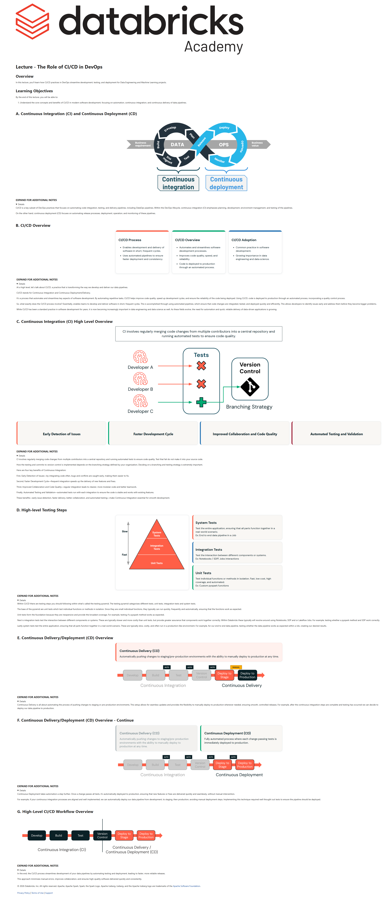

# Lecture: The Role of CI/CD in DevOps

**Course:** DevOps Essentials for Data Engineering  
**Lesson:** 7 (Lecture / SCORM)  
**Full Screenshot:** 

---

## Verbatim Lesson Content

	

	
Lecture - The Role of CI/CD in DevOps
Overview

In this lecture, you’ll learn how CI/CD practices in DevOps streamline development, testing, and deployment for Data Engineering and Machine Learning projects.

Learning Objectives

By the end of this lecture, you will be able to:

Understand the core concepts and benefits of CI/CD in modern software development, focusing on automation, continuous integration, and continuous delivery of data pipelines.
	
A. Continuous Integration (CI) and Continuous Deployment (CD)
	
EXPAND FOR ADDITIONAL NOTES

CI/CD is a key subset of DevOps practices that focuses on automating code integration, testing, and delivery pipelines, including DataOps pipelines. Within the DevOps lifecycle, continuous integration (CI) emphasizes planning, development, environment management, and testing of the pipelines.

On the other hand, continuous deployment (CD) focuses on automating release processes, deployment, operation, and monitoring of these pipelines.

	
B. CI/CD Overview
CI/CD Process
Enables development and delivery of software in short, frequent cycles.
Uses automated pipelines to ensure faster deployment and consistency.
CI/CD Overview
Automates and streamlines software development processes.
Improves code quality, speed, and reliability.
Code is deployed to production through an automated process.
CI/CD Adoption
Common practice in software development.
Growing importance in data engineering and data science.
	
EXPAND FOR ADDITIONAL NOTES

At a high level, let's talk about CI/CD, a practice that is transforming the way we develop and deliver our data pipelines.

CI/CD stands for Continuous Integration and Continuous Deployment/Delivery.

It’s a process that automates and streamlines key aspects of software development. By automating repetitive tasks, CI/CD helps improve code quality, speed up development cycles, and ensure the reliability of the code being deployed. Using CI/CD, code is deployed to production through an automated process, incorporating a quality control process.

So, what exactly does the CI/CD process involve? Essentially, enables teams to develop and deliver software in short, frequent cycles. This is accomplished through using automated pipelines, which ensure that code changes are integrated, tested, and deployed quickly and efficiently. This allows developers to identify issues early and address them before they become bigger problems.

While CI/CD has been a standard practice in software development for years, it is now becoming increasingly important in data engineering and data science as well. As these fields evolve, the need for automation and quick, reliable delivery of data-driven applications is growing.

	
C. Continuous Integration (CI) High Level Overview
CI involves regularly merging code changes from multiple contributors into a central repository and running automated tests to ensure code quality.
Early Detection of Issues
Faster Development Cycle
Improved Collaboration and Code Quality
Automated Testing and Validation
	
EXPAND FOR ADDITIONAL NOTES

CI involves regularly merging code changes from multiple contributors into a central repository and running automated tests to ensure code quality. Test that fail do not make it into your source code.

How the testing and commits to version control is implemented depends on the branching strategy defined by your organization. Deciding on a branching and testing strategy is extremely important.

Here are four key benefits of Continuous Integration:

First, Early Detection of Issues—by integrating code often, bugs and conflicts are caught early, making them easier to fix.

Second, Faster Development Cycle—frequent integration speeds up the delivery of new features and fixes.

Third, Improved Collaboration and Code Quality—regular integration leads to cleaner, more modular code and better teamwork.

Finally, Automated Testing and Validation—automated tests run with each integration to ensure the code is stable and works with existing features.

These benefits—early issue detection, faster delivery, better collaboration, and automated testing—make Continuous Integration essential for smooth development.

	
D. High-level Testing Steps
System Tests

Test the entire application, ensuring that all parts function together in a real-world scenario.
Ex: End to end data pipeline in a Job

Integration Tests

Test the interaction between different components or systems.
Ex: Notebooks / SDP/ Jobs interactions

Unit Tests

Test individual functions or methods in isolation. Fast, low cost, high coverage, and automated.
Ex: Custom pyspark functions

	
EXPAND FOR ADDITIONAL NOTES

Within CI/CD there are testing steps you should following within what's called the testing pyramid. The testing pyramid categorizes different tests, unit tests, integration tests and system tests.

The base of the pyramid are unit tests which test individual functions or methods in isolation. Since they are small individual functions, they typically can run quickly, frequently and automatically, ensuring that the functions work as expected.

Unit tests form the foundation because they are inexpensive and provide the broadest coverage. For example, testing if a pyspark method works as expected.

Next is integration tests test the interaction between different components or systems. These are typically slower and more costly than unit tests, but provide greater assurance that components work together correctly. Within Databricks these typically will revolve around using Notebooks, SDP and or Lakeflow Jobs. For example, testing whether a pyspark method and SDP work correctly.

Lastly system tests test the entire application, ensuring that all parts function together in a real-world scenario. These are typically slow, costly, and often run in a production-like environment. For example, for our end to end data pipeline, testing whether the data pipeline works as expected within a Job, creating our desired results.

	
E. Continuous Delivery/Deployment (CD) Overview
Continuous Delivery (CD)

Automatically pushing changes to staging/pre-production environments with the ability to manually deploy to production at any time.

	
EXPAND FOR ADDITIONAL NOTES

Continuous Delivery is all about automating the process of pushing changes to staging or pre-production environments. This setup allows for seamless updates and provides the flexibility to manually deploy to production whenever needed, ensuring smooth, controlled releases. For example, after the continuous integration steps are complete and testing has occurred we can decide to deploy our data pipeline to production.

	
F. Continuous Delivery/Deployment (CD) Overview - Continue
Continuous Delivery (CD)

Automatically pushing changes to staging/pre-production environments with the ability to manually deploy to production at any time.

Continuous Deployment (CD)

Fully automated process where each change passing tests is immediately deployed to production.

	
EXPAND FOR ADDITIONAL NOTES

Continuous Deployment takes automation a step further. Once a change passes all tests, it’s automatically deployed to production, ensuring that new features or fixes are delivered quickly and seamlessly, without manual intervention.

For example, if your continuous integration processes are aligned and well implemented, we can automatically deploy our data pipeline from development, to staging, then production, avoiding manual deployment steps. Implementing this technique required well thought out tests to ensure the pipeline should be deployed.

	
G. High-Level CI/CD Workflow Overview
	
EXPAND FOR ADDITIONAL NOTES

In the end, the CI/CD process streamlines development of your data pipelines by automating testing and deployment, leading to faster, more reliable releases.

This approach minimizes manual errors, improves collaboration, and ensures high-quality software delivered quickly and consistently.

	

© 2026 Databricks, Inc. All rights reserved. Apache, Apache Spark, Spark, the Spark Logo, Apache Iceberg, Iceberg, and the Apache Iceberg logo are trademarks of the Apache Software Foundation.

Privacy Policy | Terms of Use | Support

