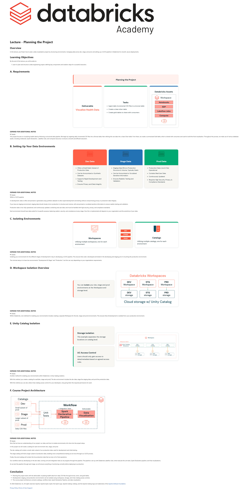

# Lecture: Planning the Project

**Course:** DevOps Essentials for Data Engineering  
**Lesson:** 8 (Lecture / SCORM)  
**Full Screenshot:** 

---

## Verbatim Lesson Content

	

	
Lecture - Planning the Project
Overview

In this lecture, you’ll learn how to plan a data visualization project by structuring environments, managing data across dev, stage, and prod, and setting up a CI/CD pipeline in Databricks for smooth, secure deployments.

Learning Objectives

By the end of this lecture, you will be able to:

Learn to plan and structure a data engineering project, defining key components and isolation steps for successful execution.
	
A. Requirements
Planning the Project
Deliverable
Visualize Health Data
Tasks
Ingest daily incremental CSV files to a bronze table
Create a clean silver table
Create gold tables to share with consumers
Databricks Assets
	
EXPAND FOR ADDITIONAL NOTES

This project focuses on visualizing health data by following a structured data pipeline. We begin by ingesting daily incremental CSV files into a Bronze table, then refining this raw data into a clean Silver table. From there, we create a summarized Gold table, which is shared with consumers and used to build the final visualization. Throughout the process, we make use of various database assets, including notebooks, Spark Declarative , Lakeflow Jobs, and compute resources, to ensure a smooth and efficient execution.

	
B. Setting Up Your Data Environments
Dev Data
Often a Small Static Subset of Production Data
Can be Anonymized or Synthetic Datasets
Supports Rapid Development and Testing
Ensures Privacy and Data Integrity
Stage Data
Staging Data Mirrors Production Structure & Volume, Typically Static
Can be Anonymized or Scrubbed Sensitive Information
Ensures Realistic Testing and Validation
Prod Data
Production Data: Live & Fully Operational
Contains Real User Data
Continuously Updated
Requires High Security, Privacy, & Compliance Standards
	
EXPAND FOR ADDITIONAL NOTES

Within a CI/CD pipeline

In development, data is often anonymized or generated using synthetic datasets to allow rapid development and testing without compromising privacy or production data integrity.

If you have an staging environment, staging data should closely mirror production in structure and volume, with anonymized or scrubbed sensitive information to ensure realistic testing and validation.

Production data is live, fully operational, and continuously updated, containing real user data, and must be handled with high security, privacy, and compliance standards.

Each environment should have data suited for its specific purpose, balancing realism, security, and compliance at every stage. How this is implemented will depend on your organization and the sensitivity of your data.

	
C. Isolating Environments
Workspaces

Utilizing multiple workspaces, one for each environment

Catalogs

Utilizing multiple catalogs, one for each environment

	
EXPAND FOR ADDITIONAL NOTES

Isolating your environments for the different stages of development is key to developing a CI/CD pipeline. This ensures that code is developed and tested in the developing and staging prior to touching the production environment.

The minimal setup is to have two environments “Development & Stage” and “Production”, but this can vary depending on your organizations requirements.

	
D. Workspace Isolation Overview

You can isolate your dev, stage and prod environments at the Workspace and storage level.

	
EXPAND FOR ADDITIONAL NOTES

Within Databricks, one methods for isolating your environments includes creating a separate Workspace for the dev, stage and prod environments. This ensures that all development is isolated from your production environment.

	
E. Unity Catalog Isolation
Storage isolation

This example separates the storage locations on catalog level.

UC Access Control

Users should only gain access to data/metadata based on agreed access rules.

	
EXPAND FOR ADDITIONAL NOTES

Another method for isolating your environments within Databricks is Unity Catalog isolation.

With this method, you create a catalog for each(dev, stage and prod). The dev environment includes the dev data, stage the staging data, and prod the production data.

With this method you can also utilize Unity Catalog access control for your developers, only giving them the required permissions for each.

	
F. Course Project Architecture

	
EXPAND FOR ADDITIONAL NOTES

Now that we have an understanding of our project, our data, and how to isolate environments, let's dive into the project setup.

In this project we will create a catalog for each environment: dev, stage, and prod.

The dev catalog will contain a small, static subset of our production data, used for development and initial testing.

The stage catalog will hold a larger subset of production data, enabling more comprehensive testing as we move through our CI/CD process.

Finally, the prod catalog will contain the live production data that we rely on for final operations.

Our workflow starts by developing on the dev data, running unit and integration tests as we progress through the pipeline. The pipeline is set up with Databricks Lakeflow Jobs, which execute the unit tests, Spark Declarative pipeline, and final visualizations.

As we test the pipeline through each stage, we will ensure everything is functioning correctly before deploying to production.

	
Conclusion
Planning the project starts with the deliverable: visualizing health data from daily CSV files through bronze, silver, and gold tables.
Development, staging, and production environments can be isolated using workspaces, storage, and Unity Catalog access controls.
The course project architecture connects catalogs, workflow tests, Spark Declarative Pipeline, and data visualization.
	

© 2026 Databricks, Inc. All rights reserved. Apache, Apache Spark, Spark, the Spark Logo, Apache Iceberg, Iceberg, and the Apache Iceberg logo are trademarks of the Apache Software Foundation.

Privacy Policy | Terms of Use | Support

