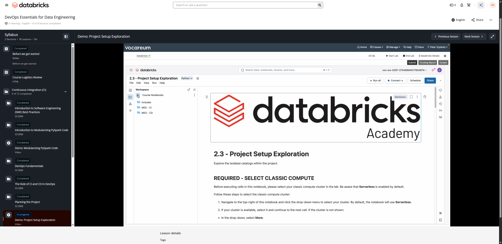

# Demo: Project Setup Exploration

**Course:** DevOps Essentials for Data Engineering  
**Lesson:** 9 (Demo)  
**Duration:** ~5 min (304s)  
**Screenshot:** 

---

## Overview & Learning Objectives

In this hands-on demonstration, the instructor guides learners through the initial setup and folder structure of a real-world data engineering project in Databricks.

Key concepts demonstrated:
- Navigating the project repo cloned into Databricks Git Folders.
- Exploring configuration files (`requirements.txt`, `setup.py`, `databricks.yml`).
- Inspecting data assets across Development, Staging, and Production catalogs in Unity Catalog.
- Reviewing sample data directories and volume locations.

---

## Verbatim Video Transcript & Walkthrough

- **[00:00 - 00:03]** 欢迎来到演示 2.3：项目设置与探索。
- **[00:04 - 00:08]** 在本演示中，我们位于 M02-CI 文件夹中。
- **[00:10 - 00:15]** 在 course notebooks 中，找到 M02CI 2.3。
- **[00:15 - 00:22]** 我先整理一下界面空间，然后我们来选择 classic compute。
- **[00:22 - 00:25]** 再说一次，往上滚动，选择你的 classic compute，名称应该是 lab user，
- **[00:25 - 00:27]** 后面还跟着一串数字。
- **[00:27 - 00:29]** 它的 compute 名称不会和我的一样。
- **[00:29 - 00:30]** 你会有你自己的 compute。
- **[00:33 - 00:37]** 在本演示中，我们将探索我们所创建的隔离环境，
- **[00:37 - 00:40]** 我们是通过目录级别来隔离环境的。
- **[00:44 - 00:47]** 接下来我们要运行这个课堂设置脚本，它会把我们的
- **[00:47 - 00:50]** 环境全部配置就绪。
- **[00:52 - 00:53]** 再次强调，这就是 DA 对象。
- **[00:53 - 00:57]** DA 对象仅用于我们的实验环境，因此本课程
- **[00:57 - 00:58]** 无法在这些实验环境之外运行。
- **[01:00 - 01:01]** 请大家注意这一点。
- **[01:01 - 01:04]** 不过，你可以把这些内容记录下来作为笔记使用。
- **[01:06 - 01:10]** 我们让脚本运行一会儿，同时来探索一下我们的环境。
- **[01:10 - 01:14]** 那么，我们的环境是如何为我们的项目，也就是我们的 CI/CD 搭建的呢？
- **[01:14 - 01:20]** 我快速进入课程文件夹，在这里我会返回到……
- **[01:21 - 01:25]** 我们有这个主课程文件夹：DevOps Essentials for Data Engineering。
- **[01:25 - 01:27]** 这算是主文件夹。
- **[01:27 - 01:29]** 我们会看到 course notebooks，也就是我们当前所在的位置。
- **[01:29 - 01:30]** 演示和实验都会按照它来进行。
- **[01:32 - 01:36]** Tests 文件夹里是我们的单元测试，稍后会讲到；而 sources
- **[01:36 - 01:37]** 里则是我们的源生产文件。
- **[01:38 - 01:40]** 此外这里还有一些其他文件，我们稍后再讨论。
- **[01:41 - 01:46]** 我们回到之前的位置，我往上滚动一下。
- **[01:46 - 01:49]** 那么这个课堂设置脚本，这个课堂设置脚本
- **[01:49 - 01:52]** 只是告诉我们：我们有 dev、stage 和 prod 三个目录。
- **[01:52 - 01:56]** 如果我点击……其实，我们在这里点击 catalogs，就会
- **[01:56 - 01:58]** 看到你应该拥有这些目录。
- **[01:58 - 02:02]** 如果没有，你就必须重新运行笔记本 2.1，执行那个课堂设置。
- **[02:04 - 02:07]** 但由于我们使用的是各自不同的实验环境，我们会动态引用
- **[02:07 - 02:13]** 我们的 dev 目录，使用 da.catalog_dev；stage 使用 da.catalog_stage，以此类推。
- **[02:13 - 02:19]** 在这里，我们展开第一个目录，然后
- **[02:19 - 02:24]** 进入 Default.Health，这就是我们的 dev 目录。
- **[02:24 - 02:27]** 接下来的几个演示中，我们大部分工作都会在这里进行。
- **[02:28 - 02:29]** 它是 prod 数据的一个小子集。
- **[02:29 - 02:34]** 我们已经对 PII 进行了匿名化处理，它包含 7,500 行数据。
- **[02:35 - 02:39]** 然后我们展开名称中带有下划线二下划线的 stage。
- **[02:41 - 02:42]** 接着进入 health。
- **[02:42 - 02:43]** 同样，我们有 health，对吧？
- **[02:43 - 02:46]** 除了这里是 stage 数据之外，其余都一样，而这个有 35,000
- **[02:46 - 02:48]** 行，嗯，它也是 prod 的一个子集。
- **[02:49 - 02:51]** 然后是 prod 数据。
- **[02:55 - 02:59]** 在我们模拟的场景中，每天都会有一个新的 CSV 文件被放入这个 volume。
- **[02:59 - 03:01]** 这就是本课程设定的场景。
- **[03:03 - 03:07]** 我们已经注意到，我们有三个目录，严格来说
- **[03:07 - 03:10]** 是四个，但我们有一、二、三，也就是 dev、stage 和 prod。
- **[03:10 - 03:12]** 再次提醒，如果你没有这些目录，就必须运行
- **[03:12 - 03:14]** 2.1 中的设置脚本。
- **[03:15 - 03:18]** 现在，正如我之前提到的，在整个课程中我们都会使用
- **[03:18 - 03:24]** 这些 Python 变量来动态引用我们的目录，因为
- **[03:24 - 03:26]** 我们每个人的环境都不一样，所以我们直接运行它。
- **[03:28 - 03:30]** 我们可以看到，这些只是指向这些目录而已。
- **[03:30 - 03:33]** 它的作用就这些，只是为我们所有的实验提供一种动态的方式。
- **[03:35 - 03:37]** 现在我们来探索 dev 数据。
- **[03:38 - 03:42]** 我们快速进入 dev 目录，虽然我们已经看过了，
- **[03:42 - 03:46]** 但在 health volume 中，我们有这个 dev health CSV 文件。
- **[03:47 - 03:53]** 再说一次，它只是我们 prod 数据的一个 dev 子集，可用于开发、
- **[03:53 - 04:00]** 测试等。我们在之前的演示中见过，我来运行一下，它确实
- **[04:00 - 04:02]** 包含以逗号分隔的列。
- **[04:02 - 04:06]** 这只是一个非常非常非常简单的 CSV 文件。
- **[04:06 - 04:11]** 我们有这个 PII 列，我们只是假设它很
- **[04:11 - 04:16]** 重要，属于 PII 信息，而处于 dev
- **[04:16 - 04:19]** 区域的开发人员无权查看它。
- **[04:19 - 04:20]** 实现这一点有多种方式。
- **[04:21 - 04:23]** 这里我们并不专注于数据隐私。
- **[04:23 - 04:26]** 你知道，你可以创建 token 等方式来改变它。
- **[04:26 - 04:28]** 在本例中，我们只是对这个 PII 列进行掩码处理。
- **[04:30 - 04:32]** 同样，它有 7,500 行。
- **[04:32 - 04:34]** 第 7,501 行则是列标题那一行。
- **[04:34 - 04:36]** 所以说，都是非常简单的 CSV 文件。
- **[04:37 - 04:40]** 我们看到，我们有 dev、stage 和 prod。
- **[04:40 - 04:43]** 这就是我们在这里隔离环境的方式。
- **[04:43 - 04:45]** 如果你愿意，也可以在 workspace 级别进行隔离。
- **[04:45 - 04:50]** 这完全取决于你的具体场景，以及最适合你所在组织的方式。
- **[04:51 - 04:56]** 总而言之，这只是对我们的环境，以及我们的环境如何
- **[04:56 - 04:58]** 通过目录进行隔离，做了一个快速概览。
- **[04:58 - 04:59]** 感谢观看。
- **[04:59 - 05:00]** 我们下个演示再见。

---

## Key Takeaways

1. **Project Directory Layout:**
   - `src/`: Contains modularized Python packages and ETL transformation functions.
   - `tests/`: Contains unit and integration test suites using pytest.
   - `notebooks/`: Lightweight driver notebooks invoking modular library functions.
   - `resources/`: Databricks Asset Bundles (DABs) definitions and pipeline configurations.
