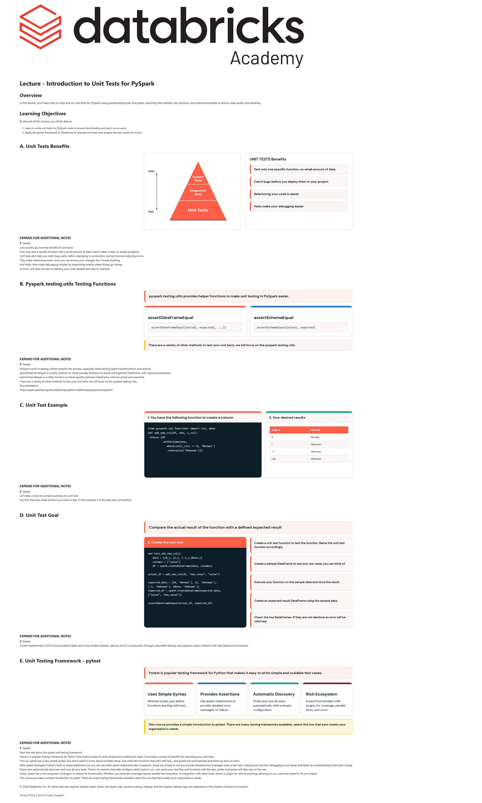

# Lecture: Introduction to Unit Tests for PySpark

**Course:** DevOps Essentials for Data Engineering  
**Lesson:** 10 (Lecture / SCORM)  
**Full Screenshot:** 

---

## Verbatim Lesson Content

	

	
Lecture - Introduction to Unit Tests for PySpark
Overview

In this lecture, you’ll learn how to write and run unit tests for PySpark using pyspark.testing.utils and pytest, exploring their benefits, key functions, and practical examples to ensure code quality and reliability.

Learning Objectives

By the end of this lecture, you will be able to:

Learn to write unit tests for PySpark code to ensure functionality and catch errors early.
Apply the pytest framework in Databricks to execute unit tests and analyze the test results for errors.
	
A. Unit Tests Benefits
Slow
Fast
System
Tests
Integration
Tests
Unit Tests
UNIT TESTS Benefits
Test only one specific function, on small amount of data
Catch bugs before you deploy them in your project
Refactoring your code is easier
Tests make your debugging easier
	
EXPAND FOR ADDITIONAL NOTES

Let’s quickly go over the benefits of unit tests:
First, they test a specific function with a small amount of data, which makes it easy to isolate problems.
Unit tests also help you catch bugs early, before deploying to production, saving time and reducing errors.
They make refactoring easier since you can ensure your changes don’t break anything.
And lastly, they make debugging simpler by pinpointing exactly where things go wrong.
In short, unit tests are key to keeping your code reliable and easy to maintain.

	
B. Pyspark.testing.utils Testing Functions
pyspark.testing.utils provides helper functions to make unit testing in PySpark easier.
assertDataFrameEqual
assertDataFrameEqual(actual, expected[, ...])
assertSchemaEqual
assertSchemaEqual(actual, expected)
There are a variety of other methods to test your unit tests, we will focus on the pyspark testing utils.
	
EXPAND FOR ADDITIONAL NOTES

PySpark's built-in testing utilities simplify the process, especially when testing Spark transformations and actions.
assertDataFrameEqual is a utility function to check equality between an actual and expected DataFrame, with optional parameters.
assertSchemaEqual is a utility function to check equality between DataFrame schemas actual and expected.
There are a variety of other methods to test your unit tests, we will focus on the pyspark testing utils.
Documentation:
https://spark.apache.org/docs/latest/api/python/reference/pyspark.testing.html

	
C. Unit Test Example
1. You have the following function to create a column
from pyspark.sql.functions import col, when
def add_new_col(df, new, s_col):
 return (df
         .withColumn(new,                        
            when(col(s_col) == 0, 'Normal')                            
            .otherwise('Unknown')))
2. Your desired results
original	desired
0	Normal
1	Unknown
-1	Unknown
null	Unknown
	
EXPAND FOR ADDITIONAL NOTES

Let's take a look at a simple example of a unit test.
You first have the initial function you want to test. In this example it is the add_new_col function.

	
D. Unit Test Goal
Compare the actual result of the function with a defined expected result
3. Create the unit test
def test_add_new_col():
   data = [(0,), (1,), (-1,),(None,)]
   columns = ["value"]
   df = spark.createDataFrame(data, columns)

actual_df = add_new_col(df, "new_value", "value")

expected_data = [(0, 'Normal'), (1, 'Unknown'),
(-1, 'Unknown'), (None, 'Unknown')]
expected_df = spark.createDataFrame(expected_data,
["value", "new_value"])

assertDataFrameEqual(actual_df, expected_df)
Create a unit test function to test the function. Name the unit test function accordingly.
Create a sample DataFrame to test any use cases you can think of.
Execute your function on the sample data and store the result.
Create an expected result DataFrame using the sample data.
Check the two DataFrames. If they are not identical an error will be returned.
	
EXPAND FOR ADDITIONAL NOTES

A well-implemented CI/CD process enables faster and more reliable releases, reduces errors in production through automated testing, and supports easier rollbacks with safe deployment practices.

	
E. Unit Testing Framework - pytest
Pytest is popular testing framework for Python that makes it easy to write simple and scalable test cases.
Uses Simple Syntax

Minimal syntax, just define functions starting with test_

Provides Assertions

Use assert statements to provide detailed error messages on failure

Automatic Discovery

Finds and runs all tests automatically with a simple configuration

Rich Ecosystem

Extend functionality with plugins for coverage, parallel tests, and more

This course provides a simple introduction to pytest. There are many testing frameworks available, select the one that best meets your organization's needs.
	
EXPAND FOR ADDITIONAL NOTES

Next like talk about the pytest unit testing framework.
Pytest is a popular testing framework for Python that makes it easy to write simple and scalable test cases. It provides a variety of benefits for executing your unit tests.
First up, pytest has a very simple syntax. You don’t need to worry about complex setup. Just write test functions that start with test_, and pytest will automatically pick them up and run them.
Next, pytest leverages Python’s built-in assert statements (or you can use other assert statements like in pyspark). These are simple to use but provide detailed error messages when a test fails, making your function debugging much easier and faster by understanding what went wrong.
Pytest also automatically discovers and runs all your tests. There’s no need to manually configure which tests to run. Just name your test files and functions with the test_ prefix, and pytest will take care of the rest.
Lastly, pytest has a rich ecosystem of plugins to extend its functionality. Whether you need test coverage reports, parallel test execution, or integration with other tools, there's a plugin for almost anything, allowing you to customize pytest to fit your needs.
This course provides a simple introduction to pytest. There are many testing frameworks available, select the one that best meets your organization's needs.

	

© 2026 Databricks, Inc. All rights reserved. Apache, Apache Spark, Spark, the Spark Logo, Apache Iceberg, Iceberg, and the Apache Iceberg logo are trademarks of the Apache Software Foundation.

Privacy Policy | Terms of Use | Support

