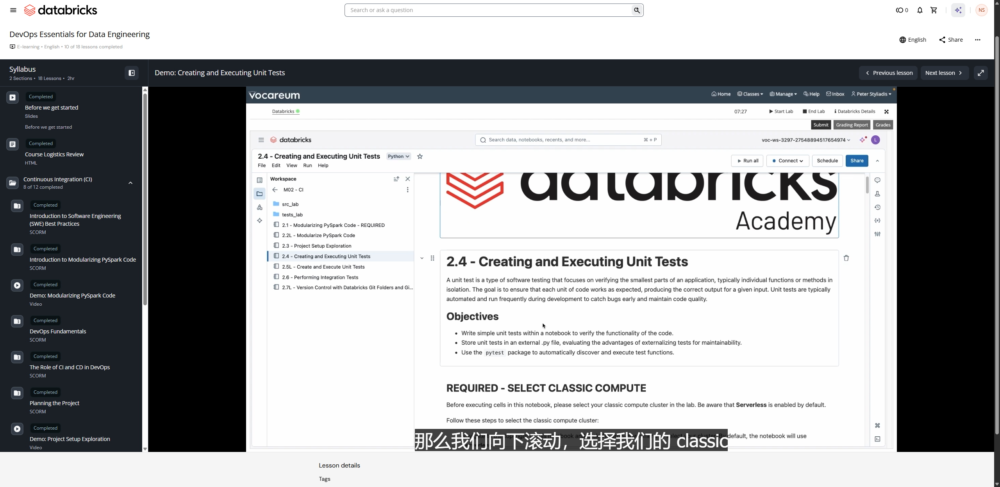

# Demo: Creating and Executing Unit Tests

**Course:** DevOps Essentials for Data Engineering  
**Lesson:** 11 (Demo)  
**Duration:** ~17 min (1007s)  
**Screenshot:** 

---

## Overview & Learning Objectives

In this hands-on demonstration, the instructor walks through implementing robust unit tests for PySpark data transformations using pytest and `pyspark.testing.utils`.

Key concepts demonstrated:
- Writing test cases with pytest fixtures for Spark sessions.
- Using `assertDataFrameEqual` to compare actual DataFrame results with expected DataFrames, including precision and column ordering tolerance.
- Using `assertSchemaEqual` to validate output schemas without running heavy data comparisons.
- Running pytest directly inside Databricks notebooks using `pytest.main(["-v", "tests/"])`.
- Running pytest from the Databricks web terminal and CLI.

---

## Verbatim Video Transcript & Walkthrough

- **[00:00 - 00:03]** 这是演示 2.4：创建并执行单元测试。
- **[00:03 - 00:08]** 在本次演示中，我们将重点做一个高层次的概览，
- **[00:08 - 00:13]** 介绍如何创建单元测试，以及如何用 pytest 框架来执行它们。
- **[00:14 - 00:18]** 那么我们向下滚动，选择我们的 classic
- **[00:18 - 00:21]** compute 集群，名称应该是 lab user 后面跟着一串数字。
- **[00:22 - 00:23]** 你的会是一个不同的集群。
- **[00:24 - 00:26]** 同样，如果它还没启动，进入 more（更多）找到它，你就可以
- **[00:26 - 00:27]** 重新启动它，然后等几分钟。
- **[00:30 - 00:35]** 我们先从一个高层次的概览开始，讲讲
- **[00:35 - 00:36]** 如何创建简单的单元测试，好吧？
- **[00:36 - 00:39]** 在本例中，我们是用一个 Databricks 笔记本来做的，但这
- **[00:39 - 00:40]** 也可以在 Databricks 之外完成。
- **[00:41 - 00:44]** 就我们而言，我们这里就坚持在笔记本环境中使用这个实验。
- **[00:45 - 00:48]** 要执行一个单元测试，我把它拆分成了三个部分，对吧？
- **[00:48 - 00:52]** 创建你最初的项目函数，也就是生产函数，然后取用
- **[00:52 - 00:56]** 那个函数，并决定为它创建多少个单元测试。
- **[00:57 - 01:00]** 在本次演示中，这是一个非常高层次的概览。
- **[01:00 - 01:02]** 我是说，光是学习创建单元测试你就可能要花上好几周。
- **[01:03 - 01:05]** 在本例中，我们会创建一个生产函数，然后
- **[01:05 - 01:06]** 只为它创建一个单元测试。
- **[01:07 - 01:10]** 理论上，你可能会根据函数的复杂程度创建
- **[01:10 - 01:11]** 更多的单元测试。
- **[01:11 - 01:13]** 最后，执行这些单元测试。
- **[01:14 - 01:16]** 我们会逐步建立本演示的知识。
- **[01:16 - 01:19]** 那么同样，创建一个最初的函数，也就是你的生产函数，创建一个或
- **[01:19 - 01:23]** 多个单元测试来测试它的功能，然后以某种方式执行它们。
- **[01:24 - 01:25]** 就我们而言，我们会使用 pytest 框架。
- **[01:27 - 01:32]** 为此，我们会看一下这个项目的自定义函数。
- **[01:32 - 01:37]** 那么我们进入这个文件夹，再往上退一级，回到主 DevOps
- **[01:37 - 01:40]** Essentials for Data Engineering 文件夹，然后我们有 Source 文件夹。
- **[01:40 - 01:44]** 在这里，我们有 helpers、DLT pipelines 和一个最终的
- **[01:44 - 01:46]** 可视化文件，稍后我们会讲到。
- **[01:46 - 01:49]** 如果你进入 Helpers，你应该会看到 project_functions。
- **[01:50 - 01:53]** 你可以手动导航，也可以直接点击链接，只是
- **[01:53 - 01:55]** 这里只是向你展示它的位置。
- **[01:58 - 02:03]** 这来自模块化 PySpark 代码那个演示，我们把之前演示中
- **[02:03 - 02:09]** 讲过的这些函数，直接放进了一个 .py 文件里。
- **[02:09 - 02:13]** 这只是一个简单的 .py 文件，名为 project_functions，
- **[02:13 - 02:14]** 位于 helpers 和 source 之下。
- **[02:15 - 02:17]** 这些正是我们之前看到的那些函数。
- **[02:18 - 02:22]** 我们有第三个之前没看过的——不过其实我们也看过了。
- **[02:22 - 02:23]** 我们有了第三个。
- **[02:23 - 02:25]** 那么同样，它只是一个 .py 文件。
- **[02:26 - 02:27]** 不是笔记本，只是一个普通的 .py 文件。
- **[02:28 - 02:29]** 我们已经导入了所需的依赖包。
- **[02:30 - 02:33]** 那么我往上退，把那个关掉，回到这里。
- **[02:33 - 02:35]** 那么我们有这些函数，对吧？
- **[02:35 - 02:37]** def get_health_schema、highcholest_map、group_ages_map。
- **[02:37 - 02:39]** 同样，非常简单的例子。
- **[02:40 - 02:44]** 关闭那个 py 文件，现在我们要做的是运行下面
- **[02:44 - 02:48]** 这个单元格，从 helpers 模块中导入那些函数，对吧？
- **[02:48 - 02:49]** 这些是我们自定义的函数。
- **[02:50 - 02:52]** 这有不同的做法。
- **[02:52 - 02:54]** 这算是最简单的方式。
- **[02:54 - 02:56]** 我们会用到 sys 和 OS 来导入这些。
- **[02:56 - 03:00]** 我们必须这样做，因为……让我进入我的笔记本。
- **[03:00 - 03:04]** 严格来说，这个笔记本是从这个位置运行的，所以我们需要
- **[03:04 - 03:09]** 告诉 Python，我们想从 source、从这里导入一些东西。
- **[03:09 - 03:14]** 那么从这个 DevOps Essentials for Databricks 的 source，
- **[03:14 - 03:16]** 从那里导入一些东西。
- **[03:16 - 03:21]** 那么我们会添加一个路径，让 Python 去搜索某个依赖包。
- **[03:21 - 03:23]** 我们要用的就是 sys.path.append。
- **[03:24 - 03:29]** 也就是获取这个笔记本的当前路径，从这个笔记本往上两级，
- **[03:29 - 03:32]** 到达主课程文件夹，然后追加那个路径，好让 Python 可以尝试
- **[03:32 - 03:34]** 从那里导入这些依赖包。
- **[03:34 - 03:36]** 我来运行它。
- **[03:37 - 03:40]** 它应该会给你一条提示，并以 DevOps Essentials
- **[03:40 - 03:41]** for Data Engineering 结尾，对吧？
- **[03:41 - 03:43]** 它只是指向这个主文件夹，对吧？
- **[03:43 - 03:45]** 我们此刻在里面两级深处。
- **[03:46 - 03:51]** 现在它知道要去搜索这个位置了，我们就可以写 from src，对吧？
- **[03:51 - 03:52]** 那么我点击那个。
- **[03:53 - 03:54]** Helpers，点击那个。
- **[03:55 - 03:58]** 准备导入 project_functions，我们已经看到它包含了
- **[03:58 - 03:59]** 我们的生产函数。
- **[04:00 - 04:01]** 那么我们有这三个函数。
- **[04:01 - 04:04]** 我们来执行一些非常非常简单的单元测试。
- **[04:05 - 04:10]** 我们会创建一个名为 test get health csv schema match 的测试函数。
- **[04:10 - 04:13]** 极其重要的是：第一，给你的函数命名时要加上类似
- **[04:13 - 04:17]** test 下划线的前缀；第二，让函数名准确反映你所测试的内容。
- **[04:17 - 04:20]** 在本例中，我只是测试 schema 是否与我预期的一致。
- **[04:22 - 04:25]** 然后我们会测试来自 project_functions 的
- **[04:25 - 04:27]** get_health_csv_schema 函数，对吧？
- **[04:27 - 04:30]** 我们已经看过它了，现在可以在这里把它导入进来。
- **[04:31 - 04:35]** 那么我们会创建一个名为 actual schema 的变量，用来保存
- **[04:35 - 04:38]** 实际的 schema；再用 expected schema 保存我们手动输入的预期 schema，
- **[04:38 - 04:41]** 然后我们只需检查并确认它们是相同的。
- **[04:41 - 04:41]** 就是这么简单。
- **[04:41 - 04:42]** 我们做的就这些。
- **[04:42 - 04:47]** 同样，这些可以变得更复杂，需要构建更多的测试，但为了
- **[04:47 - 04:50]** 简单起见，我们要做的就是测试我们构建的东西，
- **[04:51 - 04:54]** 我们期望它们返回我们认为应返回的结果，如果有什么
- **[04:54 - 04:56]** 出错了，我们就得去修复。
- **[04:57 - 05:00]** 那么我们会导入一些依赖包。
- **[05:00 - 05:03]** 呃，这里的关键是 from pyspark.testing.utils。
- **[05:03 - 05:05]** 我们会导入这个 assert_schema_equals。
- **[05:05 - 05:08]** 同样，还有各种其他的依赖包等你可以使用。
- **[05:09 - 05:11]** 在本例中，我们就使用 PySpark testing utils。
- **[05:12 - 05:14]** 这就是那个函数，我正在构建的单元测试。
- **[05:15 - 05:18]** 这里是来自 project_functions 的 get_health_schema，
- **[05:18 - 05:23]** 就在这边，它只是保存我的函数所返回的内容，对吧？
- **[05:23 - 05:24]** 没什么特别的。
- **[05:24 - 05:27]** 然后我在创建这个 expected schema。
- **[05:27 - 05:30]** 我手动输入了那个函数应该返回的内容。
- **[05:30 - 05:34]** 简单的例子，逻辑是合理的，对吧，也就是你想做的事情。
- **[05:34 - 05:39]** 然后你只需问：“那个函数返回的是我所期望的吗？”
- **[05:39 - 05:40]** 我们就运行这个单元格。
- **[05:41 - 05:45]** 呃，哎呀，我忘了导入我的依赖包。
- **[05:46 - 05:47]** 导入它们很重要，
- **[05:49 - 05:50]** 然后运行它，测试通过。
- **[05:50 - 05:51]** 好了。
- **[05:51 - 05:53]** 我忘了导入依赖包，也就是我的自定义依赖包。
- **[05:54 - 05:54]** 就是这样。
- **[05:55 - 05:59]** 真正困难的部分是编写所有这些单元测试函数，并思考
- **[05:59 - 06:00]** 你想要测试的所有场景。
- **[06:01 - 06:03]** 这里的代码都不算特别复杂，对吧？
- **[06:03 - 06:06]** 根据你所做的事情，它可能会稍微复杂一些。
- **[06:07 - 06:15]** 那么，这里差不多就是这样了。现在，关键在于：如果你的函数——
- **[06:15 - 06:17]** 对吧，如果它更复杂——没有返回你所期望的结果呢？
- **[06:18 - 06:20]** 这时单元测试就会说：“嘿，出问题了。
- **[06:20 - 06:24]** 要么是你的预期不对，要么是你的函数本身有问题”，
- **[06:24 - 06:26]** 它能让你很快意识到，这就是那种持续
- **[06:26 - 06:29]** 集成的过程：“嘿，去修复吧，
- **[06:30 - 06:34]** 有东西坏了。” 你也可以想象，如果项目很大，你有
- **[06:34 - 06:38]** 多个开发人员，从版本控制里拉取代码，而你
- **[06:38 - 06:41]** 已经构建好一个函数，结果有人去修改那个函数，对吧？
- **[06:41 - 06:44]** 也许他们没意识到你在某个地方用到了它，就把它改了，
- **[06:44 - 06:48]** 那么单元测试就应该失败，从而阻止他们把那段代码推送
- **[06:49 - 06:50]** 到你的主版本控制系统。
- **[06:51 - 06:54]** 这就是这一切如何真正整合到一起，服务于
- **[06:54 - 06:56]** 我们的 CI 以及 CI/CD。
- **[06:56 - 07:00]** 接下来我们会测试上面的 high_cholesterol_map 函数，
- **[07:00 - 07:03]** 把它命名为 test high cholesterol column valid map。
- **[07:04 - 07:06]** 名字很长，但基本能看出它在做什么。
- **[07:07 - 07:10]** 我们会用 assert_dataframe_equals 来进行比较。
- **[07:10 - 07:14]** 我们会用 actual_df 来保存函数返回的内容。
- **[07:15 - 07:18]** 至于 expected_df，我会手动填入我期望那个函数
- **[07:18 - 07:21]** 返回的内容，然后我们只需测试这两者是否相等。
- **[07:22 - 07:24]** 好，这里是我对 assert_dataframe_equals 的导入。
- **[07:24 - 07:26]** 这是我的单元测试函数。
- **[07:27 - 07:30]** 同样，这是一个示例 DataFrame，即 0、1、2、
- **[07:30 - 07:32]** 3、4 和 none，对吧？
- **[07:32 - 07:35]** 我喜欢测试的几样东西之一是空值，所以在本例中就是一个 none。
- **[07:36 - 07:37]** 我大概还应该测试一个负值。
- **[07:38 - 07:41]** 这不是一个非常深入的测试，但在这些测试中你应该非常谨慎，
- **[07:41 - 07:46]** 认真思考，什么样的数据可能进入那个表或那个
- **[07:46 - 07:50]** DataFrame 从而引发问题，你确实需要测试这些情况。
- **[07:50 - 07:53]** 这里这些都极其简单，所以我们并没有真正
- **[07:53 - 07:56]** 深入探讨，但这就是那个示例 DataFrame。
- **[07:56 - 08:00]** actual_df 取用一个示例 DataFrame，使用 withColumn 创建一个名为
- **[08:00 - 08:05]** actual 的列，然后使用我们的函数创建一个新列，对吧？
- **[08:05 - 08:06]** 这里没什么特别的。
- **[08:06 - 08:07]** 我们应该得到某些特定的值。
- **[08:08 - 08:12]** 那么同样，看看我的函数，这些就是我所期望的值。
- **[08:12 - 08:16]** 0 应该是正常，1 是高于平均，2 是偏高，3 是未知，
- **[08:16 - 08:18]** 4 是未知，none 是未知，对吧？
- **[08:19 - 08:22]** 这就是我期望我创建的那个函数所返回的内容。
- **[08:22 - 08:24]** 所以我期望它是这样的。
- **[08:24 - 08:26]** 这是我的 expected_df 和我的 actual。
- **[08:27 - 08:30]** 然后我们会用 PySpark 的 assert_dataframe_equals。
- **[08:30 - 08:31]** 只测试这两者。
- **[08:32 - 08:32]** 它们相同吗？
- **[08:33 - 08:35]** 我会加一条小提示，表明它们通过了。
- **[08:36 - 08:37]** 然后，看吧。
- **[08:37 - 08:38]** 它们通过了。
- **[08:38 - 08:39]** 所以我所做的一切都奏效了。
- **[08:39 - 08:42]** 同样，如果它失败了，你现在就得深入排查了。
- **[08:42 - 08:45]** 那么我们来看看它失败时会发生什么。
- **[08:46 - 08:50]** 在下面的单元格中，我们只是取用那个 expected_df 变量，改动了一个
- **[08:50 - 08:53]** 值，只是为了故意让它失败。
- **[08:53 - 08:57]** 所以这会失败。同样，这个单元格会引发错误，所以当你
- **[08:57 - 08:58]** 运行它时，你会得到一个错误。
- **[08:58 - 09:00]** 不要慌，这是故意的。
- **[09:01 - 09:06]** 我们所做的是，在 expected_df 中把 0 改成了返回
- **[09:06 - 09:10]** 一个错误的值来引发错误，只是为了故意破坏它，对吧？
- **[09:10 - 09:13]** 有时是函数出问题，有时是你的 expected_df 写错了。
- **[09:14 - 09:15]** 但我只是想给你展示一下会发生什么。
- **[09:15 - 09:17]** 这里其他一切都相同。
- **[09:17 - 09:18]** 我们用的是同一个 high_cholesterol_map。
- **[09:19 - 09:21]** 除了名字之外，其他一切都一样。
- **[09:22 - 09:24]** 也就是 test high_cholesterol_column invalid map。
- **[09:24 - 09:30]** 我们确实希望它失败。我运行它，如果我向下滚动——它
- **[09:30 - 09:32]** 确实失败了，所以这很好，对吧？
- **[09:32 - 09:36]** 它告诉我那两个 DataFrame 不匹配，实际上其中 17%
- **[09:37 - 09:39]** 的数据不匹配。
- **[09:39 - 09:41]** 所以这实际上相当详细。
- **[09:41 - 09:44]** 它告诉我 DataFrame 中有问题，17% 对不上。
- **[09:45 - 09:48]** 那么这告诉我的是——如果我以前从没见过这种情况——
- **[09:48 - 09:50]** 就是有东西坏了，对吧？
- **[09:50 - 09:54]** 要么是单元测试有问题，要么是原始函数有问题。
- **[09:54 - 09:59]** 如果这个项目已经存在一年，有个开发人员在改动——在本例中就是
- **[09:59 - 10:05]** high_cholesterol_map 函数——比如一个新开发人员刚入职第一年、
- **[10:05 - 10:08]** 上班第一周，试图修改这个函数，
- **[10:08 - 10:15]** 给它加点东西，为了满足他或她的特定需求而改动它，那么单元测试
- **[10:15 - 10:19]** 就应该失败，因为它在说：“嘿，它没有做它该做的事”，对吧？
- **[10:19 - 10:20]** 这才是它应该做的。
- **[10:20 - 10:21]** 你把它改了。
- **[10:21 - 10:22]** 有东西坏了。
- **[10:22 - 10:24]** 那么同样，把这一点用到你的整个流程中去思考，对吧？
- **[10:25 - 10:28]** 那么，你能不能去修改这些来做改动？
- **[10:28 - 10:31]** 能，但你真的——它有点像一道止损关卡，会说：“嘿，
- **[10:31 - 10:36]** 现在有东西坏了。你得去查一查。” 所以开发出优秀的
- **[10:36 - 10:38]** 单元测试极其重要。
- **[10:38 - 10:40]** 我是说，光讲这个我们就能开好几个月的课。
- **[10:40 - 10:45]** 这里关于单元测试大约讲了 15 分钟，但希望它能改变你的
- **[10:45 - 10:46]** 关于如何开发一个项目的思路。
- **[10:47 - 10:48]** 这大概就是它的目的。
- **[10:49 - 10:51]** 那么现在我们想为单元测试创建一个文件。
- **[10:52 - 10:54]** 我们是在笔记本中做的，这没问题。
- **[10:54 - 10:54]** 它能用。
- **[10:54 - 10:58]** 我们可以用 %run，但最好的做法是把
- **[10:58 - 11:00]** 单元测试放进一个 .py 文件里。
- **[11:00 - 11:03]** 把它放进 .py 文件，然后直接导入它们，对吧？
- **[11:03 - 11:06]** 这样能让你的代码库更有条理，然后你就可以运行它们，我会
- **[11:06 - 11:09]** 向你展示如何以自动化的方式运行它们，这一点极其重要。
- **[11:10 - 11:13]** 那么我们先从导入 pytest 开始，pytest 框架是
- **[11:13 - 11:18]** 一种自动运行你的单元测试的方式，它会给你一份很好的输出报告。
- **[11:18 - 11:21]** 同样，光是讲 pytest 我们就能花上好几周。
- **[11:21 - 11:23]** 这是一个极其简单的介绍。
- **[11:24 - 11:25]** 那么这个刚刚运行完。
- **[11:26 - 11:26]** 可以继续了。
- **[11:26 - 11:27]** 依赖包已安装。
- **[11:28 - 11:34]** 那么接下来，在这个 test、unit test 文件夹里，我们其实已经放入了
- **[11:34 - 11:38]** 上面的函数——抱歉，是上面的单元测试。
- **[11:39 - 11:45]** 那么如果你进入主 DevOps 文件夹、test、unit tests，我们其实已经把
- **[11:45 - 11:49]** 那些文件放在了那里给你——抱歉，是把那些函数放进那个文件里给你。
- **[11:50 - 11:53]** 那么我可以，呃，右键在新标签页中打开，或者我在这里直接提供了链接。
- **[11:53 - 11:54]** 我们就点击这个链接。
- **[11:57 - 12:01]** 我们在导入 pytest，以及我们需要导入的其他一些东西。
- **[12:01 - 12:03]** 我不会太深入地讲这个。
- **[12:03 - 12:06]** 同样，你可以去查阅各种 pytest 教程。
- **[12:06 - 12:08]** 这只是一个非常简单的介绍。
- **[12:09 - 12:11]** 但这里我在导入 source helpers project_functions。
- **[12:11 - 12:15]** 我发现，要让这个正常工作可能会有点麻烦。
- **[12:16 - 12:18]** 关于 pytest，同样，我们不会讲太多细节。
- **[12:19 - 12:20]** 我给你展示一下我们在这里做了什么。
- **[12:20 - 12:24]** 一个 pytest fixture，你可以把它理解为：它要做的是
- **[12:24 - 12:28]** 帮我们建立 Spark session，并在我们
- **[12:28 - 12:30]** 需要用于任何这些单元测试时运行它。
- **[12:30 - 12:33]** 比如，def spark 会创建或获取一个 Spark session。
- **[12:33 - 12:37]** yield 表示，好，在测试结束时，让它去做别的事情。
- **[12:37 - 12:40]** 如果我们是在本地做的，我们可以，比如说，终止这个 Spark session。
- **[12:40 - 12:43]** 在本例中，我们不想在 Databricks 中终止这个 Spark session。
- **[12:44 - 12:49]** 然后是我们之前看到的 test_get_health_schema 函数。
- **[12:49 - 12:51]** 这里我们不需要 Spark session，所以可以跳过它。
- **[12:51 - 12:57]** 但对于 test high cholesterol column valid map，我们确实需要那个来自
- **[12:57 - 12:59]** 这个所谓 fixture 的 Spark session。
- **[12:59 - 13:01]** 那是一个你可以自行查阅的内容。
- **[13:01 - 13:02]** 我们不会讲太多细节。
- **[13:03 - 13:07]** 你可以用那种方式创建假数据，然后同样把它应用到你的单元测试中。
- **[13:08 - 13:11]** 本质上，当你想为每个单元测试都做某件事，但又
- **[13:11 - 13:15]** 不想手动把它写进每个单元测试时，我们就会使用那个 fixture。
- **[13:16 - 13:18]** 总之，我们的函数就在这里，对吧？
- **[13:18 - 13:19]** 我们之前看过它们了。
- **[13:19 - 13:21]** 这些就是我们的单元测试。
- **[13:21 - 13:21]** 我把那个关掉。
- **[13:22 - 13:24]** 这里有一些信息，如果你想看的话可以过一遍。
- **[13:26 - 13:29]** 重要提示，同样，你的测试的复杂程度和全面程度真正
- **[13:29 - 13:32]** 取决于你所在组织的最佳实践、准则和策略。
- **[13:32 - 13:35]** 这是一个极其简单的演示，对吧？
- **[13:36 - 13:38]** 但希望它能在某种程度上改变你思考
- **[13:38 - 13:39]** 如何真正开发项目的方式。
- **[13:40 - 13:43]** 我们在这里不会深入讲解 pytest 或任何其他框架。
- **[13:43 - 13:46]** 那么接下来，我们会在 Databricks 中执行 pytest。
- **[13:47 - 13:49]** 这和在本地做略有不同，所以如果你
- **[13:49 - 13:52]** 在本地做过，本地会稍微容易一些，比如在 VS Code 中。
- **[13:53 - 13:56]** 你可以在 VS Code 中用 Spark 在本地运行这些，但我们
- **[13:56 - 13:58]** 是在 Databricks 中做的。
- **[13:58 - 13:59]** 这里有一些说明。
- **[13:59 - 14:00]** 我不会太深入地讲所有这些。
- **[14:01 - 14:03]** 我们会结合代码本身来讲。
- **[14:03 - 14:07]** 那么 pytest 真正要做的是，去你告诉
- **[14:07 - 14:11]** 它去的地方，如果它发现任何函数名中带有类似 test 下划线的
- **[14:11 - 14:13]** 内容，它就会执行它。
- **[14:13 - 14:14]** 差不多就是这样。
- **[14:14 - 14:16]** 它会执行它，并给你一份报告。
- **[14:17 - 14:20]** 那么如果你有一个像 test_example.py 这样的文件，你告诉 pytest
- **[14:20 - 14:24]** 去那个文件夹，它就会找到它，找到任何函数名中带有 test
- **[14:24 - 14:25]** 下划线的函数，然后运行它。
- **[14:27 - 14:30]** 那么根据你所在组织的最佳实践，你可以用
- **[14:30 - 14:34]** Databricks 运行单元测试，也可以根据具体需求在你选择的 IDE 中本地运行。
- **[14:35 - 14:37]** 在本例中，我会导入 pytest 和 sys。
- **[14:37 - 14:43]** 这里同样，这只是移除某种字节码或缓存，
- **[14:43 - 14:47]** 它们在运行时可能会在某些只读的
- **[14:47 - 14:48]** 环境（比如这里的 Databricks）中引发错误。
- **[14:48 - 14:52]** 所以我们就选择不写入那些字节码，以避免在那里出现任何问题。
- **[14:52 - 14:57]** pytest.main 会执行我们的 pytest。
- **[14:57 - 15:03]** 也就是说，让 pytest 执行时，从这个笔记本往上退两级文件夹到这个 unit test 文件夹，
- **[15:03 - 15:09]** 我明确地告诉它去执行这个文件。
- **[15:09 - 15:13]** 如果我移除这个文件，pytest 会自己去查找，如果它找到多个
- **[15:13 - 15:15]** 文件，它也会把那些全部执行。
- **[15:16 - 15:18]** 我在这里非常明确地说：“嘿，只执行这个文件。”
- **[15:19 - 15:23]** V 代表 verbose（详细模式），这里是一些缓存相关的信息。
- **[15:24 - 15:25]** 然后如果它运行失败，我们就会得到一个错误。
- **[15:26 - 15:27]** 这就是我们在 Databricks 中运行它的方式。
- **[15:27 - 15:28]** 我们运行这个。
- **[15:29 - 15:33]** 哦，趁它运行的时候，我想指出这个 pytest.ini 文件。
- **[15:34 - 15:36]** 同样，这是 pytest 的一项功能。
- **[15:37 - 15:39]** 你告诉它从哪里开始导入你的路径。
- **[15:39 - 15:41]** 这里我只是去掉一些警告。
- **[15:42 - 15:44]** 同样，这是一个可以深入了解的内容。
- **[15:44 - 15:46]** 它有助于控制 pytest 的配置。
- **[15:47 - 15:47]** 但看看它做了什么。
- **[15:48 - 15:53]** 我们有三个测试函数，它把三个全部执行了，而且全部通过。
- **[15:53 - 15:54]** 相当酷。
- **[15:55 - 15:59]** 同样，你可以看到，随着项目变大，这会变得复杂得多。
- **[15:59 - 16:02]** 那么同样，它自动发现了那个文件中的单元测试，
- **[16:02 - 16:04]** 而我们把这些单元测试都包含在其中。
- **[16:05 - 16:08]** 想了解更多关于 pytest 的信息，你可以查阅文档。
- **[16:09 - 16:12]** 但归根结底，单元测试极其重要，而且它
- **[16:12 - 16:16]** 比我们这里展示的要复杂得多，需要认真思考你需要构建的
- **[16:16 - 16:17]** 所有测试。
- **[16:18 - 16:20]** pytest 只是你可以使用的一个框架。
- **[16:20 - 16:21]** 还有其他框架。
- **[16:22 - 16:25]** 接下来是单元测试的一些后续步骤，我们不会在本课程中
- **[16:25 - 16:29]** 讲得太深，但有一个叫 GitHub Actions 的东西，你可以在
- **[16:29 - 16:33]** 把代码推送到版本控制时执行你的单元测试，你可以
- **[16:33 - 16:34]** 在这里查阅那份文档。
- **[16:34 - 16:35]** 所以去看看吧。
- **[16:35 - 16:39]** 但归根结底，单元测试极其重要，而这
- **[16:39 - 16:40]** 只是一个非常简单的介绍。
- **[16:40 - 16:41]** 感谢观看。
- **[16:41 - 16:42]** 我们下个演示再见。

---

## Key Takeaways

1. **`pyspark.testing.utils` Standards:**
   - `assertDataFrameEqual(actual, expected)`: The gold standard for PySpark unit tests in Spark 3.5+. Compares values, schema, and nullable flags with actionable diff output.
   - `assertSchemaEqual(actual_schema, expected_schema)`: Checks schema structure independently.

2. **Automating Test Execution:**
   - Unit tests are placed in a `tests/` directory following pytest naming conventions (`test_*.py`).
   - Pytest automatically discovers and runs tests, giving clear green/red status suitable for automated CI pipelines.
