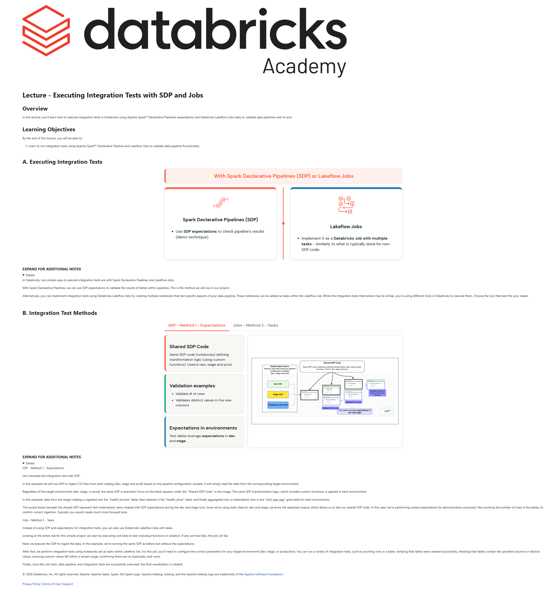

# Lecture: Executing Integration Tests with SDP and Jobs

**Course:** DevOps Essentials for Data Engineering  
**Lesson:** 12 (Lecture / SCORM)  
**Full Screenshot:** 

---

## Verbatim Lesson Content

	

	
Lecture - Executing Integration Tests with SDP and Jobs
Overview

In this lecture, you’ll learn how to execute integration tests in Databricks using Apache Spark™ Declarative Pipelines expectations and Databricks Lakeflow Jobs tasks to validate data pipelines end-to-end

Learning Objectives

By the end of this lecture, you will be able to:

Learn to run integration tests using Apache Spark™ Declarative Pipeline and Lakeflow Jobs to validate data pipeline functionality.
	
A. Executing Integration Tests
With Spark Declarative Pipelines (SDP) or Lakeflow Jobs
Spark Declarative Pipelines (SDP)
Use SDP expectations to check pipeline’s results (demo technique).
Lakeflow Jobs
Implement it as a Databricks Job with multiple tasks - similarly to what is typically done for non-SDP code.
	
EXPAND FOR ADDITIONAL NOTES

In Databricks, two simple ways to execute integration tests are with Spark Declarative Pipelines and Lakeflow Jobs.

With Spark Declarative Pipelines, we can use SDP expectations to validate the results of tables within pipelines. This is the method we will use in our project.

Alternatively, you can implement integration tests using Databricks Lakeflow Jobs by creating multiple notebooks that test specific aspects of your data pipeline. These notebooks can be added as tasks within the Lakeflow Job. While the integration tests themselves may be similar, you're using different tools in Databricks to execute them. Choose the tool that best fits your needs.

	
B. Integration Test Methods
SDP - Method 1 - Expectations
Jobs - Method 2 - Tasks
Shared SDP Code

Same SDP code (notebooks) defining transformation logic (using custom functions). Used in dev, stage and prod.

Validation examples
Validate # of rows
Validates distinct values in the new columns
Expectations in environments

Test tables leverage expectations in dev and stage.

	
EXPAND FOR ADDITIONAL NOTES

SDP - Method 1 - Expectations:

Let's example the integration test with SDP.

In this example we will use SDP to ingest CSV files from each catalog (dev, stage and prod) based on the pipeline configuration variable, it will simply read the data from the corresponding target environment.

Regardless of the target environment (dev, stage, or prod), the same SDP is executed. Focus on the black squares under the "Shared SDP Code" in the image. The same SDP transformation logic, which includes custom functions, is applied in each environment.

In this example, data from the target catalog is ingested into the "health_bronze" table, then cleaned in the "health_silver" table, and finally aggregated into a materialized view in the "chol_age_agg" gold table for each environment.

The purple boxes beneath the shared SDP represent test materialized views created with SDP expectations during the dev and stage runs. Since we're using static data for dev and stage, we know the expected output, which allows us to test our shared SDP code. In this case, we’re performing simple expectations for demonstration purposed, like counting the number of rows in the tables, to confirm correct ingestion. Typically you would create much more focused tests.

Jobs - Method 2 - Tasks

Instead of using SDP and expectations for integration tests, you can also use Databricks Lakeflow Jobs with tasks.

Looking at the entire Job for this simple project, we start by executing unit tests to test individual functions in isolation. If any unit test fails, the job will fail.

Next, we execute the SDP to ingest the data. In this example, we're running the same SDP as before but without the expectations.

After that, we perform integration tests using notebooks set as tasks within Lakeflow Job. For this job, you’ll need to configure the correct parameters for your target environment (dev, stage, or production). You can run a variety of integration tests, such as counting rows in a table, verifying that tables were created successfully, checking that tables contain the specified columns or distinct values, ensuring column values fall within a certain range, confirming there are no duplicates, and more.

Finally, once the unit tests, data pipeline, and integration tests are successfully executed, the final visualization is created.

	

© 2026 Databricks, Inc. All rights reserved. Apache, Apache Spark, Spark, the Spark Logo, Apache Iceberg, Iceberg, and the Apache Iceberg logo are trademarks of the Apache Software Foundation.

Privacy Policy | Terms of Use | Support

