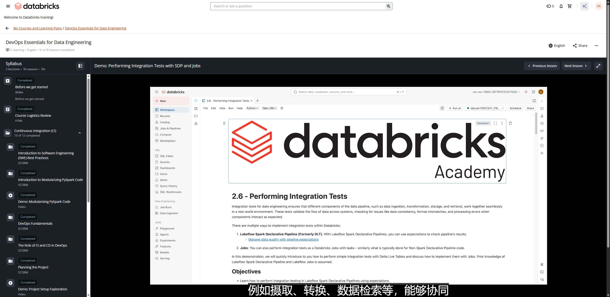

# Demo: Performing Integration Tests with SDP and Jobs

**Course:** DevOps Essentials for Data Engineering  
**Lesson:** 13 (Demo)  
**Duration:** ~13 min (799s)  
**Screenshot:** 

---

## Overview & Learning Objectives

In this hands-on demonstration, the instructor walks through setting up end-to-end integration tests using Lakeflow Spark Declarative Pipelines (SDP) orchestrated by Lakeflow Jobs.

Key concepts demonstrated:
- Triggering an SDP pipeline run programmatically or via a multi-task Job.
- Orchestrating integration test tasks that execute downstream of the pipeline refresh.
- Querying target tables in the Staging catalog to assert row counts, referential integrity, and business logic outcomes.
- Emitting test failure alerts and stopping subsequent deployment steps if integration assertions fail.

---

## Verbatim Video Transcript & Walkthrough

- **[00:00 - 00:04]** 欢迎来到演示 2.6：执行集成测试。
- **[00:04 - 00:09]** 集成测试用于确保你的数据管道的不同组件，
- **[00:09 - 00:14]** 例如摄取、转换、数据检索等，能够协同
- **[00:14 - 00:16]** 在真实环境中无缝运行。
- **[00:17 - 00:20]** 你可以用许多方式来实现集成测试，但在这个
- **[00:20 - 00:26]** 特定的演示中，我们将重点讲解 Lakeflow Spark Declarative Pipeline。
- **[00:26 - 00:31]** 我们将设置一些 expectations 来执行我们的测试。
- **[00:32 - 00:36]** 此外，还有另一种方式可以执行这个集成
- **[00:36 - 00:42]** 测试：把这些测试创建为任务，然后使用 Databricks Lakeflow Jobs
- **[00:42 - 00:45]** 来编排你的管道。
- **[00:45 - 00:50]** 那么，首先，我要确认自己已连接到 classic compute。
- **[00:51 - 00:53]** 然后我会运行我的设置脚本。
- **[00:54 - 00:57]** 在运行设置脚本之前，请确保你已经运行过
- **[00:57 - 01:03]** 演示 2.1，也就是模块化 PySpark 代码，因为那是
- **[01:03 - 01:06]** 为本演示设置目录所必需的。
- **[01:07 - 01:08]** 我来给你演示。
- **[01:09 - 01:14]** 我已经设置好了我的 dev、stage 和 prod 目录，而这个课堂设置
- **[01:14 - 01:21]** 脚本给了我一个变量，可以用来指向我不同的目录。
- **[01:22 - 01:26]** 那么，对于使用 Lakeflow Spark Declarative
- **[01:26 - 01:31]** Pipeline 来执行集成测试，我们会用到我们在执行单元测试时
- **[01:31 - 01:33]** 也用过的这个辅助函数。
- **[01:33 - 01:35]** 我快速看一下它。
- **[01:35 - 01:41]** 我回到 source 里面、helpers 里面，我有这个 project_functions。
- **[01:43 - 01:47]** 这些就是我们在单元测试中也见过的函数。
- **[01:47 - 01:52]** 它的作用是获取你的 health CSV schema、获取高胆固醇
- **[01:53 - 01:55]** 映射等诸如此类的操作。
- **[01:55 - 01:58]** 好，回到演示。
- **[01:59 - 02:02]** 现在，有一些文档和博客你可以查阅，
- **[02:02 - 02:06]** 以便更多地了解如何在 Spark Declarative Pipelines 中
- **[02:07 - 02:09]** 实现这些 expectations。
- **[02:10 - 02:11]** 我强烈建议你通读它们。
- **[02:12 - 02:18]** 现在，在我们的代码中，我们使用了一个类，即 DAPipelineConfig。
- **[02:18 - 02:25]** 这个类会创建一个已经用 SDK 设置好的管道，
- **[02:25 - 02:29]** 虽然 SDK 不在本课程的范围之内，但如果你想更多地了解
- **[02:29 - 02:33]** SDK、了解那个管道是如何设置的，你可以查看这个 classroom_setup_common，
- **[02:34 - 02:38]** 你就能看到我们用来构建这个管道的代码。
- **[02:39 - 02:40]** 好，一个管道看起来会是这样。
- **[02:40 - 02:45]** 我们有 Health Bronze、Health Silver 和我们的 Gold 表，并且我们为
- **[02:45 - 02:48]** 每一个都定义了 expectations。
- **[02:48 - 02:50]** 好，现在这是我们的代码。
- **[02:51 - 02:54]** 首先，它会定义一个管道，然后为了创建那个
- **[02:54 - 02:59]** 管道，这些就是我们在 DA 类的配置函数中定义的
- **[02:59 - 03:05]** 各种参数，同时它也会启动这个管道。
- **[03:06 - 03:07]** 我来运行它。
- **[03:08 - 03:09]** 好。
- **[03:09 - 03:14]** 我们这里的主要关注点是，我们会看到它已经启动了管道运行。
- **[03:14 - 03:19]** 所以我们需要导航到 Jobs and Pipeline 来查看这些管道。
- **[03:20 - 03:22]** 我进入 Jobs and Pipeline。
- **[03:22 - 03:24]** 我在新标签页中打开它。
- **[03:25 - 03:28]** 好，那么这个管道当前的状态是正在运行。
- **[03:30 - 03:34]** 此刻它正在进行初始化。
- **[03:35 - 03:36]** 与此同时，它正在进行设置。
- **[03:37 - 03:38]** 我来看一下这里的设置。
- **[03:39 - 03:42]** 那么我此刻在管道设置里面。
- **[03:42 - 03:44]** 这些是一些可用的元数据信息。
- **[03:44 - 03:46]** 管道 ID 是什么？
- **[03:46 - 03:47]** 管道名称是什么？
- **[03:47 - 03:48]** 是谁创建了它？
- **[03:48 - 03:50]** 谁是它的所有者？
- **[03:50 - 03:51]** 又是谁在运行它？
- **[03:52 - 03:56]** 在代码资产中，我有一个根文件夹，然后我有一份源代码。
- **[03:57 - 04:00]** 在源代码里，我选择了两个文件夹。
- **[04:00 - 04:03]** 一个是 SDP，另一个是我们的集成测试。
- **[04:04 - 04:09]** SDP 包含我们为管道或所创建的表编写的代码，比如
- **[04:09 - 04:14]** 我们的 Silver、Gold 和 Bronze 表，而这个里面有我们的集成测试代码。
- **[04:14 - 04:18]** 我们稍后会看这段代码，但现在我们的目录就在那里。
- **[04:19 - 04:25]** 默认 schema 就是我们只用 default，compute 是 serverless，
- **[04:25 - 04:28]** 我们在这里定义了一些配置。
- **[04:28 - 04:30]** 第一个是 target。
- **[04:30 - 04:34]** target 是 development，因为我们只从 development 开始，
- **[04:34 - 04:39]** 我们也定义了路径，也就是 volumes，那是我们的数据。
- **[04:40 - 04:41]** 我把这个关掉。
- **[04:42 - 04:45]** 那么我进入源代码。
- **[04:45 - 04:45]** 好。
- **[04:47 - 04:50]** 它会打开一个像这样的视图。
- **[04:50 - 04:55]** 不过，在这里，你可以看到我们有 ingest_Bronze、Silver、
- **[04:56 - 04:58]** SDP 以及 Gold tables SDP。
- **[04:58 - 05:01]** 我来看一下这个。
- **[05:03 - 05:05]** 现在，我腾出一些空间。
- **[05:06 - 05:11]** 它所表达的是，它在追加我们的 project_functions，也就是
- **[05:11 - 05:17]** 我们的辅助函数，同时它在获取不同的配置变量。
- **[05:17 - 05:18]** 它是如何获取的呢？
- **[05:19 - 05:22]** 它借助了我们在这些设置中定义的、
- **[05:22 - 05:25]** 或者说我们在这些设置中看到过的配置或变量，对吧？
- **[05:25 - 05:29]** 那么它先取用 target，然后是原始数据路径。
- **[05:30 - 05:35]** 这里的代码是——这是我们首先定义的一个单元测试。
- **[05:35 - 05:40]** 它检查 PII 是否不为空，或者 date 是否不为空。
- **[05:40 - 05:41]** 这是一段简单的代码，对吧？
- **[05:42 - 05:45]** 然后它为我创建一个表，而这是一个
- **[05:45 - 05:47]** 会摄取 CSV 文件的表。
- **[05:47 - 05:50]** 一旦摄取完成，我们就借助 project_functions 的
- **[05:51 - 05:53]** get_health_schema。
- **[05:53 - 05:56]** 那来自我们的辅助函数，对吧？
- **[05:57 - 05:58]** 这是一个简单的表。
- **[05:58 - 06:00]** 那就是我们的 Bronze 表。
- **[06:00 - 06:05]** 在此之后，我们创建一个 Silver 表，在其中我们对
- **[06:05 - 06:06]** 两个列应用了一些转换。
- **[06:07 - 06:11]** 第一个是高胆固醇分组，第二个是年龄分组。
- **[06:12 - 06:15]** 显然，我们是从上面创建的 health bronze 中读取数据。
- **[06:16 - 06:23]** 现在到了 Gold 表，我们在这里所做的，就是创建
- **[06:23 - 06:29]** 一个 materialized view，并根据我们的高胆固醇分组和年龄分组
- **[06:29 - 06:32]** 对数据进行聚合。
- **[06:33 - 06:36]** 好，那么以上就是关于我们所创建的表的内容。
- **[06:36 - 06:39]** 现在我们来看一下集成测试。
- **[06:42 - 06:47]** 现在，我们来看一下 SDP 集成测试的代码，看看我们是如何
- **[06:47 - 06:50]** 使用 expectations 来执行集成测试的。
- **[06:51 - 06:56]** 我们建议通读这些文档，以便更好地理解
- **[06:57 - 07:00]** 不同的 expectation，以及如何在高级模式中应用它。
- **[07:01 - 07:07]** 但在这个特定的演示中，我们使用一个非常简单的集成测试示例来
- **[07:08 - 07:12]** 讲解如何在 Spark Declarative Pipeline 中定义集成测试。
- **[07:12 - 07:16]** 但在真实场景中，它可能会复杂得多。
- **[07:16 - 07:20]** 首先，我要获取我的 target，也就是我们
- **[07:20 - 07:22]** 当前所处的 target。
- **[07:22 - 07:25]** 那么我会使用配置设置来获取它。
- **[07:27 - 07:31]** 现在我要执行一个集成测试，统计可用的
- **[07:31 - 07:34]** 总行数。
- **[07:34 - 07:39]** 那么首先我要定义它的预期值是多少。
- **[07:39 - 07:42]** 为此，我创建了一个字典。
- **[07:43 - 07:47]** 这个字典会考虑到，比如，如果我处于一个
- **[07:47 - 07:51]** 开发环境，对于 Bronze 表，总行数应该
- **[07:51 - 07:54]** 是 7,500。
- **[07:54 - 07:57]** 同样，对于 Staging，它应该是 35,000。
- **[07:58 - 08:02]** 同样，对于 Silver，我期望有相同数量的数据被传递下去。
- **[08:03 - 08:08]** 同样，我没有对生产环境这样做，因为
- **[08:08 - 08:13]** 在生产中我们的数据可能会变化，而且它有可能
- **[08:13 - 08:16]** 处于高得多的范围。
- **[08:16 - 08:18]** 所以我们在这里不对它进行定义。
- **[08:19 - 08:21]** 现在我在创建两个变量，即 TotalExpectedBronze
- **[08:22 - 08:23]** 和 TotalExpectedSilver。
- **[08:23 - 08:29]** 这没什么，它只是会取用这个值，我会
- **[08:29 - 08:30]** 只把它定义为变量。
- **[08:31 - 08:31]** 好。
- **[08:32 - 08:35]** 那么，一旦我准备好了字典，现在我要手动
- **[08:35 - 08:40]** 获取我的管道中每个表的总行数，对吧？
- **[08:40 - 08:45]** 为此，我要做的是，我先创建一个表，
- **[08:45 - 08:49]** 名字叫 test 下划线，比方说 development、health
- **[08:49 - 08:51]** bronze 以及总行数验证。
- **[08:52 - 08:55]** 它的作用是确认所有行都已被摄取，因为我们在
- **[08:55 - 08:59]** 把实际存在的行数与我们所期望的进行比较，对吧？
- **[09:00 - 09:02]** 那么针对这一点的测试就定义在这里。
- **[09:03 - 09:06]** 它要么全部接受，要么失败。
- **[09:06 - 09:11]** 如果它得到正确的数据，它就会运行管道。
- **[09:11 - 09:13]** 如果它失败，它就会停止你的管道。
- **[09:14 - 09:17]** 那么它取用两个值，比较两个值。
- **[09:17 - 09:22]** 第一个是 total rows（总行数），是我们从这个特定函数中获取的。
- **[09:22 - 09:26]** 它其实就是对你那个特定表执行 count star，然后它
- **[09:26 - 09:28]** 会拿它和 total count 进行比对。
- **[09:28 - 09:33]** total count 是我们从这个函数中获取的，也就是 TotalExpectedBronze。
- **[09:34 - 09:40]** 而这个 TotalExpectedBronze 其实就是我们上面这里定义过的内容。
- **[09:41 - 09:41]** 好。
- **[09:42 - 09:47]** 那么，进入下一个函数，它是用于我们的 gold materialized view 的。
- **[09:48 - 09:52]** 这个函数专门检查我的列数据。
- **[09:52 - 09:56]** 我有两个列，即年龄分组和高胆固醇分组。
- **[09:57 - 10:00]** 那么我要检查的是，我先设置一些 expectations，
- **[10:00 - 10:02]** 也就是有效的年龄分组。
- **[10:03 - 10:07]** 年龄分组应该在 0 到 9、10 到 19 等范围内。
- **[10:07 - 10:11]** 同样，对于有效的胆固醇分组，它应该是 normal、
- **[10:12 - 10:13]** above average、high 或 unknown 之一。
- **[10:14 - 10:18]** 我要检查的是，我会拿我的每一条记录
- **[10:18 - 10:21]** 与这些 expectations 进行比对。
- **[10:22 - 10:27]** 如果匹配，它就会通过；但如果失败，它就会停止我的管道。
- **[10:27 - 10:29]** 这就是我在这里所做的。
- **[10:29 - 10:30]** 好。
- **[10:30 - 10:33]** 如你所见，它只读取两个列。
- **[10:34 - 10:38]** 现在，是时候执行我们的集成测试了。
- **[10:38 - 10:43]** 那么，对于 development 和 stage，我们希望执行
- **[10:43 - 10:46]** 总行数测试和 Gold 表测试。
- **[10:46 - 10:49]** 如果我在生产环境中工作，我只希望执行我的
- **[10:50 - 10:52]** Gold 表列测试。
- **[10:52 - 10:59]** 现在，回到管道。你可以看到我的输出记录。
- **[10:59 - 11:03]** 由于我在开发环境中工作，预期的数字应该
- **[11:03 - 11:08]** 是 7,500，它在这里通过了，被传递到这个 Silver
- **[11:08 - 11:10]** 表，然后我在这里有我的测试。
- **[11:11 - 11:12]** 好。
- **[11:12 - 11:17]** 现在，回到我的演示，我们已经看过这个了。
- **[11:19 - 11:22]** 现在，这里有一张小图，帮助你更好地理解这一点。
- **[11:22 - 11:27]** 我们有三个环境：development、stage 和 production。
- **[11:28 - 11:33]** 所有这些都使用同一份共享的 Spark Declarative Pipeline 代码。
- **[11:33 - 11:37]** 所以我们不需要为不同的环境定义不同的
- **[11:37 - 11:38]** 集成测试。
- **[11:38 - 11:42]** 我们可以使用一份代码，它就能在你所有的环境中运行。
- **[11:43 - 11:47]** 方案二是在这里使用笔记本和 Databricks Jobs 来执行
- **[11:47 - 11:49]** 集成测试。
- **[11:49 - 11:53]** 那么你可以执行与我们在 Spark Declarative
- **[11:53 - 11:55]** Pipeline 中使用 expectations 所做的类似操作。
- **[11:55 - 11:59]** 你可以在 Databricks 中做类似的事情，并相应地编排
- **[11:59 - 12:00]** 你的管道。
- **[12:00 - 12:05]** 为此，你首先需要定义你的笔记本，你可以在其中定义你所有的
- **[12:05 - 12:07]** 任务参数和环境。
- **[12:07 - 12:10]** 然后你可以创建额外的笔记本和文件，用来存放
- **[12:11 - 12:14]** 集成测试，只不过是以任务的形式。
- **[12:14 - 12:17]** 然后你可以由此创建一个 Databricks Jobs。
- **[12:17 - 12:20]** 你可以创建所需的表，无论你需要什么。
- **[12:20 - 12:23]** 你可以用你的普通代码或 Spark Declarative Pipeline 代码来实现。
- **[12:24 - 12:28]** 最后，你的测试现在会作为一个任务来运行。
- **[12:28 - 12:33]** 那么如果你的任务失败，就意味着你的管道失败了，或者
- **[12:33 - 12:34]** 你的 expectations 失败了。
- **[12:35 - 12:39]** 这就是你如何使用 Lakeflow Jobs 来完成它。
- **[12:39 - 12:44]** 那么这种方法的缺点是，你需要为设置脚本
- **[12:44 - 12:48]** 编写更多代码，而且你需要手动验证你的任务参数。
- **[12:49 - 12:53]** 而且，与预先定义好所有 expectations 的 Spark Declarative Pipelines 相比，
- **[12:53 - 12:56]** 维护 Databricks Jobs 要困难得多。
- **[12:56 - 13:00]** 你需要以手动的方式来创建那些 expectations。
- **[13:00 - 13:03]** 那么总结一下，有多种方式可以让你
- **[13:03 - 13:05]** 定义集成测试。
- **[13:05 - 13:09]** 但在这个特定的演示中，我们只关注两种方式：第一种
- **[13:09 - 13:13]** 使用 Spark Declarative Pipeline，第二种使用 Databricks Jobs。
- **[13:14 - 13:15]** 感谢观看本演示。

---

## Key Takeaways

1. **Integration Testing Pattern in Lakeflow:**
   - **Task 1 (Pipeline Task):** Runs the Spark Declarative Pipeline targeting isolated staging schemas.
   - **Task 2 (Validation Task):** Runs a test notebook/script querying staging tables with assertions (e.g. `assert df.count() > 0`, schema verification, boundary tests).
   - If Task 2 passes, the build artifact is certified for production promotion.
