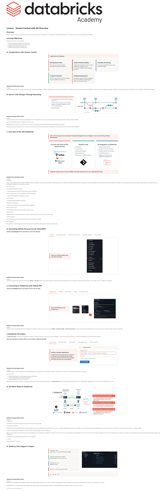

# Lecture: Version Control with Git Overview

**Course:** DevOps Essentials for Data Engineering  
**Lesson:** 14 (Lecture / SCORM)  
**Full Screenshot:** 

---

## Verbatim Lesson Content

	

	
Lecture - Version Control with Git Overview
Overview

Git version control is important because it provides a structured way to manage, track, and collaborate on code changes in software projects. Basically, it is an essential tool for modern software development and DevOps.

Learning Objectives

By the end of this lecture, you will be able to:

Describe organizational challenges with version control
Explain how Git-based repositories work on Databricks
Integrate GitHub repositories with Databricks
Identify supported file types in Databricks repos
	
A. Complications with Version Control
Organizational Challenges
Development Silos

Silos form over time that isolate development and team operations.

Lower Software Quality

Independent development leads to lower quality due to duplicate code, inconsistent standards, code reviewing, and more.

Unstable Versioning

It can become difficult to track, revert, and audit changes.

Frequent Updates

Without proper version control, managing frequent updates increases risk.

Scaling Development

Branching, merging, and CI/CD integration can become difficult, diminishing the ability to scale development.

	
EXPAND FOR ADDITIONAL NOTES

A lack of centralized version control leads to development silos, resulting in duplicate code, inconsistent standards, and lower software quality. Unstable versioning makes tracking, reverting, and auditing changes difficult, increasing risks when managing frequent updates. Additionally, branching, merging, and CI/CD integration become challenging, ultimately limiting scalability.

	
B. Secure Code Changes Through Branching
Complementary concept to CI/CD → Enables effective CI
Version control changes and run through quality control before merging to main branch and deploying
Example: Gitflow
	
EXPAND FOR ADDITIONAL NOTES

This is an example of a version control and code management over time with Gitflow, which is a common branching strategy that organizes branches for features, releases, and hotfixes.

Here you will see different versions of a feature (v0.1, v0.2, and v1.0).

Starting with the first version v0.1 on the main branch, branching occurs to the feature branch where testing and be properly performed in isolation.

Now that we know how complicated version control can be and we’ve seen an example of what securing code changes looks like, let’s take a look at how Git can be used with Databricks.

	
C. Overview of Git with Databricks
Git is a free and open-source software framework designed to track changes in source code during software development.
Common Git Tools and Git-Based Services
Benefits of Git
Collaboration
Version Control
Branching and Merging
Distributed Nature
Open Source and Widely Adopted
Git Integration on Databricks
Visual Git client and API
Supports Common Operations
Supports common Git providers
Visual diff comparison
Designed for authoring and collaborative Lakeflow Jobs

Integrate 3rd party tools into your Lakeflow Jobs that make sense for your organizational needs.
	
EXPAND FOR ADDITIONAL NOTES

Git Benefits:

Version control enables tracking code changes, facilitating rollback and collaboration. Branching and merging allow multiple developers to work in parallel and integrate changes efficiently. A distributed job ensures each developer has a full local repository, enhancing flexibility and reliability. Git is optimized for high-performance handling of large projects, and its security features use cryptographic integrity checks to prevent data corruption.

Git Tools & Services

GitHub, GitLab, Bitbucket, Azure DevOps

– Cloud-based repositories with CI/CD, issue tracking, and team collaboration.

Git CLI & GUI Clients (e.g., SourceTree, GitKraken, VS Code Git Integration)

– Provides different interfaces for managing repositories.

CI/CD Integration

– Automated testing and deployment pipelines.

Code Review & Collaboration

– Features like pull requests and merge approvals streamline teamwork.

Security & Access Control

– Role-based permissions and audit logs enhance repository security.

Visual Git Client -

Databricks provides a user-friendly interface for common Git operations, which we will discuss about on the next slide.

Seamless Integration -

Users can leverage remote Git repos while developing code inside Databricks notebooks

CI/CD Capabilities -

The repos REST API enables integration of data and AI projects into CI/CD pipelines, allowing users to automate Git Lakeflow Jobs

	
D. Generating GitHub Personal Access Token(PAT)
Click the red highlighted box in each step to move to the next step.
1. Settings
2. Developer settings
3. Personal access tokens
4. Fine-grained token
5. Classic token
Open your GitHub profile menu and select Settings.
	
EXPAND FOR ADDITIONAL NOTES

To generate a Personal Access Token (PAT) in GitHub, go to Settings → Developer settings, choose either fine-grained or classic tokens, and click Generate new token. Configure the required repository permissions, copy the token, and use it in Databricks for integration.

	
E. Connecting to Databricks with GitHub PAT
Click the red highlighted box in each step to move to the next step.
1. Profile Menu
2. Settings
3. Developer
4. Token
5. Linked Accounts
Open the Databricks user profile menu.
	
EXPAND FOR ADDITIONAL NOTES

Setting up a Personal Access Token (PAT) and connecting to your repositories is simple—click your user icon, go to Settings → Developer settings → Personal access tokens, then copy the token into the provided text box. Once saved, your account is linked and ready to use with your repository.

	
F. Databricks Git Folders

A Databricks Git folder is a folder in your workspace that is linked to a remote Git repository. It lets you run common Git operations — clone, commit, push, pull, and branch — directly from the Databricks UI, without leaving the workspace.

Select each tab below to explore what you can do inside a Databricks Git folder.
1. Clone a repo
2. Commit & push
3. Pull updates
4. Manage branches
5. Visual validation
Clone a remote repository

Create a Git folder by pasting your repository's HTTPS URL into the Create Git folder dialog. Databricks detects the provider automatically and clones the repo into your workspace.

Create Git folder
Git repository URL
https://github.com/<your-username>/databricks_devops.git
Git provider
GitHub  (detected automatically)
Create Git folder
	
EXPAND FOR ADDITIONAL NOTES

Databricks Git folders streamline development by tightly integrating version control systems into the Databricks ecosystem, making it easier to manage code collaboratively while adhering to best practices.

Use-cases include:

Collaborative development of machine learning models and ETL pipelines.
Source-controlling SQL queries for analytics workloads.
Automating deployments through CI/CD pipelines.

Walk through the tabs above to see the core Git-folder operations: cloning a repo by pasting its GitHub URL into the Create Git folder dialog, committing and pushing changes from the UI, pulling updates, managing branches, and reviewing a visual diff before you commit.

	
G. Git-Based Repos in Databricks
	
EXPAND FOR ADDITIONAL NOTES

1. Aha! Feature:

DB-3749 W2.0: Projects API private preview with tag and commit based checkouts | Aha!

2. Description of the features:

The Repos API provides programmatic access to git-based Re[ps that are part of the Workspace 2.0 effort. With the API, customers can integrate Databricks Repos with their CI/CD workflow. They can programmatically create/update/delete Repos, perform git operations, and specify Git versions when running Jobs based on notebooks in Repos.

3. Value of the feature (aka what databricks was before this feature, and what this feature will do for databricks)

Right now, many customers have built workarounds using the Databricks CLI to pull notebooks from Databricks, check them into Git, pull them from Git, and push them back to Databricks. This is not a very robust solution. With Repos and the Repos API we provide a native feature to pull code from a Git repository, check updates back into Git, and programmatically update this Repos using the Repos API

4. Associated summary slide bullet points: Repos API for CI/CD integration

5. Cloud: All

6. Deployment (MT, ST, Azure): GA

	
H. Arbitrary Files Support in Repos
Portability of code

Library files - use Python/R files as packages

Environment specification portability

Build packages from the same repo

Small data ease of use

Relative imports

Whatever you can do with files “just works”

.txt   .yml   .py   .csv   ...

	
EXPAND FOR ADDITIONAL NOTES

Arbitrary files are supported in repos, enabling portability of code for library files like Python and R. This makes it possible to build packages from the same repository, use relative imports, and structure your project in a way that best suits your needs.

	

© 2026 Databricks, Inc. All rights reserved. Apache, Apache Spark, Spark, the Spark Logo, Apache Iceberg, Iceberg, and the Apache Iceberg logo are trademarks of the Apache Software Foundation.

Privacy Policy | Terms of Use | Support

