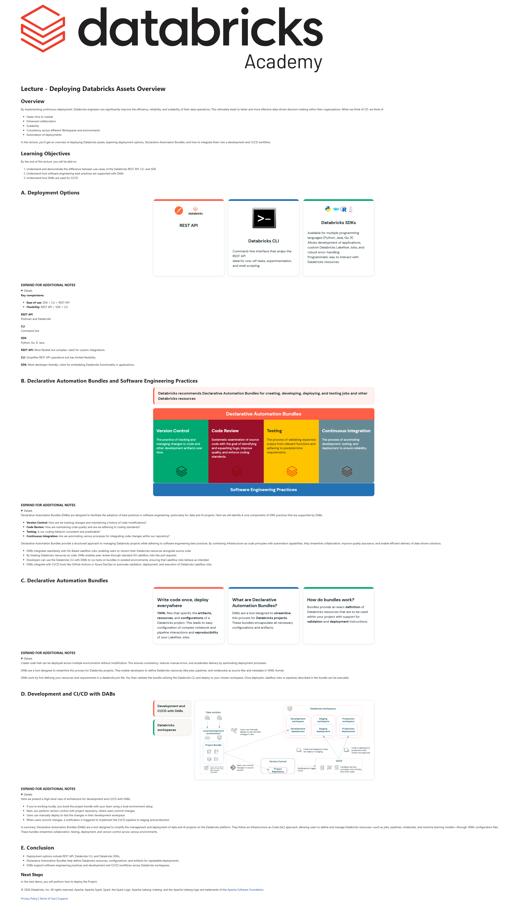

# Lecture: Deploying Databricks Assets Overview

**Course:** DevOps Essentials for Data Engineering  
**Lesson:** 15 (Lecture / SCORM)  
**Full Screenshot:** 

---

## Verbatim Lesson Content

	

	
Lecture - Deploying Databricks Assets Overview
Overview

By implementing continuous deployment, Databricks engineers can significantly improve the efficiency, reliability, and scalability of their data operations. This ultimately leads to faster and more effective data-driven decision-making within their organizations. When we think of CD, we think of

Faster time to market
Enhanced collaboration
Scalability
Consistency across different Workspaces and environments
Automation of deployments

In this lecture, you’ll get an overview of deploying Databricks assets, exploring deployment options, Declarative Automation Bundles, and how to integrate them into a development and CI/CD workflow.

Learning Objectives

By the end of this lecture, you will be able to:

Understand and demonstrate the difference between use-cases of the Databricks REST API, CLI, and SDK
Understand how software engineering best practices are supported with DABs
Understand how DABs are used for CI/CD
	
A. Deployment Options
REST API
Databricks CLI

Command-line interface that wraps the REST API
Ideal for one-off tasks, experimentation, and shell scripting

Databricks SDKs

Available for multiple programming languages (Python, Java, Go, R)
Allows development of applications, custom Databricks Lakeflow Jobs, and robust error-handling
Programmatic way to interact with Databricks resources

	
EXPAND FOR ADDITIONAL NOTES

Key comparisons:

Ease of use: SDK > CLI > REST API
Flexibility: REST API > SDK > CLI

REST API
Postman and Databricks

CLI
Command line

SDK
Python, Go, R, Java

REST API: Most flexible but complex—best for custom integrations.

CLI: Simplifies REST API operations but has limited flexibility.

SDK: Most developer-friendly—best for embedding Databricks functionality in applications.

	
B. Declarative Automation Bundles and Software Engineering Practices
Databricks recommends Declarative Automation Bundles for creating, developing, deploying, and testing jobs and other Databricks resources
Declarative Automation Bundles
Version Control

The practice of tracking and managing changes to code and other development artifacts over time.

Code Review

Systematic examination of source code with the goal of identifying and squashing bugs, improve quality, and enforce coding standards.

Testing

The process of validating expected output from relevant functions and adhering to predetermine requirements.

Continuous Integration

The process of automating development, testing, and deployment to ensure reliability.

Software Engineering Practices
	
EXPAND FOR ADDITIONAL NOTES

Declarative Automation Bundles (DABs) are designed to facilitate the adoption of best practices in software engineering, particularly for data and AI projects. Here we will identify 4 core components of SWE practices that are supported by DABs.

Version Control: How are we tracking changes and maintaining a history of code modifications?
Code Review: How are maintaining code quality and are we adhering to coding standards?
Testing: Is our coding behavior consistent and predictable?
Continuous Integration: Are we automating various processes for integrating code changes within our repository?

Declarative Automation Bundles provide a structured approach to managing Databricks projects while adhering to software engineering best practices. By combining infrastructure-as-code principles with automation capabilities, they streamline collaboration, improve quality assurance, and enable efficient delivery of data-driven solutions.

DABs integrates seamlessly with Git-Based Lakeflow Jobs, enabling users to version their Databricks resources alongside source code
By treating Databricks resources as code, DABs enables peer review through standard Git Lakeflow Jobs like pull requests
Developers can use the Databricks CLI with DABs to run tests on bundles in isolated environments, ensuring that Lakeflow Jobs behave as intended
DABs integrate with CI/CD tools like GitHub Actions or Azure DevOps to automate validation, deployment, and execution of Databricks Lakeflow Jobs
	
C. Declarative Automation Bundles
Write code once, deploy everywhere

YAML files that specify the artifacts, resources, and configurations of a Databricks project. This leads to easy configuration of complex notebook and pipeline interactions and reproducibility of your Lakeflow Jobs.

What are Declarative Automation Bundles?

DABs are a tool designed to streamline this process for Databricks projects. These bundles encapsulate all necessary configurations and artifacts.

How do bundles work?

Bundles provide an exact definition of Databricks resources that are to be used within your project with support for validation and deployment instructions.

	
EXPAND FOR ADDITIONAL NOTES

Create code that can be deployed across multiple environments without modification. This ensures consistency, reduces manual errors, and accelerates delivery by automating deployment processes.

DABs are a tool designed to streamline this process for Databricks projects. They enable developers to define Databricks resources (like jobs, pipelines, and notebooks) as source files and metadata in YAML format.

DABs work by first defining your resources and requirements in a databricks.yml file. You then validate the bundle utilizing the Databricks CLI and deploy to your chosen workspace. Once deployed, Lakeflow Jobs or pipelines described in the bundle can be executed.

	
D. Development and CI/CD with DABs
Development and CI/CD with DABs
Databricks workspaces
	
EXPAND FOR ADDITIONAL NOTES

Here we present a high-level view of architecture for development and CI/CD with DABs.

If you’re working locally, you build the project bundle with your team using a local environment setup.
Next, you perform version control with project repository, where users commit changes.
Users can manually deploy to test the changes in their development workspace
When users commit changes, a notification is triggered to implement the CI/CD pipeline to staging and production.

In summary, Declarative Automation Bundles (DABs) are a tool designed to simplify the management and deployment of data and AI projects on the Databricks platform. They follow an Infrastructure-as-Code (IaC) approach, allowing users to define and manage Databricks resources—such as jobs, pipelines, notebooks, and machine learning models—through YAML configuration files. These bundles streamline collaboration, testing, deployment, and version control across various environments.

	
E. Conclusion
Deployment options include REST API, Databricks CLI, and Databricks SDKs.
Declarative Automation Bundles help define Databricks resources, configurations, and artifacts for repeatable deployments.
DABs support software engineering practices and development and CI/CD workflows across Databricks workspaces.
Next Steps

In the next demo, you will perform how to deploy the Project.

	

© 2026 Databricks, Inc. All rights reserved. Apache, Apache Spark, Spark, the Spark Logo, Apache Iceberg, Iceberg, and the Apache Iceberg logo are trademarks of the Apache Software Foundation.

Privacy Policy | Terms of Use | Support

