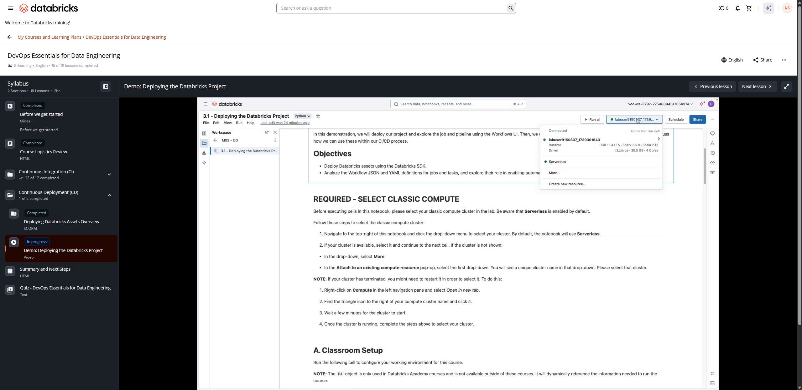

# Demo: Deploying the Databricks Project

**Course:** DevOps Essentials for Data Engineering  
**Lesson:** 16 (Demo)  
**Duration:** ~11 min (659s)  
**Screenshot:** 

---

## Overview & Learning Objectives

In this hands-on demonstration, the instructor walks through deploying a completed data engineering project using Databricks Asset Bundles (DABs) and the Databricks CLI into Staging and Production workspaces.

Key concepts demonstrated:
- Validating bundle configuration with `databricks bundle validate`.
- Deploying resources to a staging target with `databricks bundle deploy -t staging`.
- Running pipeline and job executions via `databricks bundle run`.
- Promoting changes to production targets with `databricks bundle deploy -t prod`.
- Inspecting generated Unity Catalog assets, jobs, and pipelines in the Databricks UI.

---

## Verbatim Video Transcript & Walkthrough

- **[00:00 - 00:03]** 欢迎来到演示 3.1：部署 Databricks 项目。
- **[00:04 - 00:07]** 它位于 M03 CD 文件夹中。
- **[00:08 - 00:10]** 这是本课程的最后一个演示。
- **[00:11 - 00:13]** 我们向下滚动，选择我们的 compute。
- **[00:15 - 00:16]** 它已经被选中了。
- **[00:17 - 00:23]** 在本次演示中，我们将简要介绍
- **[00:23 - 00:24]** 如何部署 Databricks 资产。
- **[00:25 - 00:29]** 我们会讲到如何通过 UI 来完成，也会讲到如何通过
- **[00:29 - 00:33]** SDK 来完成，然后再介绍此后最佳的推进方式。
- **[00:34 - 00:37]** 我们先从运行课堂设置开始。
- **[00:41 - 00:44]** 我们快速看一下最终的 Databricks 任务。
- **[00:44 - 00:47]** 在这一部分，我们将创建这个任务。
- **[00:47 - 00:50]** 再说一次，其中很多实现方式因情况而异，但在这个简单的
- **[00:50 - 00:55]** 场景中，我们会执行单元测试，执行我们
- **[00:55 - 00:58]** 之前创建的 DLT 管道，然后会有这个可视化
- **[00:58 - 01:00]** 来对数据进行可视化，对吧？
- **[01:00 - 01:04]** 对于更复杂的项目，你可以将它连接到你的版本控制，并
- **[01:04 - 01:06]** 在尝试连接时运行单元测试。
- **[01:06 - 01:09]** 这个可视化，你可以把它看作是一个仪表盘。
- **[01:10 - 01:13]** 而这就是我们想要创建的项目。
- **[01:14 - 01:17]** 好，同样，我们有我们的目录。
- **[01:17 - 01:20]** 再次强调，你必须确保这里有可用的目录。
- **[01:20 - 01:26]** 如果没有，你就必须重新运行 CI02 文件夹中的演示 2.1。
- **[01:28 - 01:29]** 我们先腾出一些界面空间。
- **[01:32 - 01:37]** 对我来说，在开发过程中，用 UI 来搭建
- **[01:37 - 01:40]** DLT 管道中的工作流是非常有帮助的。
- **[01:40 - 01:43]** 这样更方便，我们之后可以借助一些额外的文件来
- **[01:43 - 01:46]** 研究它是如何创建的，稍后我们会看一下这些文件。
- **[01:47 - 01:48]** 在这个场景中，我来运行这段代码。
- **[01:50 - 01:54]** 我们不会浪费时间手动构建它，我们的做法是：
- **[01:54 - 01:58]** 在课堂设置的幕后有 Databricks SDK，它会
- **[01:58 - 02:00]** 为我们创建工作流以供查看。
- **[02:00 - 02:03]** 同样，这只是为了不在构建工作流上浪费太多时间。
- **[02:03 - 02:05]** 这是本课程的一项先决条件。
- **[02:06 - 02:11]** 这个函数和这个函数是 Databricks Academy 实验环境专用的，
- **[02:11 - 02:12]** 但同样，它确实用到了 SDK。
- **[02:13 - 02:14]** 那么我们来完成以下操作。
- **[02:14 - 02:15]** 我来展开我的导航栏。
- **[02:16 - 02:17]** 我们来看一下工作流。
- **[02:18 - 02:20]** 现在，在最左侧的导航栏中，我右键点击
- **[02:20 - 02:23]** Workflow，然后在新标签页中打开。
- **[02:27 - 02:30]** SDK 为我创建了这个工作流，也就是 dev workflow，对吧？
- **[02:30 - 02:32]** 它使用 dev 数据和你的用户名。
- **[02:33 - 02:37]** 我选中它，然后点击 Run now。
- **[02:39 - 02:44]** 接下来你要做的就是按照这里的这些说明操作。
- **[02:44 - 02:48]** 在任务运行期间，我们要做的是……它大约需要五到
- **[02:48 - 02:54]** 七分钟才能完成，我们来讲一讲任务中正在发生的事情。
- **[02:54 - 02:57]** 第一个任务是运行单元测试。
- **[02:57 - 03:01]** 创建了一个 run_unit_tests 笔记本，它只负责运行单元测试、
- **[03:01 - 03:04]** 安装 pytest，你想想看。
- **[03:04 - 03:06]** 如果它报错，比如我们对某个函数做了一些开发，
- **[03:06 - 03:08]** 把某个地方弄坏了，它就会停止。
- **[03:09 - 03:13]** 如果单元测试通过，工作流就会继续进入 DLT 管道，
- **[03:13 - 03:15]** 也就是我们放置集成测试的地方。
- **[03:15 - 03:19]** 同样，目前这些都是在 dev 数据、dev 环境上运行的，
- **[03:19 - 03:21]** 如果其中出了问题，它就会失败。
- **[03:21 - 03:24]** 最终我们会得到这个交付物，也就是这个可视化。
- **[03:25 - 03:28]** 因此，每个任务都依赖于前一个任务。
- **[03:29 - 03:31]** 我们来看看其中一些任务。
- **[03:33 - 03:34]** 我们来看一下任务一。
- **[03:34 - 03:36]** 任务一正在运行。
- **[03:36 - 03:43]** 我们停留在 Runs 选项卡上，我右键点击这个绿色小方块，
- **[03:43 - 03:46]** 在它运行的时候，我们把它打开，看一看那个笔记本。
- **[03:49 - 03:54]** 这里是在导入 pytest、重启 Python。
- **[03:55 - 03:58]** 我们在执行这个 autoreload，你可以直接在
- **[03:58 - 04:01]** 这份文档里读到它的作用；简单说，如果你在开发，它会自动加载
- **[04:01 - 04:02]** 我们正在创建的软件包。
- **[04:02 - 04:03]** 在这里我们其实并不需要它。
- **[04:04 - 04:07]** 然后在这里，我们在单元测试演示中见过这段代码。
- **[04:07 - 04:10]** 我这就运行单元测试，也就是我们之前构建的这些单元测试。
- **[04:11 - 04:12]** 哦，它们出现了。
- **[04:12 - 04:13]** 它们运行完成了。
- **[04:13 - 04:15]** 这实际上通过了，所以我们可以继续了。
- **[04:17 - 04:19]** 我这就回到任务界面。
- **[04:21 - 04:22]** 我们回到 Runs。
- **[04:22 - 04:23]** 那个任务已经执行完毕。
- **[04:24 - 04:26]** 我们进入 health_etl。
- **[04:26 - 04:29]** 那是我们之前创建的 DLT 管道。
- **[04:29 - 04:33]** 我右键点击，在新标签页中打开。
- **[04:39 - 04:39]** 到了。
- **[04:39 - 04:42]** 哦，它给了我们一个很方便的链接，表示它创建了
- **[04:42 - 04:44]** 带有 update ID 的 DLT 管道。
- **[04:45 - 04:48]** 如果管道尚未创建，而它是由课堂设置脚本中的 SDK
- **[04:48 - 04:53]** 创建的，你会在这里看到这个任务，直到它准备就绪。
- **[04:53 - 04:55]** 但在本例中，我们之前已经创建过它了。
- **[04:56 - 05:00]** 它正在执行完全刷新，我们已经研究过这个了，所以
- **[05:00 - 05:01]** 这里我就不详细展开了。
- **[05:01 - 05:03]** 我们在之前的演示中看过这个。
- **[05:03 - 05:05]** 所以这只是我们之前讲过的 ETL。
- **[05:06 - 05:10]** 同样，需要指出的一点是上面的那个 YAML 文件，我们可以
- **[05:10 - 05:15]** 在后续使用 Databricks Asset Bundles 时利用它，这个我们
- **[05:15 - 05:16]** 在上一讲中讨论过。
- **[05:17 - 05:21]** 而且其中一些关键字有时也可以在 SDK 中使用，或者用法类似。
- **[05:22 - 05:26]** 但同样，它运行了，而我们仍处于 dev 阶段，所以它运行的是 dev。
- **[05:30 - 05:32]** 好，我把这个关掉。
- **[05:33 - 05:35]** 我们可以看到它仍在运行。
- **[05:37 - 05:39]** 最后一个任务是可视化。
- **[05:39 - 05:42]** 我们还没有真正研究过它，但那就是我们的交付物，对吧？
- **[05:42 - 05:43]** 这是一个非常简单的项目。
- **[05:44 - 05:46]** 你可以设想，也许你正在创建一个仪表盘，或者
- **[05:46 - 05:48]** 一个报表，或者这里的其他什么东西。
- **[05:48 - 05:55]** 我右键点击这个，它正在拉取这些小组件。
- **[05:56 - 05:59]** 这些是任务参数，也就是目录名称和目标名称。
- **[05:59 - 06:03]** 如果我在任务里向下滚动，我们创建了这个
- **[06:03 - 06:09]** 目录名称和这个目标 dev，我们把它们拉进来，因为同样，我们
- **[06:09 - 06:11]** 希望它最终能够是动态的。
- **[06:11 - 06:15]** 我们想把这个工作流部署到 stage，然后我们希望这些
- **[06:15 - 06:18]** 会针对 stage 做相应更改，之后我们再对 prod 做同样的事情。
- **[06:19 - 06:23]** 只要更改这些内容以及 DLT 中的配置，就能真正
- **[06:23 - 06:25]** 自动化整个部署过程。
- **[06:26 - 06:29]** 同样，我们在这里并不特别在意，但它会生成一个可视化图形，对吧？
- **[06:29 - 06:31]** 非常简单，没什么特别的。
- **[06:31 - 06:32]** 用的是 matplotlib。
- **[06:33 - 06:39]** 我们把这个关掉，可以看到 dev 中的那个任务已成功执行。
- **[06:39 - 06:45]** 这里的关键，也是我为什么喜欢一开始手动构建它的原因，就是
- **[06:46 - 06:50]** 我们可以查看这个 kebab 菜单，或者叫汉堡菜单，随你怎么称呼，然后
- **[06:50 - 06:53]** 我们可以把它切换到，比如说，JSON。
- **[06:54 - 07:00]** 而在这个 JSON 里，我们可以找到大量信息，从而真正开始
- **[07:00 - 07:02]** 那个持续部署或持续交付，我们可以在其中
- **[07:02 - 07:10]** 开始自动化地把它部署到 dev、stage 和 prod，在那里我们
- **[07:10 - 07:12]** 可以查看其中的一些参数。
- **[07:13 - 07:15]** 我们可以看到这里设置的参数。
- **[07:15 - 07:19]** 通常，如果我使用 SDK，我会
- **[07:19 - 07:23]** 以此为基线，然后查阅文档，直接开始
- **[07:23 - 07:26]** 编写代码来真正部署它。
- **[07:26 - 07:30]** 在我们的例子中，这只会被部署到 dev，但我需要
- **[07:30 - 07:34]** 编写一些 Python 代码，也许运行一个循环，去切换我需要
- **[07:34 - 07:35]** 切换的内容，而这需要大量工作。
- **[07:35 - 07:41]** 另一个值得一看的是，如果我们进入 kebab 菜单，点击将代码切换为 YAML。
- **[07:41 - 07:45]** 这确实是最佳的推进方式，它会创建
- **[07:45 - 07:49]** 一个 YAML 文件，你随后可以在 Databricks Asset Bundles 中使用它。
- **[07:49 - 07:53]** 它们要清晰得多，你可以通过 Databricks CLI
- **[07:54 - 07:56]** 来使用 Databricks Asset Bundles。
- **[07:56 - 08:00]** 在 Databricks CLI 中，你可以把这些内容
- **[08:00 - 08:03]** 与你的 DABs，也就是 Databricks Asset Bundles 组合在一起，开始自动化
- **[08:03 - 08:07]** 那个部署，也就是持续交付、持续部署。
- **[08:08 - 08:10]** 但目前，本课程不会深入到那一步。
- **[08:10 - 08:13]** 本课程更侧重于 CI，也就是持续集成
- **[08:13 - 08:18]** 部分的基础知识，所以我们回到这里，回到我们的任务。
- **[08:22 - 08:24]** 最后，任务应该已经完成了。
- **[08:26 - 08:30]** 我们看了工作流的不同 JSON 和 YAML 配置，
- **[08:30 - 08:32]** 其中包含了我们所需的一切。
- **[08:32 - 08:33]** 我们是用 DLT 来完成的。
- **[08:34 - 08:39]** 但要手动创建的话，就我而言，我会去取用 YAML，然后
- **[08:39 - 08:41]** 构建我的 DAB 来部署所有内容。
- **[08:42 - 08:46]** 但我确实想给你展示一点：假设你想使用 SDK 或者
- **[08:46 - 08:51]** REST API，你仍然可以，但我们来看一下用于创建
- **[08:51 - 08:53]** 我们上面所做的那个工作流的 SDK 代码。
- **[08:53 - 08:58]** 我点击这个，它会带我们进入一个课堂设置脚本，
- **[08:58 - 09:02]** 这不是本课程的重点，但它会带你进入本演示的设置。
- **[09:04 - 09:09]** 如果我们进入第五个单元格，这里就是代码，也就是
- **[09:09 - 09:15]** 我们用来模拟手动创建工作流的 Databricks SDK 代码，对吧？
- **[09:15 - 09:17]** 我们只是运行它，这样就不必手动去做了。
- **[09:18 - 09:19]** 但这就是全部代码。
- **[09:20 - 09:24]** 同样，这并不……这是一个相当简单的、需要我们手动编写的工作流。
- **[09:26 - 09:29]** 再说一次，这不是一门 SDK 课程，但这就是全部代码。
- **[09:29 - 09:31]** 那么现在思考一下这个问题：
- **[09:34 - 09:40]** 如果我想用 SDK 来部署，我该如何使用这段代码；或者如果我想
- **[09:40 - 09:44]** 使用 REST API；又或者这里最佳的推进方式是 DABS，也就是 Databricks Asset
- **[09:44 - 09:50]** Bundles——那么我该如何采用其中一种方法，自动地把这些
- **[09:50 - 09:52]** 资产部署到 dev、stage 和 prod 上运行呢？
- **[09:53 - 09:58]** 我该如何为我的 DLT 管道或任务参数化这些值，
- **[09:58 - 10:00]** 以便选择其中一个环境？
- **[10:01 - 10:04]** 当我开始创建循环来做这些事情，以及创建列表和
- **[10:04 - 10:08]** 字典（这大概是我最初会采用的方法）时，
- **[10:09 - 10:11]** 我该如何在后续持续维护它呢？
- **[10:11 - 10:14]** 现在我们可以回到 DevOps，问自己：“那么，我是否要创建一些小函数，
- **[10:14 - 10:17]** 然后对这些函数进行单元测试，再开始部署所有内容呢？”
- **[10:17 - 10:21]** 那么我又该如何把所有这些自动化地整合在一起，我该如何
- **[10:21 - 10:23]** 建立这套持续集成和持续交付，真正
- **[10:23 - 10:25]** 把一切整合到一起？
- **[10:26 - 10:31]** 而在这个环境中，为你的 CD 从这里继续推进，真正最佳的方式
- **[10:31 - 10:32]** 就是 Databricks Asset Bundles。
- **[10:33 - 10:38]** 而这大概就是从这门基础课程之后的下一步，
- **[10:38 - 10:41]** 也就是专注于使用 DABS 进行部署。
- **[10:42 - 10:46]** 这里有一些链接供你查看，应该还有一些
- **[10:46 - 10:50]** 其他课程，或某门课程，你可以看看，以进一步了解 DABS。
- **[10:51 - 10:52]** 这就是最后一个演示了。
- **[10:53 - 10:54]** 感谢观看。

---

## Key Takeaways

1. **Databricks Asset Bundles (DABs) Workflow:**
   - Bundles treat data pipelines, jobs, dashboards, and ML models as code defined in `databricks.yml`.
   - `bundle validate`: Catches syntax and reference errors before hitting the workspace API.
   - `bundle deploy`: Synchronizes artifacts, creates or updates job/pipeline definitions, and attaches appropriate permissions.

2. **Multi-Environment Promotion:**
   - Targets (`dev`, `staging`, `prod`) allow deploying identical logic against different compute, catalogs, and schedules with zero code duplication.
