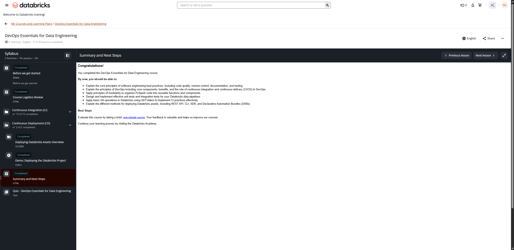

# Summary and Next Steps

**Course:** DevOps Essentials for Data Engineering  
**Lesson:** 17 (HTML / Summary)  
**Screenshot:** 

---

## Verbatim Summary

### Congratulations!

You completed the **DevOps Essentials for Data Engineering** course.

By now, you should be able to:

- **Explain the core principles of software engineering best practices**, including code quality, version control, documentation, and testing.
- **Explain the principles of DevOps** including core components, benefits, and the role of continuous integration and continuous delivery (CI/CD) in DevOps.
- **Apply principles of modularity** to organize PySpark code into reusable functions and components.
- **Design and implement effective unit tests and integration tests** for your Databricks data pipelines.
- **Apply basic Git operations in Databricks** using Git Folders to implement CI practices effectively.
- **Explain the different methods for deploying Databricks assets**, including REST API, CLI, SDK, and Declarative Automation Bundles (DABs).

---

## Next Steps

- Evaluate this course by taking a brief, one-minute survey. Your feedback is valuable and helps us improve our courses.
- Continue your learning journey by visiting the **Databricks Academy**.
