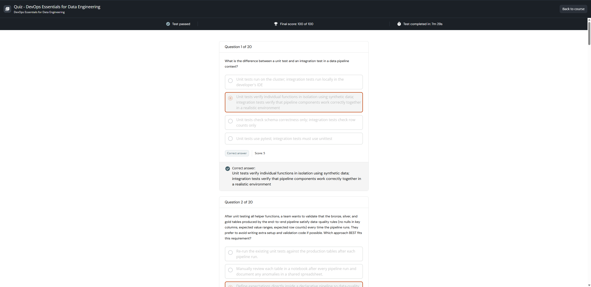

# Quiz - DevOps Essentials for Data Engineering

**Course:** DevOps Essentials for Data Engineering  
**Lesson:** 18 (Graded Assessment / Test)  
**Passing Score:** 80% (16/20)  
**Achieved Score:** 100% (20/20) - PASSED  
**Screenshot:** 

---

## Verbatim Questions and Verified Answer Key (100% Score)

Question 1 of 20

What is the difference between a unit test and an integration test in a data pipeline context?

Unit tests run on the cluster; integration tests run locally in the developer's IDE

Unit tests verify individual functions in isolation using synthetic data; integration tests verify that pipeline components work correctly together in a realistic environment

Unit tests check schema correctness only; integration tests check row counts only

Unit tests use pytest; integration tests must use unittest

Options
You gave the correct answer and your score is 5
Correct answer
Score: 5
Correct answer:

Unit tests verify individual functions in isolation using synthetic data; integration tests verify that pipeline components work correctly together in a realistic environment

Question 2 of 20

After unit testing all helper functions, a team wants to validate that the bronze, silver, and gold tables produced by the end-to-end pipeline satisfy data-quality rules (no nulls in key columns, expected value ranges, expected row counts) every time the pipeline runs. They prefer to avoid writing extra setup and validation code if possible. Which approach BEST fits this requirement?

Re-run the existing unit tests against the production tables after each pipeline run.

Manually review each table in a notebook after every pipeline run and document any anomalies in a shared spreadsheet.

Define expectations directly inside a declarative pipeline so data-quality rules are evaluated inline as each table is built and are visible in the pipeline UI.

Build a separate workflow with multiple notebook tasks that re-read each output table and run validation queries after the pipeline finishes.

Options
You gave the correct answer and your score is 5
Correct answer
Score: 5
Correct answer:

Define expectations directly inside a declarative pipeline so data-quality rules are evaluated inline as each table is built and are visible in the pipeline UI.

Question 3 of 20

In a PySpark pipeline, the gold layer is created using a SQL aggregation. Why might this aggregation logic be placed inside a dedicated function rather than written inline in the pipeline notebook?

A function can accept catalog, schema, and table name as parameters, making the same aggregation reusable across dev, stage, and prod

SQL cannot be executed inline in a PySpark notebook without a dedicated function wrapper

Functions automatically cache the aggregation result to avoid recomputation

Inline SQL statements are not supported by Delta Live Tables

Options
You gave the correct answer and your score is 5
Correct answer
Score: 5
Correct answer:

A function can accept catalog, schema, and table name as parameters, making the same aggregation reusable across dev, stage, and prod

Question 4 of 20

Which of the following scenarios would integration testing catch that unit testing would NOT?

A join condition in the pipeline that silently drops rows when moving from bronze to silver

A schema function that returns a field with IntegerType instead of DoubleType

A column renaming function that converts names to lowercase instead of uppercase

A mapping function that returns 'Unknown' for a null input instead of the expected category label

Options
You gave the correct answer and your score is 5
Correct answer
Score: 5
Correct answer:

A join condition in the pipeline that silently drops rows when moving from bronze to silver

Question 5 of 20

A pipeline must run the same transformation logic in development, stage, and production, but each environment reads data from a different raw source path and writes to a different catalog. What is the BEST way to design the pipeline so the same code can be promoted across environments?

Maintain three separate copies of the pipeline notebook, one per environment, and update each copy when the logic changes.

Hard-code the production paths and have developers comment out lines locally when they want to run against dev data.

Parameterize the pipeline with configuration variables (such as target environment and raw data path) that are injected at deployment time, while keeping the transformation logic identical across environments.

Use a single shared catalog for all environments and rely on table-name prefixes to distinguish dev, stage, and prod data.

Options
You gave the correct answer and your score is 5
Correct answer
Score: 5
Correct answer:

Parameterize the pipeline with configuration variables (such as target environment and raw data path) that are injected at deployment time, while keeping the transformation logic identical across environments.

Question 6 of 20

What happens when a unit test that uses assertDataFrameEqual is run with an intentionally wrong expected value?

The test passes silently because assertDataFrameEqual only checks row counts

The SparkSession terminates to prevent further incorrect comparisons

The test is skipped automatically because the expected value does not match the schema

The test raises an error showing exactly which values differ between the actual and expected DataFrames

Options
You gave the correct answer and your score is 5
Correct answer
Score: 5
Correct answer:

The test raises an error showing exactly which values differ between the actual and expected DataFrames

Question 7 of 20

A team currently builds and edits a multi-task job (unit tests, the ETL pipeline, and a final visualization) by clicking through the workspace UI in each environment. They want changes to the job definition to be reviewed in pull requests and deployed identically across development, stage, and production. Which option BEST addresses these needs?

Create separate UI-built jobs in each environment and rely on engineers to manually keep the three jobs in sync.

Export the job JSON from the UI after each change and paste it into a shared wiki page for reference.

Continue building jobs in the UI and capture screenshots of the configuration to attach to pull requests.

Define the job as code (for example, using an asset bundle or the Databricks SDK) so the configuration is version-controlled and can be deployed consistently across environments.

Options
You gave the correct answer and your score is 5
Correct answer
Score: 5
Correct answer:

Define the job as code (for example, using an asset bundle or the Databricks SDK) so the configuration is version-controlled and can be deployed consistently across environments.

Question 8 of 20

Why is it better to use a small synthetic DataFrame created with spark.createDataFrame() in a unit test rather than reading from an actual Delta table?

Delta tables cannot be read within pytest test functions

The assertDataFrameEqual function only works with in-memory DataFrames

Synthetic DataFrames isolate the test from external dependencies, making tests faster and environment-independent

Reading from Delta tables in tests automatically triggers a full table scan that is prohibited in CI

Options
You gave the correct answer and your score is 5
Correct answer
Score: 5
Correct answer:

Synthetic DataFrames isolate the test from external dependencies, making tests faster and environment-independent

Question 9 of 20

Which of the following BEST describes why a function that returns a PySpark Column expression is preferred over a function that returns a transformed DataFrame for mapping operations?

Column expressions automatically handle null values without additional logic

Column expressions are composable and lazily evaluated, making them reusable inside withColumn or select calls

Column expressions are executed eagerly, which speeds up transformations

DataFrames returned from functions cannot be written to Delta tables

Options
You gave the correct answer and your score is 5
Correct answer
Score: 5
Correct answer:

Column expressions are composable and lazily evaluated, making them reusable inside withColumn or select calls

Question 10 of 20

In a Lakeflow Spark Declarative Pipeline, what are expectations used for?

They define the compute cluster size for the pipeline

They specify which Unity Catalog catalog the pipeline should write to

They configure the schedule on which the pipeline runs automatically

They enforce data quality rules on pipeline tables, and their results are captured in the pipeline event log

Options
You gave the correct answer and your score is 5
Correct answer
Score: 5
Correct answer:

They enforce data quality rules on pipeline tables, and their results are captured in the pipeline event log

Question 11 of 20

Which of the following BEST describes the role of the src/ folder in a well-structured Databricks DevOps project?

It stores raw data files and CSV inputs for the pipeline

It is a temporary scratch space for exploratory notebook development

It holds only unit test files that are run by pytest during CI

It contains production source code and helper functions that are deployed and tested across environments

Options
You gave the correct answer and your score is 5
Correct answer
Score: 5
Correct answer:

It contains production source code and helper functions that are deployed and tested across environments

Question 12 of 20

What is the main advantage of creating a Databricks Workflow using the SDK or DABs compared to building it manually through the UI?

The SDK eliminates the need for YAML configuration files when deploying with DABs

SDK-created jobs run faster because they bypass the Databricks REST API layer

The code can be version-controlled, parameterized, and executed automatically by a CI/CD system to recreate identical jobs across environments

SDK-created jobs automatically scale compute resources based on the target environment

Options
You gave the correct answer and your score is 5
Correct answer
Score: 5
Correct answer:

The code can be version-controlled, parameterized, and executed automatically by a CI/CD system to recreate identical jobs across environments

Question 13 of 20

What is a Personal Access Token (PAT) used for when connecting Databricks Git Folders to GitHub?

It authenticates Databricks to perform Git operations (clone, push, pull) on GitHub repositories on behalf of the user

It encrypts notebook content before it is pushed to the GitHub repository

It grants Unity Catalog read access to files stored in GitHub repositories

It stores the Databricks cluster configuration used for running notebooks

Options
You gave the correct answer and your score is 5
Correct answer
Score: 5
Correct answer:

It authenticates Databricks to perform Git operations (clone, push, pull) on GitHub repositories on behalf of the user

Question 14 of 20

Which of the following is a direct benefit of modularizing code when working in a team environment?

Modular functions are automatically parallelized across Spark workers

Team members can work on separate modules without causing conflicts in shared code

Modular code eliminates the need for version control tools like Git

Modular code runs on fewer executor nodes, reducing cluster costs

Options
You gave the correct answer and your score is 5
Correct answer
Score: 5
Correct answer:

Team members can work on separate modules without causing conflicts in shared code

Question 15 of 20

What is a key drawback of using Databricks Jobs with notebook tasks for integration testing compared to using Lakeflow Spark Declarative Pipeline expectations?

Databricks Jobs do not support notebook tasks in the free tier

Job-based integration tests run on Serverless compute only, which lacks access to Unity Catalog volumes

Job-based tests require additional code for setup, dynamic parameter passing, and orchestration, increasing implementation complexity

Jobs cannot read from Delta tables created by a Spark Declarative Pipeline

Options
You gave the correct answer and your score is 5
Correct answer
Score: 5
Correct answer:

Job-based tests require additional code for setup, dynamic parameter passing, and orchestration, increasing implementation complexity

Question 16 of 20

A team has written a helper that maps a numeric column to a categorical label. They want a fast, deterministic unit test that runs in seconds and does not depend on any cloud storage or Delta table. Which approach BEST fits this requirement?

Run the full bronze-to-gold pipeline end-to-end and check that the final aggregated counts look reasonable.

Write the function output to a temporary table and run an ad hoc SQL query to spot-check the values.

Read a sample from the production silver table, apply the function, and visually inspect a few rows of the result.

Build a small in-memory DataFrame using spark.createDataFrame() with representative inputs and a static expected DataFrame, then compare them with assertDataFrameEqual.

Options
You gave the correct answer and your score is 5
Correct answer
Score: 5
Correct answer:

Build a small in-memory DataFrame using spark.createDataFrame() with representative inputs and a static expected DataFrame, then compare them with assertDataFrameEqual.

Question 17 of 20

Why should unit test functions be named with the test_ prefix in pytest?

Functions without this prefix are excluded from Python bytecode compilation

It prevents the function from being imported by production code accidentally

The prefix signals to Spark that the function should run on the driver node only

pytest uses naming conventions to automatically discover and collect test functions without explicit registration

Options
You gave the correct answer and your score is 5
Correct answer
Score: 5
Correct answer:

pytest uses naming conventions to automatically discover and collect test functions without explicit registration

Question 18 of 20

A data engineer has built an ETL pipeline as one large notebook that ingests a CSV file, applies several transformations to produce bronze, silver, and gold tables, and writes Delta tables. The team now wants to introduce automated unit tests as part of CI. Which approach is the BEST first step before writing the tests?

Add try/except blocks around every transformation cell so failures can be logged.

Refactor the transformation logic into small reusable functions stored in a separate Python module that can be imported by both the pipeline and the tests.

Run the existing notebook against the production dataset and compare row counts manually.

Switch all transformations to Spark SQL so they can be validated by reading the resulting tables.

Options
You gave the correct answer and your score is 5
Correct answer
Score: 5
Correct answer:

Refactor the transformation logic into small reusable functions stored in a separate Python module that can be imported by both the pipeline and the tests.

Question 19 of 20

What is the main reason to break a PySpark ETL pipeline into smaller, reusable functions?

It reduces the number of Spark jobs submitted to the cluster

It makes each piece of logic easier to test, debug, and maintain independently

It prevents other team members from modifying shared code

It automatically improves query performance by caching intermediate results

Options
You gave the correct answer and your score is 5
Correct answer
Score: 5
Correct answer:

It makes each piece of logic easier to test, debug, and maintain independently

Question 20 of 20

A Lakeflow Spark Declarative Pipeline uses a target configuration variable set to 'development', 'stage', or 'production'. What is the main benefit of this design?

It allows the pipeline to use different compute cluster types per environment

It prevents the pipeline from writing to the wrong catalog by enforcing Unity Catalog access controls

It automatically selects the correct Delta table version for time travel queries

The same pipeline code can be deployed to dev, stage, and prod by changing only the configuration values, without modifying the pipeline logic

Options
You gave the correct answer and your score is 5
Correct answer
Score: 5
Correct answer:

The same pipeline code can be deployed to dev, stage, and prod by changing only the configuration values, without modifying the pipeline logic

---

## Master Question & Answer Summary for The Data Dojo

### Question 1: Unit Test vs. Integration Test
- **Question:** What is the difference between a unit test and an integration test in a data pipeline context?
- **Correct Answer:** Unit tests verify individual functions in isolation using synthetic data; integration tests verify that pipeline components work correctly together in a realistic environment.

### Question 2: End-to-End Data Quality Validation
- **Question:** After unit testing all helper functions, a team wants to validate that the bronze, silver, and gold tables produced by the end-to-end pipeline satisfy data-quality rules (no nulls in key columns, expected value ranges, expected row counts) every time the pipeline runs. They prefer to avoid writing extra setup and validation code if possible. Which approach BEST fits this requirement?
- **Correct Answer:** Define expectations directly inside a declarative pipeline so data-quality rules are evaluated inline as each table is built and are visible in the pipeline UI.

### Question 3: Parameterizing Aggregation Functions
- **Question:** In a PySpark pipeline, the gold layer is created using a SQL aggregation. Why might this aggregation logic be placed inside a dedicated function rather than written inline in the pipeline notebook?
- **Correct Answer:** A function can accept catalog, schema, and table name as parameters, making the same aggregation reusable across dev, stage, and prod.

### Question 4: Integration Test vs. Unit Test Scenario
- **Question:** Which of the following scenarios would integration testing catch that unit testing would NOT?
- **Correct Answer:** A join condition in the pipeline that silently drops rows when moving from bronze to silver.

### Question 5: Multi-Environment Promotion Strategy
- **Question:** A pipeline must run the same transformation logic in development, stage, and production, but each environment reads data from a different raw source path and writes to a different catalog. What is the BEST way to design the pipeline so the same code can be promoted across environments?
- **Correct Answer:** Parameterize the pipeline with configuration variables (such as target environment and raw data path) that are injected at deployment time, while keeping the transformation logic identical across environments.

### Question 6: Behavior of assertDataFrameEqual
- **Question:** What happens when a unit test that uses assertDataFrameEqual is run with an intentionally wrong expected value?
- **Correct Answer:** The test raises an error showing exactly which values differ between the actual and expected DataFrames.

### Question 7: Job Definition as Code
- **Question:** A team currently builds and edits a multi-task job (unit tests, the ETL pipeline, and a final visualization) by clicking through the workspace UI in each environment. They want changes to the job definition to be reviewed in pull requests and deployed identically across development, stage, and production. Which option BEST addresses these needs?
- **Correct Answer:** Define the job as code (for example, using an asset bundle or the Databricks SDK) so the configuration is version-controlled and can be deployed consistently across environments.

### Question 8: Synthetic Data in Unit Tests
- **Question:** Why is it better to use a small synthetic DataFrame created with spark.createDataFrame() in a unit test rather than reading from an actual Delta table?
- **Correct Answer:** Synthetic DataFrames isolate the test from external dependencies, making tests faster and environment-independent.

### Question 9: Returning Column Expressions
- **Question:** Which of the following BEST describes why a function that returns a PySpark Column expression is preferred over a function that returns a transformed DataFrame for mapping operations?
- **Correct Answer:** Column expressions are composable and lazily evaluated, making them reusable inside withColumn or select calls.

### Question 10: Role of Expectations
- **Question:** In a Lakeflow Spark Declarative Pipeline, what are expectations used for?
- **Correct Answer:** They enforce data quality rules on pipeline tables, and their results are captured in the pipeline event log.

### Question 11: Purpose of src/ Directory
- **Question:** Which of the following BEST describes the role of the src/ folder in a well-structured Databricks DevOps project?
- **Correct Answer:** It contains production source code and helper functions that are deployed and tested across environments.

### Question 12: Workflows as Code (SDK/DABs) Advantage
- **Question:** What is the main advantage of creating a Databricks Workflow using the SDK or DABs compared to building it manually through the UI?
- **Correct Answer:** The code can be version-controlled, parameterized, and executed automatically by a CI/CD system to recreate identical jobs across environments.

### Question 13: GitHub Personal Access Token
- **Question:** What is a Personal Access Token (PAT) used for when connecting Databricks Git Folders to GitHub?
- **Correct Answer:** It authenticates Databricks to perform Git operations (clone, push, pull) on GitHub repositories on behalf of the user.

### Question 14: Team Collaboration and Modularity
- **Question:** Which of the following is a direct benefit of modularizing code when working in a team environment?
- **Correct Answer:** Team members can work on separate modules without causing conflicts in shared code.

### Question 15: Drawbacks of Job-Based Testing
- **Question:** What is a key drawback of using Databricks Jobs with notebook tasks for integration testing compared to using Lakeflow Spark Declarative Pipeline expectations?
- **Correct Answer:** Job-based tests require additional code for setup, dynamic parameter passing, and orchestration, increasing implementation complexity.

### Question 16: Fast In-Memory Unit Testing
- **Question:** A team has written a helper that maps a numeric column to a categorical label. They want a fast, deterministic unit test that runs in seconds and does not depend on any cloud storage or Delta table. Which approach BEST fits this requirement?
- **Correct Answer:** Build a small in-memory DataFrame using spark.createDataFrame() with representative inputs and a static expected DataFrame, then compare them with assertDataFrameEqual.

### Question 17: Pytest test_ Prefix Convention
- **Question:** Why should unit test functions be named with the test_ prefix in pytest?
- **Correct Answer:** pytest uses naming conventions to automatically discover and collect test functions without explicit registration.

### Question 18: First Step to Automated CI
- **Question:** A data engineer has built an ETL pipeline as one large notebook that ingests a CSV file, applies several transformations to produce bronze, silver, and gold tables, and writes Delta tables. The team now wants to introduce automated unit tests as part of CI. Which approach is the BEST first step before writing the tests?
- **Correct Answer:** Refactor the transformation logic into small reusable functions stored in a separate Python module that can be imported by both the pipeline and the tests.

### Question 19: Value of Smaller Functions
- **Question:** What is the main reason to break a PySpark ETL pipeline into smaller, reusable functions?
- **Correct Answer:** It makes each piece of logic easier to test, debug, and maintain independently.

### Question 20: Target Variable Environment Configuration
- **Question:** A Lakeflow Spark Declarative Pipeline uses a target configuration variable set to 'development', 'stage', or 'production'. What is the main benefit of this design?
- **Correct Answer:** The same pipeline code can be deployed to dev, stage, and prod by changing only the configuration values, without modifying the pipeline logic.
