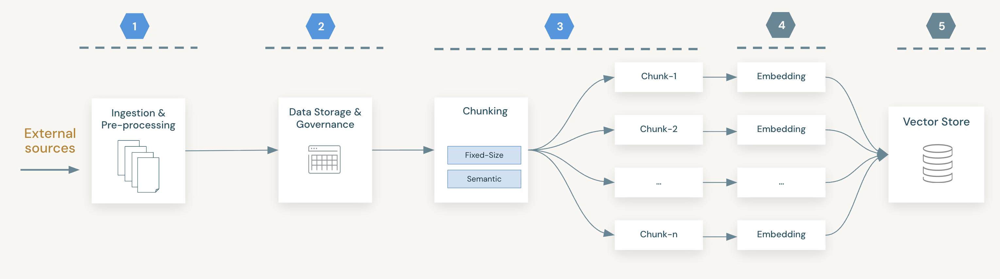
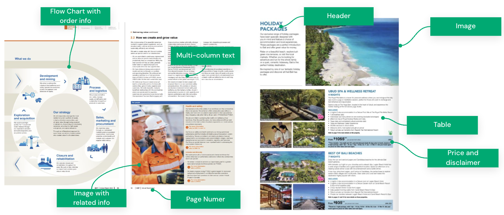
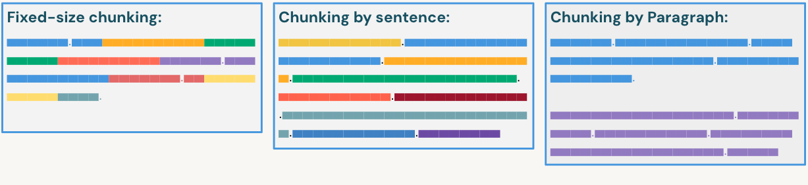
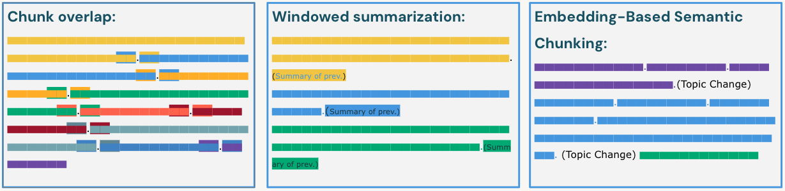

# Parsing de documentos y chunking

## Introduccion

La efectividad de una aplicacion de **Retrieval Augmented Generation (RAG)** esta fundamentalmente limitada por la calidad de los datos que recupera. Antes de generar embeddings, los datos crudos no estructurados, como PDFs, archivos HTML e imagenes, deben ingerirse, almacenarse y transformarse en un formato que los modelos de lenguaje grandes (**LLMs**) puedan interpretar.

Esta leccion se enfoca en la etapa de preparacion de datos dentro de **Databricks Intelligence Platform**, aprovechando especificamente **Delta Lake** para almacenamiento y **Unity Catalog** para gobernanza. Examinaremos la funcion nativa `ai_parse_document` para extraer texto estructurado desde archivos binarios, y exploraremos estrategias criticas de **chunking** de texto, pasando de divisiones basicas de tamano fijo a metodos conscientes del contexto.

## Objetivos de la leccion

- Explicar el rol de Delta Lake y Unity Catalog Volumes en el almacenamiento de datos no estructurados para RAG.
- Describir la funcionalidad de Databricks AI Functions, especificamente `ai_parse_document`, y sus capacidades v2.0, como descripcion de figuras.
- Identificar patrones eficientes de ingestion usando Autoloader y Spark Declarative Pipelines (SDP).
- Comparar y contrastar estrategias de chunking de tamano fijo, recursivo y semantico basado en embeddings.
- Mapear herramientas y frameworks estandar usados para parsing y chunking en Databricks.

## A. Arquitectura de almacenamiento y procesamiento de datos

En una arquitectura RAG, el almacenamiento de datos debe acomodar tanto archivos fuente crudos como texto procesado y estructurado. **Delta Lake** actua como la capa unificada de administracion de datos, entregando transacciones ACID y versionado para todos los tipos de datos. Aunque las tablas Delta estan optimizadas para datos estructurados, los flujos RAG normalmente comienzan con archivos no estructurados, como PDFs.

**Unity Catalog Volumes** proporciona una capa de gobernanza para estos archivos no tabulares. Los volumes permiten administrar el acceso a archivos crudos usando el mismo modelo unificado de permisos aplicado a tablas y modelos. Al almacenar documentos crudos en Volumes y texto procesado en Delta Tables, se mantiene linaje completo desde el archivo original hasta el texto fragmentado usado para recuperacion.

**Nota:** los Volumes almacenan los archivos "crudos" (Bronze), mientras que las Delta Tables almacenan el texto "parseado y fragmentado" (Silver/Gold).

A continuacion se presenta un esquema del flujo de ingestion y procesamiento de datos. En un caso de uso tipico, y en este modulo, seguimos este flujo enfocandonos en los primeros tres pasos:

1. **Ingestion y preprocesamiento de datos:** leer archivos desde un Unity Catalog Volume y parsearlos usando una funcion de IA.
2. **Almacenamiento de datos:** guardar los documentos parseados en Delta Lake y aplicar los controles de gobernanza necesarios. La gobernanza no se cubre en detalle en este modulo.
3. **Chunking:** dividir los datos en fragmentos adecuados para la generacion de embeddings.



**Figura 1.** Este diagrama muestra cinco pasos principales del flujo de ingestion, procesamiento y generacion de embeddings.

## B. Procesamiento de documentos con AI Functions

El procesamiento de documentos es esencial para construir una base de conocimiento de alta calidad para agentes de recuperacion, especialmente cuando los documentos son la fuente primaria de conocimiento. Los documentos del mundo real suelen tener estructuras complejas. Para enfrentar estos desafios, usamos modelos avanzados como LLMs y LLMs con capacidades OCR, disenados especificamente para interpretar y extraer informacion desde diversos formatos documentales.

Databricks proporciona funciones nativas de IA para simplificar este proceso. En particular, la funcion `ai_parse_document` permite un parsing robusto de PDFs e imagenes, extrayendo contenido estructurado e informacion de layout directamente desde archivos crudos.

### B1. Desafios del procesamiento de documentos

Parsear documentos reales es complejo porque rara vez son solo texto plano. Los documentos suelen contener una mezcla de imagenes, layouts multicolumna, tablas, figuras, encabezados, subencabezados y numeros de pagina. Extraer correctamente esta informacion manteniendo su significado semantico presenta varios desafios:

- **Informacion jerarquica:** los graficos y diagramas suelen comunicar relaciones jerarquicas que deben preservarse.
- **Preservacion del orden:** en documentos multicolumna, el orden de lectura es critico; un parsing ingenuo puede mezclar columnas incorrectamente.
- **Integridad contextual:** las imagenes, como graficos o fotos de productos, deben mantenerse asociadas con sus descripciones de texto relevantes.



**Figura 2.** Esta imagen muestra un ejemplo de pagina con layout complejo.

### B2. LLMs y OCR para parsing

Para abordar estos desafios, los enfoques modernos aprovechan modelos de lenguaje grandes y modelos OCR (**Optical Character Recognition**). A diferencia de los parsers tradicionales de texto, estos modelos pueden "ver" el layout del documento. Los modelos OCR identifican texto dentro de imagenes, mientras que los LLMs multimodales interpretan la disposicion espacial de los elementos, comprendiendo que una leyenda pertenece a la imagen superior o que una tabla se extiende por multiples paginas.

### B3. Uso de `ai_parse_document`

Databricks simplifica este proceso con **AI Functions**, que permiten a los desarrolladores aplicar estos modelos avanzados directamente sobre sus datos usando llamadas simples en SQL o Python. Esto elimina la necesidad de administrar infraestructura separada para inferencia de modelos. Estas funciones se ejecutan en modo serverless, escalan automaticamente para manejar millones de filas y operan directamente sobre datos gobernados dentro de Unity Catalog.

La funcion `ai_parse_document` es la herramienta principal de Databricks para esta tarea. Invoca modelos generativos de IA de ultima generacion para extraer contenido estructurado desde documentos no estructurados, como PDFs e imagenes, y devuelve el resultado como un objeto JSON estructurado de tipo `VARIANT`.

Capacidades clave del esquema v2.0:

- **Conciencia del layout:** separa el contenido del documento de la informacion de layout.
- **Descripciones de figuras:** puede generar automaticamente descripciones textuales de graficos e imagenes encontrados dentro de PDFs, haciendo que los datos visuales sean accesibles para el LLM.
- **Bounding boxes:** devuelve coordenadas (`bbox`) para elementos de texto, utiles para resaltar fuentes en una interfaz de usuario.

Ejemplo de implementacion:

```sql
-- Extrae layout y contenido del documento desde datos binarios de PDF
SELECT ai_parse_document(content) as parsed_document
FROM read_files(
  '/Volumes/path/to/pdfs/',
  format => 'binaryFile'
)
```

## C. Limpieza y transformacion de datos

Despues de parsear un documento, necesitamos limpiar el contenido parseado y transformarlo a un formato que cumpla nuestros objetivos.

### C1. Reduccion de ruido

Antes de fragmentar el texto, se requiere limpieza para eliminar artefactos que degradan la calidad de recuperacion. La extraccion cruda suele incluir encabezados, pies de pagina y numeros de pagina que interrumpen el flujo semantico del texto. La logica de limpieza debe aplicarse sobre la salida de la etapa de parsing.

Para datos HTML, aunque el exceso de etiquetas de formato puede confundir a los modelos, `ai_parse_document` puede extraer inteligentemente tablas en formato HTML, preservando su estructura. Esto es vital para parsear paginas web y asegurar que los datos tabulares sigan siendo interpretables.

### C2. Inyeccion de metadatos

Los sistemas RAG efectivos dependen de metadatos para filtrar resultados de busqueda antes de la busqueda por similitud vectorial. Durante la transformacion, extraer y asociar metadatos, como titulos de documentos, nombres de autores o fechas de creacion, es critico.

Si estos metadatos no estan en las propiedades del archivo, funciones como `ai_extract` pueden usarse para identificar y extraer campos estructurados, como "Invoice Date" o "Contract Type", desde texto no estructurado.

## D. Estrategias de chunking

El **chunking** es el proceso de dividir documentos largos en segmentos mas pequenos y manejables. Este paso es esencial porque los modelos de embeddings tienen limites de ventana de contexto, y recuperar informacion precisa requiere resultados de busqueda granulares.

Otra consideracion importante es la relacion entre el tamano del contexto y el rendimiento del modelo de lenguaje. El fenomeno **Lost in the Middle** ocurre cuando los LLMs pasan por alto informacion enterrada en zonas profundas de ventanas de contexto grandes. Por eso, se prefieren fragmentos mas pequenos y relevantes para asegurar que no se pierdan detalles criticos.

La pregunta clave es como fragmentar mejor los documentos. Existen varios metodos de chunking; en esta seccion exploraremos los enfoques mas comunes y efectivos.

**Tip:** revisa ChunkViz para visualizar el chunking segun tamano de fragmento y splitter.

### D1. Chunking de tamano fijo vs. chunking recursivo

**Chunking de tamano fijo (legacy/baseline):** divide texto segun un conteo rigido de caracteres o tokens, por ejemplo 500 tokens. Es barato computacionalmente, pero suele partir oraciones o parrafos por la mitad, destruyendo contexto.

**Chunking semantico (estandar recomendado):** a diferencia de la division arbitraria por caracteres, este enfoque divide el texto segun limites linguisticos significativos, como oraciones, parrafos o secciones del documento. Al respetar la estructura logica del documento, preserva la integridad semantica de la informacion.

Ademas, el chunking semantico suele incluir la inyeccion de metadatos relevantes, etiquetas y titulos directamente dentro del fragmento, asegurando que incluso segmentos pequenos de texto retengan su contexto amplio durante la recuperacion.



**Figura 3.** Representacion visual de chunking de tamano fijo y chunking semantico.

### D2. Estrategias avanzadas de chunking

Para maximizar el rendimiento de recuperacion y asegurar coherencia semantica, se requieren estrategias mas sofisticadas para manejar documentos complejos y preservar contexto a traves de los limites entre fragmentos.

**Chunk overlap:** esta tecnica define la cantidad de solapamiento entre fragmentos consecutivos, por ejemplo 10-20%. Al repetir una pequena porcion de texto al inicio del siguiente fragmento, asegura que no se pierda informacion contextual entre fragmentos y evita que oraciones o ideas se corten abruptamente.

**Chunking semantico basado en embeddings:** metodo mas avanzado que usa un modelo de embeddings para determinar puntos de corte. Calcula la similitud semantica entre oraciones secuenciales y solo "rompe" un fragmento cuando el tema cambia significativamente, es decir, cuando la similitud cae por debajo de un umbral. Esto asegura que cada fragmento represente un concepto distinto y coherente.

**Windowed summarization:** metodo de chunking que enriquece el contexto, donde cada fragmento incluye un "resumen en ventana" de los fragmentos anteriores. En lugar de ver solo el texto actual, el modelo recibe un resumen de lo que vino antes, proporcionando contexto mas amplio sin el costo de embeber todo el historial.



**Figura 4.** Representacion visual de metodos avanzados de chunking. Cada color representa un fragmento.

### D3. Consideraciones sobre modelos de embeddings

Aunque los modelos de embeddings se cubren en detalle en un modulo posterior, sus restricciones tecnicas deben considerarse desde ahora durante la fase de chunking.

**Limites de ventana de contexto:** cada modelo de embeddings tiene un limite maximo de tokens, por ejemplo 512 u 8192 tokens. Si un fragmento excede este limite, el modelo simplemente truncara el texto e ignorara cualquier contenido posterior al limite. Esto produce representaciones vectoriales incompletas y perdida de datos. Por lo tanto, el tamano maximo del fragmento siempre debe estar de forma segura por debajo del limite de ventana de contexto del modelo de embeddings.

**Granularidad vs. contexto:** una ventana de contexto mas grande permite fragmentos mayores y captura mas contexto, pero puede diluir detalles especificos. Ventanas mas pequenas obligan a fragmentos mas pequenos, que son mas precisos pero pueden carecer de contexto alrededor. La eleccion del tamano del fragmento es un trade-off directo que debe alinearse con las capacidades del modelo de embeddings que se utilizara posteriormente.

## E. Herramientas y frameworks para chunking

El procesamiento de documentos en Databricks combina funciones nativas de IA con bibliotecas open source lideres, como LangChain, para crear un pipeline robusto de varios pasos. Este flujo transforma archivos crudos en texto listo para embeddings mediante parsing y chunking secuenciales.

**Parsing o extraccion:** el paso inicial es parsear el archivo crudo y extraer texto limpio junto con informacion de layout.

**`ai_parse_document` nativo:** herramienta recomendada que procesa eficientemente documentos estandar, como PDFs e imagenes, realizando OCR y analisis de layout en modo serverless. Devuelve texto estructurado listo para tareas posteriores.

**Chunking o division:** despues de la extraccion, el texto debe dividirse en fragmentos mas pequenos y manejables.

**LangChain:** bibliotecas como LangChain proporcionan logica avanzada de splitting, por ejemplo `RecursiveCharacterTextSplitter`, para el texto parseado. La suite de text splitters de LangChain soporta diversos formatos y estrategias, convirtiendola en un estandar de la industria para chunking.

**Funciones personalizadas:** los desarrolladores tambien pueden implementar funciones personalizadas de Python, como UDFs, para aplicar logica especializada de division, por ejemplo dividir texto por encabezados Markdown especificos, sobre la salida de `ai_parse_document`.

## F. Resumen

Preparar datos para RAG en Databricks implica un pipeline confiable de ingestion, parsing y transformacion. Primero, los archivos crudos se ingieren en **Unity Catalog Volumes**. Luego, se parsean usando la funcion nativa `ai_parse_document`, que aprovecha LLMs y OCR para extraer texto limpio e informacion de layout desde documentos complejos como PDFs.

Finalmente, este texto se fragmenta estrategicamente usando metodos avanzados como **Recursive Character Splitting** o **Embedding-Based Semantic Chunking**, para asegurar que los sistemas de recuperacion puedan acceder a informacion precisa y rica en contexto, respetando las restricciones de los modelos de embeddings.

## Puntos clave

- **Gobernanza unificada:** almacena archivos crudos en Unity Catalog Volumes y fragmentos procesados en Delta Tables para mantener linaje completo y seguridad.
- **Procesamiento secuencial:** la preparacion de documentos es un proceso de dos pasos: primero usa `ai_parse_document` para una extraccion robusta con OCR/layout, y luego usa bibliotecas como LangChain para una division logica.
- **Chunking avanzado:** ve mas alla de la simple division por tamano fijo. Adopta estrategias semanticas, overlap o Parent Document Retrieval para prevenir perdida de contexto y mejorar la precision de recuperacion.

© 2026 Databricks, Inc. Todos los derechos reservados. Apache, Apache Spark, Spark, el logotipo de Spark, Apache Iceberg, Iceberg y el logotipo de Apache Iceberg son marcas comerciales de Apache Software Foundation.

Politica de privacidad | Terminos de uso | Soporte

