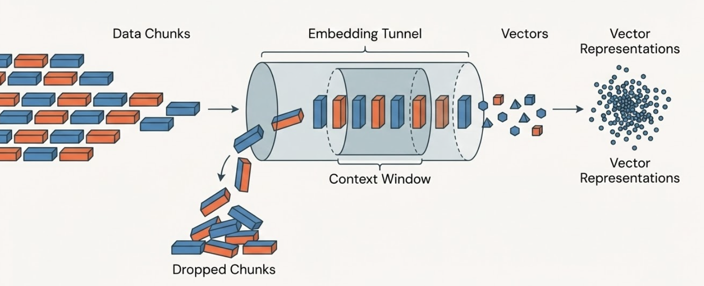
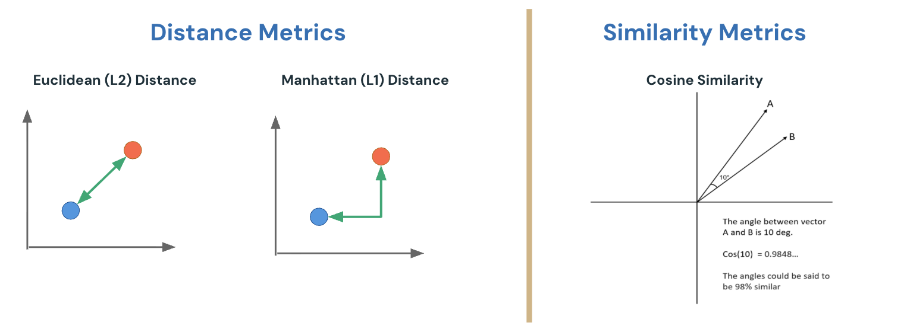
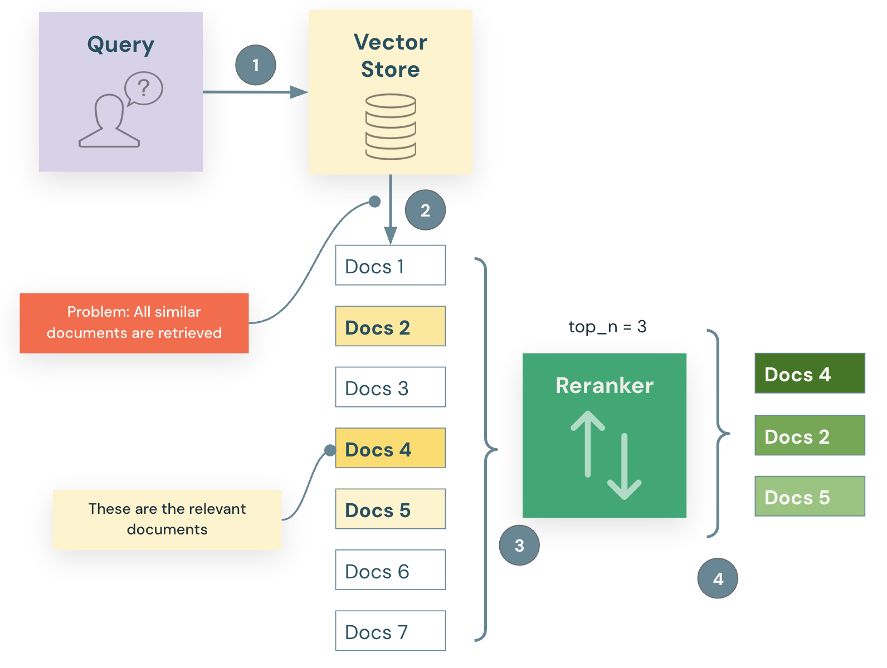
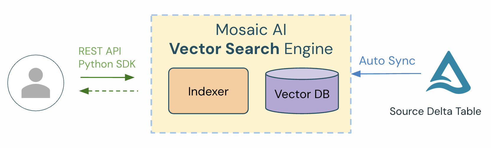
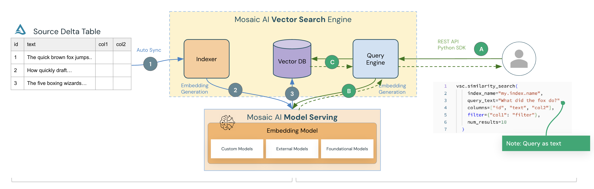

# Embeddings and Vector Search

## Building Retrieval Agents on Databricks

## Imagenes de este modulo

- **Imagen #1**: `../assets/images/embeddings_vectorization_process.png` - Proceso de vectorizacion: chunks de datos, tunel de embeddings, ventana de contexto, chunks descartados y representaciones vectoriales.
- **Imagen #2**: `../assets/images/distance_similarity_metrics.png` - Metricas de distancia y similitud: Euclidean L2, Manhattan L1 y Cosine Similarity.
- **Imagen #3**: `../assets/images/reranking_process.png` - Proceso de reranking: recuperacion inicial, reordenamiento y seleccion de documentos top_n.
- **Imagen #4**: `../assets/images/mosaic_ai_vector_search_components.png` - Componentes de Mosaic AI Vector Search: Indexer, Vector DB, API/SDK y Delta Sync.
- **Imagen #5**: `../assets/images/vector_search_managed_embeddings_auto_sync.png` - Arquitectura de managed embeddings con Source Delta Table, Model Serving, Vector DB y Query Engine.

## Introduccion

La efectividad de cualquier sistema de **Retrieval Augmented Generation (RAG)** depende de un factor critico: la calidad de su pipeline de recuperacion. Antes de poder recuperar informacion relevante, primero debemos transformar texto no estructurado en representaciones numericas llamadas **embeddings** y almacenarlas en bases de datos vectoriales especializadas.

En esta leccion exploraremos el ciclo completo de preparacion de datos: desde entender como los modelos de embeddings convierten texto en vectores, hasta aprovechar algoritmos de similitud vectorial para realizar busquedas eficientes. Tambien examinaremos tecnicas avanzadas de recuperacion como **hybrid search** y **reranking**, que mejoran significativamente la calidad de los resultados. Finalmente, veremos como **Mosaic AI Vector Search** integra estos componentes dentro de Databricks Data Intelligence Platform, ofreciendo una solucion serverless, segura y especializada para bases de datos vectoriales.

## Objetivos de la leccion

Al final de esta leccion, podras:

- Identificar las caracteristicas clave de los vectores de embeddings y evaluar criterios para seleccionar modelos de embeddings apropiados.
- Comparar busqueda por similitud, busqueda de texto completo y busqueda hibrida para determinar estrategias optimas de recuperacion.
- Analizar los trade-offs entre algoritmos de busqueda exacta y aproximada en entornos de produccion.
- Explicar como el reranking mejora la precision del contexto y reduce alucinaciones en aplicaciones RAG.
- Describir los modos de ingestion, el modelo de gobernanza y los beneficios arquitectonicos de Mosaic AI Vector Search.

## A. Conceptos centrales de embeddings

En esta seccion estableceremos el conocimiento fundamental necesario para trabajar con embeddings, que son la base matematica de la recuperacion moderna de informacion. Exploraremos como el texto no estructurado se transforma en representaciones vectoriales, por que seleccionar el modelo correcto importa para cada dominio especifico y por que es critico alinear el espacio vectorial de consultas y documentos.

### A1. Definicion de embeddings

Un **embedding** es una representacion numerica de contenido, normalmente generada por un modelo de deep learning. Estos modelos convierten datos no estructurados de alta dimensionalidad, como texto, en vectores de menor dimensionalidad: arreglos de numeros de punto flotante que capturan significado semantico.

La caracteristica clave que hace poderosos a los embeddings es su capacidad para ubicar conceptos similares cerca unos de otros en el espacio vectorial. Palabras o frases con significados relacionados se agrupan cerca, permitiendo que los sistemas identifiquen relaciones conceptuales incluso cuando las palabras exactas no coinciden.

### A2. Contexto multimodal

Aunque esta leccion se enfoca en texto no estructurado, vale la pena notar que los embeddings van mucho mas alla de las palabras. Modelos multimodales como GPT-4o y Gemini 1.5 pueden procesar e incrustar imagenes, audio y texto en un espacio vectorial unificado.

Esta capacidad permite escenarios de recuperacion cross-modal. Por ejemplo, se podria usar una consulta de texto para encontrar imagenes semanticamente relevantes, o buscar contenido de audio usando descripciones escritas.

### A3. Modelos de embeddings

Un **modelo de embeddings** es un modelo especializado de machine learning, normalmente una red neuronal profunda, disenado para convertir datos no estructurados de alta dimensionalidad, como texto, imagenes o audio, en vectores numericos de menor dimensionalidad.

Podemos pensarlo como un traductor que convierte contenido legible para humanos en listas de numeros de punto flotante legibles para maquinas. El objetivo es que entradas con significados similares produzcan vectores matematicamente cercanos entre si.

Seleccionar el modelo de embeddings correcto es una decision arquitectonica critica que impacta la calidad de la recuperacion. Factores clave:

- **Tamano de vocabulario y dominio:** algunos modelos se entrenan con texto general de la web, mientras que otros se especializan en dominios como finanzas, medicina o documentos legales. Los modelos especificos de dominio suelen ofrecer mejores resultados para contenido especializado.
- **Ventana de contexto:** cada modelo tiene un limite maximo de tokens de entrada. El texto que excede ese limite se trunca o se ignora, por lo que las estrategias de chunking son esenciales para documentos largos.
- **Dimensiones:** los vectores de mayor dimensionalidad capturan mas matiz y detalle semantico, pero aumentan costos de almacenamiento y latencia de recuperacion. Se debe equilibrar la necesidad de precision con restricciones operativas.

**Figura 1.** La ilustracion muestra como los chunks de datos son procesados por un modelo de embeddings para generar vectores. Si la entrada supera el limite de la ventana de contexto del modelo, el contenido excedente se omite, lo cual puede afectar la completitud del embedding resultante.

### A4. Alineacion de embeddings

Para que la recuperacion funcione correctamente, el modelo de embeddings debe representar tanto los documentos fuente como las consultas del usuario en el mismo espacio vectorial.

Si el modelo fue entrenado principalmente con documentos largos, pero la aplicacion usa consultas cortas e informales, las representaciones vectoriales podrian no alinearse bien. Esto puede producir resultados de recuperacion pobres.

La mejor practica es directa: usar el mismo modelo de embeddings tanto para indexar documentos como para procesar consultas. Asi se garantiza que ambos existan en el mismo espacio matematico y puedan compararse de forma significativa.

## B. Vector stores y mecanica de busqueda

Una vez que convertimos datos no estructurados en embeddings, necesitamos un almacenamiento especializado capaz de manejar vectores de alta dimensionalidad y ejecutar consultas eficientes de similitud.

En esta seccion examinaremos la arquitectura particular de las bases de datos vectoriales y como se diferencian de los sistemas relacionales tradicionales. Tambien exploraremos los algoritmos y metricas usados para recuperar informacion semanticamente relevante a escala.

### B1. El rol de las bases de datos vectoriales

Una **base de datos vectorial** esta disenada especificamente para almacenar y recuperar vectores de alta dimensionalidad de forma eficiente.

A diferencia de las bases de datos tradicionales, pensadas para coincidencias exactas, como clausulas `WHERE` en SQL, las bases vectoriales sobresalen en busquedas por similitud: encontrar elementos conceptualmente relacionados, no necesariamente identicos.

Estas bases mantienen capacidades tradicionales como operaciones **Create, Read, Update, Delete (CRUD)**, pero incorporan estructuras de indexacion especializadas y optimizadas para operaciones vectoriales.

### B2. Metodos de busqueda

Distintos metodos de busqueda sirven para distintas necesidades de recuperacion:

**Similarity Search:** recupera contenido basado en correlacion semantica, no en coincidencia exacta de palabras. Permite que consultas en lenguaje natural como "how to deal with anxiety" recuperen resultados relevantes que usan otra terminologia, como "coping with PTSD" o "managing stress".

**Full-Text Search:** enfoque tradicional basado en coincidencia de palabras clave. Es muy bueno para encontrar terminos especificos como numeros de parte, codigos de producto o nombres propios, pero no captura bien intencion semantica ni reconoce sinonimos.

**Hybrid Search:** combina busqueda por similitud vectorial con busqueda basada en palabras clave. Al aprovechar tanto entendimiento semantico como coincidencia exacta, suele entregar mayor precision de recuperacion que cualquiera de los dos metodos por separado.

### B3. Metricas de distancia y similitud

Para determinar que tan "similares" son dos vectores, usamos dos grandes tipos de metricas: **metricas de distancia** y **metricas de similitud**. Cada una se adapta a diferentes escenarios de recuperacion.

Las metricas de distancia se usan cuando queremos cuantificar que tan separados estan dos vectores en el espacio. Son ideales para clustering, deteccion de valores atipicos o escenarios donde la magnitud importa.

Las metricas de similitud se usan cuando queremos saber que tan alineados estan dos vectores en direccion. Son ideales para busqueda semantica, recuperacion de documentos y la mayoria de aplicaciones NLP, donde el significado importa mas que la escala.

#### Metricas de distancia

**Euclidean Distance (L2):** mide la distancia en linea recta entre dos puntos en el espacio vectorial. Un valor menor significa que los vectores son mas similares. Se usa cuando importa la diferencia absoluta en todas las dimensiones, por ejemplo en clustering o deteccion de anomalias.

**Manhattan Distance (L1):** suma las diferencias absolutas a traves de todas las dimensiones. Un valor menor significa que los vectores estan mas cerca. Es util cuando las diferencias en cada eje son igualmente importantes, como en datos tipo grilla o datos dispersos.

#### Metricas de similitud

**Cosine Similarity:** mide el coseno del angulo entre dos vectores. Un puntaje mayor indica mayor similitud. Es la metrica mas popular para embeddings de texto porque se enfoca en la orientacion, es decir, el significado semantico, y no en la magnitud. Esto la hace robusta frente a diferencias de longitud o escala del documento.

**Figura 2.** El diagrama visualiza las metricas de distancia y similitud: Euclidean L2, Manhattan L1 y Cosine Similarity.

### B4. Estrategias de busqueda

Dos estrategias principales equilibran precision y rendimiento:

**K-Nearest Neighbors (KNN):** metodo de busqueda exacta que calcula la distancia entre el vector de consulta y cada vector en la base de datos. Aunque es muy preciso, es computacionalmente costoso y no escala bien a datasets grandes. Seria como comparar una consulta contra millones de documentos uno por uno.

**Approximate Nearest Neighbors (ANN):** estrategia que sacrifica una pequena cantidad de precision para lograr grandes ganancias de velocidad. ANN usa algoritmos de indexacion sofisticados como **HNSW (Hierarchical Navigable Small Worlds)** o **FAISS (Facebook AI Similarity Search)** para navegar eficientemente el espacio vectorial, revisando solo un subconjunto de vectores pero encontrando aun resultados muy relevantes.

## C. Precision, calidad y reranking

Aunque las bases vectoriales ofrecen un mecanismo poderoso para encontrar contenido semanticamente similar, tambien tienen limitaciones. En esta seccion abordaremos los matices de la calidad de embeddings y la posible brecha entre similitud matematica y relevancia semantica real.

Tambien introduciremos **reranking** como un paso critico posterior a la recuperacion, que refina los resultados y mejora la precision del contexto entregado a los modelos de lenguaje.

### C1. Calidad y limitaciones de embeddings

Una idea crucial: **similitud no equivale necesariamente a relevancia semantica**. Un documento puede estar matematicamente cerca de una consulta en el espacio vectorial y aun asi ser factualmente irrelevante o contextualmente inapropiado.

La calidad de los embeddings depende fuertemente del modelo, sus datos de entrenamiento y que tan bien se alinea con el dominio especifico. Datos mal preparados o una diferencia entre el corpus de entrenamiento del modelo y el contenido de la aplicacion pueden producir bajo rendimiento de recuperacion e informacion "perdida".

Otro escenario comun ocurre cuando se debe seleccionar un subconjunto de documentos en lugar de usar todos los resultados de una busqueda por similitud. Si necesitamos limitar el numero de documentos por restricciones de tokens o costos de procesamiento, debemos asegurarnos de que los documentos mas relevantes queden en las primeras posiciones. Aqui es donde el reranking se vuelve esencial.

### C2. El proceso de reranking

Para cerrar la brecha de precision en la recuperacion inicial, agregamos un **reranker** al pipeline:

1. **Recuperacion inicial:** el vector store recupera un conjunto amplio de documentos candidatos, normalmente los top 20 a 50, usando algoritmos ANN rapidos.
2. **Reranking:** un modelo especializado, con frecuencia un **Cross-Encoder**, evalua la relevancia real de cada documento candidato frente a la consulta especifica, considerando la relacion entre ambos con mas detalle.
3. **Reordenamiento:** los documentos se vuelven a ordenar segun los puntajes de relevancia del reranker, colocando la informacion mas pertinente arriba para que el modelo de lenguaje la procese.

**Figura 3.** El diagrama muestra como funciona el proceso de reranking: primero se recuperan documentos candidatos, luego se reordenan y finalmente se seleccionan los mejores resultados.

### C3. Beneficios y trade-offs

El reranking introduce consideraciones importantes:

**Beneficios:** mejora significativamente la precision del contexto proporcionado al modelo de lenguaje. Esto reduce directamente las alucinaciones y mejora la calidad de las respuestas. Al refinar los resultados iniciales, se asegura que la informacion mas relevante llegue a la etapa de generacion.

**Trade-offs:** agregar un reranker aumenta tanto la latencia como el costo del pipeline de recuperacion. El modelo de reranking debe procesar la consulta y los documentos candidatos en tiempo real, agregando carga computacional. Estos costos deben balancearse contra la mejora de calidad segun el caso de uso.

## D. Mosaic AI Vector Search: caracteristicas y arquitectura

Implementar una infraestructura robusta de base de datos vectorial puede ser complejo, pero Databricks simplifica este proceso con **Mosaic AI Vector Search**.

En esta seccion exploraremos la arquitectura del servicio y su integracion con Delta Lake para sincronizacion automatica de datos. Tambien examinaremos el modelo de gobernanza unificado bajo Unity Catalog, que asegura acceso gestionado y seguro a indices vectoriales.

**Figura 4.** El diagrama muestra los componentes principales de Mosaic AI Vector Search: API/SDK, Indexer, Vector DB y sincronizacion automatica desde una Source Delta Table.

### D1. Descripcion del producto

**Mosaic AI Vector Search** es una solucion de base de datos vectorial integrada directamente en Databricks Lakehouse. Este servicio escalable y de baja latencia almacena representaciones vectoriales de los datos junto con sus metadatos, permitiendo busqueda por similitud en tiempo real mediante REST API y cliente Python.

Esta disenado especificamente para optimizar la recuperacion en aplicaciones RAG, eliminando la necesidad de administrar infraestructura separada de bases vectoriales.

### D2. Delta Sync e indexacion

Una de las funciones mas poderosas de Mosaic AI Vector Search es su integracion estrecha con Delta Lake. Mediante **Delta Sync API**, el indice vectorial se sincroniza automaticamente con una tabla Delta fuente.

Cuando se agregan, actualizan o eliminan datos en la tabla fuente, el indice vectorial se actualiza automaticamente. Esto asegura que el sistema de recuperacion refleje siempre los datos mas recientes sin intervencion manual.

Esta integracion elimina la carga operativa de mantener embeddings sincronizados con los datos fuente.

### D3. Modos de gestion e ingestion

Mosaic AI Vector Search ofrece tres enfoques flexibles para ingerir y gestionar embeddings. Esto permite elegir el nivel de control que mejor se ajusta a las necesidades del proyecto.

**Managed Embeddings (Delta Sync):** se proporciona una tabla Delta fuente que contiene texto crudo, y Databricks se encarga del resto. El sistema calcula automaticamente embeddings usando un endpoint configurado de Mosaic AI Model Serving, como Foundation Model API, procesa nuevos datos y actualiza el indice sin que el equipo tenga que administrar el pipeline de embeddings.

**Self-Managed Embeddings (Delta Sync):** el equipo calcula los embeddings usando sus propios pipelines personalizados y los almacena en una tabla Delta. El indice de Vector Search se sincroniza con esa tabla e indexa los vectores precomputados. Este enfoque ofrece control total sobre el proceso de embeddings y conserva el beneficio de sincronizacion automatica.

**Direct Access CRUD API:** permite interactuar directamente con el indice de Vector Search usando REST API o Python SDK. Se pueden insertar, actualizar o eliminar vectores y metadatos directamente sin depender de una sincronizacion con tabla Delta. Es ideal para aplicaciones en tiempo real o flujos personalizados.

**Figura 5.** El diagrama muestra como funciona Vector Search con managed embeddings y sincronizacion automatica: desde la Source Delta Table hasta Model Serving, Vector DB, Query Engine y similarity search.

### D4. Gobernanza y control de acceso

Mosaic AI Vector Search esta gobernado por **Unity Catalog**, proporcionando un modelo de seguridad unificado para datos y activos de IA.

Los indices creados en Vector Search aparecen como objetos securables dentro de Unity Catalog, lo que permite a los administradores aplicar **Access Control Lists (ACLs)** granulares a nivel de indice.

Esto asegura que solo usuarios y aplicaciones autorizadas puedan consultar o modificar datos vectoriales, manteniendo politicas de seguridad consistentes en toda la plataforma de datos.

## E. Resumen

En esta leccion exploramos el ciclo completo de preparacion de datos para recuperacion en un sistema RAG.

Definimos los embeddings como el puente esencial entre texto no estructurado y vectores legibles por maquina, enfatizando que la seleccion del modelo debe alinearse con el dominio especifico y los patrones de consulta.

Examinamos la mecanica de las bases de datos vectoriales, distinguiendo entre estrategias de busqueda exacta (**KNN**) y aproximada (**ANN**), y vimos como hybrid search y reranking superan las limitaciones de la similitud vectorial pura.

Finalmente, exploramos Mosaic AI Vector Search y su capacidad para automatizar la gestion de embeddings mediante Delta Sync, mientras proporciona una integracion solida de seguridad con Unity Catalog.

## Puntos clave

- **Embeddings y alineacion:** los embeddings capturan significado semantico al ubicar conceptos similares cerca en el espacio vectorial. Para una recuperacion efectiva, el modelo de embeddings debe crear un espacio vectorial compartido para documentos y consultas. Usa el mismo modelo para ambos.
- **Precision de busqueda:** aunque los algoritmos ANN entregan la velocidad y escalabilidad necesarias para produccion, agregar un paso de reranking suele ser esencial para filtrar ruido y asegurar alta relevancia para el modelo de lenguaje. Se debe equilibrar la mejora de calidad contra la latencia y costo adicionales.
- **Arquitectura integrada:** Mosaic AI Vector Search simplifica la operacion al ofrecer sincronizacion automatica con Delta Lake y soportar modos flexibles de ingestion: Managed, Self-Managed o Direct CRUD. Esta integracion elimina la complejidad de administrar infraestructura vectorial separada, manteniendo gobernanza empresarial mediante Unity Catalog.

© 2026 Databricks, Inc. Todos los derechos reservados. Apache, Apache Spark, Spark, el logotipo de Spark, Apache Iceberg, Iceberg y el logotipo de Apache Iceberg son marcas comerciales de Apache Software Foundation.

Politica de privacidad | Terminos de uso | Soporte

