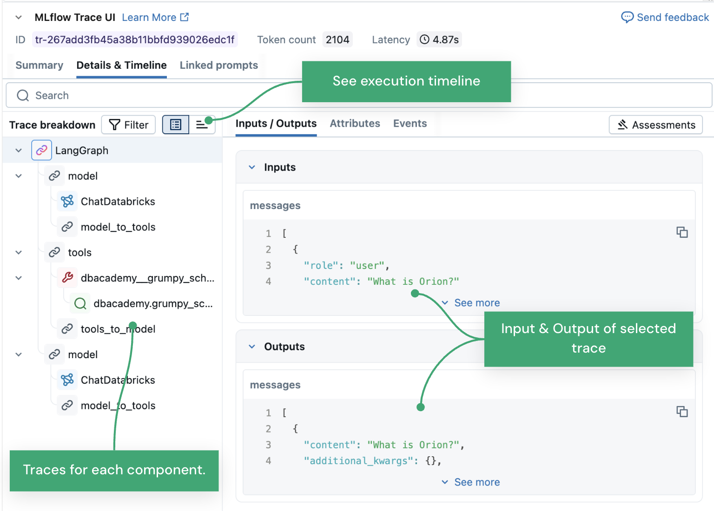
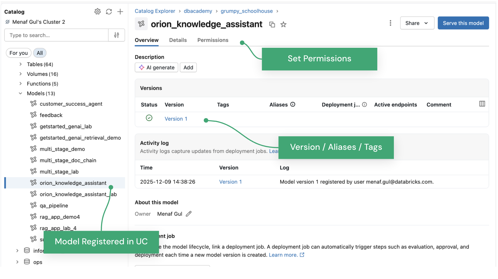

# MLflow and Agent Development

## Desarrollo de agentes con MLflow

## Introduccion

Construir un agente de recuperacion es diferente de entrenar un modelo convencional. El proceso exige coordinar dinamicamente las consultas de los usuarios, los modelos de embeddings, las bases de datos vectoriales y los modelos de lenguaje de gran escala.

Esta leccion explica como **MLflow 3.0 o posterior** proporciona la infraestructura necesaria para desarrollar, depurar y gobernar estos agentes. El enfoque va mas alla del registro basico: incluye trazabilidad profunda de los pasos de recuperacion y gobierno de los artefactos del agente mediante **Databricks Unity Catalog**.

## Objetivos de la leccion

Al finalizar esta leccion, se espera poder:

- Identificar los componentes principales de MLflow y su funcion en el desarrollo de agentes.
- Configurar experimentos para rastrear variaciones de prompts y parametros del retriever.
- Diferenciar los sabores de modelos tradicionales de los sabores orientados a GenAI, como LangChain y PyFunc.
- Utilizar MLflow Tracing para diagnosticar fallos de recuperacion, resultados vacios y latencia elevada.
- Registrar y gobernar agentes de recuperacion mediante el Model Registry de Unity Catalog.

## A. Fundamentos de MLflow para agentes

MLflow es una plataforma de codigo abierto disenada para administrar el ciclo de vida completo del machine learning. En el desarrollo de agentes funciona como el sistema central de registro de cada configuracion, version de codigo y traza de ejecucion.

### El problema de trabajar sin MLflow

Sin MLflow, los desarrolladores suelen depender de llamadas dispersas a `print()` o de logs basicos para depurar cadenas complejas. Este enfoque resulta insuficiente cuando se necesita comprender por que fallo una consulta concreta.

Por ejemplo, ante una respuesta incorrecta se deben distinguir varias causas posibles:

- Un timeout en Vector Search.
- Una consulta mal formada enviada al modelo de embeddings.
- Un fallo del retriever.
- Un error de razonamiento del LLM.
- Una configuracion diferente del prompt o de los parametros de recuperacion.

Sin un sistema estructurado de seguimiento, relacionar estas fallas intermedias con cambios especificos de configuracion es muy dificil.

Con MLflow, cada parte del comportamiento del agente, desde los parametros de recuperacion hasta la respuesta generada, queda registrada sistematicamente. Esto permite responder con certeza:

```text
Que configuracion exacta produjo esta respuesta de alta calidad?
```

## A1. Componentes de MLflow

MLflow no es una sola herramienta. Es un conjunto de componentes integrados que cubren distintas etapas del ciclo de vida del agente, desde el desarrollo inicial hasta su gobierno en produccion.

### MLflow Tracking

Proporciona la API y la interfaz para registrar:

- Parametros.
- Versiones de codigo.
- Metricas.
- Archivos de salida y artefactos.
- System prompts.
- Configuraciones del retriever.

### MLflow Tracing

Es la capacidad de observabilidad que captura el flujo jerarquico de ejecucion de un agente. Resulta esencial para depurar llamadas concretas a herramientas de recuperacion y revisar sus entradas, salidas y tiempos de ejecucion.

### MLflow Models

Define un formato estandar para empaquetar modelos y agentes. El artefacto resultante puede utilizarse en herramientas posteriores, como serving en tiempo real, independientemente de la biblioteca original con la que se construyo.

### MLflow Model Registry

Es un repositorio centralizado para administrar colaborativamente el ciclo de vida del modelo o agente, incluyendo:

- Versiones.
- Alias y etiquetas.
- Permisos.
- Transiciones entre ambientes o etapas.
- Gobierno antes del despliegue.

## A2. Experimentos y runs

Una vez comprendidos los componentes, el primer paso del ciclo de desarrollo consiste en organizar las iteraciones.

Al probar un agente de recuperacion se pueden evaluar veinte prompts de sistema, diferentes estrategias de chunking o varias configuraciones de busqueda. Sin una estructura, estas pruebas se vuelven rapidamente dificiles de comparar y reproducir.

### Experiment

Un **Experiment** es el contenedor logico principal de un proyecto especifico, por ejemplo:

```text
Customer Support Retrieval Agent
```

### Run

Dentro del experimento, cada **Run** captura el estado especifico del agente en un momento determinado.

MLflow ayuda a reproducir los resultados porque registra la configuracion del motor de razonamiento en cada run:

- **System prompts:** instrucciones que definen el comportamiento del agente, por ejemplo, responder solamente con base en el contexto recuperado.
- **Configuracion del modelo:** parametros como `temperature` y `max_tokens`.
- **Configuracion del retriever:** numero de chunks a recuperar, normalmente `k`, y umbrales de similitud vectorial.

El experimento se establece con:

```python
mlflow.set_experiment("/ruta/del/experimento")
```

Esto define la ubicacion del workspace donde se almacenaran las ejecuciones y organiza las iteraciones de la logica de recuperacion.

## A3. Model flavors y wrappers

Despues de identificar una configuracion ganadora, el agente debe empaquetarse para su despliegue. Guardar solamente un script de Python no es suficiente, porque la ejecucion tambien depende de bibliotecas, configuraciones, ambiente y logica de carga.

Un **Model Flavor** es una integracion que permite a MLflow guardar, cargar y servir un modelo sin que el usuario tenga que administrar manualmente todos esos detalles.

### Flavors nativos para GenAI

MLflow ofrece soporte nativo para bibliotecas como LangChain y OpenAI. Por ejemplo, `mlflow.langchain` puede serializar la cadena de recuperacion y sus componentes.

### PyFunc Flavor

Los agentes de produccion suelen incluir logica personalizada, como:

- Reranking especifico.
- Aplicacion dinamica de filtros.
- Transformaciones propias de los resultados.
- Combinacion de multiples retrievers.

Cuando un flavor nativo no cubre esa logica, el flavor **Python Function**, conocido como **PyFunc**, permite envolver codigo Python arbitrario como un modelo, siempre que exponga un metodo `predict()`.

Al usar PyFunc se debe incluir en el artefacto tanto el codigo del retriever personalizado como los archivos de configuracion que necesite.

## B. Observabilidad y tracing

Una vez empaquetado el agente, el siguiente desafio es comprender por que se comporta de determinada manera.

Un agente de recuperacion coordina al usuario, la base vectorial, las herramientas y el LLM. Esa cadena de interacciones puede comportarse como una caja negra si solo se observa la respuesta final.

## B1. Por que se necesitan trazas

Supongamos que un usuario pregunta:

```text
Cual es la politica de trabajo remoto?
```

Y el agente responde:

```text
No lo se.
```

Un log de texto simple no explica la causa. Entre las posibilidades estan:

- La herramienta de recuperacion no encontro documentos.
- Vector Search fue demasiado lento y genero un timeout.
- El retriever encontro la informacion correcta, pero el LLM la ignoro.

MLflow Tracing ofrece visibilidad detallada del grafo de ejecucion al registrar las entradas y salidas de cada paso.

## B2. Traces y spans



**Figura 1.** Interfaz de MLflow Tracing. A la izquierda se muestran las trazas de los componentes; a la derecha, las entradas y salidas del elemento seleccionado. La vista tambien permite revisar la linea de tiempo, la latencia y el consumo de tokens.

MLflow representa el flujo de ejecucion mediante **traces** y **spans**.

### Trace

Una trace representa el ciclo de vida completo de una solicitud, desde la pregunta inicial del usuario hasta la respuesta final.

### Span

Un span representa una unidad individual de trabajo dentro de la trace. En un agente de recuperacion pueden aparecer spans como:

- `query_embedding`
- `retrieval_tool`
- `vector_search`
- `context_generation`
- llamada al LLM

El tracing puede habilitarse de dos formas:

1. **Autologging:** para bibliotecas compatibles, por ejemplo `mlflow.langchain.autolog()`.
2. **Instrumentacion manual:** mediante el decorador `@mlflow.trace` en funciones de recuperacion personalizadas.

## B3. Diagnostico de fallos de recuperacion

El principal valor de tracing es hacer visibles los modos de fallo de la herramienta de recuperacion.

### Recuperacion vacia o irrelevante

Al inspeccionar la salida del span del retriever, se puede ver exactamente que chunks devolvio la base vectorial.

Si la salida esta vacia o contiene texto irrelevante pese a que la consulta es adecuada, el problema probablemente se encuentra en:

- El modelo de embeddings.
- La estrategia de chunking.
- Los filtros aplicados.
- La configuracion de la busqueda.

En este caso, el problema no esta necesariamente en el LLM.

### Latencia en Vector Search

Cada span registra su duracion. Si el agente responde lentamente, la linea de tiempo puede mostrar, por ejemplo, que `vector_search` tomo cuatro segundos y la generacion del LLM solo 500 milisegundos.

La optimizacion debe dirigirse entonces a la consulta de la base vectorial, al indice o a los filtros, no al modelo generativo.

### Alucinacion a pesar de tener contexto

Si el span del retriever devolvio el documento correcto, pero la salida del span del LLM lo ignora, se ha identificado un fallo de razonamiento o de seguimiento de instrucciones.

Una posible correccion es mejorar el system prompt para exigir que la respuesta se limite estrictamente al contexto proporcionado.

## C. Gobierno con Unity Catalog

Despues de construir y depurar el agente, queda el desafio de gobernarlo en produccion.

No es conveniente permitir que el codigo pase directamente a endpoints productivos sin validacion. Tampoco se debe permitir acceso no gobernado a los datos subyacentes. Por eso se necesita un registro robusto y centralizado.

## C1. Unity Catalog Model Registry

Unity Catalog, o **UC**, funciona como el registro centralizado de los agentes y modelos empresariales.

A diferencia del antiguo Workspace Model Registry, Unity Catalog utiliza un namespace de tres niveles:

```text
catalog.schema.model
```

Este esquema unifica el control de acceso de los activos de datos e inteligencia artificial.

### Control de acceso

Se pueden administrar permisos como `SELECT` y `EXECUTE` sobre el agente registrado, al igual que sobre las tablas utilizadas por Vector Search.

### Linaje

Unity Catalog puede rastrear las tablas de datos y los indices de Vector Search utilizados por el agente. Esto aporta linaje de extremo a extremo, desde los documentos originales hasta el agente desplegado.

## C2. Logging y registro de agentes

El flujo de gobierno requiere registrar el modelo con una firma especifica y luego incorporarlo a Unity Catalog.

### 1. Definir la firma del modelo

Los agentes normalmente reciben cadenas de texto o listas con historial de conversacion. El esquema de entrada y salida se define con `mlflow.models.ModelSignature`.

La firma permite que el endpoint de serving valide correctamente las solicitudes.

### 2. Registrar el artefacto en un run

Se puede utilizar `mlflow.langchain.log_model()` o el flavor apropiado. Es recomendable incluir un **Input Example**, porque permite que la interfaz genere un widget funcional para probar el modelo.

### 3. Registrar una version en Unity Catalog

Una vez almacenado el modelo en un experimento, se registra con:

```python
mlflow.register_model(
    "runs:/<run_id>/model",
    "catalog.schema.retrieval_agent"
)
```

Si la herramienta de recuperacion esta implementada como una funcion de Unity Catalog, tambien debe gobernarse dentro de la misma estructura de catalogo para conservar fronteras de seguridad coherentes.



**Figura 2.** Agente registrado en Unity Catalog. La interfaz permite administrar permisos y controlar versiones, aliases y tags antes de servir el modelo.

## Resumen

Esta leccion presento la adaptacion de MLflow a flujos centrados en recuperacion:

1. Los componentes de MLflow registran configuraciones, artefactos y ejecuciones.
2. Los experiments y runs permiten comparar prompts, modelos y parametros del retriever.
3. Los model flavors empaquetan el agente; PyFunc cubre la logica personalizada.
4. MLflow Tracing ayuda a diferenciar fallos de recuperacion de fallos de razonamiento.
5. Unity Catalog proporciona versionado, permisos y linaje para gobernar el agente.

## Conceptos clave para el simulador

- **MLflow Tracking** registra parametros, metricas, codigo y artefactos.
- **MLflow Tracing** captura el flujo jerarquico de ejecucion del agente.
- Un **Experiment** agrupa runs relacionados con un proyecto.
- Un **Run** representa una ejecucion con una configuracion especifica.
- Un **Trace** cubre la solicitud completa; un **Span** representa una unidad individual de trabajo.
- Inspeccionar el span del retriever permite comprobar los chunks recuperados.
- La duracion de los spans ayuda a localizar cuellos de botella.
- Si el retriever devuelve el contexto correcto y el LLM lo ignora, el fallo es de razonamiento o prompting.
- Los flavors nativos simplifican el empaquetado de cadenas compatibles.
- **PyFunc** es apropiado cuando existe logica personalizada de filtros, recuperacion o reranking.
- `ModelSignature` define y valida el esquema de entrada y salida.
- Un Input Example facilita las pruebas del modelo desde la interfaz.
- Unity Catalog usa el namespace `catalog.schema.model`.
- Unity Catalog centraliza versiones, aliases, tags, permisos y linaje.
- El agente y su herramienta de recuperacion deben compartir fronteras de gobierno coherentes.
