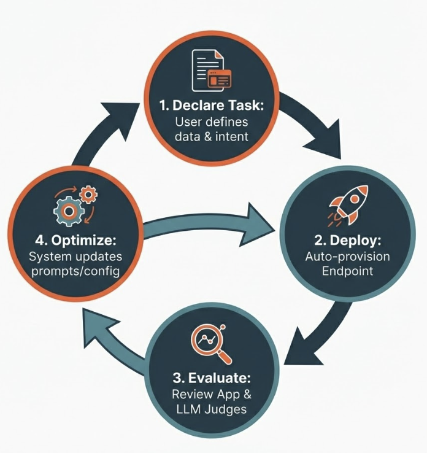
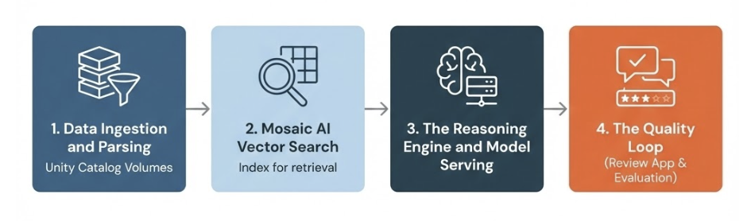

# Knowledge Assistant with Agent Bricks

## Asistente de conocimiento con Agent Bricks

## Introduccion

Esta leccion presenta **Agent Bricks**, un framework declarativo de Databricks Mosaic AI que simplifica la creacion de agentes de inteligencia artificial listos para produccion.

El enfoque principal es **Knowledge Assistant**, un patron especializado para construir agentes conversacionales expertos basados en documentacion empresarial.

Agent Bricks cambia el paradigma de desarrollo: en lugar de ajustar manualmente cada componente, el equipo declara el resultado deseado y utiliza ciclos automatizados de optimizacion. La arquitectura subyacente permite que los agentes sean robustos, escalables y gobernados.

## Objetivos de la leccion

Al finalizar esta leccion, se espera poder:

- Definir la propuesta de valor de Agent Bricks frente al desarrollo manual tradicional.
- Identificar sus casos de uso principales, incluidos Information Extraction y Custom LLM.
- Explicar los componentes de un Knowledge Assistant, como parsing, Vector Search y Model Serving.
- Describir el **Quality Loop**.
- Explicar como Agent Learning from Human Feedback, o ALHF, optimiza el rendimiento del agente.

## A. Que es Agent Bricks

Agent Bricks es un framework declarativo dentro de Databricks Mosaic AI. Esta disenado para acelerar la creacion, el despliegue y la optimizacion de agentes de IA con calidad de produccion.

En un enfoque tradicional **Do It Yourself**, o DIY, los ingenieros deben:

- Seleccionar manualmente el modelo.
- Configurar la estrategia de chunking.
- Elegir el modelo de embeddings.
- Construir el indice de recuperacion.
- Ajustar prompts manualmente.
- Evaluar distintas combinaciones.

Agent Bricks automatiza muchas de estas decisiones a partir de los datos proporcionados y de la tarea seleccionada.

## A1. El desafio de llevar IA a produccion

Mover una aplicacion de IA generativa desde una prueba de concepto, o PoC, hasta produccion presenta tres puntos principales de friccion.

### 1. Complejidad de optimizacion

Un sistema de IA tiene muchos parametros ajustables:

- Eleccion del LLM, por ejemplo Llama 4 o GPT-4o.
- Tamano de los chunks.
- Estrategia de recuperacion.
- Modelo de embeddings.
- Tecnicas de prompt engineering.
- Parametros del modelo y del retriever.

Encontrar la combinacion optima para un conjunto de datos empresarial puede consumir mucho tiempo.

### 2. Dificultad de evaluacion

Decidir si un agente es suficientemente bueno para produccion requiere pruebas rigurosas.

Los equipos no siempre disponen de conjuntos de datos etiquetados o **golden datasets**. En consecuencia, pueden depender de evaluaciones subjetivas conocidas como **vibe checks**, que no ofrecen metricas verificables.

### 3. Equilibrio entre costo y calidad

Los modelos grandes y costosos suelen producir resultados de mayor calidad. Reducir el costo puede degradar el rendimiento.

El reto consiste en encontrar la configuracion que maximice la calidad con el menor costo posible.

## A2. La solucion de Agent Bricks

Agent Bricks trata la definicion del agente de forma declarativa:

1. El usuario proporciona los datos.
2. Selecciona la tarea.
3. Describe la intencion o el resultado esperado.
4. Agent Bricks despliega una configuracion inicial.
5. El sistema evalua y optimiza iterativamente la solucion.

El mecanismo central es **Agent Learning from Human Feedback**, o **ALHF**.

El sistema:

- Despliega inmediatamente un agente base.
- Recopila feedback mediante una Review App.
- Registra votos positivos, votos negativos y respuestas corregidas.
- Sintetiza el feedback para generar benchmarks de evaluacion.
- Optimiza prompts y configuraciones sin exigir cambios manuales de codigo.

**Figura 1.** Ciclo de optimizacion de Agent Bricks: declarar la tarea, desplegar el endpoint, evaluar mediante la aplicacion y jueces LLM, y optimizar prompts o configuraciones. El resultado vuelve a alimentar un ciclo continuo de mejora.

## B. Casos de uso de Agent Bricks

Agent Bricks proporciona arquitecturas preconfiguradas, llamadas **bricks**, para patrones empresariales comunes. Cada brick se especializa en un tipo de interaccion o procesamiento de datos.

## B1. Knowledge Assistant

Knowledge Assistant transforma documentacion empresarial en un agente conversacional experto.

### Funcion

Ejecuta **Retrieval Augmented Generation**, o RAG, sobre los archivos seleccionados. Administra automaticamente:

- Parsing.
- Chunking.
- Generacion de embeddings.
- Indexacion.
- Recuperacion.
- Generacion de citas.

### Casos de uso

- Un bot de recursos humanos que responde preguntas sobre politicas internas a partir de un manual.
- Un bot de soporte tecnico que resuelve consultas utilizando manuales de productos.

## B2. Information Extraction

Este tipo de agente convierte documentos no estructurados, como PDF, imagenes y archivos de texto, en datos estructurados.

### Funcion

Extrae campos especificos definidos mediante un esquema JSON.

### Casos de uso

- Convertir facturas en una tabla Delta con campos como nombre del proveedor, monto total y fecha.
- Extraer clausulas concretas de contratos legales.

## B3. Multi-Agent Supervisor

Este patron avanzado coordina multiples agentes y herramientas para resolver problemas complejos de varios pasos.

### Funcion

Un agente supervisor dirige la consulta del usuario hacia el subagente o la herramienta adecuada, por ejemplo una Unity Catalog Function.

### Caso de uso

En un sistema de atencion al cliente, el supervisor puede:

- Enviar preguntas de facturacion a un Genie space que consulta datos estructurados.
- Enviar problemas tecnicos a un Knowledge Assistant que consulta documentacion no estructurada.

## B4. Custom LLM

Este agente crea un endpoint de LLM especializado para las normas y tareas de una empresa.

### Funcion

Optimiza un modelo para seguir reglas concretas de tono, formato o cumplimiento.

### Casos de uso

- Un generador de contenido para redes sociales que respeta estrictamente la guia de estilo de una marca.
- Una herramienta de resumen que entrega informes ejecutivos con un formato especifico.

## C. Metodos declarativos frente a Code-First

Al construir agentes en Databricks existen dos niveles principales de abstraccion: **Code-First** y **Declarative**.

## C1. Code-First con Mosaic AI Agent Framework

Este metodo ofrece el maximo control, pero requiere mayor esfuerzo de implementacion.

Los desarrolladores escriben la logica principal con bibliotecas como:

- LangChain.
- LlamaIndex.
- OpenAI SDK.

Luego utilizan Mosaic AI Agent Framework para tracing, estructura de desarrollo, evaluacion y gobierno.

### Flujo de trabajo

El desarrollador:

- Escribe manualmente la logica de recuperacion.
- Define templates de prompts.
- Selecciona el modelo de embeddings.
- Administra la sincronizacion del indice de Vector Search.
- Registra trazas en MLflow.
- Despliega el agente como endpoint de Model Serving.

### Ventajas

- Maxima personalizacion.
- Permite ciclos de razonamiento novedosos.
- Permite controlar con precision el uso de herramientas.

### Desventajas

- El equipo asume la deuda tecnica.
- La optimizacion de chunking y prompts es manual.
- Cambiar la estrategia de recuperacion puede exigir modificar y desplegar nuevamente el codigo.

## C2. Enfoque declarativo con Agent Bricks

Este enfoque esta orientado al resultado. El desarrollador declara **que** debe hacer el agente, no exactamente **como** debe implementarlo.

### Flujo de trabajo

El desarrollador:

1. Selecciona Knowledge Assistant.
2. Indica un Unity Catalog Volume que contiene los documentos.
3. Proporciona una descripcion textual de la personalidad o intencion.

Agent Bricks administra el parsing, la indexacion, la seleccion de componentes y el prompt engineering.

### Ventajas

- Menor tiempo hasta obtener valor.
- Generacion de datos sinteticos para evaluacion.
- Optimizacion automatica con base en feedback.
- Menos codigo y configuracion manual.

### Desventajas

- Menor control granular sobre la logica de bajo nivel.
- Es menos flexible que un agente completamente implementado con codigo.

## Comparacion rapida

| Aspecto | Code-First | Agent Bricks |
|---|---|---|
| Objetivo | Control de implementacion | Resultado deseado |
| Logica | Escrita manualmente | Generada y administrada |
| Optimizacion | Manual | Automatizada |
| Personalizacion | Muy alta | Menos granular |
| Tiempo de desarrollo | Mayor | Menor |
| Deuda tecnica | Administrada por el equipo | Reducida mediante servicios gestionados |

## D. Componentes de Knowledge Assistant

Un Knowledge Assistant no es una caja negra. Esta compuesto por servicios nativos de Databricks que trabajan de forma coordinada.

**Figura 2.** Componentes administrados por Agent Bricks: ingestion y parsing desde Unity Catalog Volumes, indice de Mosaic AI Vector Search, motor de razonamiento con Model Serving y Quality Loop mediante Review App y evaluacion.

## D1. Ingestion de datos y parsing

La base del Knowledge Assistant son los datos almacenados en **Unity Catalog Volumes**.

### Fuente

El usuario selecciona un Volume que contiene archivos como:

- PDF.
- DOCX.
- HTML.

### Parsing

El sistema utiliza `ai_parse_document`, una funcion de Mosaic AI disenada para extraer texto, tablas e imagenes de documentos complejos.

Esto permite convertir elementos visuales, como un grafico dentro de un PDF, en contexto que el LLM pueda procesar.

## D2. Mosaic AI Vector Search

Despues del parsing, los datos deben indexarse para su recuperacion.

### Managed embeddings

Agent Bricks selecciona automaticamente un modelo de embeddings, por ejemplo GTE, y aprovisiona un indice de Mosaic AI Vector Search.

### Sincronizacion

El indice es completamente administrado. Cuando se agregan archivos nuevos al Volume de origen, Vector Search actualiza el indice automaticamente.

Esto permite que el agente use el conocimiento mas reciente sin ejecutar manualmente un proceso de reindexacion.

## D3. Motor de razonamiento y Model Serving

La logica del agente se aloja en Model Serving.

### Inferencia

Cuando el usuario formula una pregunta, el sistema:

1. Convierte la consulta en una representacion vectorial.
2. Recupera chunks relevantes desde Vector Search.
3. Envia esos chunks al LLM como contexto.
4. Genera la respuesta final.

### Citas

Knowledge Assistant esta disenado para proporcionar citas. La respuesta se relaciona con el archivo fuente especifico del Unity Catalog Volume.

Esto permite que el usuario verifique la informacion y aumenta la confianza en la respuesta.

## D4. Quality Loop

El ciclo de calidad diferencia a Agent Bricks de una arquitectura RAG configurada manualmente.

### Review App

Es una interfaz integrada donde los especialistas del dominio, o SMEs, pueden:

- Conversar con el agente.
- Marcar una respuesta con voto positivo o negativo.
- Editar o corregir respuestas.
- Proporcionar ejemplos de lo que consideran correcto.

### LLM Judges

Mosaic AI Agent Evaluation ejecuta jueces LLM sobre las trazas de interaccion.

Estos jueces evaluan metricas como:

- **Faithfulness:** si la respuesta esta respaldada por el contexto o contiene alucinaciones.
- **Correctness:** si la respuesta es correcta para la pregunta.

### Optimizacion

Agent Bricks utiliza el feedback recopilado para proponer o aplicar mejoras en:

- Instrucciones del sistema.
- Prompts.
- Configuracion.
- Rendimiento general del agente.

Este ciclo convierte el conocimiento de los expertos en mejoras sistematicas del agente.

## Resumen

Knowledge Assistant con Agent Bricks representa un cambio desde la ingenieria manual de componentes hacia la administracion de resultados de IA.

Mediante un enfoque declarativo, los equipos pueden desplegar rapidamente sistemas RAG basados en datos empresariales. Agent Bricks coordina los Unity Catalog Volumes, `ai_parse_document`, Vector Search, Model Serving y el Quality Loop.

El feedback humano recopilado mediante la Review App alimenta ALHF y permite optimizar continuamente la calidad y el costo del agente.

## Conceptos clave para el simulador

- Agent Bricks es un framework declarativo dentro de Databricks Mosaic AI.
- El usuario declara los datos, la tarea y el resultado esperado.
- Agent Bricks automatiza seleccion de modelos, recuperacion, prompts y optimizacion.
- ALHF significa Agent Learning from Human Feedback.
- El ciclo principal es declarar, desplegar, evaluar y optimizar.
- Knowledge Assistant implementa RAG sobre documentacion empresarial.
- Information Extraction convierte documentos no estructurados en datos estructurados mediante un esquema JSON.
- Multi-Agent Supervisor dirige consultas hacia distintos agentes o herramientas.
- Custom LLM adapta tono, formato o reglas de cumplimiento.
- Code-First ofrece mayor control, pero requiere mas desarrollo y optimizacion manual.
- Agent Bricks reduce el tiempo de desarrollo, pero ofrece menos control de bajo nivel.
- Unity Catalog Volumes almacena los documentos fuente.
- `ai_parse_document` extrae texto, tablas e imagenes de documentos complejos.
- Mosaic AI Vector Search administra embeddings, indexacion y sincronizacion.
- Model Serving aloja el motor de razonamiento.
- Knowledge Assistant genera citas hacia los documentos fuente.
- Review App recopila feedback de especialistas del dominio.
- LLM Judges evaluan faithfulness y correctness.
- El Quality Loop transforma el feedback en mejoras de prompts y configuracion.

