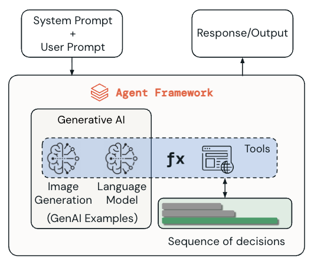
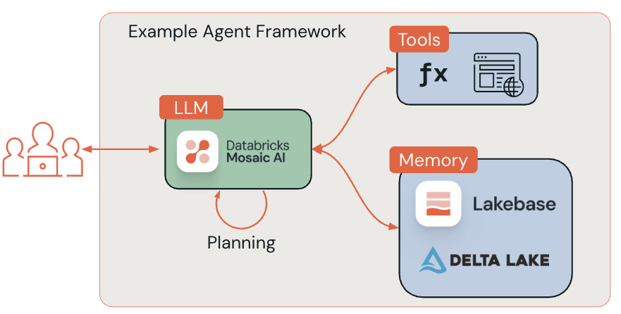
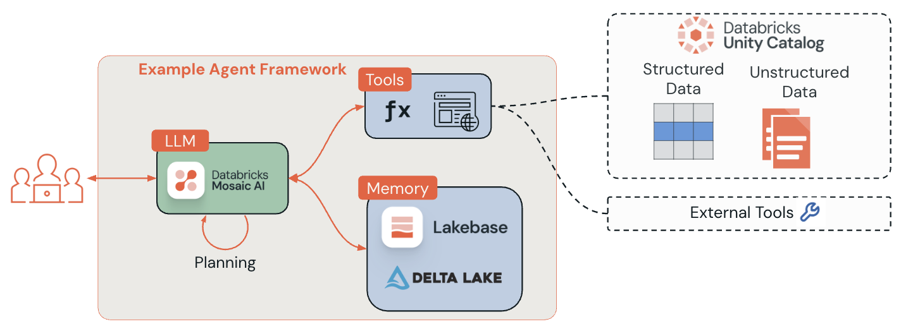
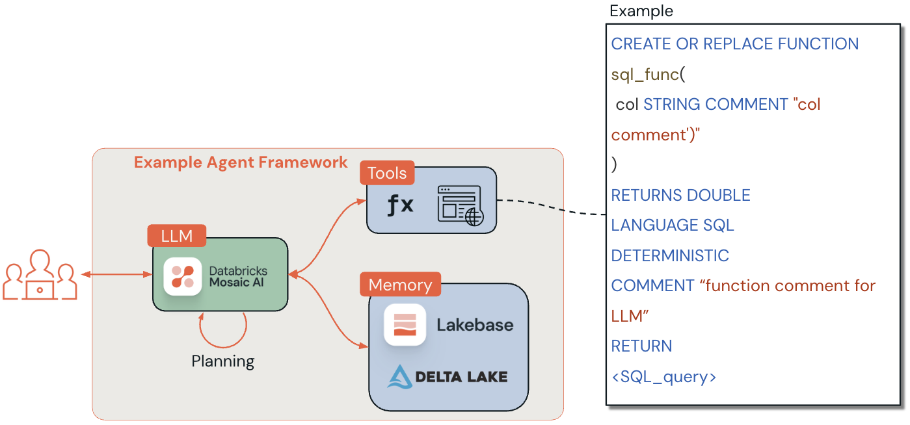

# Fundamentos de los agentes de IA y las herramientas en Databricks

## Descripción general

Esta lección presenta los conceptos fundamentales de los agentes de inteligencia artificial y sus herramientas dentro de Databricks. Las aplicaciones modernas de IA necesitan agentes capaces de interactuar con datos, realizar tareas analíticas y tomar decisiones informadas a partir de la información disponible.

Comprender estos fundamentos prepara el camino para crear soluciones de IA robustas y escalables que combinen gobierno, seguridad y capacidad analítica.

Los agentes de IA representan un cambio importante frente a los sistemas tradicionales que se limitan a responder con información a partir del prompt del usuario. Un agente también puede utilizar herramientas para obtener información actualizada, decidir qué acciones necesita y actuar con cierto grado de autonomía para alcanzar un objetivo definido por una persona.

## Objetivos de aprendizaje

Al finalizar la lección, se debe poder:

- Definir qué es un agente de IA y reconocer sus componentes y capacidades principales.
- Explicar la función de las herramientas dentro de la arquitectura de un agente y cómo amplían sus capacidades.
- Identificar los beneficios de Unity Catalog para gobernar y administrar las herramientas de los agentes.

## A. Comprender los agentes de IA

### A1. ¿Qué es un agente de IA?

Un agente de IA es un sistema de software inteligente que puede percibir su entorno, tomar decisiones y ejecutar acciones para alcanzar objetivos específicos. A diferencia de un sistema tradicional que necesita entradas continuas del usuario, un agente puede operar con autonomía para:

- Razonar sobre problemas y situaciones complejas.
- Planificar una secuencia de acciones para lograr un objetivo.
- Adaptar su comportamiento cuando recibe información nueva.
- Interactuar con sistemas externos y fuentes de datos.
- Aprender de la experiencia para mejorar su desempeño futuro.

La adaptabilidad es una de sus características más importantes. Los agentes utilizan herramientas que pueden recuperar conjuntos de datos actualizados de forma dinámica. Esto les permite fundamentar mejor sus decisiones y trabajar en tareas complejas o impredecibles. La persona establece la meta; el agente determina la mejor manera de alcanzarla.

En analítica de datos y business intelligence, un agente actúa como intermediario inteligente entre el usuario y los sistemas de datos: comprende consultas en lenguaje natural y puede ejecutar tareas analíticas complejas.



**Lectura de la figura:** el system prompt y el user prompt ingresan al agent framework. Dentro del framework, la IA generativa —por ejemplo, un modelo de lenguaje o un modelo de generación de imágenes— participa en una secuencia de decisiones y puede invocar herramientas. El resultado final se devuelve como respuesta o salida.

### A2. Evolución de los agentes de IA

| Periodo | Etapa | Características principales |
|---|---|---|
| Década de 1960 | Sistemas basados en reglas | Chatbots básicos con árboles lógicos predeterminados, programación rígida y respuestas simples previamente definidas. |
| Década de 1990 | Aprendizaje estadístico | Sistemas más autónomos capaces de procesar información y tomar decisiones sencillas; sentaron bases para dispositivos de IA de consumo. |
| Década de 2000 | Integración de machine learning | Aspiradoras robot y asistentes como Siri y Alexa; uso de modelos estadísticos y redes neuronales para mejorar el análisis y la toma de decisiones. |
| Década de 2020 | Large Language Models | Avances en deep reinforcement learning y LLM basados en transformers, interfaces multimodales, razonamiento avanzado, interacción dinámica y tool calling. |

### A3. Principios fundamentales

Los agentes de IA operan sobre tres principios que los distinguen del software tradicional.

#### 1. Percepción

Es el primer paso para comprender el contexto en el que funciona el agente. En el caso de los modelos de lenguaje, la percepción puede incluir:

- Entradas y consultas del usuario mediante texto, fotografías o audio.
- Datos del entorno obtenidos con sensores o APIs.
- Contexto histórico y memoria de la conversación.

#### 2. Toma de decisiones

El agente procesa la información recopilada y determina qué acciones corresponden al objetivo del usuario. Esto implica:

- Analizar requisitos y restricciones.
- Determinar los pasos necesarios y las herramientas que debe utilizar.
- Planificar una secuencia de ejecución adecuada.

#### 3. Acción

Finalmente, el agente realiza pasos concretos para cumplir el objetivo, por ejemplo:

- Ejecutar consultas de base de datos y llamadas a APIs.
- Procesar y transformar datos.
- Generar informes y recomendaciones.
- Tomar decisiones que produzcan resultados en el mundo real.

### A4. Componentes principales de un agente

Los agentes modernos suelen combinar varios componentes.

#### Large Language Model: el cerebro

Es el motor central de razonamiento. Procesa lenguaje natural, interpreta el contexto y decide qué acciones ejecutar.

#### Sistema de memoria

Conserva el historial de la conversación, el contexto y la información aprendida para mantener interacciones coherentes a lo largo del tiempo.

#### Módulo de planificación

Divide solicitudes complejas en tareas más pequeñas y manejables, y determina el orden más conveniente para realizarlas.

#### Interfaz de herramientas

Conecta al agente con sistemas externos, bases de datos, APIs y funciones. Así amplía su alcance más allá de la generación de texto.

#### Motor de ejecución

Administra la ejecución real de las acciones planificadas y procesa las respuestas de las herramientas y los sistemas externos.



**Patrón mostrado:** el LLM de Databricks Mosaic AI funciona como el cerebro que planifica y ejecuta tareas a partir de la solicitud del usuario. El agente invoca herramientas y consulta o actualiza la memoria. Las herramientas pueden almacenarse de forma segura en Unity Catalog; la memoria puede apoyarse en Lakebase y Delta Lake.

### A5. Tipos de agentes según su complejidad

| Tipo | Comportamiento | Ejemplo de la lección |
|---|---|---|
| **Simple reflex agents** | Deciden únicamente según la condición actual, sin considerar el historial ni implicaciones futuras. | Una aspiradora robot que limpia cuando detecta suciedad. |
| **Model-based reflex agents** | Consideran el estado actual y utilizan un modelo del mundo para orientar sus acciones. | Un termostato inteligente que toma en cuenta la hora, el clima y las preferencias. |
| **Goal-based agents** | Planifican estrategias y secuencias de acciones para alcanzar una meta, y evalúan su progreso. | Google Maps al considerar rutas y tráfico. |
| **Utility-based agents** | Comparan diferentes formas de alcanzar un objetivo y buscan la alternativa de mayor utilidad o eficiencia. | Un bot de trading que ajusta estrategias según riesgo y recompensa. |
| **Learning agents** | Aprenden de acciones anteriores, analizan su desempeño y se adaptan para mejorar. | Un sistema de recomendaciones que mejora con el comportamiento del usuario. |

### A6. ¿Todos los LLM pueden utilizar herramientas?

No. La capacidad de **tool calling** no está presente en todos los LLM.

En Databricks, el uso de herramientas se habilita mediante frameworks e integraciones específicas, como Databricks Assistant o frameworks de agentes personalizados. Estos mecanismos permiten que un LLM interactúe con sistemas externos, bases de datos o APIs.

Por tanto, no es una capacidad universal e inherente a cualquier modelo. Requiere ingeniería adicional, orquestación y controles de seguridad que garanticen un uso seguro y eficaz. Databricks Assistant, por ejemplo, está diseñado para utilizar herramientas dentro del ambiente de Databricks, pero esa capacidad pertenece a la integración de la plataforma.

La fuente menciona una lista de Foundation Model APIs compatibles con tool calling, pero no incluye la URL correspondiente en el texto recibido.

## B. Comprender las herramientas de los agentes

### B1. ¿Qué son las agent tools?

Las herramientas de un agente son funciones o capacidades especializadas que le permiten interactuar con sistemas externos y ejecutar tareas concretas.

Una analogía útil es pensar que el LLM constituye el **cerebro** que razona y decide, mientras que las herramientas son las **manos** con las que el agente puede actuar. Las herramientas le permiten:

- Ejecutar consultas de base de datos y recuperar información específica.
- Realizar cálculos complejos y análisis estadísticos.
- Interactuar con APIs y servicios web externos.
- Procesar y transformar datos en distintos formatos.
- Generar informes, visualizaciones y resúmenes.
- Tomar decisiones en tiempo real a partir de datos actuales.

Gracias a estas capacidades, un agente deja de ser un sistema puramente conversacional y se convierte en un asistente capaz de producir acciones y resultados.

### B2. Diferencias frente a otros componentes de IA

#### Herramientas frente a modelos de machine learning

- Los **modelos de ML** aportan inteligencia: predicción, generación o razonamiento.
- Las **agent tools** son capacidades ejecutables que el agente invoca para actuar o recuperar información.
- Una herramienta puede llamar a un modelo de ML, a una API o una base de datos, o ejecutar lógica de negocio.

**Ejemplo:** un modelo de sentimiento asigna una puntuación al mensaje de un cliente; luego, el agente utiliza una herramienta como `escalate_ticket` para actuar según esa puntuación.

#### Herramientas frente a chatbots

- Los **chatbots** producen respuestas conversacionales dentro de un alcance limitado por scripts, recuperación o flujos predefinidos.
- Las **agent tools** permiten ir más allá de la respuesta: el agente decide si debe consultar una base de datos, enviar un correo o escribir en un registro.

**Idea clave:** los chatbots conversan; los agentes utilizan herramientas para hacer cosas en el mundo real.

#### Herramientas frente a APIs tradicionales

- Una **API tradicional** necesita programación manual para decidir cuándo y cómo llamar cada función.
- Las **agent tools** pueden ser seleccionadas y orquestadas de manera dinámica mediante el razonamiento del agente, según el contexto y el objetivo.
- Las herramientas exponen metadata y descripciones para que el agente comprenda cuándo y cómo debe utilizarlas.

### B3. Selección y orquestación de herramientas

Ante una solicitud del usuario, un agente moderno debe:

1. **Analizar la solicitud:** comprender qué intenta conseguir el usuario.
2. **Identificar las herramientas necesarias:** determinar qué capacidades requiere para completar la tarea.
3. **Planificar el orden de ejecución:** decidir la secuencia de llamadas.
4. **Ejecutar y coordinar:** invocar las herramientas con los parámetros adecuados y procesar sus respuestas.
5. **Sintetizar los resultados:** combinar las salidas de varias herramientas en una respuesta coherente.
6. **Aprender y adaptarse:** mejorar la selección futura de herramientas a partir de patrones exitosos.

Esta capacidad de orquestación permite automatizar workflows complejos de varios pasos y resolver problemas de forma dinámica.

## C. Unity Catalog y el gobierno de las herramientas

Databricks presenta tres opciones actuales para crear herramientas de agentes.

| Opción | Descripción | Uso o consideración principal |
|---|---|---|
| **Unity Catalog function tools** | Herramientas definidas como Unity Catalog user-defined functions y registradas centralmente en UC. | Son el enfoque principal del curso. Aportan seguridad, cumplimiento, descubrimiento y reutilización integrados. |
| **Agent-code tools** | Herramientas definidas directamente en el código del agente. | Adecuadas para llamar REST APIs, ejecutar código arbitrario o implementar herramientas de baja latencia; no ofrecen por sí solas el gobierno ni el descubrimiento integrados de UC. |
| **Model Context Protocol tools** | Herramientas que siguen el estándar MCP para interoperabilidad. | Databricks dispone de servidores MCP administrados; la disponibilidad concreta depende de su estado de lanzamiento. |

### C1. ¿Por qué utilizar Unity Catalog?

Después de comprender qué convierte a un sistema en agente, la lección analiza dónde se almacenan y cómo se gobiernan las herramientas en Databricks.



El tool calling tradicional carece de un gobierno integral. Con Unity Catalog, se pueden construir herramientas para recuperar datos estructurados y no estructurados y probarlas en AI Playground.

Cuando una herramienta externa —por ejemplo, Slack, Google Calendar u otro servicio API— se conecta mediante Unity Catalog connections, sus credenciales y su autenticación quedan gobernadas por políticas de Unity Catalog. Esto permite establecer acceso seguro y auditable, además de aplicar reglas organizacionales a las integraciones externas.

#### Gobierno centralizado

- Modelo de objetos unificado y namespace de tres niveles para datos y activos de IA, incluidas las funciones, en todos los workspaces habilitados para UC.
- Auditoría y lineage integrados, con system tables que facilitan el acceso y el análisis.
- Metadata consistente, Catalog Explorer y búsqueda para mejorar el descubrimiento.
- Las funciones registradas en UC se pueden reutilizar como herramientas gobernadas de agentes.

#### Seguridad y control de acceso

- Permisos detallados mediante ANSI `GRANT`, incluido el privilegio `EXECUTE` sobre funciones y herramientas.
- Integración de identidades centralizada mediante SCIM e identidades a nivel de cuenta.
- Ejecución segura y aislada de Python UDFs, junto con acceso gobernado a conexiones y ubicaciones externas.
- Las Python UDFs requieren Unity Catalog y un serverless/pro SQL warehouse o clusters habilitados para UC.
- Privilegios jerárquicos basados en roles: `catalogs → schemas → objects`, incluidos tables, views, volumes, models y functions.

#### Descubrimiento y documentación

- Catálogo consultable con metadata enriquecida, comentarios de funciones y parámetros, lineage y navegación.
- Se recomiendan docstrings con propósito, parámetros, valor de retorno, ejemplos y registro de cambios para facilitar el tool calling.
- La plataforma admite documentación generada con IA para acelerar el descubrimiento de activos gobernados.

#### Escalabilidad y rendimiento

- Las herramientas gobernadas por UC se ejecutan mediante el compute de Databricks.
- La ejecución de herramientas de agentes utiliza serverless generic compute basado en Spark Connect serverless.
- Algunas integraciones pueden ejecutar funciones de UC mediante SQL Warehouses con `uc_function`.
- Los SQL Warehouses aportan controles de escalado y concurrencia; los clusters pueden usar autoscaling para ajustarse a la carga.

#### Compatibilidad con herramientas externas

Unity Catalog connections gobierna la administración de credenciales y la autenticación de servicios externos. Esto permite aplicar controles de acceso, auditoría y políticas de la organización a integraciones como Slack, Google Calendar y otros servicios API.

### C2. Registro y administración de herramientas

Unity Catalog ofrece más de una forma de registrar y administrar herramientas basadas en SQL. Para rastrear el uso de herramientas dentro del agente, Databricks aprovecha capacidades administradas de MLflow, como la inferencia automática de signature, tracing y la interfaz `ResponseAgent`.

El curso mantiene sencilla y directa la lógica de las herramientas para concentrarse en los fundamentos del tool calling. Por ejemplo, no profundiza en la capacidad de un agente para ejecutar vector search.

#### Registro mediante SQL

Se utilizan sentencias `CREATE OR REPLACE FUNCTION` con metadata que el LLM pueda interpretar:

- Parámetros claramente definidos, con tipos y descripciones.
- Documentación de la función y orientación de uso.
- Indicación de comportamiento determinista cuando corresponda.
- Validación y manejo de errores.

La figura muestra esta estructura básica:

```sql
CREATE OR REPLACE FUNCTION sql_func(
  col STRING COMMENT "col comment"
)
RETURNS DOUBLE
LANGUAGE SQL
DETERMINISTIC
COMMENT "function comment for LLM"
RETURN <SQL_query>
```

El marcador `<SQL_query>` representa la consulta que implementaría la lógica real de la función; la fuente no proporciona una consulta concreta.

#### Registro programático

`DatabricksFunctionClient()` permite automatizar la administración de herramientas:

- Crear y actualizar funciones de forma programática.
- Integrarlas con pipelines de CI/CD.
- Ejecutar operaciones por lotes y administración masiva.
- Automatizar pruebas y workflows de validación.

#### Buenas prácticas de documentación

Las funciones SQL deben incluir metadata suficiente para que un agente comprenda su propósito:

- Comentarios detallados que expliquen la lógica de negocio.
- Descripciones de parámetros con tipos y rangos esperados.
- Especificaciones del valor de retorno y ejemplos de salida.
- Ejemplos de uso y patrones frecuentes.
- La marca `DETERMINISTIC` cuando sea apropiada.

Los dos enfoques ayudan a que las funciones estén documentadas, versionadas y disponibles para los agentes sin renunciar al gobierno ni a la seguridad.

MLflow es una base importante para desarrollar, monitorear y desplegar aplicaciones de agentes en Databricks. Aporta tracing, versionado, evaluación y despliegue en producción, especialmente cuando el agente utiliza herramientas.



### C3. Otras herramientas y patrones comunes

Aunque la lección se concentra en las herramientas almacenadas en Unity Catalog, también reconoce alternativas disponibles en Databricks.

#### Model Context Protocol

El beneficio principal de MCP es la estandarización. Una herramienta puede crearse una vez y utilizarse con distintos agentes, tanto propios como de terceros. Del mismo modo, es posible reutilizar herramientas desarrolladas por otras personas o equipos.

La fuente remite a documentación adicional de MCP en Databricks y a la documentación oficial, pero no conserva las URLs de esos enlaces.

#### Mosaic AI Vector Search

Mosaic AI Vector Search es una solución de búsqueda vectorial integrada en Databricks Data Intelligence Platform y en sus herramientas de gobierno y productividad. La búsqueda vectorial está optimizada para recuperar embeddings.

#### Patrones comunes de herramientas

| Patrón | Descripción |
|---|---|
| **Structured data retrieval tools** | Consultan tablas SQL, bases de datos y otras fuentes de datos estructurados. |
| **Unstructured data retrieval tools** | Buscan en colecciones de documentos y permiten implementar retrieval-augmented generation. |
| **Code interpreter tools** | Permiten que el agente ejecute Python para cálculos, análisis de datos y procesamiento dinámico. |
| **External connection tools** | Conectan al agente con servicios y APIs externos, como Slack. |
| **AI Playground prototyping** | Permiten agregar rápidamente herramientas de Unity Catalog a un agente y probar su comportamiento en AI Playground. |

## Conclusión

La lección establece una base conceptual para trabajar con agentes de IA y funciones de Unity Catalog como herramientas en Databricks.

Los puntos centrales son:

- Un agente de IA es un sistema autónomo que combina percepción, toma de decisiones y acción para resolver problemas complejos.
- Las herramientas amplían las capacidades del agente al proporcionarle interfaces con sistemas externos, fuentes de datos y funciones especializadas.
- Unity Catalog ofrece el gobierno, la seguridad, el control de acceso, la documentación y la administración necesarios para desplegar herramientas de agentes en entornos empresariales.

La siguiente lección profundiza en las herramientas de Unity Catalog. Después se construyen funciones SQL y se prueban en AI Playground.

## Conceptos clave para el simulador

- Los tres principios fundamentales de un agente son **percepción, toma de decisiones y acción**.
- El LLM actúa como cerebro; las herramientas permiten actuar; la memoria conserva contexto; la planificación ordena los pasos.
- No todos los LLM admiten tool calling: hacen falta compatibilidad, integración, orquestación y controles de seguridad.
- Un chatbot conversa dentro de un alcance; un agente puede decidir utilizar herramientas para ejecutar acciones.
- Una API tradicional se invoca mediante lógica programada; una agent tool puede seleccionarse dinámicamente a partir del razonamiento del agente.
- La orquestación comprende analizar, seleccionar herramientas, planificar, ejecutar, sintetizar y aprender.
- Las tres opciones de herramientas presentadas son **Unity Catalog function tools**, **agent-code tools** y **MCP tools**.
- Unity Catalog function tools es el enfoque principal de este curso.
- `EXECUTE` es el permiso específico mencionado para permitir el uso de funciones o herramientas.
- Las funciones y los parámetros deben tener comentarios claros para que el LLM entienda cuándo y cómo invocarlos.
- `DatabricksFunctionClient()` permite administrar herramientas de forma programática.
- Una función debe marcarse `DETERMINISTIC` cuando corresponda.
- MLflow aporta tracing, versionado, evaluación y despliegue de aplicaciones de agentes.
- MCP destaca por la interoperabilidad y reutilización de herramientas entre distintos agentes.
- Los patrones comunes incluyen recuperación estructurada, recuperación no estructurada, code interpreter, conexiones externas y prototipado en AI Playground.
