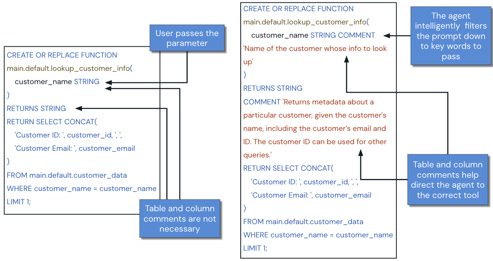
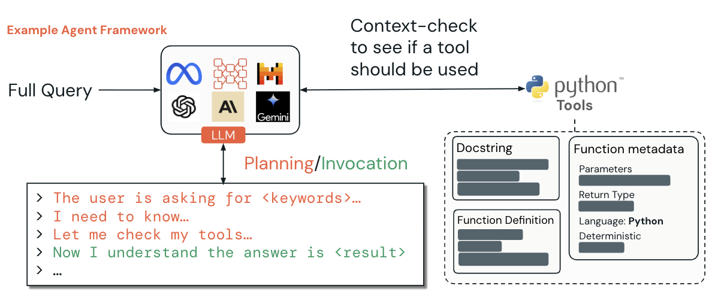
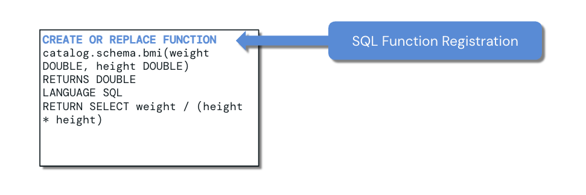
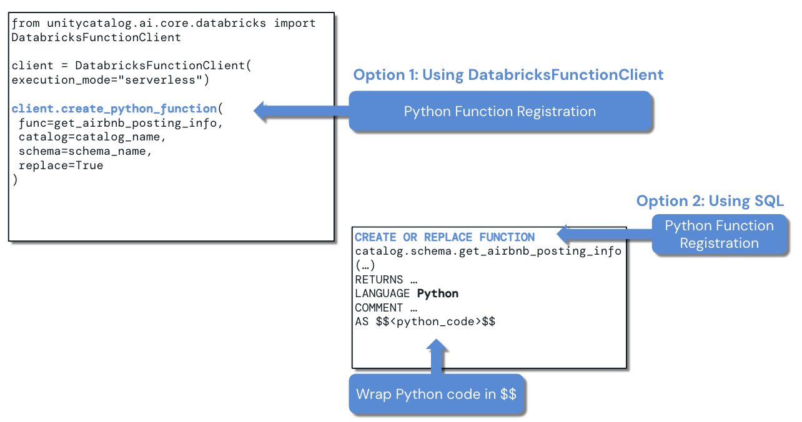
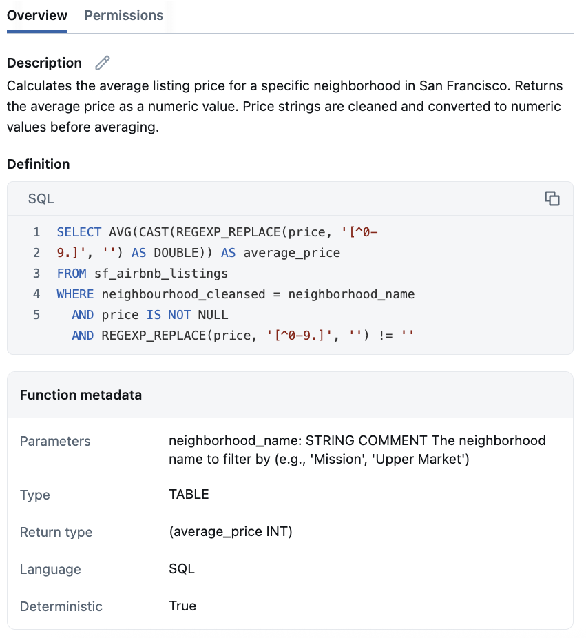
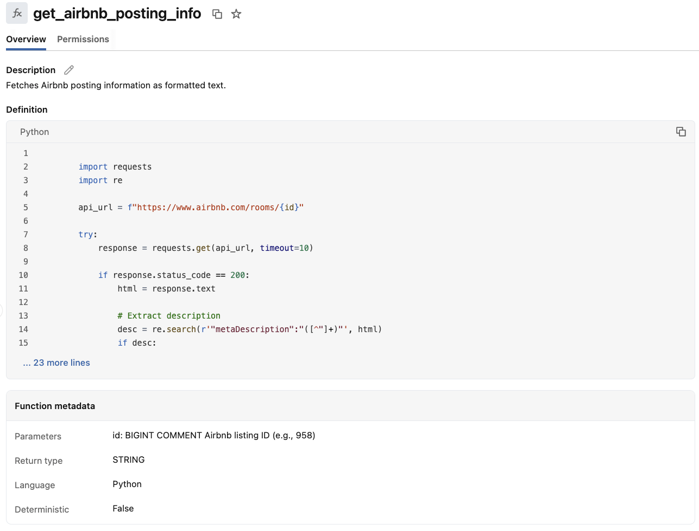
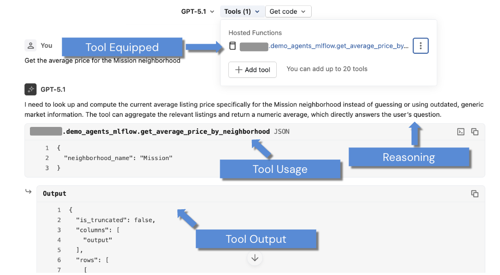

# Funciones de Unity Catalog como herramientas de agentes en Databricks

## Descripción general

Imaginemos un agente de IA que pueda responder de inmediato preguntas como «¿Cuál es el precio promedio de las viviendas en el distrito Mission?» o «Calcula el valor de vida del cliente para nuestros clientes principales». El agente puede hacerlo descubriendo y ejecutando automáticamente las operaciones de datos y la lógica de negocio adecuadas. Ese es el propósito de utilizar **Unity Catalog Functions as Agent Tools**.

A partir de los fundamentos sobre agentes de IA y herramientas, esta lección se concentra en una implementación práctica: utilizar funciones SQL y Python de Unity Catalog como herramientas inteligentes y descubribles que un agente pueda seleccionar y ejecutar según una consulta en lenguaje natural.

La lección establece los conceptos técnicos y las buenas prácticas necesarias para las demostraciones siguientes, donde se crearán y probarán funciones SQL y Python de Unity Catalog como herramientas en AI Playground.

## Objetivos de aprendizaje

Al finalizar la lección, se debe poder:

- Comprender las diferencias fundamentales entre las funciones de Unity Catalog y las Agent Tools.
- Explicar las diferencias entre herramientas SQL y Python.
- Explicar cómo registrar funciones SQL.
- Explicar las distintas formas de registrar funciones Python.
- Explorar las funciones registradas mediante la interfaz de Databricks.
- Comprender cómo se integra AI Playground con las herramientas de Unity Catalog.

## A. Funciones de Unity Catalog como Agent Tools

### A1. ¿Qué son?

En su implementación interna, las herramientas de Unity Catalog son **user-defined functions** o UDFs registradas en Unity Catalog. Definir una herramienta de UC significa registrar una función en el catálogo.

Una **función definida por el usuario** amplía las capacidades de SQL o Python disponibles en Databricks. Permite definir lógica personalizada, utilizarla y compartirla de forma segura y gobernada entre ambientes de cómputo.

Las Unity Catalog Functions as Agent Tools son funciones SQL o Python que un agente de IA puede descubrir, seleccionar y ejecutar dinámicamente para realizar operaciones de datos o lógica de negocio. A diferencia de las funciones convencionales, que un desarrollador llama explícitamente desde el código, estas herramientas están diseñadas para ser:

- **Autodescriptivas:** presentan metadata y documentación completas.
- **Adecuadas al contexto:** resuelven una tarea empresarial o analítica específica.
- **Gobernables:** utilizan los mecanismos de seguridad y control de acceso de Unity Catalog.

### A2. Herramientas SQL frente a herramientas Python

Elegir entre SQL y Python es una decisión importante de diseño.

| Aspecto | SQL Agent Tools | Python Agent Tools |
|---|---|---|
| Propósito principal | Consultas de datos y operaciones analíticas | Lógica de negocio personalizada y cálculos complejos |
| Registro | `CREATE OR REPLACE FUNCTION` | `DatabricksFunctionClient.create_python_function()` o DDL SQL con `LANGUAGE PYTHON` |
| Lógica disponible | Sintaxis SQL y funciones SQL integradas | Lógica Python, bibliotecas y APIs externas |
| Modos de ejecución | Solo serverless | Serverless y local |
| Requisitos de metadata | Comentarios de la función y sus parámetros | Type hints explícitos y docstrings con estilo Google |
| Fortalezas operativas | Optimización automática de consultas y caching | Manejo avanzado de errores y debugging |
| Casos ideales | Recuperación, agregación, filtrado y cálculos analíticos | Reglas de negocio, integraciones externas, algoritmos complejos y transformaciones |

Las arquitecturas más potentes pueden combinar ambos tipos. SQL se encarga del acceso a los datos y el análisis; Python administra la lógica de negocio y las integraciones con sistemas externos.



#### Cómo la metadata convierte una función SQL en una herramienta eficaz

La figura compara una función con documentación mínima y una versión preparada para un LLM. Ambas reciben `customer_name` del usuario y devuelven datos del cliente, pero la versión documentada agrega:

- Un comentario del parámetro que explica que `customer_name` es el nombre del cliente que se desea buscar.
- Un comentario de la función que explica qué información devuelve y por qué el identificador del cliente resulta útil.

Los comentarios no son necesarios para ejecutar la función SQL, pero ayudan al agente a identificar la herramienta correcta y extraer el argumento adecuado desde un prompt en lenguaje natural.

La función simplificada que aparece en la figura es:

```sql
CREATE OR REPLACE FUNCTION main.default.lookup_customer_info(
  customer_name STRING
)
RETURNS STRING
RETURN SELECT CONCAT(
  'Customer ID: ', customer_id, '; ',
  'Customer Email: ', customer_email
)
FROM main.default.customer_data
WHERE customer_name = customer_name
LIMIT 1;
```

La versión orientada al LLM agrega comentarios:

```sql
CREATE OR REPLACE FUNCTION main.default.lookup_customer_info(
  customer_name STRING COMMENT
    'Name of the customer whose info to look up'
)
RETURNS STRING
COMMENT 'Returns metadata about a particular customer, given the customer''s
name, including the customer''s email and ID. The customer ID can be used for
other queries.'
RETURN SELECT CONCAT(
  'Customer ID: ', customer_id, '; ',
  'Customer Email: ', customer_email
)
FROM main.default.customer_data
WHERE customer_name = customer_name
LIMIT 1;
```

Los ejemplos reproducen la lógica mostrada en la figura del curso. La fuente utiliza `customer_name` tanto para el parámetro como para la columna; esta lección no modifica ese ejemplo.

### A3. Agent Tools frente a funciones tradicionales

| Funciones tradicionales | Unity Catalog Functions as Agent Tools |
|---|---|
| Diseñadas para que los desarrolladores las utilicen directamente desde el código | Diseñadas para que un agente de IA las descubra e invoque dinámicamente |
| Pueden tener documentación mínima | Necesitan metadata enriquecida y documentación completa |
| Se llaman explícitamente con parámetros conocidos | El uso y los parámetros se pueden inferir desde una consulta en lenguaje natural |
| Priorizan eficiencia computacional y rendimiento | Priorizan claridad, interpretación y facilidad de uso para el agente |
| Suelen documentar el comportamiento técnico | Incluyen contexto de negocio y ejemplos de uso |



El agente recibe la consulta completa y revisa las herramientas disponibles para decidir si debe utilizar una. El LLM planifica la acción examinando información como:

- El docstring de la herramienta.
- La definición de la función.
- La metadata de sus parámetros.
- El tipo de retorno.
- El lenguaje.
- La propiedad `deterministic`.

La secuencia ilustrada consiste en identificar lo que solicita el usuario, determinar qué información hace falta, revisar las herramientas, invocar la más adecuada y utilizar el resultado para responder.

## B. Métodos de registro

> **Nota sobre la numeración:** la fuente recibida denomina “B2” a la siguiente subsección y no contiene una sección “B1”. Se conserva esa numeración para mantener la trazabilidad.

### B2. Métodos para registrar funciones

Unity Catalog proporciona distintas formas de registrar funciones SQL y Python como herramientas. Como las funciones registradas en UC están gobernadas mediante sus permisos, se diferencian de las UDF limitadas a una sesión o un notebook.

#### Registro de funciones SQL

Las funciones SQL se registran mediante `CREATE OR REPLACE FUNCTION`. Este enfoque ofrece:

- Registro y disponibilidad inmediatos.
- Control completo de la definición y la metadata.
- Integración con workflows de desarrollo SQL existentes.
- Compatibilidad con lógica SQL y reglas de negocio complejas.
- Ningún soporte para ambientes o dependencias personalizadas.



La figura utiliza una función de índice de masa corporal como ejemplo compacto:

```sql
CREATE OR REPLACE FUNCTION catalog.schema.bmi(
  weight DOUBLE,
  height DOUBLE
)
RETURNS DOUBLE
LANGUAGE SQL
RETURN SELECT weight / (height * height)
```

#### Registro de funciones Python: opción 1

`DatabricksFunctionClient` permite registrar directamente un callable de Python. Su API `create_python_function()` ofrece:

- Extracción automática de type hints y metadata del docstring.
- Integración con el namespace de tres niveles de Unity Catalog.
- Reemplazo de funciones y workflows de versionado.
- Modo serverless para producción y modo local para desarrollo.

El modo local no admite funciones basadas en SQL.

La figura presenta esta estructura:

```python
from unitycatalog.ai.core.databricks import DatabricksFunctionClient

client = DatabricksFunctionClient(
    execution_mode="serverless"
)

client.create_python_function(
    func=get_airbnb_posting_info,
    catalog=catalog_name,
    schema=schema_name,
    replace=True
)
```

#### Registro de funciones Python: opción 2

También se puede registrar una función Python mediante DDL SQL, declarando `LANGUAGE PYTHON`. Esta alternativa permite definir dependencias personalizadas mediante la cláusula `ENVIRONMENT`.

```sql
CREATE OR REPLACE FUNCTION catalog.schema.get_airbnb_posting_info(
  ...
)
RETURNS ...
LANGUAGE PYTHON
COMMENT ...
AS $$
<python_code>
$$
```

El cuerpo Python se encierra entre `$$`. Los puntos suspensivos y `<python_code>` son marcadores que aparecen en la figura; la fuente no proporciona una implementación completa para este ejemplo.



### B3. Opcional: consideraciones del ambiente de ejecución

La elección entre los modos serverless y local afecta la ejecución de las funciones Python de Unity Catalog. La lección remite a documentación técnica adicional, pero el texto recibido no conserva la URL de destino.

## C. Validación del registro mediante la interfaz

Después de registrar una función en Unity Catalog, su metadata puede inspeccionarse en la interfaz de Databricks. Esta validación es importante porque el LLM consume dicha información para comprender el contexto y filtrar las herramientas candidatas.

### Función SQL registrada



El ejemplo SQL calcula el precio promedio de los anuncios en un vecindario de San Francisco. La pestaña Overview muestra:

- Una descripción en lenguaje natural.
- La definición SQL.
- El parámetro `neighborhood_name` y su comentario.
- El tipo de objeto y el tipo de retorno.
- El lenguaje, `SQL`.
- La propiedad determinista, mostrada como `True`.

La definición SQL visible es:

```sql
SELECT AVG(
  CAST(REGEXP_REPLACE(price, '[^0-9.]', '') AS DOUBLE)
) AS average_price
FROM sf_airbnb_listings
WHERE neighbourhood_cleansed = neighborhood_name
  AND price IS NOT NULL
  AND REGEXP_REPLACE(price, '[^0-9.]', '') != ''
```

La descripción de la función indica que limpia los precios expresados como cadenas, los convierte en valores numéricos y devuelve el promedio del vecindario solicitado.

### Función Python registrada



El ejemplo Python, `get_airbnb_posting_info`, devuelve información formateada de un anuncio de Airbnb. La interfaz muestra:

- La descripción.
- La definición Python.
- El parámetro `id` como `BIGINT`, junto con un identificador de ejemplo.
- El tipo de retorno `STRING`.
- El lenguaje `Python`.
- La propiedad determinista con valor `False`.

La captura solo muestra una parte del cuerpo de la función. Se importan `requests` y `re`, se construye la URL de una habitación de Airbnb, se ejecuta una solicitud HTTP con timeout y comienza la extracción de metadata del HTML recibido. Las 23 líneas restantes están contraídas en la figura y no se reconstruyen.

## D. Integración con AI Playground para prototipado

### D1. Integración con AI Playground

AI Playground proporciona una interfaz no-code para probar y crear prototipos de funciones SQL y Python de Unity Catalog utilizadas como Agent Tools.

Dentro de AI Playground:

- El acceso a las herramientas respeta el nivel de permisos del usuario en Unity Catalog.
- Se pueden probar modelos avanzados compatibles, incluidos modelos Claude y GPT.
- Se pueden prototipar consultas, modelos y uso de herramientas antes de escribir el código del agente.
- Los modelos con soporte para tool calling pueden equiparse con funciones de Unity Catalog.



En el ejemplo, GPT-5.1 está equipado con una función alojada que calcula el precio promedio por vecindario. El usuario solicita el precio promedio en Mission. El modelo:

1. Razona que necesita datos actuales de anuncios en lugar de adivinar.
2. Selecciona la herramienta registrada.
3. Envía `{"neighborhood_name": "Mission"}`.
4. Recibe la salida estructurada de la herramienta.
5. Utiliza esa salida para producir la respuesta final.

La figura diferencia la herramienta equipada, el razonamiento del modelo, la invocación y la salida de la herramienta.

## Conclusión

Las herramientas de Unity Catalog pueden crearse, registrarse, inspeccionarse visualmente y probarse dentro de Databricks. SQL y Python desempeñan funciones complementarias: SQL resulta adecuado para recuperación y análisis gobernado de datos; Python admite lógica compleja e integraciones externas.

El requisito central de una buena herramienta no es únicamente que su código sea ejecutable. La función también necesita metadata clara, descripciones de parámetros, información de retorno, permisos y contexto de negocio para que el LLM pueda descubrirla e invocarla correctamente.

Con estos conceptos, la siguiente demostración construye funciones de Unity Catalog y las prueba en AI Playground.

## Conceptos clave para el simulador

- Una herramienta de Unity Catalog es internamente una UDF de Unity Catalog.
- Las UDF de UC pueden escribirse en SQL o Python y se comparten y gobiernan mediante Unity Catalog.
- Las herramientas SQL son apropiadas para recuperación, agregación, filtrado y cálculos analíticos.
- Las herramientas Python son apropiadas para lógica de negocio, APIs, algoritmos complejos y transformaciones.
- Las herramientas SQL solo se ejecutan en serverless; las herramientas Python admiten serverless y local.
- Las herramientas Python necesitan type hints explícitos y docstrings con estilo Google.
- Los comentarios y la metadata ayudan al LLM a seleccionar la herramienta y derivar sus parámetros.
- Las funciones SQL se registran mediante `CREATE OR REPLACE FUNCTION`.
- Las funciones Python se registran mediante `DatabricksFunctionClient.create_python_function()` o DDL SQL con `LANGUAGE PYTHON`.
- La alternativa DDL SQL puede usar la cláusula `ENVIRONMENT` para dependencias personalizadas.
- El modo local no admite funciones basadas en SQL.
- La interfaz de Databricks muestra descripción, definición, parámetros, retorno, lenguaje, permisos y propiedad determinista.
- AI Playground debe utilizarse para prototipar prompts, modelos y herramientas antes de crear el código del agente.
- El acceso a herramientas en AI Playground respeta los permisos de Unity Catalog.

