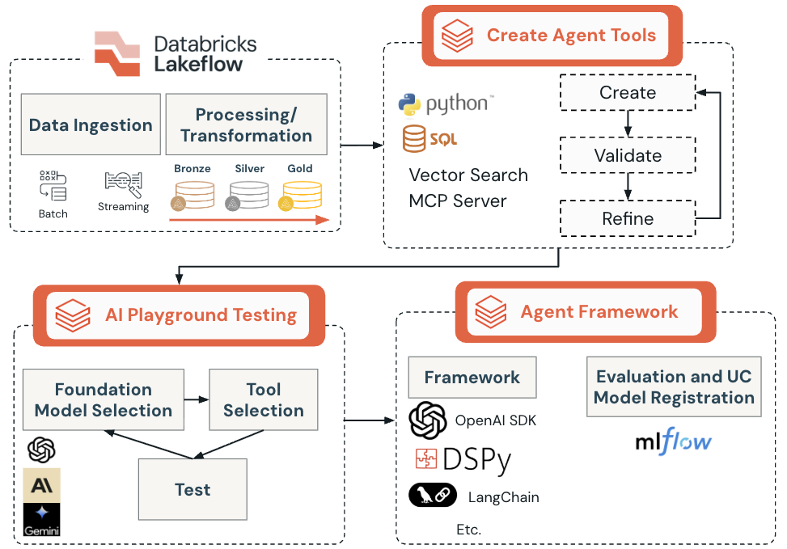
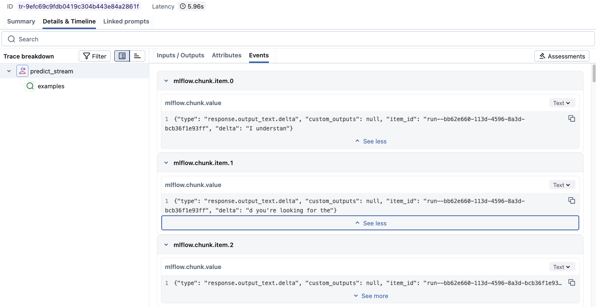
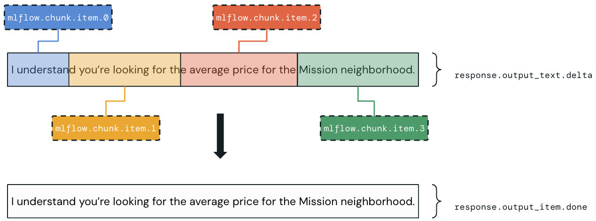

# Authoring Single AI Agents with Databricks Mosaic AI Agent Framework

## Overview

The Databricks Mosaic AI Agent Framework provides a unified platform for authoring, deploying, and monitoring AI agents. It supports popular agent-development libraries such as LangChain, LangGraph, DSPy, and OpenAI patterns, while integrating with Databricks services including Vector Search, Model Serving, Unity Catalog, AI Gateway, and MLflow.

The framework is designed for production readiness. It combines automatic tracing, evaluation, governance, model registration, scalable serving, and continuous monitoring. These capabilities can support simple chat agents as well as more complex agentic and multi-agent applications.

## Learning objectives

By the end of the lecture, you should be able to:

- Understand the architecture and components of Mosaic AI Agent Framework.
- Explain the benefits of `ResponsesAgent` for production-grade development.
- Identify supported authoring frameworks and their integration patterns.
- Describe deployment considerations for agents.
- Recognize advanced capabilities such as streaming, custom inputs and outputs, and retriever integration.

## A. Introduction to Mosaic AI Agent Framework

Mosaic AI Agent Framework addresses the complete agent lifecycle, from preparing data and creating tools to deployment and production monitoring.

### The agent lifecycle

#### 1. Prepare data and create tools

AI engineers prepare data through AI-related ETL using notebooks, SQL queries, and the Lakeflow suite. Unstructured data is commonly embedded and indexed with Vector Search.

Once the data is ready, tools are created in SQL or Python and registered in Unity Catalog for centralized governance.

#### 2. Rapid prototyping and quality checks

AI Playground supports rapid no-code experimentation. Engineers can define a system prompt, select foundation models, compare them side by side, attach tools, and perform an initial qualitative check.

MLflow 3 evaluation capabilities help identify quality problems and their root causes. After prototyping, code can be exported from AI Playground and evaluated programmatically with `mlflow.genai.evaluate()`.

#### 3. Evaluate and collect feedback

The agent is tested against evaluation datasets. Evaluation can use:

- LLM judges.
- Stakeholder or domain-expert labeling.
- Synthetic data.
- Review applications.
- Direct tracing of interactions.

#### 4. Label data and feedback

Interactions and outputs are labeled to build reliable benchmarks for subsequent iterations. These evaluation sets become the ground truth for quality assessment. Labeling sessions provide a structured way for domain experts to review GenAI application behavior.

#### 5. Improve iteratively

Feedback and benchmark results are used to identify and correct the root causes of quality issues. Multiple versions and configurations are compared to balance:

- Accuracy.
- Safety.
- Cost.
- Latency.

#### 6. Deploy to production

The agent moves into a scalable production environment, often exposed through a REST API backed by Mosaic AI Model Serving. Unity Catalog provides unified access and compliance governance.

#### 7. Monitor quality and performance

The same evaluation and tracing tools used during development continue to operate in production. Logs, traces, user feedback, and automated judges provide ongoing quality signals.

Production interactions can be incorporated into future evaluation sets. Additional capabilities include:

- AI Gateway-enhanced inference tables with detailed request metadata.
- End-to-end observability through MLflow Tracing.
- Automatic execution of MLflow scorers on production traces through production monitoring for GenAI.



The figure connects four major areas:

1. Lakeflow data ingestion and Bronze/Silver/Gold processing.
2. Iterative creation, validation, and refinement of SQL, Python, Vector Search, and MCP tools.
3. Foundation-model and tool testing in AI Playground.
4. Agent authoring with supported frameworks, followed by MLflow evaluation and Unity Catalog model registration.

The focus of this lecture is the **Agent Framework** stage.

### A1. Framework architecture

After UC and external tools have been tested in notebooks, SQL Editor, and AI Playground, Mosaic AI Agent Framework provides the components required to author, deploy, and monitor agentic and RAG applications:

- **MLflow 3 integration:** experiment tracking, model logging, tracing, evaluation, and lifecycle management.
- **`ResponsesAgent` interface:** production-oriented interface compatible with the OpenAI Responses schema.
- **Agent-authoring libraries:** integrations for LangChain, LangGraph, DSPy, OpenAI, and pure Python patterns.
- **Databricks AI Bridge:** packages that connect third-party agent frameworks to Databricks AI capabilities.
- **Agent governance:** tools and agents are registered and governed in Unity Catalog; AI Gateway and MLflow capture inference logs and traces.
- **Mosaic AI Model Serving:** scalable serving infrastructure for production agents.
- **Evaluation and monitoring:** built-in assessment of agent quality and performance.

### A2. Requirements and setup

#### Core requirements

- `databricks-agents` 1.2.0 or later.
- `mlflow` 3.1.3 or later.
- Python 3.10 or later.
- Serverless compute or Databricks Runtime 13.3 LTS or later.

#### Installation

```python
%pip install -U -qqqq databricks-agents mlflow
```

#### Databricks AI Bridge integration packages

AI Bridge provides a shared API layer for Databricks AI features such as AI/BI Genie and Vector Search.

| Package | Intended integration |
|---|---|
| `databricks-openai` | OpenAI-style agents |
| `databricks-langchain` | LangChain and LangGraph |
| `databricks-dspy` | DSPy |
| `databricks-ai-bridge` | Pure Python agents without a dedicated framework package |

## B. `ResponsesAgent`: the production interface

Databricks recommends the MLflow `ResponsesAgent` interface as the primary method for creating production-grade agents. It is compatible with the OpenAI Responses schema and adds Databricks-specific capabilities.

For new agents, `ResponsesAgent` is intended to replace the older `ChatAgent` interface.

### B1. Benefits of `ResponsesAgent`

#### Advanced agent capabilities

- Support for multi-agent workflows.
- Streaming output through real-time chunks.
- Complete tool-calling message history.
- Confirmation before tool execution.
- Support for long-running tools.

#### Streamlined authoring and deployment

- **Framework agnostic:** existing agents can be wrapped for Databricks compatibility.
- Typed interfaces with IDE autocomplete.
- Automatic model-signature inference during logging.
- Automatic tracing for `predict` and `predict_stream`, including aggregation of streamed output.
- AI Gateway-enhanced inference tables for detailed logging.

If the recommended interface is not used, the model signature must be defined manually or inferred from input examples with MLflow Model Signature capabilities.

A non-streaming agent implements `predict` and returns `ResponsesAgentResponse`. A streaming agent can implement `predict_stream`. Detailed streaming implementation is beyond the central scope of this lecture.

### B2. Request and response schema

#### Input: `ResponsesAgentRequest`

```json
{
  "input": [
    {
      "role": "user",
      "content": "What did the data scientist say when their Spark job finally completed?"
    }
  ]
}
```

#### Output: `ResponsesAgentResponse`

```python
ResponsesAgentResponse(
    output=[
        {
            "type": "message",
            "id": str(uuid.uuid4()),
            "content": [
                {
                    "type": "output_text",
                    "text": "Well, that really sparked joy!"
                }
            ],
            "role": "assistant",
        }
    ]
)
```

### B3. Wrapping an existing agent

An existing LangChain, LangGraph, OpenAI-style, or similar agent does not have to be rewritten. A wrapper can inherit from `mlflow.pyfunc.ResponsesAgent`, translate the incoming messages, invoke the existing agent, and convert the result to the expected response format.

```python
from uuid import uuid4
from mlflow.pyfunc import ResponsesAgent
from mlflow.types.responses import ResponsesAgentRequest, ResponsesAgentResponse


class MyWrappedAgent(ResponsesAgent):
    def __init__(self, agent):
        # Reference the existing LangChain, LangGraph, OpenAI, or other agent.
        self.agent = agent

    def prep_msgs_for_llm(self, messages: list[dict]) -> list[dict]:
        # Convert request messages to the format expected by the existing agent.
        return messages

    def predict(
        self,
        request: ResponsesAgentRequest,
    ) -> ResponsesAgentResponse:
        messages = self.prep_msgs_for_llm(
            [item.model_dump() for item in request.input]
        )

        agent_response = self.agent.invoke(messages)

        if not isinstance(agent_response, str):
            agent_response = str(agent_response)

        output_item = self.create_text_output_item(
            text=agent_response,
            id=str(uuid4()),
        )
        return ResponsesAgentResponse(output=[output_item])
```

## C. Supported agent-authoring frameworks

### C1. LangChain

LangChain is a broad framework for building LLM applications and provides many integrations.

On Databricks, it supports:

- Databricks-served models for LLM inference and embeddings.
- Mosaic AI Vector Search for vector storage and retrieval.
- MLflow experiment tracking and performance monitoring.
- MLflow Tracing during development and production.
- A PySpark DataFrame loader.
- Spark DataFrame Agent and Databricks SQL Agent for natural-language querying.

```python
from databricks_langchain import ChatDatabricks

chat_model = ChatDatabricks(
    endpoint="databricks-gpt-5-1",
    temperature=0.1,
    max_tokens=250,
)

chat_model.invoke("How to use Databricks?")
```

The source warns that LangChain features for LLM development on Databricks are experimental and their APIs may change.

### C2. DSPy

DSPy defines and optimizes generative AI programs through a programmatic approach to prompt engineering.

#### Main components

- **Modules:** components that perform text transformations instead of relying on manually written prompts.
- **Signatures:** natural-language definitions of input and output behavior, such as `question -> answer`.
- **Compiler:** optimizes pipelines by adjusting modules against performance metrics.
- **Program:** connected modules that form a pipeline for a complex task.

#### Advantages

- Automated prompt optimization.
- Systematic agent improvement.
- Built-in performance optimization.
- Programmatic rather than manual prompt engineering.

### C3. OpenAI integration

Databricks supports familiar OpenAI API patterns while using Databricks-hosted models. Benefits include:

- Familiar authoring patterns.
- Access to Databricks Foundation Model APIs.
- Easier migration from OpenAI models to Databricks models.
- Streaming and non-streaming responses.
- Tool calling with compatible Databricks models.

### C4. LangGraph

LangGraph extends LangChain with graph-based orchestration for complex, stateful workflows:

- Graph-based agent workflows.
- State management across interactions.
- Conditional logic and complex decision trees.
- Multi-step reasoning and tool coordination.

## D. Streaming and real-time responses

Streaming emits a response incrementally instead of waiting for the entire result before displaying anything to the user. This improves interactivity and perceived performance.

MLflow can display both the final response and the intermediate chunks. These events can help explain why the agent selected—or did not select—a specific tool.

> **Source clarification:** one sentence in the supplied text says that streaming waits for a complete response. The surrounding definition, event types, screenshots, and stated benefits describe incremental delivery, so this study version uses that consistent interpretation.



The screenshot shows a Knowledge Assistant trace with multiple `mlflow.chunk.item.*` events containing `response.output_text.delta` values.

### D1. Streaming pattern

1. Emit several `response.output_text.delta` events with the same `item_id`.
2. Finish with one `response.output_item.done` event containing the complete output.

#### Benefits

- Real-time user feedback.
- Better perceived performance.
- Stronger engagement during long-running operations.
- Automatic integration with MLflow Tracing.
- Aggregated responses in AI Gateway inference tables.



The figure illustrates four delta chunks that progressively form the sentence “I understand you’re looking for the average price for the Mission neighborhood.” The final `response.output_item.done` event contains the completed text.

### D2. Error handling during streaming

Mosaic AI propagates streaming errors through the last token under `databricks_output.error`:

```json
{
  "delta": "...",
  "databricks_output": {
    "trace": {},
    "error": {
      "error_code": "BAD_REQUEST",
      "message": "TimeoutException: Tool XYZ failed to execute."
    }
  }
}
```

Client applications must detect and surface these errors appropriately.

## E. Optional advanced capabilities

These topics are introduced for awareness but are outside the main scope of the course.

### E1. Custom inputs and outputs

Some applications need values beyond the normal conversation history:

- `custom_inputs`: additional input parameters such as `client_type` or `session_id`.
- `custom_outputs`: extra output data such as retrieval-source links.
- Agent code reads additional input values through `request.custom_inputs`.
- AI Playground and review applications accept JSON configuration for these fields.

**Limitation:** Agent Evaluation review apps do not render traces for agents with additional input fields.

### E2. Retriever integration and schema

Agents commonly use retrievers to access unstructured data from Vector Search indices. Databricks provides specialized tracing and evaluation for retrievers.

Benefits include:

- Automatic source-document links in AI Playground.
- Automatic groundedness and relevance evaluation for retrieved content.
- Integration with Databricks AI Bridge retriever tools.

```python
import mlflow

mlflow.models.set_retriever_schema(
    name="mlflow_docs_vector_search",
    primary_key="document_id",
    text_column="chunk_text",
    doc_uri="doc_uri",
    other_columns=["title"],
)
```

### E3. Multi-agent systems

Databricks can support systems in which multiple specialized agents collaborate. The source points to Genie and Agent Bricks as related areas for further study.

### E4. Stateful agents

Stateful agents preserve memory across conversation threads and support conversation checkpoints. This topic is also outside the scope of the course.

## Conclusion

Mosaic AI Agent Framework provides the components needed to author, evaluate, register, deploy, and monitor production-ready agents. Its central production interface is `ResponsesAgent`, while AI Bridge packages connect popular authoring frameworks to Databricks services.

Production quality depends on the complete lifecycle: governed tools and data, rapid prototyping, evaluation, expert feedback, iterative improvement, scalable serving, tracing, and continuous monitoring.

## Key facts for the simulator

- Mosaic AI Agent Framework covers authoring, deployment, governance, evaluation, tracing, and monitoring.
- The principal lifecycle stages are data/tool preparation, prototyping, evaluation, labeling, iteration, deployment, and monitoring.
- `ResponsesAgent` is the recommended production interface and replaces `ChatAgent` for new agents.
- `predict` returns `ResponsesAgentResponse` for non-streaming requests; streaming agents can implement `predict_stream`.
- Existing framework-based agents can be wrapped instead of rewritten.
- Minimum versions in the lecture are `databricks-agents >= 1.2.0`, `mlflow >= 3.1.3`, and Python 3.10 or later.
- Compute must be serverless or Databricks Runtime 13.3 LTS or later.
- AI Bridge packages include `databricks-openai`, `databricks-langchain`, `databricks-dspy`, and `databricks-ai-bridge`.
- LangChain, LangGraph, DSPy, OpenAI patterns, and pure Python are supported authoring approaches.
- DSPy replaces manual prompt tuning with programmatic modules, signatures, compilation, and optimization.
- Streaming uses repeated `response.output_text.delta` events followed by `response.output_item.done`.
- Streaming errors appear under `databricks_output.error` in the final token.
- `custom_inputs` and `custom_outputs` carry data outside the chat history.
- `mlflow.models.set_retriever_schema()` describes retriever fields for tracing and evaluation.
- AI Gateway inference tables and MLflow Tracing provide production observability.

