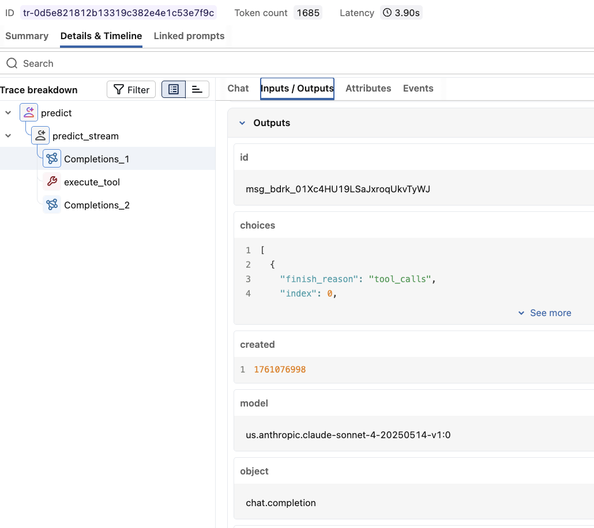
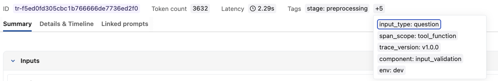
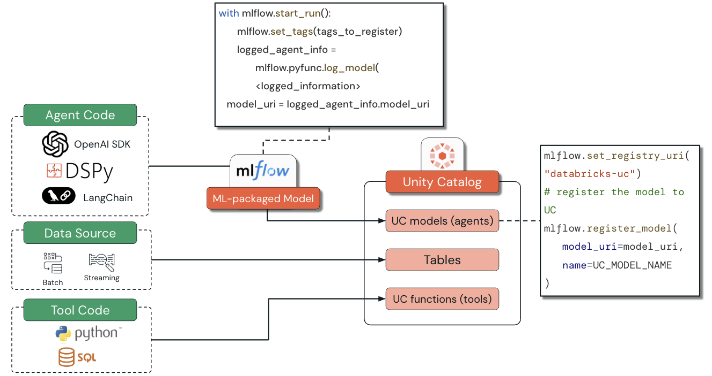

# Building Agents on Databricks with MLflow

## Overview

MLflow supports GenAI applications with integrated experiment tracking, observability, evaluation, model registration, deployment support, and production monitoring. These capabilities span the entire agent lifecycle, from initial experimentation through governed deployment and ongoing production analysis.

This lecture is an introduction to basic MLflow concepts for agents. It focuses on managed MLflow in Databricks and is not intended to cover every MLflow component or the separate OSS MLflow experience.

## Learning objectives

By the end of the lecture, you should be able to:

- Explain how MLflow experiment tracking supports iterative agent development.
- Describe how tracing and tagging provide agent observability.
- Identify how the MLflow Model Registry enables reproducible and governed deployments.
- Analyze the benefits of integrating MLflow with Unity Catalog for enterprise agent management.

## A. The agent-development challenge

Production agents create requirements that traditional machine-learning workflows do not fully address.

### A1. Complexity of agent systems

Agents differ from traditional predictive models in several ways:

- **Multi-step reasoning:** a single request can involve planning, retrieval, tool use, LLM calls, and decisions across many steps.
- **Dynamic behavior:** behavior changes according to context, available tools, and conversation history.
- **Tool integration:** agents must interact with APIs, databases, functions, and other external systems.
- **Conversational context:** state must be preserved and interpreted across multi-turn conversations.

These characteristics complicate development, testing, debugging, deployment, and production monitoring.

### A2. Observability requirements

Agent observability extends beyond traditional model monitoring:

- **Execution tracing:** inspect the sequence of operations, the tools selected, and the reasons for using them.
- **Performance analysis:** track latency, token consumption, and cost across a multi-step workflow.
- **Quality assessment:** evaluate the final answer as well as intermediate reasoning and tool-use patterns.
- **Error diagnosis:** locate failures within the workflow and determine their root causes.

Without this visibility, diagnosing agent behavior—particularly in production—becomes extremely difficult.

### A3. Governance and reproducibility

Enterprise agent deployment also requires:

- **Version management:** track changes to code, prompts, tools, dependencies, and configuration.
- **Reproducibility:** preserve consistent behavior across development, staging, and production.
- **Access control:** govern who can deploy, modify, execute, or inspect agent assets.
- **Audit trails:** retain records of behavior for compliance and debugging.
- **AI Guardrails:** enforce data-compliance policies at the model-serving-endpoint level.

## B. MLflow on Databricks

### B1. Why tracing is needed

#### Traditional request/response inference

A conventional ML inference flow is comparatively simple:

1. A client sends an input request to the handler on a serving endpoint.
2. The handler passes the request to the model.
3. The handler returns the model output to the client.

The input and output may be the only visible components.

Production systems can also benefit from server-side visibility, latency and cost metrics, and API logging. Databricks Model Serving and AI Gateway provide these telemetry and governance capabilities.

Databricks hosts managed MLflow. Setting the tracking URI to `databricks` logs traces to the workspace and provides managed security, reliability, search, and a user interface. Deploying through Mosaic AI Agent Framework automatically integrates real-time tracing and can enable the Review App and production monitoring.

#### Agents need visibility into intermediate work

An agent can perform retrieval, tool calls, LLM calls, validation, and response generation during one request. Developers need the input, output, duration, token use, and metadata of each operation.

MLflow Tracing captures this information automatically for supported libraries such as:

- OpenAI SDK.
- LangChain and LangGraph.
- DSPy.

It provides both APIs and a UI for analyzing traces in development and production.

#### What is a span?

A **span** is one operation in a tracing system. It records:

- Start and end times.
- Inputs and outputs.
- Metadata.
- Attributes such as token counts.
- Errors or other operation events.

MLflow spans follow the OpenTelemetry standard. Additional information is stored as key-value attributes rather than arbitrary custom fields.

### B2. Tracing agents

A **trace** in a GenAI application is a collection of spans arranged in a DAG-like structure. Each span represents one operation, such as:

- A function call.
- A database query.
- An LLM request.
- A tool execution.
- A retrieval operation.

Consider an agent with three Unity Catalog tools that is responding slowly. The MLflow interface can reveal:

- Which Foundation Model API was used at each reasoning step.
- The system prompts used by the agent.
- Whether tools were invoked and in what order.
- Each tool’s inputs and outputs.
- The reasoning associated with each step.
- Per-step latency, making it possible to identify the slowest tool or an inefficient SQL query.
- Token usage for individual spans and the aggregated trace.

### B3. Hierarchical span structure

MLflow organizes spans hierarchically to mirror the execution plan:

- A **root span** represents the complete request or workflow.
- **Parent spans** represent high-level operations such as processing a user request.
- **Child spans** represent steps such as calling a retrieval tool or generating a response.
- **Parent-child relationships** reveal the actual execution flow.
- **Span types** such as `TOOL`, `CHAT_MODEL`, and `RETRIEVER` categorize the operations.



The figure shows a `predict` root operation containing `predict_stream`, model completions, and `execute_tool`. The selected completion exposes its input/output details, including the tool-call finish reason and model information.

### B4. Custom tracing and tagging

#### Custom tracing with `@mlflow.trace`

The `@mlflow.trace` decorator can convert a function into a traced span with minimal instrumentation.

It automatically:

- Infers parent-child relationships between traced functions.
- Works alongside automatic tracing integrations such as `mlflow.openai.autolog`.
- Captures exceptions as span events.
- Records the function name, inputs, outputs, and duration.

The decorator accepts:

- `name`: overrides the default span name, which is normally the function name.
- `span_type`: assigns a built-in MLflow span type or a custom string.
- `attributes`: adds custom span attributes.

#### Tags versus metadata

- **Tags** are flexible key-value pairs that can be updated during the trace lifecycle.
- **Metadata** is immutable and is set once when the trace is created.



The example trace contains tags such as:

- `stage: preprocessing`
- `input_type: question`
- `span_scope: tool_function`
- `trace_version: v1.0.0`
- `component: input_validation`
- `env: dev`

These tags help filter, classify, and compare traces without changing the trace’s immutable creation metadata.

## C. Unity Catalog models for agent governance

MLflow integrates with Unity Catalog so that agents can be registered as UC models and managed with the same controls as other enterprise assets.



The illustrated flow is:

1. Agent code can use OpenAI SDK, DSPy, LangChain, or another framework.
2. Data sources and tool code—SQL or Python—are governed resources.
3. MLflow packages the agent as an MLflow model.
4. The model URI produced by logging is used to register the agent in Unity Catalog.
5. Unity Catalog governs the registered agent model, tables, and function tools.

The figure summarizes model logging with the following pattern:

```python
with mlflow.start_run():
    mlflow.set_tags(tags_to_register)
    logged_agent_info = mlflow.pyfunc.log_model(
        # Logged model information
    )

model_uri = logged_agent_info.model_uri
```

Registration uses the Unity Catalog registry URI:

```python
mlflow.set_registry_uri("databricks-uc")

mlflow.register_model(
    model_uri=model_uri,
    name=UC_MODEL_NAME,
)
```

The comment inside `log_model` is a placeholder because the course figure does not provide the complete arguments.

### Centralized governance through the UC Model Registry

Registering an agent as a UC model provides:

- **Version management:** MLflow logs a point-in-time snapshot of the code, configuration, and declared resources. Each registered model version is immutable.
- **Lineage:** when inputs are logged—for example with `mlflow.log_input`—Unity Catalog can show relationships between models and upstream datasets. Feature Store training flows can also contribute lineage.
- **Access control:** fine-grained UC privileges govern models and dependent functions, tables, connections, and other resources.
- **Cross-workspace discovery:** workspaces connected to the same metastore can discover and govern the registered models.
- **Governed tags:** standardized keys, values, and assignment permissions can provide consistent classification and control. The source identifies governed tags as public preview.

### Reproducible deployments

Unity Catalog and MLflow support reproducibility through:

- **Immutable versions:** changing agent code or dependencies requires a new model version; metadata can be updated without rewriting the snapshot.
- **Dependency capture:** MLflow records environment dependencies through mechanisms such as pip or conda specifications.
- **Managed serving:** UC-registered agents can be deployed to Model Serving endpoints with scaling, tracing, Review Apps, feedback collection, and monitoring.

## Conclusion

MLflow addresses the complexity of agent development through experiment tracking, hierarchical tracing, tagging, evaluation, model packaging, registration, and production observability.

Its integration with Unity Catalog adds the governance, security, lineage, access controls, immutable versions, and reproducibility required for enterprise deployments.

The next demonstration focuses on tracing a single agent with MLflow.

## Key facts for the simulator

- Managed MLflow supports the agent lifecycle from experimentation through production monitoring.
- Agents require deeper observability because one request can contain many tool, model, retrieval, and decision steps.
- A span represents one operation; a trace is a DAG-like collection of spans.
- Spans record timing, inputs, outputs, metadata, attributes, and events.
- MLflow spans follow the OpenTelemetry standard.
- A trace has one root span with nested parent and child spans.
- Common span types include `TOOL`, `CHAT_MODEL`, and `RETRIEVER`.
- MLflow exposes latency and token use per span and in aggregate at trace level.
- `@mlflow.trace` instruments a function and automatically captures its name, inputs, outputs, duration, hierarchy, and exceptions.
- The decorator accepts `name`, `span_type`, and `attributes`.
- Tags are mutable key-value pairs; metadata is immutable after trace creation.
- Setting the managed tracking URI to `databricks` logs traces in the Databricks workspace.
- Agent code is packaged with `mlflow.pyfunc.log_model()` before registration.
- `mlflow.set_registry_uri("databricks-uc")` selects the Unity Catalog model registry.
- `mlflow.register_model()` registers the packaged agent by its model URI.
- UC model versions are immutable snapshots of agent code, configuration, and declared resources.
- MLflow dependency capture and immutable UC versions support reproducible deployment.
- UC privileges, lineage, cross-workspace discovery, and governed tags support enterprise governance.

