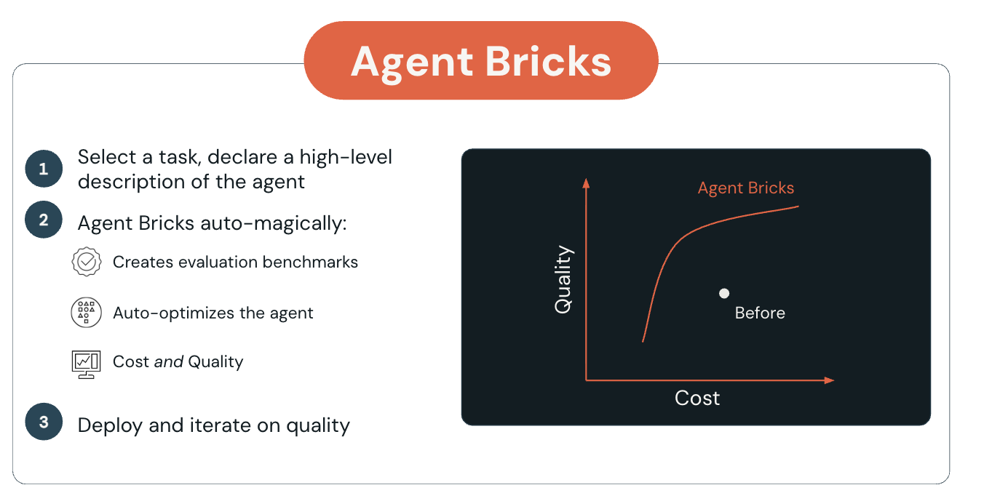
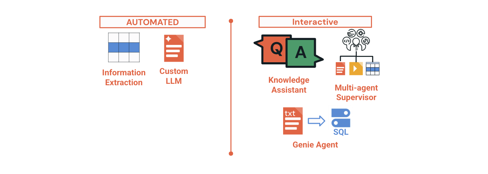
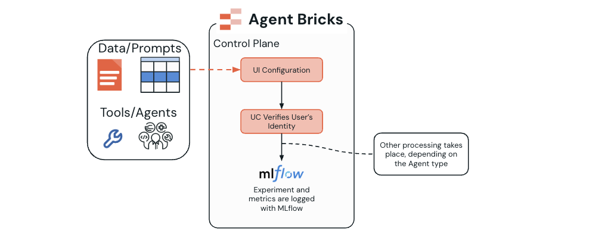
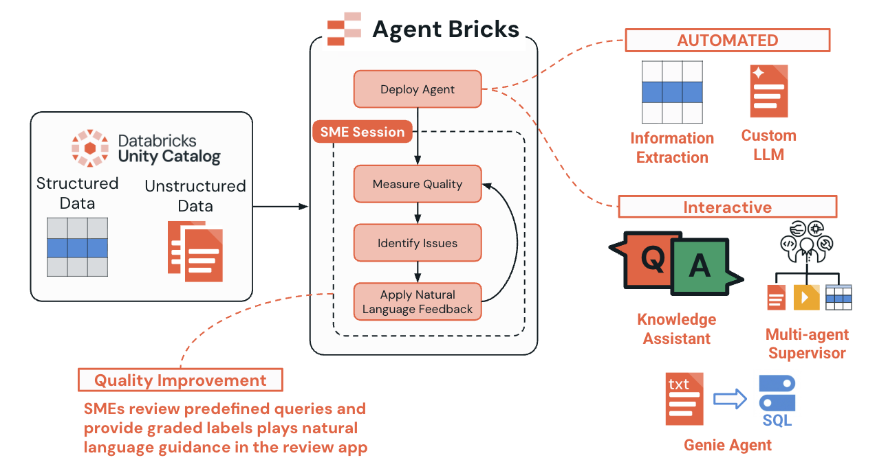
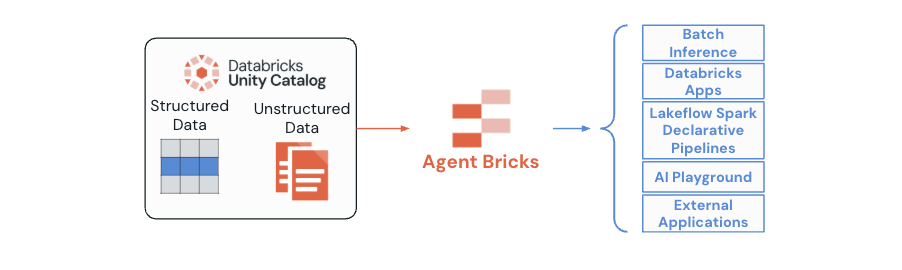

# Single Agents with Agent Bricks

## Overview

Agent Bricks is a high-level abstraction for rapidly building and optimizing production-ready, domain-specific AI agents. It emphasizes automatic evaluation and optimization, including **Agent Learning on Human Feedback (ALHF)**, while balancing quality and cost.

Traditional agent development can require extensive manual configuration, benchmarking, prompt work, model selection, and optimization. Agent Bricks moves much of that technical work into a managed process so users can focus on:

- The business problem.
- Enterprise data.
- Tools and collaborating agents.
- Quality criteria and metrics.
- Feedback from subject-matter experts.

## Learning objectives

By the end of the lecture, you should be able to:

- Understand the Agent Bricks lifecycle and iterative optimization process.
- Identify the four primary supported agent types and their use cases.
- Explain the difference between automated and interactive operational categories.
- Describe strategies for balancing cost and performance.
- Recognize the evaluation and monitoring capabilities built into Agent Bricks.

## A. Introduction to Agent Bricks

Agent Bricks abstracts much of the implementation complexity while preserving the flexibility required for enterprise applications. Its central idea is that users define the problem, provide relevant governed data, and establish quality goals; the platform handles agent optimization, evaluation, and deployment.

The high-level process shown in the figure is:

1. Select a task and provide a high-level description of the desired agent.
2. Agent Bricks automatically creates evaluation benchmarks and optimizes the agent for cost and quality.
3. Deploy the result and continue iterating on quality.

The cost-quality curve illustrates the goal: improve quality while avoiding unnecessary cost, rather than manually selecting a single configuration before the system is evaluated.

### A1. Supported agent types and use cases

The lecture identifies four primary Agent Bricks types.

| Primary type | Abbreviation | Intended use |
|---|---|---|
| **Information Extraction** | IE | Automatically extracts structured information from unstructured documents, PDFs, email, and images. |
| **Custom LLM** | CLLM | Produces a domain-specific language model that is fine-tuned and optimized for a particular task and dataset. |
| **Knowledge Assistant** | KA | Provides interactive question answering over a knowledge base through retrieval-augmented generation. It is a single agent whose tool-calling capabilities are restricted to the RAG application. |
| **Multi-Agent Supervisor** | MAS | Coordinates specialized agents and tools for complex, multi-step tasks. It can also be configured with tools and no additional agents, allowing it to behave as a single agent with a toolkit. |

#### Genie Agent

A Genie Agent lets users query databases and other structured data in natural language. It can operate as a standalone single agent or be orchestrated by a Multi-Agent Supervisor.

> **Classification note:** the source consistently states that Agent Bricks has four primary types, then discusses Genie Agent separately. This study version preserves that distinction instead of silently treating Genie as a fifth primary type.

### A2. Operational categories

Agent Bricks groups its capabilities into two operating models.

#### Automated Bricks

- Information Extraction.
- Custom LLM.

These are optimized for high-scale batch processing with minimal human intervention. Their priorities include throughput and cost-performance efficiency.

#### Interactive Bricks

- Knowledge Assistant.
- Multi-Agent Supervisor.
- Genie Agent.

These are designed for real-time interaction and human-in-the-loop workflows. They emphasize conversational interfaces and dynamic response generation.

## B. Agent Bricks development lifecycle

The development process follows a structured loop that begins with the problem definition and continues through automatic optimization, deployment, measurement, feedback, and further refinement.

### B1. Three-step development cycle

#### Step 1: specify the problem

The user begins by defining an agent for a specific business use case. For example, a Multi-Agent Supervisor can be configured as a managed single agent that uses only a Genie Agent as its tool.

The setup phase includes:

- Defining the task and expected outcomes with the relevant team.
- Selecting one of the four primary Agent Bricks types.
- Supplying Unity Catalog-managed data such as Delta tables or UC Volumes when required.
- Attaching tools or other agents according to the use case.
- Establishing permissions.
- Defining success criteria and quality metrics.

The architecture figure shows:

1. Data and prompts, along with tools and agents, are supplied through UI configuration.
2. Unity Catalog verifies the user’s identity and governs access.
3. MLflow records experiments and metrics.
4. Additional processing depends on the selected agent type.

#### Step 2: optimize on enterprise data

Agent Bricks automatically builds and optimizes an agent system according to the quality-versus-cost tradeoff.

It creates evaluation benchmarks for the specific task. Example metrics mentioned in the source include accuracy, product relevance, and customer-churn prediction.

Optimization can combine:

- Advanced prompt optimization.
- Selective fine-tuning based on the task and available data.
- Tool selection and configuration.
- Custom LLM Judges for quality assessment.
- Reward Model filtering to improve response quality.
- Reinforcement Learning from Human Feedback when it is beneficial.

#### Step 3: improve continuously

After optimization, the agent enters an iterative production loop:

1. Deploy the optimized agent.
2. Measure its quality with automatic and human evaluation.
3. Identify issues and improvement opportunities.
4. Apply feedback expressed in natural language.
5. Use ALHF to improve the next iteration.

The figure shows subject-matter experts reviewing predefined queries, assigning graded labels, and providing natural-language guidance through the Review App. Quality is measured, issues are identified, feedback is applied, and the cycle repeats.

### B2. Evaluation and monitoring framework

Agent Bricks includes evaluation and monitoring throughout the lifecycle.

#### Automatic MLflow integration

Every deployed Agent Bricks agent includes managed tracking for:

- **Requests:** incoming requests, timestamps, and user context.
- **Responses:** outgoing answers, including available confidence and reasoning information.
- **Inter-agent communication:** interactions between agents in multi-agent systems.
- **Performance:** latency, throughput, and resource utilization.

#### Quality-assessment mechanisms

- **Automatic benchmark creation:** metrics tailored to the task.
- **LLM Judge evaluation:** specialized models score response quality.
- **Human feedback:** experts provide structured feedback through review applications.
- **Production monitoring:** live performance is tracked in real time.
- **Comparative analysis:** the system compares results with baseline models and previous versions.

## C. Integration with Databricks services

Agent Bricks is integrated with the broader Databricks platform for end-to-end authoring, governance, evaluation, deployment, and use.

The figure shows structured and unstructured data governed in Unity Catalog flowing into Agent Bricks. The resulting capabilities can be consumed through:

- Batch inference.
- Databricks Apps.
- Lakeflow Spark Declarative Pipelines.
- AI Playground.
- External applications.

### How Agent Bricks works with the Databricks stack

| Service | Role |
|---|---|
| **Mosaic AI Model Serving** | Deploys agents as scalable REST APIs with authentication, load balancing, monitoring, tracing, and quality evaluation. |
| **Vector Search** | Retrieves relevant unstructured information for RAG and semantic search across documents and tables. |
| **Unity Catalog** | Governs data, models, agents, tools, lineage, access, and compliance. |
| **Genie and Genie Spaces** | Enable natural-language interaction with structured data and can participate in tool-calling or multi-agent architectures. |
| **MLflow 3** | Provides experiment tracking, versioning, tracing, evaluation, debugging, and automated quality measurement through LLM judges. |
| **Databricks Apps** | Provide chat interfaces, feedback portals, and production dashboards for users and stakeholders. |

## Conclusion

Agent Bricks provides a managed path for creating domain-specific agents from enterprise data. Its value comes from combining high-level task definition, automatic benchmarks, cost-quality optimization, expert feedback, managed deployment, governance, and continuous evaluation.

The platform supports automated batch-oriented systems and interactive human-facing agents. Integration with Unity Catalog, MLflow, Vector Search, Model Serving, Genie, and Databricks Apps allows an agent to move from configuration to governed production use within one ecosystem.

## Key facts for the simulator

- Agent Bricks is a high-level abstraction for building and optimizing domain-specific agents.
- The user focuses on the problem, data, tools, metrics, and feedback; Agent Bricks handles much of the optimization and evaluation work.
- The four primary types are Information Extraction, Custom LLM, Knowledge Assistant, and Multi-Agent Supervisor.
- Genie Agent is discussed separately and can operate alone or under a Multi-Agent Supervisor.
- Information Extraction and Custom LLM belong to the automated category.
- Knowledge Assistant, Multi-Agent Supervisor, and Genie belong to the interactive category.
- Automated Bricks prioritize batch scale, throughput, and cost-performance efficiency.
- Interactive Bricks prioritize real-time conversation and human-in-the-loop workflows.
- A Knowledge Assistant is a single agent whose tool calling is restricted to the RAG application.
- A Multi-Agent Supervisor can act as a single agent when it has tools but no additional agents.
- Step 1 defines the task, agent type, data, tools or agents, permissions, success criteria, and metrics.
- Step 2 automatically creates benchmarks and optimizes the cost-quality tradeoff.
- Optimization can use prompt optimization, selective fine-tuning, tool selection, LLM Judges, Reward Models, and RLHF.
- Step 3 deploys, measures quality, identifies issues, applies natural-language feedback, and uses ALHF for improvement.
- MLflow automatically tracks requests, responses, inter-agent communication, and performance metrics.
- Quality mechanisms include automatic benchmarks, LLM Judges, human feedback, production monitoring, and comparative analysis.
- Unity Catalog governs the data, tools, agents, permissions, and lineage.
- Agent Bricks integrates with Model Serving, Vector Search, Genie, MLflow 3, and Databricks Apps.
- Consumption options include batch inference, Databricks Apps, Lakeflow Spark Declarative Pipelines, AI Playground, and external applications.

