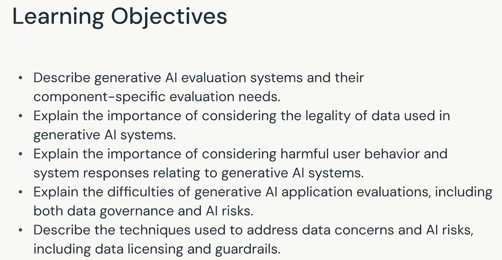

# Introduccion a la evaluacion de aplicaciones de IA generativa

## Contexto del modulo

Patrick presenta el modulo **La importancia de evaluar las aplicaciones de IA generativa en Databricks**.

La evaluacion es un componente critico al construir aplicaciones de IA generativa. No se trata de una tarea unica o aislada: evaluar un sistema GenAI implica varios desafios y exige considerar los distintos componentes de la aplicacion, los datos que utiliza, el comportamiento de los usuarios, las respuestas del sistema, el gobierno de datos y los riesgos de IA.

## Objetivos de aprendizaje

Este modulo busca que el estudiante pueda:

1. Describir los sistemas de evaluacion de IA generativa y las necesidades de evaluacion especificas de cada componente, incluida su diferencia respecto de la evaluacion tradicional de machine learning.
2. Explicar por que debe considerarse la legalidad de los datos utilizados en los sistemas de IA generativa.
3. Explicar por que deben considerarse tanto el comportamiento perjudicial de los usuarios como las respuestas perjudiciales del sistema.
4. Explicar las dificultades de evaluar aplicaciones de IA generativa, incluidos el gobierno de datos y los riesgos de IA.
5. Describir tecnicas para abordar las preocupaciones sobre los datos y los riesgos de IA, entre ellas el licenciamiento de datos y los guardrails.

## Areas presentadas en esta leccion

### Evaluacion especifica por componente

Una aplicacion de IA generativa es un sistema compuesto por varias partes. Por ello, sus necesidades de evaluacion deben analizarse tanto por componente como en el sistema completo.

### Uso legal de los datos

La evaluacion debe considerar si los datos empleados por el sistema pueden utilizarse legalmente para el proposito previsto. El modulo relacionara posteriormente este aspecto con el licenciamiento de datos.

### Conductas y respuestas perjudiciales

El proceso de evaluacion debe contemplar tanto las conductas perjudiciales iniciadas por los usuarios como las respuestas perjudiciales generadas por el sistema.

### Gobierno de datos y riesgos de IA

La evaluacion de aplicaciones de IA generativa presenta dificultades relacionadas con el gobierno de los datos y con los riesgos derivados del comportamiento de la IA.

### Licenciamiento y guardrails

El modulo presentara el licenciamiento de datos y los guardrails como tecnicas para abordar preocupaciones relacionadas con los datos y los riesgos de IA.

## Nota de alcance

Esta leccion introductoria delimita el contenido del modulo. Enumera los problemas de evaluacion y las tecnicas que se desarrollaran posteriormente, pero todavia no explica como implementarlas.

## Conceptos clave para el simulador

- La evaluacion es una parte critica del desarrollo de aplicaciones GenAI.
- Las necesidades de evaluacion pueden variar entre los componentes de una aplicacion.
- La legalidad y el licenciamiento de los datos forman parte de la evaluacion.
- Deben evaluarse tanto el comportamiento perjudicial del usuario como las respuestas perjudiciales del sistema.
- El gobierno de datos y el riesgo de IA hacen mas compleja la evaluacion de GenAI.
- Los guardrails son una de las tecnicas que el modulo abordara para reducir riesgos.
