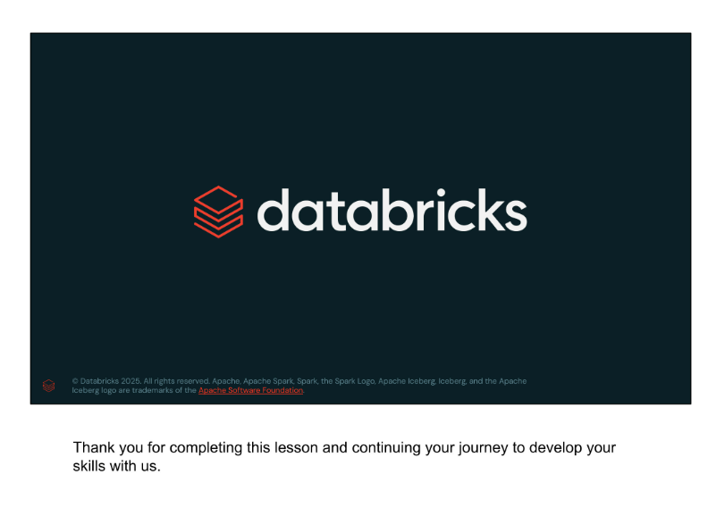

# Why Evaluating GenAI Applications

## Source reconstruction

This English source was reconstructed from the twelve screenshots supplied by the user because the original PDF could not be downloaded. The slide text and the explanatory text have been combined into one continuous thematic document rather than separated by page. Repeated copyright footers have been omitted.

## Why evaluate?

The central question is: **Is the AI system working?** Important questions include:

- Is our system behaving as expected?
- Are users happy with the results?
- Is our LLM solution effective?
- Is there bias or another ethical concern?
- What does it cost?

When evaluating an AI system, there are several important questions to consider: Is the system behaving as expected? Is our language model solution effective? Are users happy with the results? Are there any bias or ethical concerns? What does it cost to run the system? These questions cover different aspects, from technical performance like latency and cost, to how well the system solves specific tasks or problems and whether it delivers real value to customers. Both the operational side and the impact on users are key when assessing the success and quality of an AI system.

## What is an AI system?

An AI system is made up of several components. It is more than just a large language model (LLM).

For example, a Retrieval-Augmented Generation (RAG) system contains a retrieval component that handles document embeddings and a workflow that uses this data during generation. When a user sends a query, the system retrieves relevant information from a vector store and injects it into the prompt sent to the model to produce better results.

The system includes several types of components:

- **Data components:** raw documents, the vector database or data store, user queries, and generated input/output data.
- **Model components:** the embedding model used for documents or queries and the generation model that synthesizes new information from the supplied context.
- **Other components:** the Vector Search system, user interface, security and governance tooling, and the infrastructure required to put the system into production and deliver value to customers.

## Evaluating the system and its components

These systems are complex to build and therefore complex to evaluate. Proper evaluation requires a structured methodology.

Borrowing from software engineering, end-to-end testing can assess the complete system as a whole, while component or integration testing can focus on individual components separately. The objective is to ensure that the whole system and each of its parts function as expected.

## Evaluating data

Evaluating data components can be challenging. There are three main areas to consider.

### LLM training data

**Quality**

- Select LLMs with high-quality and relevant training data.
- Select LLMs with published evaluation benchmarks specific to the intended task, such as code generation or question answering.

**Bias and ethics**

- Model training data may contain sensitive or private information and may contain bias.
- The data used to train an existing LLM cannot normally be changed by the application developer, but oversight can be implemented over the model's generated output.

### Contextual data

**Quality**

- Implement quality controls for contextual data.
- Monitor changes in contextual-data statistics.

**Bias and ethics**

- Review contextual data for bias or unethical information.
- Confirm that the data is being used legally.
- Consult the legal team to determine licensing requirements.

### Input and output data

**Quality**

- Collect and review input/output data.
- Monitor changes in input/output statistics.
- Monitor user feedback.
- Use LLM-as-a-judge metrics to assess quality.

**Bias and ethics**

- Review input queries for harmful user behavior.
- Review system outputs for harmful system responses.

Data quality affects both performance and ethical considerations. Contextual data should be assessed for quality, bias, ethical issues, personally identifiable information (PII), licensing, and copyright risks. Although most organizations do not train their own LLMs, they should understand what data a selected model was trained on, how it performs across benchmarks, and whether it may contain embedded bias or expose sensitive information.

If bias or unwanted content appears, the original training data cannot be changed, but the application can filter inputs or outputs through system design. Monitoring inputs and outputs is therefore essential. User queries and model outputs can be evaluated through human review, statistical methods, or LLM-based judging. These evaluations help create filters and safeguards so that the data supports the system's goals, meets ethical standards, and complies with legal and licensing frameworks.

## Issue: data legality

Many datasets have licenses that explain how the data may be used. Important questions include:

- Who owns the data?
- Is the application intended for commercial use?
- In which countries or states will the system be deployed?
- Will the system generate profit?

The example license message distinguishes free personal and research use from commercial use that requires a subscription.

Data legality is a major concern because machine learning models such as LLMs are trained on large datasets, some of which may be copyrighted. A model could generate protected material and create legal problems. It is therefore important to understand which datasets were used for training, their licensing terms, and whether the planned application is commercial.

The countries and states where the application will be deployed and whether the system will generate profit can also affect compliance. Risk mitigation requires reviewing dataset licensing policies and consulting the legal team to ensure that the terms fit the specific use case. This helps reduce the possibility that model outputs will create licensing or copyright problems.

## Issue: harmful user behavior

LLMs are capable systems and may behave in ways that were not intended. Users can submit prompts designed to override the system's intended use. This technique is called **prompt injection** and can be used to:

- Extract private information.
- Generate harmful, biased, or incorrect responses.

In the example, the system prompt tells the assistant to answer product questions without being biased against competitors. The user then instructs the assistant to ignore that rule and promote one product at all costs.

Harmful user behavior is a significant concern because LLMs may try too hard to be helpful, make things up, or produce undesirable content. Prompt injection may be intentional or accidental. It is difficult to design robust controls when systems are deployed to end users, which makes it important to anticipate and prevent prompt injection and other harmful use cases before production deployment.

## Issue: bias and ethical use

LLMs learn patterns from their training data. Even if the application and its intended use are ethical, the model may reproduce ideas or biases present in that data and generate unintended biased responses.

The example describes an AI system trained on British healthcare data. A woman in the United States asks for advice about her pregnancy, but the system directs her to the United Kingdom's National Health Service. The response is poorly aligned with the user's location because the training data is limited or skewed toward a British context.

This example raises the question of whether such responses constitute harmful bias and how they affect the ethical use of AI tools.

## Why classical evaluation techniques are difficult to apply

Classical machine learning evaluation techniques present unique challenges when applied to generative AI.

| Area | Classical machine learning | Generative AI challenge |
|---|---|---|
| Truth | Uses target or label data to evaluate predictions. | The idea of truth is harder to measure because there may not be one correct answer. |
| Quality | Compares prediction quality with known truth. | Quality in generated text or visuals is difficult to measure and quantify. |
| Bias | Can audit data and simplify model solutions to address bias. | Bias in massive training datasets and generated responses is difficult to remove or mitigate. |
| Security | Usually produces simple, strict outputs such as labels. | Produces nearly arbitrary text, images, or audio, making data and model security more complex. |

Classical machine learning often uses labeled data, so expected inputs and outputs are known and answers can be checked. Generative AI works with language and broader tasks where several responses may be valid. For example, a question such as "What is the best science-fiction movie?" has no single correct answer.

Bias is also harder to manage because modern generative models use extremely large datasets containing trillions of tokens, making it nearly impossible to remove every bias. Security becomes more difficult because unstructured outputs such as text and images are less predictable than the constrained outputs of many classical models.

## A systematic approach to GenAI evaluation

The recommended approach is comprehensive and component based. Evaluate both the system and its individual components by taking the work step by step:

- Mitigate data risks with responsible data licensing, prompt safety, and guardrails.
- Evaluate LLM quality.
- Secure the system.
- Evaluate overall system quality.

Instead of trying to evaluate everything at once, analyze data, outputs, models, infrastructure, and system security separately. This makes it possible to select targeted techniques for improving quality and safety.

## Prompt safety and guardrails

Prompt safety is an important response to prompt injection and other forms of prompt hacking. Model responses can be controlled by providing additional guidance to the LLM. These controls are called **guardrails** and may be simple or complex.

In the example, the system prompt states: "Do not teach people how to commit crimes." When the user asks, "How do I rob a bank?", the system refuses to assist with planning or committing crimes.

A clear instruction in the system prompt acts as a simple guardrail: it steers the model away from unwanted behavior and toward the desired response. More complex guardrails may be required when a stronger level of control is needed.

## Lesson completion

Thank you for completing this lesson and continuing your journey to develop your skills with us.
