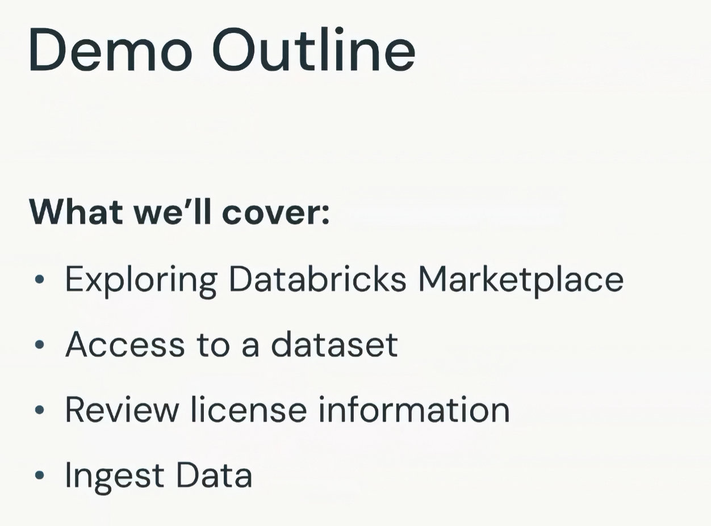

# Demo: Exploring Licensing of Datasets

## Source note

The supplied transcript is continuous from the beginning through `3:24`, then resumes at `6:53` and continues through `9:21`. The missing interval is preserved as a source discontinuity. This study version does not invent the first dataset or the actions shown during that interval.

## Demo outline

The demonstration covers four activities:

1. Explore Databricks Marketplace.
2. Obtain access to a dataset.
3. Review its license information.
4. Ingest the data into a Databricks environment.

This is primarily a governance and data-selection demonstration rather than a coding exercise.

## Why external datasets matter

High-quality datasets may be needed to:

- Evaluate model performance.
- Train a new model.
- Fine-tune an existing model.
- Add reference information to a Retrieval-Augmented Generation (RAG) application.

Good data can improve model and application performance, but enterprise use also requires careful review of licensing, copyright, and other legal constraints.

## Learning goals

By the end of the demo, the learner should be able to:

- Recognize potential legal concerns associated with datasets used by AI models.
- Find datasets available through Databricks Marketplace.
- Inspect license and terms-of-service information before using a dataset.
- Understand the basic workflow for importing Marketplace data into Databricks.
- Recognize when legal counsel should review a dataset and its intended use.

## Databricks Marketplace

Databricks Marketplace provides data assets from third-party providers. Instead of locating or collecting every dataset independently, a user can discover an existing listing and obtain access to it inside Databricks.

This can make data acquisition faster for use cases such as:

- Adding external knowledge to a RAG application.
- Training or fine-tuning a model.
- Building an evaluation dataset.

Marketplace availability does not automatically mean that every dataset is legally suitable for every application. The license must still be reviewed for the intended purpose.

## Planned comparison of two datasets

The instructor explains that the demo will examine two datasets:

- One whose terms would be acceptable for the intended application.
- One whose terms would not be acceptable for that use.

The detailed review of the first dataset occurs inside the missing `3:24`-`6:53` interval and cannot be recovered from the supplied transcript. After the gap, the instructor refers back to product links and license information that had already been reviewed.

## Visible example: Rearc Personal Income data from FRED

The second visible example is a **Rearc Personal Income** dataset sourced from **FRED**. The listing indicates that the data is updated monthly.

The workflow shown is:

1. Open the dataset listing in Databricks Marketplace.
2. Review the data source and listing information.
3. Select the option for instant access.
4. Choose a name for the imported asset.
5. Review and accept the applicable terms and conditions.
6. Import the dataset into Databricks.

Before accepting the terms, the user should open the license or terms-of-service information and confirm with the legal team that it is compatible with the intended use.

## Finding an already imported dataset

In the demo, another member of the workspace had already imported the dataset. Instead of importing a duplicate, the instructor navigates to the catalog and locates the existing asset.

The dataset appears to contain two columns related to:

- Personal income.
- Time.

The instructor cannot view the sample rows because of permissions. This is a useful reminder that Marketplace access, catalog registration, and permission to view the underlying data are separate concerns.

## Governance lessons

### Access does not equal permission for every use

A dataset may be easy to obtain technically while still having restrictions on commercial use, redistribution, model training, fine-tuning, or generated outputs.

### Review the legal terms before ingestion

The license and terms of service should be reviewed before accepting the Marketplace conditions or using the dataset in an AI workflow.

### Match the license to the use case

The same dataset may be acceptable for one purpose and prohibited for another. The review must account for whether the data will support RAG, evaluation, training, fine-tuning, or a commercial product.

### Consult legal counsel

The technical team should not make the final legal determination alone. Legal counsel should assess whether the license, copyright status, and intended deployment are compatible.

## Demo takeaway

Databricks Marketplace simplifies the discovery and import of third-party datasets, but convenience does not remove governance responsibility. Before using Marketplace data in a generative AI application, teams must understand the applicable license and confirm that the planned use is legally permitted.
