# AI System Security

## Lesson purpose

AI system security protects the complete application: data, models, prompts, outputs, infrastructure, users, and audit processes. The lesson explains why this work is difficult, introduces a component-based security framework, maps high-priority risks to Databricks tooling, and presents Llama Guard as a safeguard for prompts and responses.

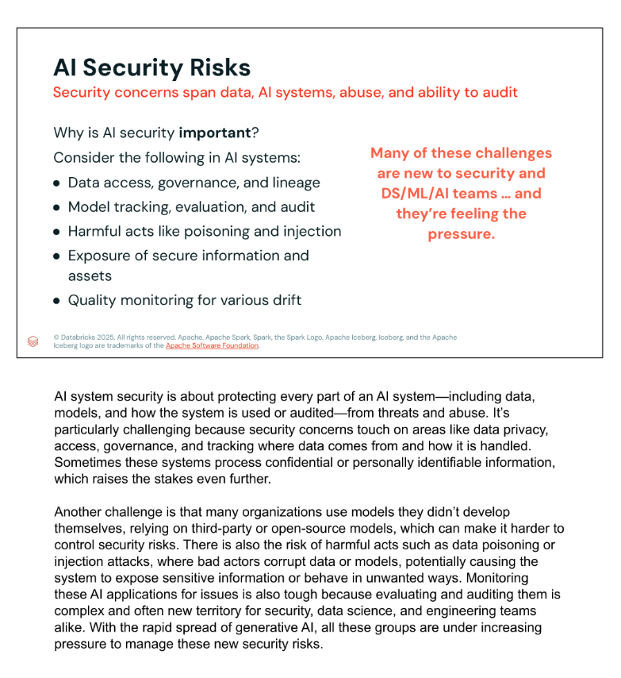

## 1. Main AI security risks

| Risk area | Security concern |
|---|---|
| Data access and governance | Unauthorized access, weak permissions, missing lineage, and insufficient knowledge of data origin or use. |
| Model tracking and audit | Inability to determine which model was used, how it was evaluated, what changed, or who accessed it. |
| Poisoning and injection | Malicious actors manipulate data, prompts, models, or workflows to change behavior. |
| Sensitive information | Confidential or personally identifiable information may be exposed through inputs, system state, or outputs. |
| Drift and quality | Changes in data or model behavior may reduce quality and introduce new security weaknesses. |
| Third-party assets | Open-source or externally developed models may introduce risks that the organization cannot fully control. |

Security must therefore address both intentional attacks and operational failures.

## 2. Why security receives priority

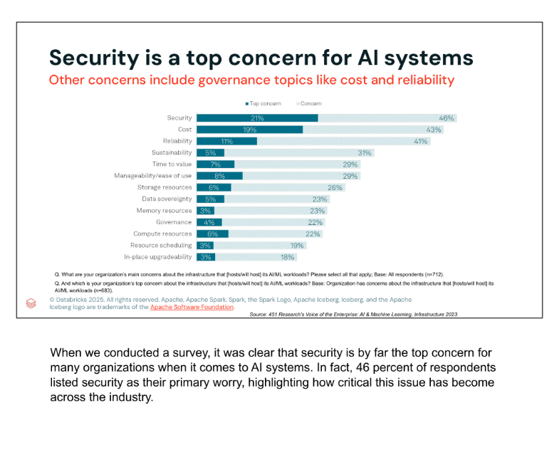

The survey chart places security above cost and reliability:

- **Security:** 21% top concern; 46% concern.
- **Cost:** 19% top concern; 43% concern.
- **Reliability:** 11% top concern; 41% concern.

The result illustrates the pressure organizations feel when deploying AI and ML workloads. Governance issues such as cost, reliability, manageability, sovereignty, and resource use remain important, but security leads the chart.

## 3. Why AI security is difficult

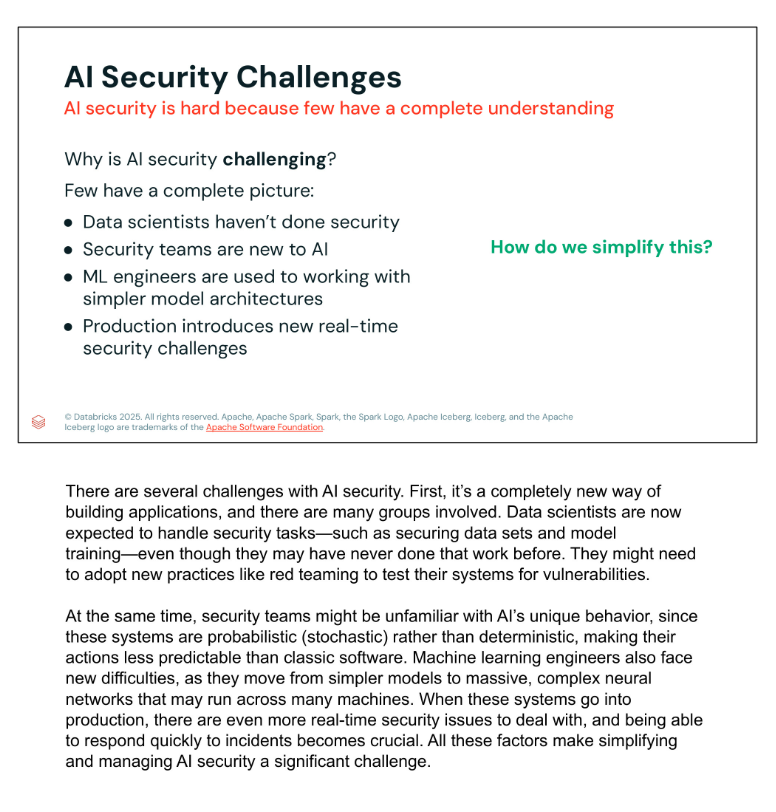

No single practitioner group normally holds the entire security picture:

- Data scientists may be responsible for securing data and model development despite limited security experience.
- Security professionals may be unfamiliar with probabilistic AI behavior.
- ML engineers may move from relatively simple architectures to large distributed neural networks.
- Production teams must detect and respond to real-time incidents.

AI systems are probabilistic rather than deterministic, which makes behavior less predictable than conventional software. Red teaming, adversarial testing, monitoring, and rapid incident response therefore become important shared responsibilities.

## 4. Decompose the system into components

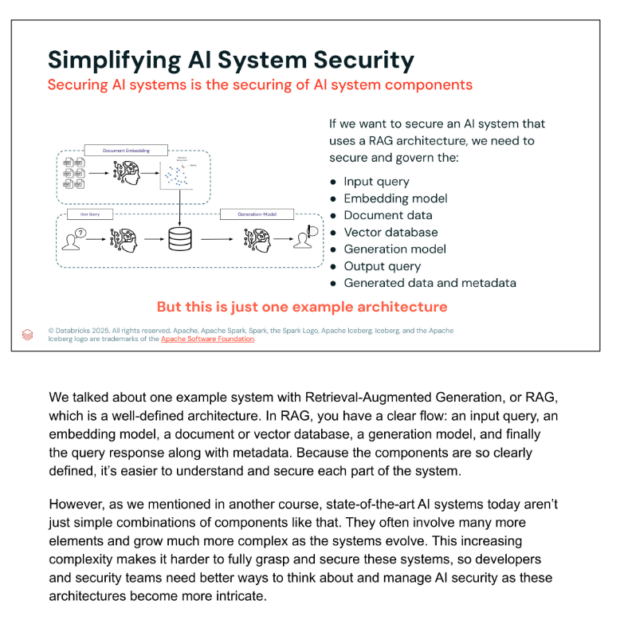

A practical way to simplify security is to identify and secure each component. For a RAG system, this includes:

1. Input query.
2. Embedding model.
3. Document data.
4. Vector database.
5. Generation model.
6. Output response.
7. Generated data and metadata.

The same principle applies to more complex architectures: protect the system as a whole while assigning security controls to every component and interface.

## 5. DASF and its component model

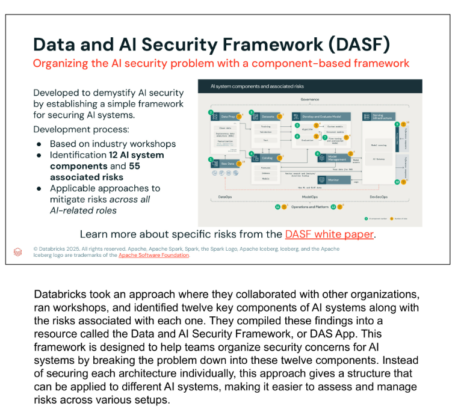

The framework described in the lesson resulted from industry workshops and identifies:

- **12 AI system components.**
- **55 associated risks.**
- Mitigation approaches applicable across AI-related roles.

### Naming note

The course slides expand DASF as **Data and AI Security Framework**. Official Databricks materials use **Databricks AI Security Framework**. Both references in this course point to the component-based framework identified by the acronym DASF.

Official reference: [Databricks security, compliance, and privacy best practices](https://docs.databricks.com/aws/en/lakehouse-architecture/security-compliance-and-privacy/best-practices).

## 6. The twelve foundational components

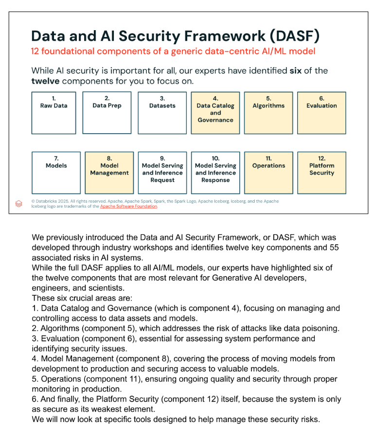

| # | Component | # | Component |
|---:|---|---:|---|
| 1 | Raw Data | 7 | Models |
| 2 | Data Prep | 8 | Model Management |
| 3 | Datasets | 9 | Model Serving and Inference Request |
| 4 | Data Catalog and Governance | 10 | Model Serving and Inference Response |
| 5 | Algorithms | 11 | Operations |
| 6 | Evaluation | 12 | Platform Security |

The course highlights components **4, 5, 6, 8, 11, and 12** for GenAI developers, engineers, and scientists.

## 7. Six priority areas for GenAI practitioners

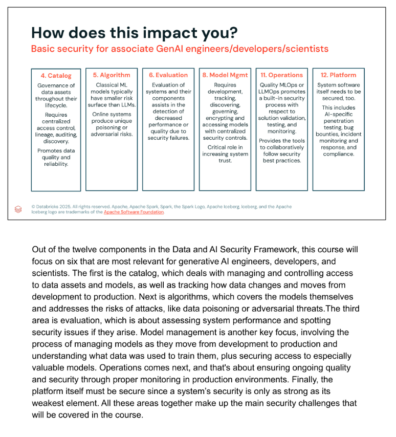

| Component | Practitioner responsibility |
|---|---|
| 4. Data Catalog and Governance | Centralize permissions, lineage, auditing, discovery, quality, and reliability across the data lifecycle. |
| 5. Algorithms | Address the larger LLM attack surface, including poisoning and adversarial behavior in online systems. |
| 6. Evaluation | Detect security-related degradation in system or component performance and quality. |
| 8. Model Management | Track, discover, govern, encrypt, and control access to models from development through production. |
| 11. Operations | Embed security in MLOps and LLMOps validation, testing, monitoring, and collaboration. |
| 12. Platform Security | Protect the software platform through penetration testing, bug bounties, monitoring, incident response, and compliance. |

These areas connect governance, model behavior, lifecycle controls, operational processes, and infrastructure.

## 8. Databricks security capabilities

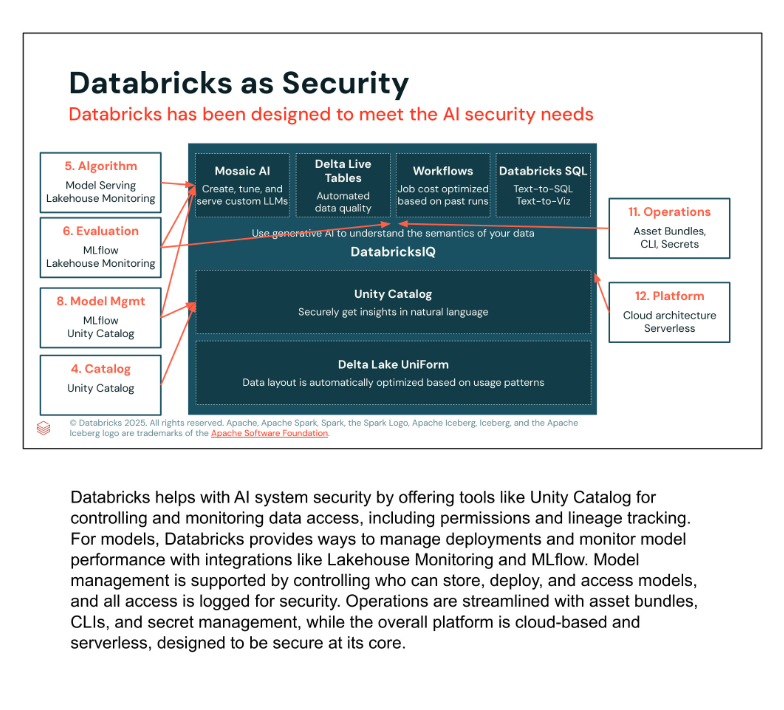

| Security area | Databricks tooling presented |
|---|---|
| Catalog and governance | Unity Catalog |
| Algorithms | Model Serving and Lakehouse Monitoring |
| Evaluation | MLflow and Lakehouse Monitoring |
| Model management | MLflow and Unity Catalog |
| Operations | Asset Bundles, CLI, and Secrets |
| Platform security | Cloud architecture and serverless services |

The broader platform shown in the lesson includes Mosaic AI, Delta Live Tables, Workflows, Databricks SQL, DatabricksIQ, Unity Catalog, and Delta Lake UniForm.

## 9. Unity Catalog and Mosaic AI

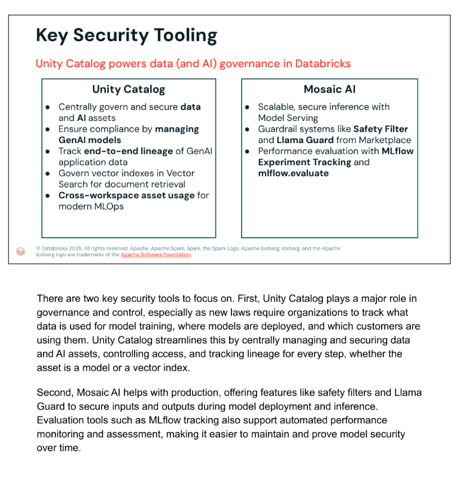

### Unity Catalog

Unity Catalog supports centralized governance for data and AI assets by:

- Managing permissions and access.
- Governing GenAI models.
- Tracking end-to-end lineage.
- Governing Vector Search indexes used for document retrieval.
- Supporting asset use across workspaces.

These controls help organizations determine which data was used, how it moved, where a model is deployed, and who can access the assets.

### Mosaic AI

Mosaic AI contributes production and evaluation controls through:

- Scalable and secure Model Serving.
- Safety Filter and Llama Guard guardrails.
- MLflow Experiment Tracking.
- `mlflow.evaluate`.
- Ongoing quality and performance monitoring.

## 10. Llama Guard

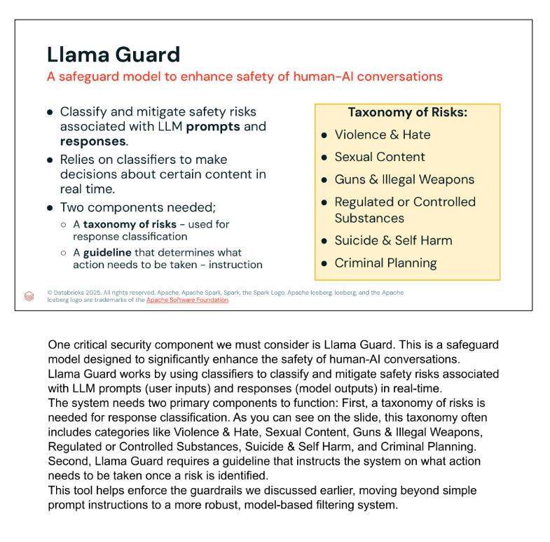

Llama Guard is a safeguard model that classifies risks associated with LLM prompts and responses. It requires:

1. A **risk taxonomy** for classification.
2. A **guideline** that specifies the action after a risk is detected.

The taxonomy shown includes:

- Violence and Hate.
- Sexual Content.
- Guns and Illegal Weapons.
- Regulated or Controlled Substances.
- Suicide and Self Harm.
- Criminal Planning.

This model-based control is more robust than relying only on a plain-language instruction in a prompt.

## 11. Input Guard and Output Guard

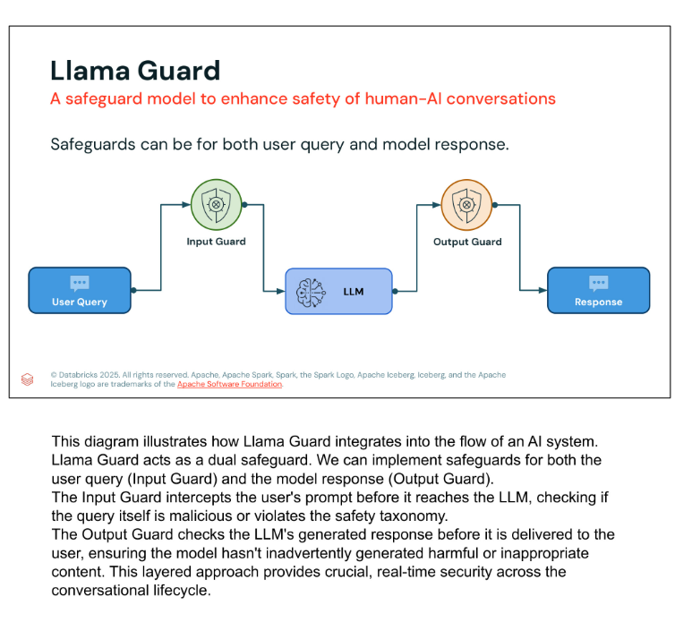

The safeguard can operate on both sides of the LLM:

```text
User Query -> Input Guard -> LLM -> Output Guard -> Response
```

- **Input Guard:** classifies the user request before the LLM processes it.
- **Output Guard:** classifies the generated response before it reaches the user.

This layered design can block a malicious prompt at entry and also prevent harmful model output if the first control does not catch the risk.

## Key takeaways

- AI security covers data, models, applications, infrastructure, users, and audits.
- Security is difficult because AI systems are probabilistic, distributed, and shared across professional disciplines.
- Component decomposition makes complex security problems more manageable.
- DASF identifies 12 components and 55 associated risks.
- The course prioritizes catalog/governance, algorithms, evaluation, model management, operations, and platform security.
- Unity Catalog supplies centralized permissions, lineage, auditing, and AI-asset governance.
- Mosaic AI, MLflow, Model Serving, and Lakehouse Monitoring support secure deployment and evaluation.
- Llama Guard can classify both prompts and responses through input and output safeguards.
