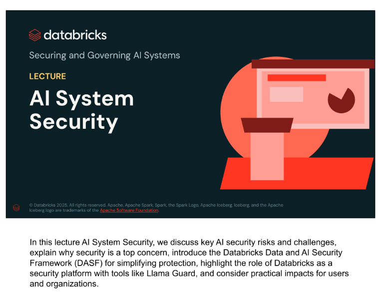
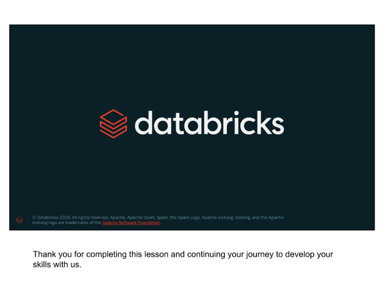

# AI System Security

## Source reconstruction

This English source was reconstructed from the thirteen screenshots supplied by the user. Slide content and accompanying explanations have been combined into one continuous thematic document rather than separated by page. Repeated copyright footers have been omitted.

This lecture discusses key AI security risks and challenges, explains why security is a top concern, introduces DASF as a way to simplify protection, highlights Databricks security tooling, and examines Llama Guard and its effect on users and organizations.

## AI security risks

AI security concerns span data, AI systems, abuse, and the ability to audit. Important areas include:

- Data access, governance, and lineage.
- Model tracking, evaluation, and audit.
- Harmful acts such as poisoning and injection.
- Exposure of secure information and assets.
- Quality monitoring for different forms of drift.

AI system security protects every part of an AI system, including data, models, use, and audit processes. The challenge includes privacy, access, governance, and tracking where data comes from and how it is handled. AI applications may process confidential or personally identifiable information, increasing the consequences of a failure.

Organizations also use third-party and open-source models that they did not develop, making some risks harder to control. Data poisoning and injection attacks may corrupt data or models, expose sensitive information, or cause unwanted behavior. Evaluation, auditing, and monitoring remain complex and relatively new for security, data science, and engineering teams.

## Security is a top concern

The survey shown in the lesson reports security as the highest concern. The chart displays **21%** under "Top concern" and **46%** under "Concern" for security. Other reported concerns include cost, reliability, sustainability, time to value, manageability, storage, data sovereignty, memory, governance, compute, resource scheduling, and in-place upgradeability.

The slide cites *451 Research's Voice of the Enterprise: AI & Machine Learning, Infrastructure 2023*.

## Why AI security is challenging

Few practitioners have the complete picture:

- Data scientists may not have performed security work before.
- Security teams may be new to AI.
- ML engineers may be accustomed to simpler model architectures.
- Production introduces real-time security challenges.

AI changes how applications are built and involves many professional groups. Data scientists may be expected to secure datasets and model training and may need practices such as red teaming. Security teams must learn the probabilistic rather than deterministic behavior of AI systems. ML engineers move from simpler models to large neural networks that may run across many machines. In production, teams must detect and respond to incidents quickly.

## Simplifying AI system security

Securing an AI system means securing its components. In the example RAG architecture, teams must secure and govern:

- Input query.
- Embedding model.
- Document data.
- Vector database.
- Generation model.
- Output query or response.
- Generated data and metadata.

RAG provides a relatively clear flow, which makes its individual components easier to identify and secure. Modern AI systems can contain many additional elements and become more complex as they evolve. Security methods must therefore adapt to increasingly intricate architectures.

## DASF: a component-based framework

The course presents DASF as a way to organize the AI security problem through a component-based framework. Its development involved:

- Industry workshops.
- Identification of **12 AI system components**.
- Identification of **55 associated risks**.
- Approaches that can mitigate risk across AI-related roles.

Instead of creating an unrelated security strategy for every architecture, the framework breaks AI systems into components and provides a structure that can be applied across different system designs.

### Terminology note

The slides expand DASF as **Data and AI Security Framework**. Current official Databricks materials use **Databricks AI Security Framework** for the same acronym. This reconstruction preserves the terminology visible in the course while the organized study guide records the official naming distinction.

## Twelve foundational components

The lesson lists twelve components in a generic data-centric AI/ML system:

1. Raw Data.
2. Data Prep.
3. Datasets.
4. Data Catalog and Governance.
5. Algorithms.
6. Evaluation.
7. Models.
8. Model Management.
9. Model Serving and Inference Request.
10. Model Serving and Inference Response.
11. Operations.
12. Platform Security.

Although all twelve are important, the course highlights six as most relevant to GenAI developers, engineers, and scientists:

- 4. Data Catalog and Governance.
- 5. Algorithms.
- 6. Evaluation.
- 8. Model Management.
- 11. Operations.
- 12. Platform Security.

## How the six areas affect practitioners

### 4. Data Catalog and Governance

- Governs data assets throughout their lifecycle.
- Requires centralized access control, lineage, auditing, and discovery.
- Promotes data quality and reliability.

### 5. Algorithms

- Classical ML models normally have a smaller risk surface than LLMs.
- Online systems introduce distinctive poisoning and adversarial risks.

### 6. Evaluation

- Evaluates systems and their components.
- Helps detect degraded performance or quality caused by security failures.

### 8. Model Management

- Covers model development, tracking, discovery, governance, encryption, and access through centralized security controls.
- Plays a critical role in increasing trust in the system.

### 11. Operations

- Quality MLOps or LLMOps includes a built-in security process for solution validation, testing, and monitoring.
- Provides tools that help teams follow security best practices collaboratively.

### 12. Platform Security

- The system software must itself be secure.
- Relevant practices include AI-specific penetration testing, bug bounties, incident response, monitoring, and compliance.
- The system is only as secure as its weakest element.

## Databricks as a security platform

The lesson maps the six areas to Databricks capabilities:

| DASF area | Databricks capabilities shown |
|---|---|
| 4. Catalog | Unity Catalog |
| 5. Algorithm | Model Serving and Lakehouse Monitoring |
| 6. Evaluation | MLflow and Lakehouse Monitoring |
| 8. Model Management | MLflow and Unity Catalog |
| 11. Operations | Asset Bundles, CLI, and Secrets |
| 12. Platform | Cloud architecture and serverless services |

The platform diagram also shows Mosaic AI, Delta Live Tables, Workflows, Databricks SQL, DatabricksIQ, Unity Catalog, and Delta Lake UniForm.

Unity Catalog controls and monitors data access through permissions and lineage. MLflow and Lakehouse Monitoring support model deployment, evaluation, and performance monitoring. Model access is governed and logged. Operational tooling includes asset bundles, command-line interfaces, and secret management. The cloud-based serverless platform is designed with security as a foundational concern.

## Key security tooling

### Unity Catalog

- Centrally governs and secures data and AI assets.
- Supports compliance by managing GenAI models.
- Tracks end-to-end lineage of GenAI application data.
- Governs vector indexes in Vector Search for document retrieval.
- Supports cross-workspace asset usage for modern MLOps.

### Mosaic AI

- Provides scalable, secure inference with Model Serving.
- Supports guardrail systems such as Safety Filter and Llama Guard from Marketplace.
- Supports performance evaluation with MLflow Experiment Tracking and `mlflow.evaluate`.

Unity Catalog helps organizations track which data trains models, where models are deployed, and which users or customers access them. Mosaic AI adds production and evaluation capabilities for securing model inputs and outputs and monitoring model quality over time.

## Llama Guard

Llama Guard is presented as a safeguard model for improving the safety of human-AI conversations. It classifies and mitigates safety risks in LLM prompts and responses in real time.

Two elements are required:

1. A **taxonomy of risks** used to classify responses.
2. A **guideline** that determines what action to take after classification.

The taxonomy shown in the lesson contains:

- Violence and Hate.
- Sexual Content.
- Guns and Illegal Weapons.
- Regulated or Controlled Substances.
- Suicide and Self Harm.
- Criminal Planning.

This is a model-based filtering approach that goes beyond simple prompt instructions.

## Input and output safeguards

Llama Guard can protect both the user query and the model response:

1. The **Input Guard** intercepts the user prompt before it reaches the LLM and checks whether the query is malicious or violates the risk taxonomy.
2. The LLM processes an accepted request.
3. The **Output Guard** inspects the generated response before it reaches the user and checks for harmful or inappropriate content.

This layered approach supplies real-time protection across the conversational lifecycle.

## Lesson completion

Thank you for completing this lesson and continuing your journey to develop your skills with us.
