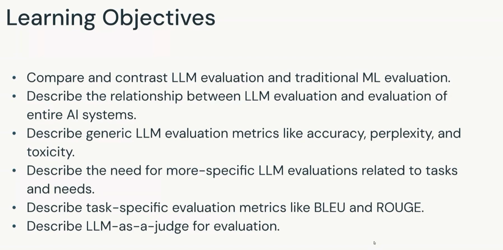

# Introduction to GenAI Evaluation Techniques

## Module context

This module continues the evaluation and governance course by focusing on techniques for evaluating large language models and the AI systems that use them.

## Learning objectives

The module aims to:

1. Compare and contrast LLM evaluation with traditional machine learning evaluation.
2. Describe the relationship between LLM evaluation and evaluation of complete AI systems.
3. Describe generic LLM evaluation metrics such as accuracy, perplexity, and toxicity.
4. Explain why LLM evaluation must become more specific to the task and the application's needs.
5. Describe task-specific metrics such as BLEU and ROUGE.
6. Describe LLM-as-a-judge evaluation, in which one large language model evaluates the output of another.

## Evaluation levels introduced

### Traditional ML evaluation and LLM evaluation

The module will compare conventional machine learning evaluation with the distinctive needs of LLMs. This introduction identifies the comparison as a learning goal; the detailed differences are developed in the following lesson.

### Model evaluation and system evaluation

Evaluating an LLM is related to, but not identical to, evaluating the complete AI application. The module will examine how model-level measurements contribute to broader system-level evaluation.

## Metric families introduced

### Generic LLM metrics

- **Accuracy**
- **Perplexity**
- **Toxicity**

### Task-specific metrics

- **BLEU**
- **ROUGE**

### Model-based evaluation

- **LLM-as-a-judge:** a large language model assesses the output produced by another large language model.

## Terminology normalization

The raw transcript contains speech-recognition variants such as `LM`, `blue`, and `rouge`. The study materials normalize these terms to **LLM**, **BLEU**, and **ROUGE**, following the text visible in the learning-objectives slide.

## Scope note

This introductory lesson defines the module's objectives and names the evaluation techniques that will be studied. It does not yet define the formulas, scoring procedures, advantages, or limitations of the metrics.

## Key takeaways

- LLM evaluation differs from traditional ML evaluation.
- Model quality is only one part of complete AI-system quality.
- Accuracy, perplexity, and toxicity are introduced as generic metrics.
- The correct evaluation depends on the task and application requirements.
- BLEU and ROUGE are introduced as task-specific metrics.
- LLM-as-a-judge uses one LLM to assess another model's output.
